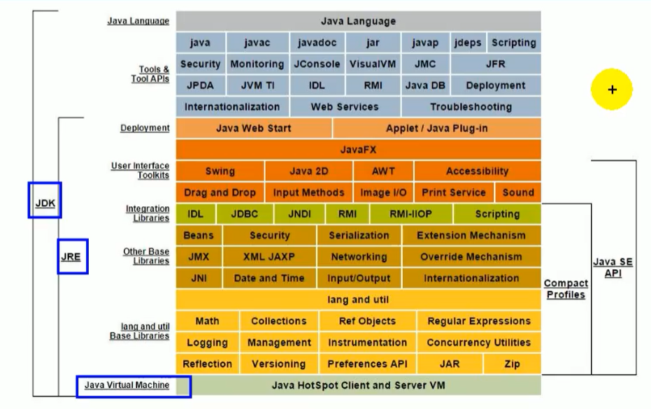

# # JVM與Java體系結構


## Java生態圈

- 作為一個平台，Java虛擬機扮演著舉足輕重的作用
       Groovy，Scala，JRuby，Kotlin等都是Java平台的一部分

- 作為燈種文化，Java幾乎成為了“開源”的代名詞。
       第三方開源軟件和框架。例如Tomcat，Struts，MyBatis，Spring等。
       就連JDK和JVM本身也有很多開源的實現，如openJDK，Harmony。

- 作為一個社區，Java擁有全世界最多的技術擁護者和開源社區支持，有數不清的論壇和資料。從桌面應用軟件，嵌入式開發到企業級應用，後台服務器，中間件，都可以看到Java 的身影。

> Write once, run anywhere

每個語言都需要轉換成字節碼文件，最後轉換的字節碼文件都可以通過Java虛擬機進行運行和處理


- 隨著Java7的正式發布，Java虛擬機的設計者們通過JSR-292規範基本實現在Java虛擬機平台上運行非Java語言編寫的程序。

- Java虛擬機根本不關心運行在其內部的程序到底是使用其他編程語言編寫的，它只關心“字節碼”文件。而Java虛擬機擁有語言無關性，並且不會單純地與Java語言“終身綁定”，只要其他編程語言的編譯結果滿足並包含Java虛擬機的內部指令集，符號表以及其他的輔助信息，它就是一個有效的字節碼文件，就能夠被虛擬機所識別並裝載運行。
  字節碼

- 我們平時說的java字節碼，指的是用java語言編譯成的字節碼。正確的說任何能在jvm平台上執行的字節碼格式都是一樣的。所以應該統稱為：jvm字節編碼。

- 不同的編譯器，可以編譯出相同的字節碼文件，字節碼文件也可以在不同的JVM上運行。

- Java虛擬機與Java語言並沒有必然的聯繫，它只與特定的二進製文件格式— Class文件格式所關聯，Class文件中包含了Java虛擬機指令集（或者稱為字節碼，Bytecodes）和符號表，還有一些其他輔助信息。
  多語言混合編程

Java平台上的多語言混合編程正成為主流，通過特定領域的語言去解決特定領域的問題是當前軟件開發應對日趨複雜的項目需求的一個方向。

試想一下，在一個項目之中，並行處理用clojure語言編寫，展示層使用JRuby / Rails，中間層則是Java，每個應用層都將使用不同的編程語言來完成，而且，接口對每一層的開發者都是透明的，各種語言之間的相互作用不存在任何困難，就像使用自己的語言的原生API一樣方便，因為它們最終都運行在一個虛擬機之上。

對這些運行於Java虛擬機之上，Java之外的語言，來自系統級的，逐步的支持正在迅速增強，以JSR-292為核心的各項目和功能改進（如Da Vinci Machine項目，Nashorn引擎） ，InvokeDynamic指令，java.lang.invoke包等），將Java虛擬機從“ Java語言的虛擬機”向“多語言虛擬機”的方向發展。

- OpenJDK  vs  OracleJDK

### 虛擬機與Java虛擬機

> 虛擬機

所謂的虛擬機（Virtual Machine），就是一台虛擬機。它是一種軟件，用於執行串行虛擬計算機指令。大體上，虛擬機可以分為系統虛擬機和程序虛擬機。

- 大名鼎鼎的Visual Box，Mware就屬於系統虛擬機，`它們完全是對物理計算機的仿真，提供一個可運行完整操作系統的軟件平台`。
- 程序虛擬機的典型代表就是Java虛擬機，它專門為執行小型計算機程序而設計，在Java虛擬機中執行的指令我們稱為Java字節碼指令。

無論是系統虛擬機還是程序虛擬機，在上面運行的軟件都被限制於虛擬機提供的資源中。

> Java虛擬機

`Java虛擬機是一台執行Java字節碼的虛擬計算機`，它具有獨立的運行機制，其運行的Java字節碼也未必由Java語言編譯而成。

JVM平台的各種語言可以共享Java虛擬機帶來的跨平台性，優秀的垃圾回器，以及可靠的即時編譯器。

Java技術的核心就是Java虛擬機（JVM，Java Virtual Machine），因為所有的Java程序都運行在Java虛擬機內部。

Java虛擬機就是二進製字節碼的運行環境，負責加載字節碼到其內部，解釋/編譯為對應平台上的機器指令執行。每一條Java指令，Java虛擬機規範中都有詳細定義，如怎麼取操作數，怎麼處理操作數，處理結果放在哪裡。

特點：

- 一次編譯，到處運行
- 自動內存管理
- 自動垃圾回收功能

> JVM的位置

JVM是運行在操作系統之上的，它與硬件沒有直接的交互


> Java的體系結構



> JVM整體結構

- HotSpot VM是目前市面上的高級虛擬機的代表作之一。
- 它採用解釋器與即時編譯器並存的架構。
- 在今天，Java程序的運行性能早已脫胎換骨，已經達到了可以和C / C ++程序一較高下的地步。
- 執行引擎包含三部分：解釋器，及時編譯器，垃圾回收器
  


### Java代碼執行流程


只是能生成被Java虛擬機所能解釋的字節碼文件，那麼理論上就可以自己設計一套代碼了

### JVM的架構模型

Java編譯器輸入的指令流基本上是一種基於棧的指令集架構，另外一種指令集架構則是基於寄存器的指令集架構。具體來說：這兩種架構之間的區別：

基於棧式架構的特點

- 設計和實現更簡單，適用於資源轉移的系統；
- 避開了寄存器的分配難題：使用零地址指令方式分配。
- 指令流中的指令大部分是零地址指令（8個字節，表示操作數），其執行過程依賴於操作棧。指令集更小，編譯器容易實現。
- 不需要硬件支持，可移植性更好，更好實現跨平台

基於寄存器架構的特點

- 典型的應用是x86的二進制指令集：某些傳統的PC以及Android的Davlik虛擬機。
- 指令集架構則完全依賴硬件，可移植性差
- 性能優秀和執行更高效
- 花花費的指令去完成一項操作。
- 在大部分情況下，基於寄存器架構的指令集經常都以一地址指令，二地址指令和三地址指令為主（16個字節，表示 1/2/3個地址＋操作數），而基於棧式架構的指令集卻以零地址指令為主方水洋

體現

同樣執行2 + 3這種邏輯操作，其指令分別如下：

基於棧的計算流程（以Java虛擬機為例）：

```
iconst_2 //常量2入棧
istore_1
iconst_3 //常量3入棧
istore_2
iload_1
iload_2
iadd //常量2/3出棧，執行相加
istore_0 //結果5入棧
```

而基於寄存器的計算流程

```
mov eax，2 //將eax寄存器的值設為1
add eax，3 //使eax寄存器的值加3
```

### 字節碼反編譯

我們編寫一個簡單的代碼，然後查看一下字節碼的反編譯後的結果

```java
public class StackStruTest {
    public static void main(String[] args) {
        int i = 2 + 3;
    }
}
```

然後我們找到編譯後的class文件，使用以下命令進行反編譯

```
javap -v StackStruTest.class
```

得到的文件為：

```
  public static void main(java.lang.String[]);
    descriptor: ([Ljava/lang/String;)V
    flags: ACC_PUBLIC, ACC_STATIC
    Code:
      stack=2, locals=4, args_size=1
         0: iconst_2
         1: istore_1
         2: iconst_3
         3: istore_2
         4: iload_1
         5: iload_2
         6: iadd
         7: istore_3
         8: return
      LineNumberTable:
        line 9: 0
        line 10: 2
        line 11: 4
        line 12: 8
      LocalVariableTable:
        Start  Length  Slot  Name   Signature
            0       9     0  args   [Ljava/lang/String;
            2       7     1     i   I
            4       5     2     j   I
            8       1     3     k   I
```

### 總結

由於是跨平台，指令集小，編譯器容易實現，缺點是性能下降，因此跨平台性的設計，Java的指令都是根據棧來設計的。不同平台CPU架構不同，所以不能設計為基於寄存器的。 ，實現同樣的功能需要更多的指令。

時至今日，儘管嵌入式平台已經不是Java程序的主流運行平台了（準確地說應該是HotSpotVM的託管環境已經不繼承嵌入式平台了），那麼為什麼不將架構替換為基於寄存器的架構呢？
棧

- 跨平台性
- 指令集小
- 指令多
- 執行性能比寄存器差

## JVM生命週期

1. 虛擬機的啟動
   - Java虛擬機的啟動是通過引導類加載器（bootstrap class loader）創建一個初始類（initial class）來完成的，這個類是由虛擬機的具體實現指定的。
2. 虛擬機的執行
   - 一個運行中的Java虛擬機擁有一個清晰的任務：執行Java程序。
     程序開始執行時他才運行，程序結束時他就停止。
   - `執行一個所謂的Java程序的時候，真正真正地執行的是一個叫做Java虛擬機的進程。`
   - Terminal : jps

3. 虛擬機的退出

有如下的幾種情況：

- 程序正常執行結束

- 程序在執行過程中遇到了異常或錯誤而異常終止

- 由於操作系統用現錯誤而導致Java虛擬機進程終止

- 某線程調用Runtime類或system類的exit方法，或Runtime類的halt方法，並且Java安全管理器也允許這次exit或halt操作。

- 除此之外，JNI（Java Native Interface）規範描述了用JNI Invocation API來加載或卸載 Java虛擬機時，Java虛擬機的退出情況。

## JVM發展歷程

> Sun Classic VM

- 早在1996年Java1.0版本的時候，Sun公司發布了一款名為sun classic VM的Java虛擬機，它同時也是`世界上第一款商用Java虛擬機`，JDK1.4時完全被淘汰。

- 這款`虛擬機內部只提供解釋器`。

  現在虛擬機還有及時編譯器（虛擬機內置解釋器＋JIT編譯器），而及時編譯器會把熱點代碼緩存起來，那麼以後使用熱點代碼的時候，效率就比較高。因此解釋器效率相對比較低。

- 如果使用JIT編譯器，就需要進行外掛。但是一旦使用了JIT編譯器，JIT就會接管虛擬機的執行系統。解釋器就不再工作。解釋器和編譯器不能配合工作。二擇一運行

- 現在hotspot內置了此虛擬機。

> Exact VM

- 為了解決上一個虛擬機問題，jdk1.2時，sun提供了此虛擬機。 
- `Exact Memory Management：準確式內存管理`
  - 也可以叫Non-Conservative/Accurate Memory Management
  - 虛擬機可以知道內存中某個位置的數據具體是什麼類型。 

- 具備現代高性能虛擬機的維形
  - 熱點探測（尋找出熱點代碼進行緩存）
  - 編譯器與解釋器混合工作模式

- 只在solaris平台短暫使用，其他平台上還是classic vm，
  - 終被Hotspot虛擬機替換

> HotSpot VM  (oracle)

HotSpot歷史

- 最初由一家名為“Longview Technologies”的小公司設計
- 1997年，此公司被sun收購；2009年，Sun公司被甲骨文收購。
- JDK1.3時，HotSpot VM成為默認虛擬機

目前Hotspot佔有絕對的市場地位，稱霸武林。

- `不管是現在仍在廣泛使用的JDK6，還是使用比例較多的JDK8中，默認的虛擬機都是HotSpot`
- Sun/oracle JDK和openJDK的默認虛擬機
- 因此本課程中默認介紹的虛擬機都是HotSpot，相關機制也主要是指HotSpot的Gc機制。 （`比如其他兩個商用虛機都沒有方法區的概念`）

從服務器、桌面到移動端、嵌入式都有應用。

名稱中的HotSpot指的就是它的熱點代碼探測技術。

- 通過計數器找到最具編譯價值代碼，觸發即時編譯或棧上替換
- 通過編譯器與解釋器協同工作，在最優化的程序響應時間（解釋器＝直接走路＝快啟動，運行慢）與最佳執行性能（JIT編譯器＝等公車＝慢啟動，運行快）中取得平衡

> JRockit  (oracle)

- `專注於服務器端應用`
  - 它可以不太關注程序啟動速度，因此JRockit內部不包含解析器實現，`全部代碼都靠即時編譯器編譯後執行`。

- 大量的行業基準測試顯示，`JRockit JVM是世界上最快的JVM`。
  - 使用JRockit產品，客戶已經體驗到了顯著的性能提高（一些超過了70%）和硬件成本的減少（達50%）。

- 優勢：全面的Java運行時解決方案組合
  - JRockit面向延遲敏感型應用的解決方案JRockit Real Time提供以毫秒或微秒級的JVM響應時間，適合財務、軍事指揮、電信網絡的需要
  - MissionControl服務套件，它是一組以極低的開銷來監控、管理和分析生產環境中的應用程序的工具。

- 2008年，JRockit被oracle收購。

- oracle表達了整合兩大優秀虛擬機的工作，大致在JDK8中完成。整合的方式是在HotSpot的基礎上，移植JRockit的優秀特性。

- 高斯林：目前就職於谷歌，研究人工智能和水下機器人

> IBM的J9

- 全稱：IBM Technology for Java Virtual Machine，簡稱IT4J，內部代號：J9
- 市場定位與HotSpot接近，服務器端、桌面應用、嵌入式等多用途VM廣泛用於IBM的各種Java產品。
- 目前，有影響力的三大商用虛擬機之一，也號稱是世界上最快的Java虛擬機。
- 2017年左右，IBM發布了開源J9VM，命名為openJ9，交給EClipse基金會管理，也稱為Eclipse OpenJ9
  - OpenJDK -> 是JDK開源了，包括了虛擬機

> KVM和CDC / CLDC Hotspot

- oracle在Java ME產品線上的兩款虛擬機為：CDC/CLDC HotSpot Implementation VM KVM（Kilobyte）是CLDC-HI早期產品目前移動領域地位尷尬，智能機被Angroid和ioS二分天下。

- KVM簡單、輕量、高度可移植，面向更低端的設備上還維持自己的一片市場
  - 智能控制器、傳感器
  - 老人手機、經濟欠發達地區的功能手機

- 所有的虛擬機的原則：一次編譯，到處運行。

> Azul VM

- 前面三大“高性能Java虛擬機”使用在通用硬件平台上這裡Azu1VW和BEALiquid VM是`與特定硬件平台綁定、軟硬件配合的專有虛擬機`

- 高性能Java虛擬機中的戰鬥機。

- Azul VM是Azu1Systems公司在HotSpot基礎上進行大量改進，運行於Azul Systems公司的專有硬件Vega系統上的java虛擬機。

- 每個Azu1VM實例都可以管理至少數十個CPU和數百GB內存的硬件資源，並提供在巨大內存範圍內實現可控的GC時間的垃圾收集器、專有硬件優化的線程調度等優秀特性。

- 2010年，AzulSystems公司開始從硬件轉向軟件，發布了自己的zing JVM，可以在通用x86平台上提供接近於Vega系統的特性。

> Liquid VM

- 高性能Java虛擬機中的戰鬥機。

- BEA公司開發的，直接運行在自家Hypervisor系統上Liquid VM即是現在的JRockit VE（Virtual Edition），

- Liquid VM不需要操作系統的支持，或者說它自己本身實現了一個專用操作系統的必要功能，如線程調度、文件系統、網絡支持等。

- 隨著JRockit虛擬機終止開發，Liquid vM項目也停止了。

> Apache Marmony

Apache也曾經推出過與JDK1.5和JDK1.6兼容的Java運行平台Apache Harmony。

它是IElf和Inte1聯合開發的開源JVM，受到同樣開源的openJDK的壓制，Sun堅決不讓Harmony獲得JCP認證，最終於2011年退役，IBM轉而參與OpenJDK

雖然目前並沒有Apache Harmony被大規模商用的案例，但是它的Java類庫代碼吸納進了Android SDK。

> Micorsoft JVM

微軟為了在IE3瀏覽器中支持Java Applets，開發了Microsoft JVM。

只能在window平台下運行。但確是當時Windows下性能最好的Java VM。

1997年，sun以侵犯商標、不正當競爭罪名指控微軟成功，賠了sun很多錢。微軟windowsXPSP3中抹掉了其VM。現在windows上安裝的jdk都是HotSpot。

> Taobao JVM

由AliJVM團隊發布。阿里，國內使用Java最強大的公司，覆蓋雲計算、金融、物流、電商等眾多領域，需要解決高並發、高可用、分佈式的複合問題。有大量的開源產品。

基於openJDK開發了自己的定製版本AlibabaJDK，簡稱AJDK。是整個阿里Java體系的基石。

基於openJDK Hotspot VM發布的國內第一個優化、深度定制且開源的高性能服務器版Java虛擬機。

創新的GCIH（GCinvisible heap）技術實現了off-heap，即將生命週期較長的Java對像從heap中移到heap之外，並且Gc不能管理GCIH內部的Java對象，以此達到降低GC的回收頻率和提升Gc的回收效率的目的。
GCIH中的對像還能夠在多個Java虛擬機進程中實現共享
使用crc32指令實現JvM intrinsic降低JNI的調用開銷
PMU hardware的Java profiling tool和診斷協助功能
針對大數據場景的ZenGc

taobao vm應用在阿里產品上性能高，硬件嚴重依賴inte1的cpu，損失了兼容性，但提高了性能

目前已經在淘寶、天貓上線，把oracle官方JvM版本全部替換了。

> Dalvik VM

- 谷歌開發的，應用於Android系統，並在Android2.2中提供了JIT，發展迅猛。

- Dalvik y只能稱作虛擬機，而不能稱作“Java虛擬機”，它沒有遵循 Java虛擬機規範

- 不能直接執行Java的Class文件

- 基於寄存器架構，不是jvm的棧架構。

- `執行的是編譯以後的dex（Dalvik Executable）文件。執行效率比較高`。

- 它執行的dex（Dalvik Executable）文件可以通過class文件轉化而來，使用Java語法編寫應用程序，可以直接使用大部分的Java API等。

- Android 5.0使用支持提前編譯（Ahead of Time Compilation，AoT）的ART VM替換Dalvik VM。

> Graal VM

- 2018年4月，oracle Labs公開了GraalvM，號稱 "Run Programs Faster Anywhere"，勃勃野心。與1995年java的”write once，run anywhere"遙相呼應。

- GraalVM在HotSpot VM基礎上增強而成的跨語言全棧虛擬機，可以作為“任何語言” 的運行平台使用。語言包括：Java、Scala、Groovy、Kotlin；C、C++、Javascript、Ruby、Python、R等

- 支持不同語言中混用對方的接口和對象，支持這些語言使用已經編寫好的本地庫文件

- 工作原理是將這些語言的源代碼或源代碼編譯後的中間格式，通過解釋器轉換為能被Graal VM接受的中間表示。 Graal VM提供Truffle工具集快速構建面向一種新語言的解釋器。在運行時還能進行即時編譯優化，獲得比原生編譯器更優秀的執行效率。

- 如果說HotSpot有一天真的被取代，Graalvm希望最大。但是Java的軟件生態沒有絲毫變化。

> 總結

具體JVM的內存結構，其實取決於其實現，不同廠商的JVM，或者同一廠商發布的不同版本，都有可能存在一定差異。主要以oracle HotSpot VM為默認虛擬機。


# # 類加載子系統

## 概述


完整圖如下


如果自己想手寫一個Java虛擬機的話，主要考慮哪些結構呢？

- 類加載器
- 執行引擎

## 類加載器子系統作用

- 類加載器子系統負責從文件系統或者網絡中加載Class文件，class文件在文件開頭有特定的文件標識。

- `ClassLoader只負責class文件的加載，至於它是否可以運行，則由Execution Engine決定`。

- `加載的類信息`存放於一塊稱為`方法區`的內存空間。除了類的信息外，方法區中`還會存放運行時常量池信息`，可能還包括`字符串字面量和數字常量`（這部分常量信息是Class文件中常量池部分的內存映射）


1. class file存在於本地硬盤上，可以理解為設計師畫在紙上的模板，而最終這個模板在執行的時候是要加載到JVM當中來根據這個文件實例化出n個一模一樣的實例。

2. class file加載到JVM中，被稱為DNA元數據模板，放在方法區。

3. 在.class文件->JVM->最終成為元數據模板，此過程就要一個運輸工具（類裝載器Class Loader），扮演一個快遞員的角色。

   


## 類的加載過程

完整的流程圖如下所示


### 1. 加載階段

- 通過一個類的`全限定名`獲取定義此類的`二進制字節流` (from disk)

- 將這個字節流所代表的靜態存儲結構轉化為`方法區`的運行時數據結構
- `在內存中生成一個代表這個類的java.lang.Class對`象，作為方法區這個類的各種數據的訪問入口

- 加載class文件的方式
  - 從本地系統中直接加載
  - 通過網絡獲取，典型場景：Web Applet
  - 從zip壓縮包中讀取，成為日後jar、war格式的基礎
  - 運行時計算生成，使用最多的是：動態代理技術
  - 由其他文件生成，典型場景：JSP應用從專有數據庫中提取.class文件，比較少見
  - 從加密文件中獲取，典型的防Class文件被反編譯的保護措施

### 2. 鏈接階段

#### 2.1 驗證 Verify

- 目的在於確保Class文件的字節流中包含信息符合當前虛擬機要求，保證被加載類的正確性，不會危害虛擬機自身安全。

- 主要包括四種驗證，文件格式驗證，元數據驗證，字節碼驗證，符號引用驗證。

  - 工具：Binary Viewer查看

    

  - 可以通過安裝IDEA的插件，來查看Class文件

    安裝完成後，我們編譯完一個class文件後，點擊view即可顯示我們安裝的插件來查看字節碼方法了

- 如果出現不合法的字節碼文件，那麼將會驗證不通過

### `***`Eclipse 查看 java 字節碼文件  :`***`


查看方式：

1. download   [jclasslib bytecode viewer](https://github.com/ingokegel/jclasslib)  --->  將 .class 文件直接拖入

2. Project Explore 中 xxxxxxx.class 右鍵 show in  ---> Terminal --->  `javap -c xxxxxxx.class`
3. Project Explore 中 xxxxxxx.class 右鍵 Open with --->  JD Class file viewer

#### 2.2 準備 Prepare

- 為類變量分配內存並且設置該類變量的默認初始值，即零值。

  ```java
  public class HelloApp {
    private static int a = 1; // 準備階段為0，在下個階段，也就是初始化的時候才是1
    public static void main(String[] args) {
      System.out.println(a);
    }
  }
  ```

- `這裡不包含用final修飾的static，因為final在編譯的時候就會分配了，準備階段會顯式初始化；`

- `這裡不會為實例變量分配初始化`，類變量會分配在方法區中，而實例變量是會隨著對像一起分配到Java堆中。

#### 2.3 解析 Resolve

- 將常量池內的符號引用轉換為直接引用的過程。
- 事實上，解析操作往往會伴隨著JVM在執行完初始化之後再執行。

- 符號引用就是一組符號來描述所引用的目標。符號引用的字面量形式明確定義在《java虛擬機規範》的class文件格式中。直接引用就是直接指向目標的指針、相對偏移量或一個間接定位到目標的句柄。

- 解析動作主要針對類或接口、字段、類方法、接口方法、方法類型等。對應常量池中的CONSTANT Class info、CONSTANT Fieldref info、CONSTANT Methodref info等

### 3. 初始化階段

- `初始化階段就是執行類構造器法<clinit>()的過程。`

  - 此方法不需定義，是javac編譯器自動收集`類中的所有類變量的賦值動作`和`靜態代碼塊中的語句`合併而來。

  - 也就是說，當我們代碼中包含static變量的時候，就會有clinit方法
  - 沒有聲明 static 代碼塊、static 變量 ---> 沒有clinit方法

- 構造器方法中指令按語句在源文件中出現的順序執行。

- `<clinit>()不同於類的構造器`。 （關聯：構造器是虛擬機視角下的類的構造器函數`<init>()`  ---> 任何一個類在聲明後，都有生成一個構造器，默認是空參構造器）

- 若該類具有父類，JVM會保證子類的` <clinit>()`  執行前，父類的 `<clinit>()`已經執行完畢。

```java
public class ClassInitTest {
  private static int num = 1;
  static {
    num = 2;
    number = 20;
    System.out.println(num);
    System.out.println(number); //報錯，非法的前向引用
  }

  private static int number = 10;

  public static void main(String[] args) {
    System.out.println(ClassInitTest.num); // 2
    System.out.println(ClassInitTest.number); // 10
  }
}
```

關於涉及到父類時候的變量賦值過程

```java
public class ClinitTest1 {
  static class Father {
    public static int A = 1;
    static {
      A = 2;
    }
  }

  static class Son extends Father {
    public static int b = A;
  }

  public static void main(String[] args) {
    System.out.println(Son.b); // 2
  }
}
```

- 輸出結果為 2，也就是說首先加載ClinitTest1的時候，會找到main方法，然後執行Son的初始化，但是Son繼承了Father，因此還需要執行Father的初始化，同時將A賦值為2。我們通過反編譯得到Father的加載過程，首先我們看到原來的值被賦值成1，然後又被複製成2，最後返回

```
iconst_1
putstatic #2 <com/atguigu/java/chapter02/ClinitTest1$Father.A>
iconst_2
putstatic #2 <com/atguigu/java/chapter02/ClinitTest1$Father.A>
return
```

虛擬機必須保證一個類的（）方法在多線程下被同步加鎖。

```java
public class DeadThreadTest {
  public static void main(String[] args) {
    new Thread(() -> {
      System.out.println(Thread.currentThread().getName() + "\t 線程t1開始");
      new DeadThread();
    }, "t1").start();

    new Thread(() -> {
      System.out.println(Thread.currentThread().getName() + "\t 線程t2開始");
      new DeadThread();
    }, "t2").start();

  }
}
class DeadThread {
  static {
    if (true) {
      System.out.println(Thread.currentThread().getName() + "\t 初始化當前類");
      while(true) {

      }
    }

  }
}
```

上面的代碼，輸出結果為

```
線程t1開始
線程t2開始
線程t2 初始化當前類
```

從上面可以看出初始化後，只能夠執行一次初始化，這也就是同步加鎖的過程

## 類加載器的分類

> Before jdk8
>
> [簡介類別載入器](https://openhome.cc/Gossip/JavaEssence/ClassLoader.html)
>
> 在文字模式下執行java XXX指令後，java執行程式會嘗試找到JRE安裝的所在目錄，然後尋找jvm.dll（預設是在JRE目錄下bin\client目錄中），接著啟動JVM並進行初始化動作，接著產生**Bootstrap Loader**，Bootstrap Loader會載入**Extended Loader**，並設定Extended Loader的parent為Bootstrap Loader，接著Bootstrap Loader會載入**System Loader**，並將System Loader的parent設定為Extended Loader。
>
> Bootstrap Loader通常由C撰寫而成；Extended Loader是由Java所撰寫而成，如果是Sun JDK，實際是對應於sun.misc.Launcher\$ExtClassLoader（Launcher中的內部類別）；System Loader是由Java撰寫而成，實際對應於sun.misc. Launcher\$AppClassLoader（Launcher中的內部類別）。

- JVM支持兩種類型的類加載器 。分別為引導類加載器（Bootstrap ClassLoader）和自定義類加載器（User-Defined ClassLoader）。

- 從概念上來講，自定義類加載器一般指的是程序中由開發人員自定義的一類類加載器，但是Java虛擬機規範卻沒有這麼定義，而是`將所有派生於抽像類ClassLoader的類加載器都劃分為自定義類加載器`。

- 無論類加載器的類型如何劃分，在程序中我們最常見的類加載器始終只有3個，如下所示：


- `這裡的四者之間是包含關係，不是上層和下層，也不是子系統的繼承關係`。

我們通過一個類，獲取它不同的加載器

```java
public class ClassLoaderTest {
  public static void main(String[] args) {
    // 獲取 系統類加載器 System ClassLoader
    ClassLoader systemClassLoader = ClassLoader.getSystemClassLoader();
    System.out.println(systemClassLoader);

    // 獲取其上層的：擴展類加載器 Extension ClassLoader
    ClassLoader extClassLoader = systemClassLoader.getParent();
    System.out.println(extClassLoader);

    // 試圖獲取 根加載器：引導類加載器 Bootstrap ClassLoader
    ClassLoader bootstrapClassLoader = extClassLoader.getParent();
    System.out.println(bootstrapClassLoader);

    // 獲取自定義加載器(當前類 ClassLoaderTest)
    ClassLoader classLoader = ClassLoaderTest.class.getClassLoader();
    System.out.println(classLoader);

    // 獲取String類型的加載器
    ClassLoader classLoader1 = String.class.getClassLoader();
    System.out.println(classLoader1);

  }
}
```

- 得到的結果，從結果可以看出`根加載器無法直接通過代碼獲取`，
- 同時`目前用戶代碼所使用的加載器為系統類加載器`。
- 同時我們通過獲取String類型的加載器，發現是null，那麼說明String類型是通過根加載器進行加載的，也就是說`Java的核心類庫都是使用根加載器進行加載的`。

```java
// jdk8
sun.misc.Launcher$AppClassLoader@18b4aac2
sun.misc.Launcher$ExtClassLoader@1540e19d
null
sun.misc.Launcher$AppClassLoader@18b4aac2
null 
---------------------------------------------------------------
// jdk13
jdk.internal.loader.ClassLoaders$AppClassLoader@55054057
jdk.internal.loader.ClassLoaders$PlatformClassLoader@4dc63996
null
jdk.internal.loader.ClassLoaders$AppClassLoader@55054057
null
```

### 虛擬機自帶的加載器

啟動類加載器（引導類加載器，Bootstrap ClassLoader）

- 這個類加載`使用C/C++語言實現的，嵌套在JVM內部`。
- 它用來`加載Java的核心庫（JAVAHOME/jre/1ib/rt.jar、resources.jar或sun.boot.class.path路徑下的內容）`，用於提供JVM自身需要的類
- `並不繼承自ava.lang.ClassLoader`，沒有父加載器。
- 加載擴展類和應用程序類加載器，並指定為他們的父類加載器。
- 出於安全考慮，Bootstrap啟動類加載器只加載包名為`java、javax、sun`等開頭的類

擴展類加載器（Extension ClassLoader）

- `Java語言編寫，由sun.misc.Launcher$ExtClassLoader實現`。
- 派生於ClassLoader類
- 父類加載器為啟動類加載器
- `從java.ext.dirs系統屬性所指定的目錄中加載類庫`，或`從JDK的安裝目錄的jre/1ib/ext子目錄（擴展目錄）下加載類庫`。如果用戶創建的JAR放在此目錄下，也會自動由擴展類加載器加載。

應用程序類加載器（系統類加載器，AppClassLoader）

- `Java語言編寫，由sun.misc.LaunchersAppClassLoader實現`
- 派生於ClassLoader類
- 父類加載器為擴展類加載器
- 它負責`加載環境變量classpath`或`系統屬性java.class.path指定路徑下的類庫`
- 該類加載是程序中默認的類加載器，一般來說，`Java應用的類都是由它來完成加載`
- 通過classLoader#getSystemclassLoader（）方法可以獲取到該類加載器

用戶自定義類加載器

- 在Java的日常應用程序開發中，類的加載幾乎是由上述3種類加載器相互配合執行的，在必要時，我們還可以自定義類加載器，來定制類的加載方式。為什麼要自定義類加載器？
  - 隔離加載類（使用多個不同框架時，類名衝突）
  - 修改類加載的方式（減少不必要類的加載）
  - 擴展加載源（從其他軟硬體加載字節碼）
  - 防止源碼洩漏（編譯加密字節碼，解密運行）

- 用戶自定義類加載器實現步驟：

  1. 開發人員可以通過繼承抽像類ava.1ang.ClassLoader類的方式，實現自己的類加載器，以滿足一些特殊的需求

  2. 在JDK1.2之前，在自定義類加載器時，總會去繼承ClassLoader類並重寫1oadClass（）方法，從而實現自定義的類加載類，但是在JDK1.2之後已不再建議用戶去覆蓋1oadclass（）方法，而是建議把自定義的類加載邏輯寫在findclass（）方法中

     ```java
     public class CustomClassLoader extends ClassLoader{
         @Override
         protected Class<?> findClass(String name) throws ClassNotFoundException {
             return super.findClass(name);
         }
     }
     ```

     

  3. 在編寫自定義類加載器時，如果沒有太過於復雜的需求，可以直接繼承URIClassLoader類，這樣就可以避免自己去編寫findclass（）方法及其獲取字節碼流的方式，使自定義類加載器編寫更加簡潔。

查看根加載器所能加載的目錄

剛剛我們通過概念了解到了，根加載器只能夠加載 java /lib目錄下的class，我們通過下面代碼驗證一下

```java
public class ClassLoaderTest1 {
  public static void main(String[] args) {
    System.out.println("*********啟動類加載器************");
    // 獲取BootstrapClassLoader 能夠加載的API的路徑
    URL[] urls = sun.misc.Launcher.getBootstrapClassPath().getURLs();
    for (URL url : urls) {
      System.out.println(url.toExternalForm());
    }

    // 從上面路徑中，隨意選擇一個類，來看看他的類加載器是什麼：得到的是null，說明是 根加載器
    ClassLoader classLoader = Provider.class.getClassLoader();
		// Provider.class
    // jdk8 --> jre --> lib --> jsse.jar --> 解壓 --> com.sun.net.ssl.internal.ssl.Provider.class
  }
}
```

得到的結果

```java
*********啟動類加載器************  // JDK 8 or older
file:/E:/Software/JDK1.8/Java/jre/lib/resources.jar
file:/E:/Software/JDK1.8/Java/jre/lib/rt.jar
file:/E:/Software/JDK1.8/Java/jre/lib/sunrsasign.jar
file:/E:/Software/JDK1.8/Java/jre/lib/jsse.jar
file:/E:/Software/JDK1.8/Java/jre/lib/jce.jar
file:/E:/Software/JDK1.8/Java/jre/lib/charsets.jar
file:/E:/Software/JDK1.8/Java/jre/lib/jfr.jar
file:/E:/Software/JDK1.8/Java/jre/classes
null
```

>[JDK 9 Release Notes](https://www.oracle.com/java/technologies/javase/v9-issues-relnotes.html)
>
>`sun.boot.class.path` and `java.ext.dirs` were removed on JDK 9 and hence using them in `(System/getProperty)` call will return  `null`
>
>> The boot class path has been mostly removed in this release. The java -Xbootclasspath and -Xbootclasspath/p options have been removed. The javac -bootclaspath option can only be used when compiling to JDK 8 or older. The system property sun.boot.class.path has been removed. Deployments that rely on overriding platform classes for testing purposes with -Xbootclasspath/p will need to changed to use the --patch-module option that is documented in JEP 261. The -Xbootclasspath/a option is unchanged.

### `***`java location on mac`***`

`command+shift+g` --->  enter  `  /User/local`


#### 關於ClassLoader

ClassLoader類，它是一個抽像類，其後所有的類加載器都繼承自ClassLoader（不包括啟動類加載器）

| 方法                                                   | 說明                                                         |
| ------------------------------------------------------ | ------------------------------------------------------------ |
| `getParent()`                                          | 返回該類載入器的父類載入器。                                 |
| `loadClass(String name)`                               | 載入名稱為 `name` 的類，返回的結果是 `java.lang.Class` 類的例項。 |
| `findClass(String name)`                               | 查詢名稱為 `name` 的類，返回的結果是 `java.lang.Class` 類的例項。 |
| `findLoadedClass(String name)`                         | 查詢名稱為 `name` 的已經被載入過的類，返回的結果是 `java.lang.Class` 類的例項。 |
| `defineClass(String name, byte[] b, int off, int len)` | 把位元組陣列 `b` 中的內容轉換成 Java 類，返回的結果是 `java.lang.Class` 類的例項。這個方法被宣告為 `final` 的。 |
| `resolveClass(Class<?> c)`                             | 連結指定的 Java 類。                                         |


`sun.misc.Launcher ` 它是一個 java 虛擬機器的入口應用


#### 獲取ClassLoader的途徑

- 獲取當前 `ClassLoader：clazz.getClassLoader()` 
- 獲取當前執行緒上下文的 `ClassLoader：Thread.currentThread().getContextClassLoader()` 
- 獲取系統的 `ClassLoader：ClassLoader.getSystemClassLoader()` 
- 獲取呼叫者的 `ClassLoader：DriverManager.getCallerClassLoader()` 

### 雙親委派機制

- Java虛擬機對class文件採用的是`按需加載`的方式，也就是說當需要使用該類時才會將它的class文件加載到內存生成class對象。
- 而且加載某個類的class文件時，Java虛擬機採用的是`雙親委派模式`，即把請求交由父類處理，它是一種任務委派模式。
  工作原理
  1. 如果一個類加載器收到了類加載請求，它並不會自己先去加載，而是把這個請求委託給父類的加載器去執行；
  2. 如果父類加載器還存在其父類加載器，則進一步向上委託，依次遞歸，請求最終將到達頂層的啟動類加載器；
  3. 如果父類加載器可以完成類加載任務，就成功返回，倘若父類加載器無法完成此加載任務，子加載器才會嘗試自己去加載，這就是雙親委派模式。


雙親委派機制舉例

- 當我們加載 jdbc.jar（第三方類＝自定義類） 用於實現數據庫連接的時候，首先我們需要知道的是 jdbc.jar 是基於 SPI 接口（java 核心類）進行實現的，所以在加載的時候，會進行雙親委派，最終從`根加載器`中加載 SPI 核心類，然後在加載 SPI 接口類，
- 接著在進行反向委派，通過線程`上下文類加載器`進行實現類 jdbc.jar（第三方類＝自定義類） 的加載。


通過上面的例子，我們可以知道，雙親機制優點：

雙親委派機制的優勢

- 避免類的重複加載

- 保護程序安全，防止核心API被隨意篡改

  - 自定義類：java.lang.String

  - 自定義類：java.lang.ShkStart（報錯：阻止創建 java.lang開頭的類）

  - Java.lang.SecurityException : Prohibited package name : java.lang

​    

### 沙箱安全機制

- 自定義string類，但是在加載自定義String類的時候會率先使用引導類加載器加載，而引導類加載器在加載的過程中會先加載jdk自帶的文件（rt.jar包中java\lang \String.class），報錯信息說沒有main方法，就是因為加載的是rt.jar包中的string類。這樣可以`保證對java核心源代碼的保護，這就是沙箱安全機制。`
  

#### 其它

##### 如何判斷兩個class對像是否相同

- 在JVM中表示兩個class對像是否為同一個類存在兩個必要條件：
  - `類的完整類名必須一致，包括包名`。
  - `加載這個類的ClassLoader（指ClassLoader實例對象）必須相同`。

- 換句話說，在JvM中，即使這兩個類對象（class對象）來源同一個Class文件，被同一個虛擬機所加載，但只要加載它們的ClassLoader實例對像不同，那麼這兩個類對像也是不相等的。

- JVM必須知道一個類型是由啟動加載器加載的還是由用戶類加載器加載的。如果一個類型是由用戶類加載器加載的，那麼JVM會`將這個類加載器的一個引用作為類型信息的一部分保存在方法區中`。
- 當解析一個類型到另一個類型的引用的時候，JVM需要保證這兩個類型的類加載器是相同的。
  類的主動使用和被動使用

##### Java程序對類的使用方式分為：王動使用和被動使用。

- 主動使用，又分為七種情況：
  - 創建類的實例
  - 訪問某個類或接口的靜態變量，或者對該靜態變量賦值
  - 調用類的靜態方法I
  - 反射（比如：Class.forName（"com.atguigu.Test"））
  - 初始化一個類的子類
  - Java虛擬機啟動時被標明為啟動類的類
  - JDK7開始提供的動態語言支持：
  - java.lang.invoke.MethodHandle實例的解析結果REF getStatic、REF 
  - putStatic、REF invokeStatic句柄對應的類沒有初始化，則初始化

- 被動使用
  - 除了以上七種情況，其他使用Java類的方式都被看作是對類的`被動使用`，都`不會導致類的初始化`。

