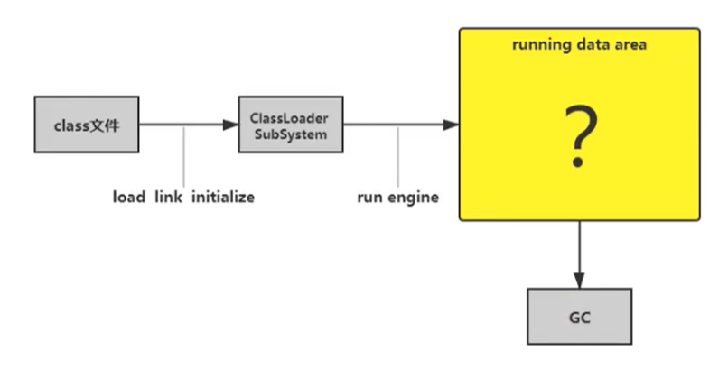
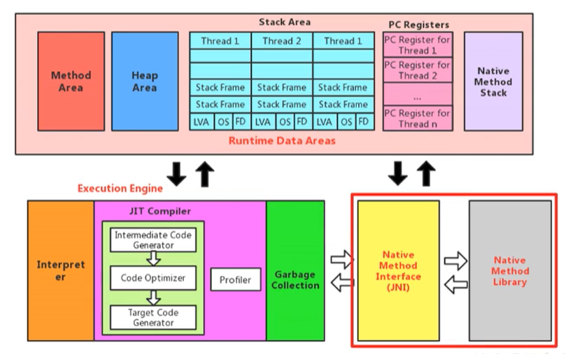

# # 運行時數據區概述及線程

[通过javap命令分析java汇编指令](https://www.jianshu.com/p/6a8997560b05)

> javap是jdk自帶的反解析工具。它的作用就是根據class字節碼文件，反解析出當前類對應的code區（彙編指令）、本地變量表、異常表和代碼行偏移量映射表、常量池等等信息。
>  當然這些信息中，有些信息（如本地變量表、指令和代碼行偏移量映射表、常量池中方法的參數名稱等等）需要在使用javac編譯成class文件時，指定參數才能輸出，比如，你直接javac xx.java，就不會在生成對應的局部變量表等信息，如果你使用javac -g xx.java就可以生成所有相關信息了。如果你使用的eclipse，則默認情況下，eclipse在編譯時會幫你生成局部變量表、指令和代碼行偏移量映射表等信息的。
>
> javap的用法格式：
>  `javap <options> <classes>`
>  其中classes就是你要反編譯的class文件。
>  在命令行中直接輸入javap或javap -help可以看到javap的options有如下選項：
>
> ```kotlin
> -help --help -? 輸出此用法消息
>  -version 版本信息，其實是當前javap所在jdk的版本信息，不是class在哪個jdk下生成的。
>  -v -verbose 輸出附加信息（包括行號、本地變量表，反彙編等詳細信息）
>  -l 輸出行號和本地變量表
>  -public 僅顯示公共類和成員
>  -protected 顯示受保護的/公共類和成員
>  -package 顯示程序包/受保護的/公共類 和成員 (默認)
>  -p -private 顯示所有類和成員
>  -c 對代碼進行反彙編
>  -s 輸出內部類型簽名
>  -sysinfo 顯示正在處理的類的系統信息 (路徑, 大小, 日期, MD5 散列)
>  -constants 顯示靜態最終常量
>  -classpath <path> 指定查找用戶類文件的位置
>  -bootclasspath <path> 覆蓋引導類文件的位置
> ```
>
> 一般常用的是-v -l -c三個選項。
>  javap -v classxx，不僅會輸出行號、本地變量表信息、反編譯彙編代碼，還會輸出當前類用到的常量池等信息。
>  javap -l會輸出行號和本地變量表信息。
>  javap -c會對當前class字節碼進行反編譯生成彙編代碼。
>  查看彙編代碼時，需要知道裡面的jvm指令，可以參考官方文檔：
>  [https://docs.oracle.com/javase/specs/jvms/se7/html/jvms-6.html](https://links.jianshu.com/go?to=https%3A%2F%2Fdocs.oracle.com%2Fjavase%2Fspecs%2Fjvms%2Fse7%2Fhtml%2Fjvms-6.html%23jvms-6.5.iconst_i)
>  另外通過jclasslib工具也可以看到上面這些信息，而且是可視化的，效果更好一些。

前言

本節主要講的是運行時數據區，也就是下圖這部分，它是在類加載完成後的階段


當我們通過前面的：類的加載-> 驗證-> 準備-> 解析-> 初始化這幾個階段完成後，就會用到執行引擎對我們的類進行使用，同時執行引擎將會使用到我們運行時數據區



也就是大廚做飯，我們把大廚後面的東西（切好的菜，刀，調料），比作是運行時數據區。而廚師可以類比於執行引擎，將通過準備的東西進行製作成精美的菜品

- 內存是非常重要的系統資源，是硬盤和CPU的中間倉庫及橋樑，承載著操作系統和應用程序的實時運行JVM內存佈局規定了Java在運行過程中內存申請、分配、管理的策略，保證了JVM的高效穩定運行`不同的JVM對於內存的劃分方式和管理機制存在著部分差異`。結合JVM虛擬機規範，來探討一下經典的JVM內存佈局。

- 我們通過磁盤或者網絡IO得到的數據，都需要先加載到內存中，然後CPU從內存中獲取數據進行讀取，也就是說內存充當了CPU和磁盤之間的橋樑

## 運行時數據區(執行時資料區)的完整圖


Java虛擬機定義了若干種程序運行期間會使用到的運行時數據區，其中有一些會隨著虛擬機啟動而創建，隨著虛擬機退出而銷毀。另外一些則是與線程一一對應的，這些與線程對應的數據區域會隨著線程開始和結束而創建和銷毀。


灰色（線程/執行緒私有）的為單獨線程私有的，紅色（進程私有）的為多個線程共享的。即：

- 每個線程：獨立包括  程序計數器（寄存器/暫存器）、棧、本地棧。

- 每個進程＝進程中線程間共享：堆、堆外內存（永久代或元空間、代碼緩存）

  ​													堆、堆外記憶體（永久代或元空間、程式碼快取）


berfore jdk8 ---> method area
after jdk8 ---> 元空間（本地內存）


## 線程(執行緒) Thread

- 線程是一個程序裡的運行單元。 JVM允許一個應用有多個線程並行的執行。
- 在Hotspot JVM裡，每個線程都與操作系統的本地線程直接映射。
  - 當一個Java線程準備好執行以後，此時一個操作系統的本地線程也同時創建。 Java線程執行終止後，本地線程也會回收。

- 操作系統負責所有線程的安排調度到任何一個可用的CPU上。一旦本地線程初始化成功，它就會調用Java線程中的 run() 方法。

### JVM系統線程(執行緒)

如果你使用console或者是任何一個調試工具，都能看到在後台有許多線程在運行。這些後台線程不包括調用`public static void main（String[]）的main`線程以及所有這個`main`線程自己創建的線程。 | 這些主要的後台系統線程在Hotspot JVM裡主要是以下幾個：

- 虛擬機線程：這種線程的操作是需要JVM達到安全點才會出現。這些操作必須在不同的線程中發生的原因是他們都需要JVM達到安全點，這樣堆才不會變化。這種線程的執行類型包括"stop-the-world"的垃圾收集，線程棧收集，線程掛起以及偏向鎖撤銷。
- 週期任務線程：這種線程是時間週期事件的體現（比如中斷），他們一般用於週期性操作的調度執行。
- GC線程：這種線程對在JVM裡不同種類的垃圾收集行為提供了支持。
- 編譯線程：這種線程在運行時會將字節碼編譯成到本地代碼。
- 信號調度線程：這種線程接收信號並發送給JVM，在它內部通過調用適當的方法進行處理。


# # 程式計數器（Program Counter Register） 介紹

## 介紹

JVM中的 `程序計數 寄存器/暫存器（Program Counter Register）`中，Register的命名源於CPU的寄存器，寄存器存儲指令相關的現場信息。 CPU只有把數據裝載到寄存器才能夠運行。這裡，並非是廣義上所指的物理寄存器，或許將其翻譯為PC計數器（或指令計數器）會更加貼切（也稱為程序鉤子），並且也不容易引起一些不必要的誤會。 `JVM中的PC寄存器是對物理PC寄存器的一種抽像模擬`。


## 作用

`PC暫存器` 用來`儲存指向下一條指令的地址，也即將要執行的指令程式碼`。由執行引擎讀取下一條指令。


- 它是一塊很小的內存空間，幾乎可以忽略不記。也是運行速度最快的存儲區域。
- 在JVM規範中，每個線程都有它自己的程序計數器，是`線程私有的`，生命週期與線程的生命週期保持一致。
  - 任何時間一個線程都只有一個方法在執行，也就是所謂的`當前方法`。程序計數器會存儲當前線程正在執行的Java方法（Java）的JVM指令地址；
  - 或者，如果是在執行native方法（C/C++），則是未指定值（undefned）。

- 它是程序控制流的指示器，分支、循環、跳轉、異常處理、線程恢復等基礎功能都需要依賴這個計數器來完成。字節碼解釋器工作時就是通過改變這個計數器的值來選取下一條需要執行的字節碼指令。
- 它是`唯一一個在Java虛擬機規範中沒有規定任何outotMemoryError情況的區域`（也沒有GC，因為只存儲指令的地址，不需要GC提高性能）。
  作用
- PC寄存器`用來存儲指向下一條指令的地址，也即將要執行的指令代碼`。由執行引擎讀取下一條指令。


## 代碼演示

我們首先寫一個簡單的代碼

```JAVA
//程序計數器
public class PCRegisterTest {
  public static void main(String[] args) {
    int i = 10;
    int j = 20;
    int k = i + j;
  }
}
```


然後將代碼進行編譯成字節碼文件，我們再次查看 ，發現在字節碼的左邊有一個行號標識，它其實就是指令地址，用於指向當前執行到哪裡。

```
Code:
	stack=2, locals=4, args_size=1
    0: bipush 	10
    2: istore_1
    3: bipush 	20
    5: istore_2
    6: iload_1
    7: iload_2
    8: iadd
    9: istore_3
    10: return

   	指令地址（偏移地址）： 操作指令
```

通過PC寄存器，我們就可以知道當前程序執行到哪一步了


### 兩個常見問題

> 使用PC寄存器存儲字節碼指令地址有什麼用呢？

因為CPU需要不停的切換各個線程，這時候切換回來以後，就得知道接著從哪開始繼續執行。

JVM的字節碼解釋器就需要通過改變PC寄存器的值來明確下一條應該執行什麼樣的字節碼指令。


> PC寄存器為什麼被設定為私有的？

我們都知道所謂的多線程在一個特定的時間段內只會執行其中某一個線程的方法，CPU會不停地做任務切換，這樣必然導致經常中斷或恢復，如何保證分毫無差呢？`為了能夠準確地記錄各個線程正在執行的當前字節碼指令地址，最好的辦法自然是為每一個線程都分配一個PC寄存器`，這樣一來各個線程之間便可以進行獨立計算，從而`不會出現相互干擾的情況`。

由於CPU時間片輪限制，眾多線程在並發執行過程中，任何一個確定的時刻，一個處理器或者多核處理器中的一個內核，只會執行某個線程中的一條指令。

這樣必然導致經常中斷或恢復，如何保證分毫無差呢？每個線程在創建後，都會產生自己的程序計數器和棧幀，程序計數器在各個線程之間互不影響。


### CPU時間片

`CPU時間片即CPU分配給各個程序的時間`，每個線程被分配一個時間段，稱作它的時間片。

在宏觀上：俄們可以同時打開多個應用程序，每個程序並行不悖，同時運行。

但在微觀上：由於只有一個CPU，一次只能處理程序要求的一部分，如何處理公平，一種方法就是引入時間片，每個程序輪流執行。


# # 虛擬機器棧概述

由於跨平臺性的設計，Java的指令都是根據棧來設計的。`不同平臺 CPU 架構不同，所以不能設計為基於暫存器的。 `（for detail --> # JVM與Java體系結構）

- 優點是`跨平臺，指令集小，編譯器容易實現`，
- 缺點是`效能下降，實現同樣的功能需要更多的指令`。 

有不少 Java 開發人員一提到Java記憶體結構，就會非常粗粒度地將JVM中的記憶體區理解為僅有 Java 堆（heap）和 Java 棧（stack）？為什麼？

`首先棧是執行時的單位，而堆是儲存的單位`

- 棧解決程式的執行問題，即程式如何執行，或者說如何處理資料。
- 堆解決的是資料儲存的問題，即資料怎麼放，放哪裡。

## |> Java虛擬機器棧是什麼

- Java虛擬機器棧（Java Virtual Machine Stack），早期也叫 Java 棧。`每個執行緒在建立時都會建立一個虛擬機器棧`，其內部儲存一個個的棧幀（Stack Frame），對應著一次次的 Java 方法呼叫。
  - 是執行緒私有的


- **生命週期**
  - 生命週期和執行緒一致，也就是執行緒結束了，該虛擬機器棧也銷燬了

- **作用**
  - 主管Java程式的執行，它儲存方法的區域性變數（八種數據類型＋物件/對象引用地址）、部分結果，並參與方法的呼叫和返回。
  - 區域性變數（局部變量），它是相比於成員變數來說的（或屬性）
  - 基本資料型別變數 VS 引用型別變數（類、陣列（數組）、介面（接口））


### 棧的特點

- 棧是一種快速有效的分配儲存方式，訪問速度僅次於程式計數器（程序計數 寄存器/暫存器）。
- JVM 直接對 Java 棧的操作只有兩個：
  - 每個方法執行，伴隨著進棧（入棧、壓棧）
  - 執行結束後的出棧工作
- 對於棧來說不存在垃圾回收問題（棧存在溢位的情況）
  - 程式計數器（程序計數 寄存器/暫存器）--> 不存在 GC;OOM
  - 棧 -->  不存在 GC，有OOM


### 開發中遇到哪些異常？

棧中可能出現的異常

- Java 虛擬機器規範`允許 Java 棧的大小是動態的或者是固定不變的`。
  - 如果採用`固定大小`的 Java 虛擬機器棧，那每一個執行緒的 Java 虛擬機器棧容量可以線上程建立的時候獨立選定。如果執行緒請求分配的棧容量超過 Java 虛擬機器棧允許的最大容量，Java 虛擬機器將會丟擲一個`StackoverflowError `異常。
  - 如果 Java 虛擬機器棧可以`動態擴充套件`，並且在嘗試擴充套件的時候無法申請到足夠的記憶體，或者在建立新的執行緒時沒有足夠的記憶體去建立對應的虛擬機器棧，那Java虛擬機器將會丟擲一個 `outofMemoryError` 異常。

```java
/**
 * 演示棧中的異常:StackOverflowError
 *  預設情況下：count : 14545
 *  設定棧的大小： -Xss256k : count : 2249
 */
public class StackoverflowErrorTest {
    private static int count = 1;
    public static void main(String[] args) {
        System.out.println(count++);
        main(args);
    }
}
---------------------------------------------------
...  
14545
Exception in thread "main" java.lang.StackOverflowError
...  
```

當棧深度達到 14545 的時候，就出現棧記憶體空間不足。 
**設定棧記憶體大小** 我們可以使用引數 `-Xss` 選項來設定執行緒的最大棧空間，棧的大小直接決定了函式呼叫的最大可達深度。

- 右擊工程Run AS --> Run Configuration ---> Arguments ---> 在VM arguments裡面填-Xss256k。這樣就可以設置它運行時最大內存為256k


```java
...
2249
Exception in thread "main" java.lang.StackOverflowError
...
```


### == 設定棧記憶體大小 ==

[Eclipse设置JVM虚拟内存的三种方式](https://blog.csdn.net/csdnmrliu/article/details/82490986?utm_medium=distribute.pc_relevant.none-task-blog-BlogCommendFromMachineLearnPai2-2.nonecase&depth_1-utm_source=distribute.pc_relevant.none-task-blog-BlogCommendFromMachineLearnPai2-2.nonecase)

方式1. 修改Elipse運行JRE默認JVM參數

- 打開Eclipse,選擇Window--Preferences...在對話框左邊的樹上雙擊Java，再雙擊Installed JREs，在右邊選擇前面有對勾的JRE，再單擊右邊的“Edit”按鈕，出現一個Edit JRE的對話框，在其中的Default VM Arguments: 框中輸入-Xms128m -Xmx512m ,這樣設置Java擬虛機內存使用最小是128M，最大是512M，再單擊“OK”

方式2. 修改Java運行時參數

- 先將程式普通運行一次（Run As  --->  Java Application）

- 右擊工程Run AS --> Run Configuration ---> Arguments ---> 在VM arguments裡面填-Xmx256m。這樣就可以設置它運行時最大內存為256m

方式3. 修改Eclipse的配置文件[eclipse.ini]

- $ {ECLIPSE_HOME} /eclipse.ini

> [jdk11 Tools and Commands Reference](https://docs.oracle.com/en/java/javase/11/tools/tools-and-command-reference.html)
>
> **2** Main Tools to Create and Build Applications  --->  java  --->  
>
> command + f --->  find by keyword
>
> ```
> -Xss size
> ```
>
> Sets the thread stack size (in bytes). Append the letter `k` or `K` to indicate KB, `m` or `M` to indicate MB, and `g` or `G` to indicate GB. The default value depends on the platform:
>
> - Linux/x64 (64-bit): 1024 KB
> - macOS (64-bit): 1024 KB
> - Oracle Solaris/x64 (64-bit): 1024 KB
> - Windows: The default value depends on virtual memory
>
> The following examples set the thread stack size to 1024 KB in different units:
>
> ```
> Copy-Xss1m
> -Xss1024k
> -Xss1048576
> ```
>
> 


### 棧的儲存單位

- 每個執行緒都有自己的棧，棧中的資料都是以 `棧幀（Stack Frame）的格式存在` 。
- 在這個執行緒上正在執行的`每個方法都各自對應一個棧幀（Stack Frame）`。
- 棧幀是一個記憶體區塊，是一個數據集，維繫著方法執行過程中的各種資料資訊。

#### 棧中儲存什麼？

每個執行緒都有自己的棧，棧中的資料都是以 `棧幀（Stack Frame）` 的格式存在。在這個執行緒上正在執行的每個方法都各自對應一個 `棧幀（Stack Frame）` 。棧幀是一個記憶體區塊，是一個數據集，維繫著方法執行過程中的各種資料資訊。

> OOP的基本概念：類 和 物件/對象 
>
> 類中基本結構：field（屬性、欄位/字段、域）、method

- JVM 直接對 Java 棧的操作只有兩個，就是對棧幀的 `壓棧` 和 `出棧` ，遵循“先進後出”/“後進先出”原則。
- 在一條活動執行緒中，一個時間點上，只會有一個活動的棧幀。即只有當前正在執行的方法的棧幀（棧頂棧幀）是有效的，這個棧幀被稱為 `當前棧幀（Current Frame` ，與當前棧幀相對應的方法就是 `當前方法（Current Method）` ，定義這個方法的類就是 `當前類（Current Class）` 。
- 執行引擎執行的所有位元組碼指令只針對當前棧幀進行操作。
- 如果在該方法中呼叫了其他方法，對應的新的棧幀會被創建出來，放在棧的頂端，成為新的當前幀。


通過一段程式碼簡單的測試

```java
/**
 * 方法的結束方式分為兩種：
 * ① 正常結束，以return為代表
 * ② 方法執行中出現未捕獲處理的異常，以丟擲異常的方式結束
 *
 */
public class StackFrameTest {
  public static void main(String[] args) {
    try {
      StackFrameTest test = new StackFrameTest();
      test.method1(); // breakpoint // 1.step into
    } catch (Exception e) {
      e.printStackTrace();	// 11.step over --> end
    }
    System.out.println("main()正常結束");
  }
  public void method1(){
    System.out.println("method1()開始執行..."); // 2.step over
    method2(); // 3.step into
    System.out.println("method1()執行結束...");
    //        System.out.println(10 / 0);
    //        return ;//可以省略
  }
  public int method2() {
    System.out.println("method2()開始執行..."); // 4.step over
    int i = 10; // 5.step over
    int m = (int) method3(); // 6.step into
    System.out.println("method2()即將結束...");
    return i + m;
  }
  public double method3() {
    System.out.println("method3()開始執行..."); // 7.step over
    double j = 20.0; // 8.step over
    System.out.println("method3()即將結束..."); // 9.step over
    return j; // 10.step over
  }
}
```

其輸出結果為：

```java
method1()開始執行...
method2()開始執行...
method3()開始執行...
method3()即將結束...
method2()即將結束...
method1()執行結束...
main()正常結束
```

滿足棧先進後出的概念，這裡通過 eclipse 的 DEBUG，能夠看到棧資訊。


#### == eclipse Debug ==

eclipse Debug : ( remember shutdown : Run --> "skip all breakpoints " )

- Step into ---> 進入該行代碼方法、類調用細節

- Step over ---> 跳過該該行代碼內部調用細節，直接將該行代碼執行完畢，並指向下一行

#### 棧執行原理

- `不同執行緒中所包含的棧幀是不允許存在相互引用的(每個執行緒都有自己獨立的棧)`，即不可能在一個棧幀之中引用另外一個執行緒的棧幀。
- 如果當前方法呼叫了其他方法，方法返回之際，當前棧幀會傳回此方法的執行結果給前一個棧幀，接著，虛擬機器會丟棄當前棧幀，使得前一個棧幀重新成為當前棧幀。
- Java方法有兩種返回函式的方式，
  - 一種是正常的函式返回，使用return指令；
  - 另外一種是丟擲異常，發生異常語句之後的語句不會執行，該方法棧幀丟擲異常後被彈出   ===>  當方法執行時發生異常，該方法沒有 `try-catch` 處理該異常，而是`throws Exception` 未處理異常，交給方法調用者去處理（`try-catch` ，或依舊不處理`throws Exception`）若直到 `main` 方法依舊不處理`throws Exception`，最後所有棧幀被都被彈出完畢。
  - 不管使用哪種方式，都會導致棧幀被彈出。

**棧幀的內部結構** 每個棧幀中儲存著：

- 區域性變量表/局部變量表（Local Variables）
- 運算元棧/操作數棧（operand Stack）（或表示式棧）
- 動態連結（DynamicLinking）（或指向執行時常量池/運行時常量池的方法引用）
- 方法返回地址（Return Address）（或方法正常退出或者異常退出的定義）
- 一些附加資訊


並行每個執行緒下的棧都是私有的，因此每個執行緒都有自己各自的棧，並且每個棧裡面都有很多棧幀，棧幀的大小主要由區域性變量表 和 運算元棧決定的。


## |> 區域性變量表/局部變量表（Local Variables）

- 區域性變量表：Local Variables，被稱之為區域性變數陣列或本地變量表
- `定義為一個數字陣列（數組）`，主要用於`儲存方法引數`和`定義在方法體內的區域性變數`，這些資料型別包括各類基本資料型別、物件引用（reference），以及 return Address 型別
- 由於區域性變量表是建立在線程（執行緒）的棧上，是執行緒（線程）的私有資料，因此`不存在資料安全問題`（多線程操作同一數據安全問題）
- `區域性變量表所需的容量大小是在編譯期確定下來的`，並儲存在方法的 Code 屬性的 `maximum local variables` 資料項中。在方法執行（運行）期間是不會改變區域性變量表的大小的。
- `方法巢狀呼叫的次數由棧的大小決定`。一般來說，`棧越大，方法巢狀呼叫次數越多`。對一個函式而言，它的引數和區域性變數越多，使得區域性變量表膨脹，它的棧幀就越大，以滿足方法呼叫所需傳遞的資訊增大的需求。進而函式呼叫就會佔用更多的棧空間，導致其巢狀呼叫次數就會減少。
- `區域性變量表中的變數只在當前方法呼叫中有效`。在方法執行時，虛擬機器通過使用區域性變量表完成引數值到引數變數列表的傳遞過程。`當方法呼叫結束後，隨著方法棧幀的銷燬，區域性變量表也會隨之銷燬。`

### 關於 Slot 的理解

- 引數值的存放總是在區域性變數陣列的 index 0 開始，到陣列長度 -1 的索引結束。
- 區域性變量表，`最基本的儲存單元是Slot（變數槽）`
- 區域性變量表中存放編譯期可知的各種基本資料型別（8種），引用型別（reference），return Address 型別的變數。
- 在區域性變量表裡，`32位以內的型別只佔用一個 slot（包括 return Address 型別），64位的型別（long 和double）佔用兩個 slot`。
  - byte、short、char 在儲存前被轉換為 int，boolean 也被轉換為 int，0 表示 false，非 0 表示 true。
  - long 和 double 則佔據兩個 slot。
- JVM 會為區域性變量表中的每一個 Slot 都分配一個`訪問索引`，通過這個索引即可成功訪問到區域性變量表中指定的區域性變數值
- 當一個例項方法被呼叫的時候，它的方法引數和方法體內部定義的區域性變數將會`按照順序被複制`到區域性變量表中的每一個 slot 上。
- `如果需要訪問區域性變量表中一個 64bit 的區域性變數值時，只需要使用前一個索引即可。`（比如：訪問 long 或 double 型別變數）
- 如果當前幀是由`構造方法`或者`實例（例項）方法`建立的`，那麼該物件引用 this   將會存放在 index 為 0 的 slot 處`，其餘的引數按照引數表順序繼續排列。（`靜態方法中不能有 this ，因為 this 變量不存在於當前方法的 區域性/局部 變量表中` ）


實例（例項）方法 :


**Slot的重複利用** `棧幀中的區域性變量表中的槽位是可以重用的`，如果一個區域性變數過了其作用域，那麼在其作用域之後申明的新的區域性變就很有可能會複用過期區域性變數的槽位，從而達到`節省資源的目的`。


```java
public class SlotTest {
    public void localVar1(){
        int a = 0;
        System.out.println(a);
        int b= 0;
    }

    public void localVar2(){
        {
            int a = 0;
            System.out.println(a);
        }
        // 此時的 b 就會複用 a 的槽位
        int b= 0;
    }
}
```

### 靜態變數與區域性變數的對比

變數的分類：

- 按資料型別（數據類型）分：

  - 基本資料型別、
  - 引用資料型別

- 按類中宣告的位置分：

  - `成員變數（類變數，例項變數）：使用前，都經歷默認（預設）初始化 賦值`
    - 類變數（類變量）：linking 的 prepare 階段，給類變數預設（默認）賦值，initial 階段給類變數顯示賦值即靜態程式碼塊賦值
    - 例項變數（實例變量）：隨著物件（對象）建立，會在堆空間中分配例項變數空間，並進行預設（默認）賦值
  - `區域性變數：在使用前，必須進行顯式賦值，不然編譯不通過。`

- 引數（參數）表分配完畢之後，再根據方法體內定義的變數的順序和作用域分配。

- 我們知道類變量表有兩次初始化的機會，第一次是在“準備階段”，執行系統初始化，對類變數設定零值，另一次則是在“初始化”階段，賦予程式設計師在程式碼中定義的初始值。

- 和類變數初始化不同的是，`區域性變量表不存在系統初始化的過程，這意味著一旦定義了局部變數則必須人為的初始化，否則無法使用`。

  ```java
  public void test(){
    int i;
    System.out.println(i); // 沒有顯式賦值，編譯不通過
  }
  ```

  

### 補充說明

- 在棧幀中，與效能調優關係最為密切的部分就是前面提到的區域性變量表。在方法執行時，虛擬機器使用區域性變量表完成方法的傳遞。
- 區域性變量表中的變數也是`重要的垃圾回收根節點`，只要`被區域性變量表中直接或間接引用的物件都不會被回收`。

## |> 運算元棧(操作數棧)

運算元棧：Operand Stack

- 每一個獨立的棧幀除了包含區域性變量表以外，還包含一個**後進先出**（Last - In - First -Out）的 **運算元棧**，也可以稱之為 **表示式棧**（Expression Stack）
- 運算元棧，在方法執行過程中，根據位元組碼指令，往棧中寫入資料或提取資料，即入棧（push）和 出棧（pop）
  - 某些位元組碼指令將值壓入運算元棧，其餘的位元組碼指令將運算元取出棧。使用它們後再把結果壓入棧
  - 比如：執行復制、交換、求和等操作


案例演示 將 `testAddOperation()` 編譯成位元組碼，如下 

- 運算元棧，主要用於儲存計算過程的中間結果，同時作為計算過程中變數臨時的儲存空間。

- 運算元棧就是 JVM 執行引擎的一個工作區，當一個方法剛開始執行的時候，一個新的棧幀也會隨之被創建出來，這個方法的運算元棧是空的。.

  - 這個時候陣列是有長度的，因為陣列一旦建立，那麼就是不可變的

- 每一個運算元棧都會擁有一個明確的棧深度用於儲存數值，其所需的最大深度在`編譯期就定義好了`，儲存在方法的 Code 屬性中，為 maxstack 的值。

- 棧中的任何一個元素都是可以任意的 Java 資料型別

  - 32bit的型別佔用一個棧單位深度
  - 64bit的型別佔用兩個棧單位深度

- 運算元棧並非採用訪問索引的方式來進行資料訪問的，而是隻能通過標準的入棧和出棧操作來完成一次資料訪問

- `如果被呼叫的方法帶有返回值的話，其返回值將會被壓入當前棧幀的運算元棧中`，並更新PC暫存器中下一條需要執行的位元組碼指令。

  

- 運算元 (操作數) 棧中元素的資料型別必須與位元組碼指令的序列嚴格匹配，這由編譯器在編譯器期間進行驗證，同時在類載入過程中的類檢驗階段的資料流分析階段要再次驗證。

- 另外，我們說 Java 虛擬機器的`解釋引擎是基於棧的執行引擎`，其中的棧指的就是`運算元(操作數)棧`。

### 程式碼追蹤

程式碼追蹤我們還是通過運算元棧中我們的那段程式碼舉例：

```java
public void testAddOperation() {
  byte i = 15;
  int j = 8;
  int k = i + j;
}
```

使用 javap 命令反編譯class檔案： `javap -v 類名.class` 

```java
  public void testAddOperation();
    descriptor: ()V
    flags: ACC_PUBLIC
    Code:
      stack=2, locals=4, args_size=1
         0: bipush        15
         2: istore_1
         3: bipush        8
         5: istore_2
         6: iload_1
         7: iload_2
         8: iadd
         9: istore_3
        10: return
```


> byte、short、char、boolean 內部都是使用int型來進行儲存的 從上面的程式碼我們可以知道，我們都是通過 bipush 對運算元 15 和 8進行入棧操作 同時使用的是 iadd方法進行相加操作，i -> 代表的就是 int，也就是int型別的加法操作

### 執行流程如下所示：

首先執行第一條語句，PC暫存器指向的是0，也就是指令地址為 0，然後使用 bipush 讓運算元 15 入棧。


執行完後，讓 PC 暫存器 + 1，指向下一行程式碼，下一行程式碼就是將運算元棧的元素儲存到區域性變量表 1 的位置，我們可以看到區域性變量表的已經增加了一個元素


> 為什麼區域性變量表不是從 0 開始的呢？ 其實區域性變量表也是從 0 開始的，但是因為0號位置儲存的是 this 指標，所以說就直接省略了~

然後PC 暫存器 +1，指向的是下一行。讓運算元 8 也入棧，同時執行 store 操作，存入區域性變量表中


然後從區域性變量表中，依次將資料放在運算元棧中


然後將運算元棧中的兩個元素執行相加操作，並存儲在區域性變量表 3 的位置


最後PC暫存器的位置指向 10，也就是 return 方法，則直接退出方法

### 棧頂快取技術

棧頂快取技術： `Top Of Stack Cashing` 前面提過，基於棧式架構的虛擬機器所使用的`零地址指令更加緊湊`，但完成一項操作的時候必然需要使用更多的入棧和出棧指令，這同時也就意味著將`需要更多的指令分派（instruction dispatch）次數和記憶體讀/寫次數`。 由於運算元是儲存在記憶體中的，因此頻繁地執行記憶體讀/寫操作必然會影響執行速度。為了解決這個問題，HotSpot JVM的設計者們提出了 `棧頂快取` `（Tos，Top-of-Stack Cashing）` 技術，**`將棧頂元素全部快取在物理CPU的暫存器中，以此降低對記憶體的讀/寫次數，提升執行引擎的執行效率`。**

> 暫存器：指令更少，執行速度快

## |> 動態連結（或指向運行/執行時常量池的方法引用）

動態連結：Dynamic Linking


> 動態連結、方法返回地址、附加資訊 ： 有些地方被稱為幀資料區

- 每一個棧幀內部都包含一個指向**`執行時常量池`**中`該棧幀所屬方法的引用包`。含這個引用的目的就是為了支援當前方法的程式碼能夠實現`動態連結（Dynamic Linking）`。比如：invokedynamic 指令

- 在Java原始檔被編譯到位元組碼檔案中時，所有的變數和方法引用都作為`符號引用（symbolic Reference）`儲存在class檔案的常量池裡。

  比如：描述一個方法呼叫了另外的其他方法時，就是通過常量池（Constant pool）中指向方法的符號引用來表示的，那麼`動態連結的作用就是為了將這些符號引用轉換為呼叫方法的直接引用`。


- 為什麼需要執行時常量池？
  - 因為在不同的方法，都可能呼叫常量或者方法，所以只需要儲存一份即可，`節省了空間`
  - 常量池的作用：就是為了`提供一些符號和常量，便於指令的識別`

## 方法的呼叫：解析與分派

### 連結

在JVM中，將符號引用轉換為呼叫方法的直接引用與方法的繫結機制相關

**靜態連結 ** 

- 當一個位元組碼檔案被裝載進 JVM 內部時，如果被呼叫的`目標方法在編譯期可知`，且執行期保持不變時，這種情況下降呼叫方法的符號引用轉換為直接引用的過程稱之為靜態連結

**動態連結**    (invockvirtual ---> 使用父類引用，不知傳入會是哪個子類實例)

- 如果`被呼叫的方法在編譯期無法被確定下來`，也就是說，只能夠在程式`執行期`將呼叫的方法的符號`轉換為直接引用`，由於這種引用轉換過程具備動態性，因此也被稱之為動態連結。

---

**繫結（綁定）機制**

- 對應的方法的繫結機制為： `早期繫結（Early Binding）` 和 `晚期繫結（Late Binding）` 。`繫結是一個欄位（字段）、方法或者類在符號引用被替換為直接引用的過程，這僅僅發生一次。`
  - **早期繫結**    (invockspecial ---> 使用父類構造器，自身構造器)
    - 早期繫結就是指被呼叫的`目標方法如果在編譯期可知，且執行期保持不變`時，即可將這個方法與所屬的型別進行繫結，這樣一來，由於明確了被呼叫的目標方法究竟是哪一個，因此也就可以使用靜態連結的方式將符號引用轉換為直接引用。
  - **晚期繫結    (invockinterface ---> 使用接口引用，不知傳入會是哪個實現類實例 )
    - 如果`被呼叫的方法在編譯期無法被確定下來，只能夠在程式執行期根據實際的型別繫結相關的方法`，這種繫結方式也就被稱之為晚期繫結。

### 早晚期繫結的發展歷史

隨著高階語言的橫空出世，類似於Java一樣的基於面向物件的程式語言如今越來越多，儘管這類程式語言在語法風格上存在一定的差別，但是它們彼此之間始終保持著一個共性，那就是都支援封裝、繼承和多型等面向物件特性，既然這一類的程式語言具備多型特性，那麼自然也就具備早期繫結和晚期繫結兩種繫結方式。 Java 中任何一個普通的方法其實都具備虛擬函式的特徵，它們相當於 C++ 語言中的虛擬函式（C++中則需要使用關鍵字 virtual 來顯式定義）。如果在Java程式中不希望某個方法擁有虛擬函式的特徵時，則可以·使用關鍵字`final來標記這個方法`。

### 虛方法和非虛方法

- 如果方法在`編譯期就確定了具體的呼叫版本`，這個版本在執行時是不可變的。這樣的方法稱為非虛方法。
- `靜態方法、私有方法、final 方法、例項構造器、父類方法`都是`非虛方法`。
- 其他方法稱為虛方法。

> 子類物件的多型的使用前提
>
> - 類的繼承關係
> - 方法的重寫（@Override）

> 重載（Overload） ：指的是在同一個類中，方法名相同，但是參數數量、參數類型或者返回類型不同的方法就叫做重載。
>
> 重寫（@Override）：（靜態方法、私有方法、final 方法、例項構造器不能重寫）
>
> 　　重寫分兩種、第一種的是在子類繼承父類的情況下，通過@Override註解，子類方法名、參數、返回值全部一樣，方法體不一樣的方法就是重寫。
>
> 　　第二種就是介面實現，實現介面必須實現介面下的所有方法，因為實現方法上也有@Override註解，所以也算是重寫的一種吧。

### 虛擬機器中提供了以下幾條方法呼叫指令：

#### 普通呼叫指令：

- invokestatic：呼叫`靜態方法`，解析階段確定唯一方法版本
- invokespecial：呼叫`方法、私有及父類方法，解析階段確定唯一方法版本`  
  - (  super.fatherFinalMethod  顯示指定調用父類 final 修飾的方法 )
- invokevirtual：呼叫所有虛方法
  - （final 修飾的除外 ===>  fatherFinalMethod   無使用 super 顯示指定調用，雖然字節碼顯示為 invokevirtual ，但該方法 final 修飾，不能被子類重寫 ===> 非虛方法 ）
- invokeinterface：呼叫介面方法

#### 動態呼叫指令：(jdk7)

- invokedynamic：動態解析出需要呼叫的方法，然後執行

前四條指令固化在虛擬機器內部，方法的呼叫執行不可人為干預，而 invokedynamic 指令則支援由使用者確定方法版本。`其中 invokestatic 指令和 invokespecial 指令呼叫的方法稱為非虛方法，其餘的（final 修飾的除外）稱為虛方法。 **invokednamic指令**`

- JVM位元組碼指令集一直比較穩定，一直到 Java7 中才增加了一個 invokedynamic 指令，這是Java為了`實現動態型別語言支援`而做的一種改進。
- 但是在 Java7 中並沒有提供直接生成 invokedynamic 指令的方法，需要藉助 ASM 這種底層位元組碼工具來產生invokedynamic 指令。`直到 Java8 的 Lambda 表示式的出現，invokedynamic 指令的生成，在 Java 中才有了直接的生成方式。`
- Java7中增加的動態語言型別支援的`本質是對 Java 虛擬機器規範的修改`，而不是對Java語言規則的修改，這一塊相對來講比較複雜，增加了虛擬機器中的方法呼叫，最直接的受益者就是執行在 Java 平臺的動態語言的編譯器。

**動態型別語言和靜態型別語言** 

- 動態型別語言和靜態型別語言兩者的區別就在於`對型別的檢查`是`在編譯期`還是在`執行期`，滿足前者就是`靜態型別語言`，反之是`動態型別語言`。
- 說的再直白一點就是，
  - `靜態型別語言`是`判斷變數自身`的型別資訊；
  - `動態型別語言`是`判斷變數值`的型別資訊，`變數沒有型別資訊，變數值才有型別資訊`，這是動態語言的一個重要特徵。

> Java：String info = "mogu blog"; (Java是靜態型別語言的，會先編譯就進行型別檢查) JS：var name = "shkstart"; var name = 10; （執行時才進行檢查）

### 方法重寫的本質

#### Java 語言中方法重寫的本質：

- 找到運算元棧頂的第一個元素所執行的物件的實際型別，記作 C。
- 如果在型別 C 中找到與常量中的描述符合簡單名稱都相符的方法，則進行訪問許可權校驗，如果通過則返回這個方法的直接引用，查詢過程結束；如果不通過，則返回  java.lang.IllegalAccessException 異常。
- 否則，按照繼承關係從下往上依次對 C 的各個父類進行第2步的搜尋和驗證過程。
- 如果始終沒有找到合適的方法，則丟擲 java.lang.AbstractMehodError 異常。

#### IllegalAccessException 介紹

程式試圖訪問或修改一個屬性或呼叫一個方法，這個屬性或方法，你`沒有許可權訪問`。一般的，這個會引起編譯器異常。這個錯誤如果`發生在執行時`，就說明一個`類發生了不相容的改變`。


#### 方法的呼叫：虛方法表

- 在面向物件的程式設計中，會很頻繁的使用到動態分派，如果在每次動態分派的過程中都要重新在類的方法元資料中搜索合適的目標的話就可能影響到執行效率。因此，`為了提高效能`，JVM採用`在類的方法區`建立一個`虛方法表 （virtual method table）（非虛方法不會出現在表中）來實現。使用索引表來代替查詢`。
- 每個類中都有一個虛方法表，表中存放著各個方法的實際入口。

#### 虛方法表是什麼時候被建立的呢？

虛方法表會在`類載入的連結階段（中的解析階段）`被建立並開始初始化，類的變數初始值準備完成之後，JVM會把該類的方法表也初始化完畢。


如上圖所示：如果類中重寫了方法，那麼呼叫的時候，就會直接在虛方法表中查詢，否則將會直接連線到Object 的方法中。

EX2:


## |> 方法返回地址

- `存放呼叫該方法的 PC 暫存器的值`。
- 一個方法的結束，有兩種方式：
  - 正常執行完成
  - 出現未處理的異常，非正常退出
- 無論通過哪種方式退出，在方法退出後都返回到該方法被呼叫的位置。方法正常退出時，`呼叫者（調用者）的 pc 計數器的值作為返回地址，即呼叫該方法的指令的下一條指令的地址`。而通過異常退出的，返回地址是要通過異常表來確定，棧幀中一般不會儲存這部分資訊。
- 當一個方法開始執行後，只有兩種方式可以退出這個方法：
- 執行引擎遇到任意一個方法返回的位元組碼指令（return），會有返回值傳遞給上層的方法呼叫者，簡稱正常完成出口；
  - 一個方法在正常呼叫完成之後，究竟需要使用哪一個返回指令，還需要根據方法返回值的實際資料型別而定。
  - 在位元組碼指令中，返回指令包`含ireturn`（當返回值是 boolean、byte、char、short和 int 型別時使用），`lreturn`（Long型別），freturn（Float型別），`dreturn`（Double型別），`areturn`（引用類型）。另外還有一個`return`指令宣告為void的方法，例項初始化方法，類和介面的初始化方法使用。
- 在方法執行過程中遇到異常（Exception），並且這個異常沒有在方法內進行處理，也就是隻要在本方法的異常表中沒有搜尋到匹配的異常處理器，就會導致方法退出，簡稱異常完成出口。
- 方法執行過程中，丟擲異常時的異常處理，儲存在一個異常處理表，方便在發生異常的時候找到處理異常的程式碼


- 本質上，方法的退出就是當前棧幀出棧的過程。此時，需要恢復上層方法的區域性變量表、運算元棧、將返回值壓入呼叫者棧幀的運算元棧、設定 PC 暫存器值等，讓呼叫者方法繼續執行下去。
- 正常完成出口和異常完成出口的區別在於：`通過異常完成出口退出的不會給他的上層呼叫者產生任何的返回值`。

## 一些附加資訊

棧幀中還允許攜帶與Java虛擬機器實現相關的一些附加資訊。例如：對程式除錯提供支援的資訊。

## 棧的相關面試

- 舉例棧溢位的情況？（StackOverflowError）

  - 通過 -Xss設定棧的大小，如果內存空間不足，無法再擴容：OOM

- 調整棧大小，就能保證不出現溢位麼？

  - 不能保證不溢位（例如：無限遞歸＝自己調用自己）

- 分配的棧記憶體越大越好麼？

  - 不是，一定時間內降低了OOM概率，但是會擠佔其它的執行緒空間，因為整個空間是有限的。

- 垃圾回收是否涉及到虛擬機器棧？

  - 不會

  |                              |       Error        |  GC  |
  | :--------------------------: | :----------------: | :--: |
  |             Heap             |  OutOfMemoryError  |  O   |
  |         Method Area          |  OutOfMemoryError  |  O   |
  |    Native Method `Stack`     | StackOverflowError |  x   |
  | Java Virtual Machine `Stack` | StackOverflowError |  x   |
  |  Program Computer Register   |         x          |  x   |

  

- 方法中定義的區域性變數是否執行緒安全？

  - 具體問題具體分析

```java
/**
 * 面試題：
 * 方法中定義的區域性變數是否執行緒安全？具體情況具體分析
 *
 *   何為執行緒安全？
 				在線程（執行緒）內部生成，內部消亡: 執行緒安全的
 				
 *      如果只有一個執行緒才可以操作此資料，則必是執行緒安全的。
 *      如果有多個執行緒操作此資料，則此資料是共享資料。如果不考慮同步機制的話，會存線上程安全問題。
 */
public class StringBuilderTest {

    int num = 10;

    //s1的宣告方式是執行緒安全的
    public static void method1(){
        //StringBuilder:執行緒不安全
        StringBuilder s1 = new StringBuilder();
        s1.append("a");
        s1.append("b");
        //...
      	// s1 在線程內部生成，內部消亡: 執行緒安全的
    }
    //sBuilder的操作過程：是執行緒不安全的
    public static void method2(StringBuilder sBuilder){
      	// sBuilder 不是線程內部生成:執行緒不安全
      	// 會修改傳入值（其他線程的參數 sBuilder）
        sBuilder.append("a");
        sBuilder.append("b");
        //...
    }
    //s1的操作：是執行緒不安全的
    public static StringBuilder method3(){
        StringBuilder s1 = new StringBuilder();
        s1.append("a");
        s1.append("b");
        return s1; 
      	// 返回值 s1 會被其他執行緒所使用
      	// s1 在線程內部生成，但當執行緒結束 s1 被當作返回值傳出當前執行緒， s1 的生命週期未結束：是執行緒不安全的
    }
    //s1的操作：是執行緒安全的
    public static String method4(){
        StringBuilder s1 = new StringBuilder(); // s1 在線程內部生成，內部消亡
        s1.append("a");
        s1.append("b");
        return s1.toString(); // 返回值 (.toString() 方法 == new String(s1) )會被其他縣城所使用：返回 String 值是執行緒不安全的
    }

    public static void main(String[] args) {
        StringBuilder s = new StringBuilder();
        new Thread(() -> {
            s.append("a");
            s.append("b");
        }).start();

        method2(s);
    }
}
```

總結一句話就是：如果物件是在內部產生，並在內部消亡，沒有返回到外部，那麼它就是執行緒安全的，反之則是執行緒不安全的。 執行時資料區，是否存在Error和GC？

| 執行時資料區 | 是否存在Error | 是否存在GC |
| ------------ | ------------- | ---------- |
| 程式計數器   | 否            | 否         |
| 虛擬機器棧   | 是            | 否         |
| 本地方法棧   | 是            | 否         |
| 方法區       | 是（OOM）     | 是         |
| 堆           | 是            | 是         |

# # 本地方法介面

### 什麼是本地方法

本地方法棧（Native Method Stacks）與虛擬機器棧所發揮的作用是非常相似的，其區別只是虛擬機器棧為虛擬機器執行Java方法（也就是位元組碼）服務，而本地方法棧則是為虛擬機器使用到的本地（Native）方法服務。

《Java虛擬機器規範》對本地方法棧中方法使用的語言、使用方式與資料結構並沒有任何強制規定，因此具體的虛擬機器可以根據需要自由實現它，甚至有的 Java 虛擬機器（譬如 Hot-Spot 虛擬機器）直接就把本地方法棧和虛擬機器棧合二為一。與虛擬機器棧一樣，本地方法棧也會在棧深度溢位或者棧擴充套件失敗時分別丟擲`StackOverflowError`和`OutOfMemoryError` 異常。

簡單地講，**`一個 Native Method 是一個 Java 呼叫非 Java 程式碼的接囗。`** 一個 Native Method是這樣一個 Java 方法：該方法的實現由非 Java 語言實現，比如 C。這個特徵並非 Java 所特有，很多其它的程式語言都有這一機制，比如在 C++ 中，你可以用 extern "c" 告知 c++ 編譯器去呼叫一個 c 的函式。

"A native method is a Java method whose implementation is provided by non-java code."（本地方法是一個非 Java 的方法，它的具體實現是非 Java 程式碼的實現），在定義一個 native method 時，並不提供實現體（有些像定義一個Java interface），因為其實現體是由非 java 語言在外面實現的。 本地介面的作用是融合不同的程式語言為Java所用，它的初衷是融合C/C++程式。




程式碼舉例說明 Native 方法是如何編寫：

```java
/**
 * 本地方法
 */
public class IhaveNatives {
    public native void Native1(int x);
    native static public long Native2();
    native synchronized private float Native3(Object o);
    native void Natives(int[] ary) throws Exception;
}
```

> 需要注意的是：識別符號 native 可以與其它 Java 識別符號連用，但是 abstract 除外
>
> native：有方法體，不過不是用 java 實現
>
> abstract：沒有方法體

### 為什麼使用Native Method？

Java使用起來非常方便，然而有些層次的任務用 Java 實現起來不容易，或者我們對程式的效率很在意時，問題就來了。

### 與Java環境的互動

`有時 Java 應用需要與 Java 外面的環境互動，這是本地方法存在的主要原因。`你可以想想Java 需要與一些底層系統，如作業系統或某些硬體交換資訊時的情況。本地方法正是這樣一種交流機制：它為我們提供了一個非常簡潔的介面，而且我們無需去了解 Java 應用之外的繁瑣的細節。

### 與作業系統的互動

JVM 支援著 Java 語言本身和執行時庫，它是 Java 程式賴以生存的平臺，它由一個直譯器（解釋位元組碼）和一些連線到原生代碼的庫組成。然而不管怎樣，它畢竟不是一個完整的系統，它經常依賴於一底層系統的支援。這些底層系統常常是強大的作業系統。`通過使用本地方法，我們得以用 Java 實現了 jre 的與底層系統的互動，甚至 JVM 的一些部分就是用c寫的`。還有，如果我們要使用一些Java語言本身沒有提供封裝的作業系統的特性時，我們也需要使用本地方法。

### Sun's Java

`Sun 的直譯器是用 C 實現的，這使得它能像一些普通的 C 一樣與外部互動`。jre 大部分是用Java實現的，它也通過一些本地方法與外界互動。例如：類`java.lang.Thread`的`setpriority()`方法是用 Java 實現的，但是它實現呼叫的是該類裡的本地方法`setpriorityo()` 。這個本地方法是用 C 實現的，並被植入 JVM 內部，在 Windows 95 的平臺上，這個本地方法最終將呼叫 `Win32 setpriority() ApI`。這是一個本地方法的具體實現由 JVM 直接提供，更多的情況是本地方法由外部的動態連結庫（`external dynamic link library`）提供，然後被 JVM 呼叫。

### 現狀

`目前該方法使用的越來越少了，除非是與硬體有關的應用`，比如通過 Java 程式驅動印表機或者 Java 系統管理生產裝置，在企業級應用中已經比較少見。因為現在的異構領域間的通訊很發達，比如可以使用 Socket 通訊，也可以使用 Web Service 等等，不多做介紹。

# # 本地方法棧

- **Java 虛擬機器棧於管理 Java 方法的呼叫，而本地方法棧用於管理本地方法的呼叫**。
- 本地方法棧，`也是執行緒私有的`。
- 允許被實現成固定或者是可動態擴充套件的記憶體大小。（在記憶體溢位方面是相同的）
- - 如果執行緒請求分配的棧容量超過本地方法棧允許的最大容量，Java虛擬機器將會丟擲一個 `StackOverflowError`異常。
  - 如果本地方法棧可以動態擴充套件，並且在嘗試擴充套件的時候無法申請到足夠的記憶體，或者在建立新的執行緒時沒有足夠的記憶體去建立對應的本地方法棧，那麼Java虛擬機器將會丟擲一個`OutOfMemoryError` 異常。
- 本地方法是使用C語言實現的。
- 它的具體做法是`Native Method Stack` 中登記`native`方法，在`Execution Engine `執行時載入本地方法庫。


- `當某個執行緒呼叫一個本地方法時，它就進入了一個全新的並且不再受虛擬機器限制的世界。它和虛擬機器擁有同樣的許可權`。
  - 本地方法可以通過本地方法介面來`訪問虛擬機器內部的執行時資料區`。
  - 它甚至可以直接使用本地處理器中的暫存器
  - 直接從本地記憶體的堆中分配任意數量的記憶體。
- `並不是所有的 JVM 都支援本地方法。因為Java 虛擬機器規範並沒有明確要求本地方法棧的使用語言、具體實現方式、資料結構`等。如果 JVM 產品不打算支援 native 方法，也可以無需實現本地方法棧。
- 在Hotspot JVM中，直接將本地方法棧和虛擬機器棧合二為一。