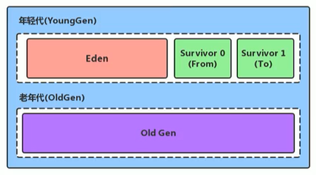
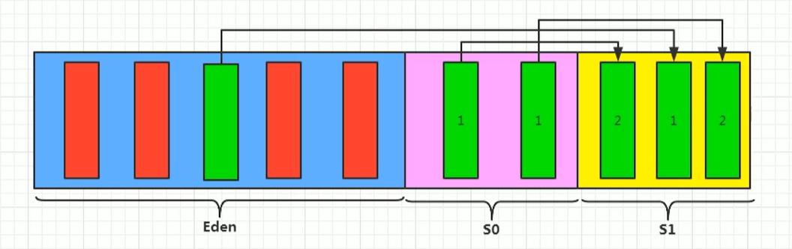
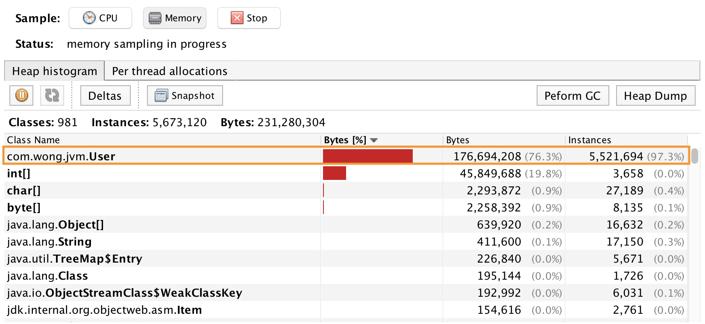
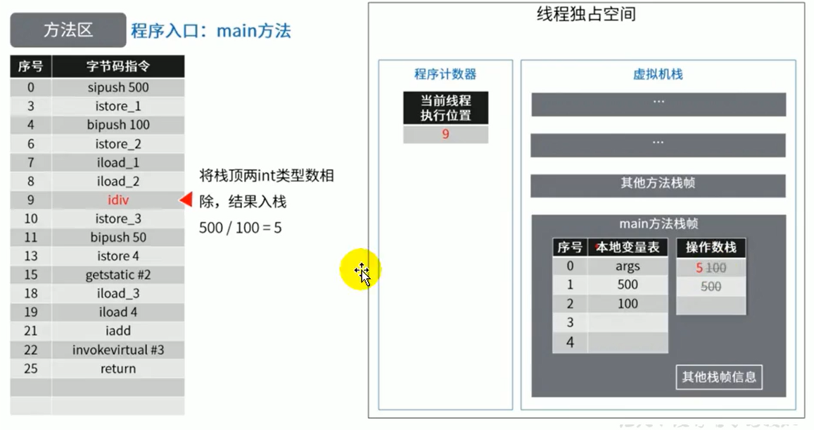
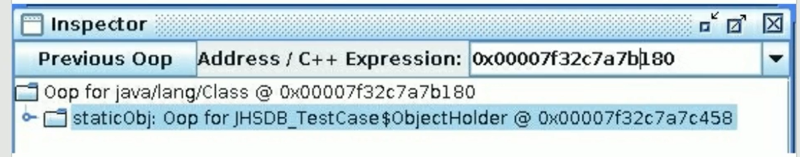

# # 堆(Heap)

## 堆的核心概述

- `一個進程對應一個 JVM 實例`，一個 JVM 實例中就有一個 `Runtime` 類（餓漢單例）＝ 運行時數據區，
- 一個 `Runtime` 實例中裡面各有`獨立的堆和方法區`，`同一個進程中的多個線程共享堆和方法區`。每個線程各有獨立的程序計數器、本地方法棧、虛擬機棧。

**堆的核心概念** 

堆針對一個 JVM 程序來說是唯一的，也就是`一個程序只有一個JVM，但是程序包含多個執行緒，他們是共享同一堆空間的`。


- 一個JVM例項只存在一個堆記憶體，堆也是 Java 記憶體管理的核心區域。
- `Java 堆區在 JVM 啟動的時候即被建立，其空間大小也就確定了`。是 JVM 管理的最大一塊記憶體空間。
  - 堆記憶體的大小是可以調節的。
- 《Java虛擬機器規範》規定，堆可以處於`物理上不連續的記憶體空間中，但在邏輯上它應該被視為連續的`。
- 所有的執行緒共享Java堆，在這裡還可以劃分`執行緒私有的緩衝區（Thread Local Allocation Buffer，TLAB）`。

> -Xms10m：最小堆記憶體

### == java location on mac ==

`command+shift+g` --->  enter  `  /User/local`

`Jdk8/bin/javavisualvmexe`


為了更好的理解，我們可以通過 `Java VisualVM `檢視堆空間的內容，通過 jdk bin提供的外掛:


- 《Java虛擬機器規範》中對Java堆的描述是：所有的物件例項以及陣列都應當在執行時分配在堆上。（The heap is the run-time data area from which memory for all class instances and arrays is allocated）
  - 我要說的是：`“幾乎”所有的物件例項都在這裡分配記憶體`。—從實際使用角度看的。
- 因為還有一些物件是在棧上分配的
- 陣列和物件可能永遠不會儲存在棧上，因為棧幀中儲存引用，這個引用指向物件或者陣列在堆中的位置。
- 在方法結束後，堆中的物件不會馬上被移除，僅僅在垃圾收集的時候才會被移除。
  - 也就是觸發了 GC 的時候，才會進行回收
  - 如果堆中物件馬上被回收，那麼使用者執行緒就會收到影響，因為有stop the word
- 堆，是 `GC（Garbage Collection，垃圾收集器）` 執行垃圾回收的重點區域


### **Java 7 和 Java 8 堆記憶體細分**

Java 7 及之前堆記憶體邏輯上分為三部分：新生區+養老區+`永久區`

- Young Generation Space 新生區 Young/New 又被劃分為 Eden 區和 Survivor 區
- Tenure generation space 養老區 Old/Tenure
- Permanent Space 永久區 Perm

Java 8 及之後堆記憶體邏輯上分為三部分：新生區+養老區+`元空間`

- Young Generation Space 新生區 Young/New 又被劃分為 Eden 區和 Survivor 區
- Tenure generation space 養老區 Old/Tenure
- Meta Space 元空間 Meta

> 約定：新生區 -> 新生代 -> 年輕代 、 養老區 -> 老年區 -> 老年代、 永久區 -> 永久代


堆空間內部結構，JDK1.8 之前從 `永久代` 替換成 `元空間` 


## 設定堆記憶體大小與OOM

- Java 堆區用於儲存 Java 物件例項，那麼堆的大小在JVM啟動時就已經設定好了，可以通過選項`"-Xmx"` 和`"-Xms"` 來進行設定。
  - `-Xms` 用於表示堆區的起始記憶體，等價於 `-xx:InitialHeapSize` 
  - `-Xmx` 則用於表示堆區的最大記憶體，等價於 `-XX:MaxHeapSize` 
- 一旦堆區中的記憶體大小超過 `-xmx` 所指定的最大記憶體時，將會丟擲 `outofMemoryError` 異常。
- 通常會將 `-Xms` 和 `-Xmx ` 兩個引數配置相同的值，其目的是**為了能夠在ava垃圾回收機制清理完堆區後不需要重新分隔計算堆區的大小，從而提高效能**。
- 預設情況下
  - 初始記憶體大小：物理電腦記憶體大小/64
  - 最大記憶體大小：物理電腦記憶體大小/4

```java
/**
 * 1. 設定堆空間大小的引數
 * -Xms 用來設定堆空間（年輕代+老年代）的初始記憶體大小
 *      -X 是jvm的執行引數
 *      ms 是memory start
 * -Xmx 用來設定堆空間（年輕代+老年代）的最大記憶體大小
 *
 * 2. 預設堆空間的大小
 *    初始記憶體大小：物理電腦記憶體大小 / 64
 *             最大記憶體大小：物理電腦記憶體大小 / 4
 * 3. 手動設定：-Xms600m -Xmx600m
 *     開發中建議將初始堆記憶體和最大的堆記憶體設定成相同的值。
 *
 * 4. 檢視設定的引數：方式一： jps   /  jstat -gc 程序id
 *                  方式二：-XX:+PrintGCDetails
			 -Xmx600m -Xms600m -XX:+PrintGCDetails
 */
public class HeapSpaceInitial {
  public static void main(String[] args) {

    //返回Java虛擬機器中的堆記憶體總量
    long initialMemory = Runtime.getRuntime().totalMemory() / 1024 / 1024;
    //返回Java虛擬機器試圖使用的最大堆記憶體量
    long maxMemory = Runtime.getRuntime().maxMemory() / 1024 / 1024;

    System.out.println("-Xms : " + initialMemory + "M");
    System.out.println("-Xmx : " + maxMemory + "M");

    // System.out.println("系統記憶體大小為：" + initialMemory * 64.0 / 1024 + "G");
    // System.out.println("系統記憶體大小為：" + maxMemory * 4.0 / 1024 + "G");

    try {
      // 使用 -XX:+PrintGCDetails 將時間調小
      Thread.sleep(1000000);
    } catch (InterruptedException e) {
      e.printStackTrace();
    }
  }
}
```

### 如何檢視堆記憶體的記憶體分配情況

#### 方式一： jps  /  jstat -gc 程序id

jps : 查看當前運行中的進程

```
> jsp
程序id	程序
程序id	程序
程序id	程序
...
> jstat -gc 程序id
```


#### 方式二：-XX:+PrintGCDetails

Run As ---> Run Configurations ---> Argument --->VM argument


```java
-Xms : 123M
-Xmx : 1820M

Heap
 PSYoungGen      total 38400K, used 1331K [0x0000000795580000, 0x0000000798000000, 0x00000007c0000000)
  eden space 33280K, 4% used [0x0000000795580000,0x00000007956cce48,0x0000000797600000)
  from space 5120K, 0% used [0x0000000797b00000,0x0000000797b00000,0x0000000798000000)
  to   space 5120K, 0% used [0x0000000797600000,0x0000000797600000,0x0000000797b00000)
 ParOldGen       total 87552K, used 0K [0x0000000740000000, 0x0000000745580000, 0x0000000795580000)
  object space 87552K, 0% used [0x0000000740000000,0x0000000740000000,0x0000000745580000)
 Metaspace       used 2721K, capacity 4486K, committed 4864K, reserved 1056768K
  class space    used 293K, capacity 386K, committed 512K, reserved 1048576K
```

`total 38400K` = `eden space 33280K` +` from space 5120K` ( or ` to space 5120K`  )

### OutOfMemory舉例

```java
/**
 * -Xms600m -Xmx600m
 */
public class OOMTest {
    public static void main(String[] args) {
        ArrayList<Picture> list = new ArrayList<>();
        while(true){
            try {
                Thread.sleep(20);
            } catch (InterruptedException e) {
                e.printStackTrace();
            }
            list.add(new Picture(new Random().nextInt(1024 * 1024)));
        }
    }
}

class Picture{
    private byte[] pixels;

    public Picture(int length) {
        this.pixels = new byte[length];
    }
}
```

**設定啟動引數**

```java
-Xms600m -Xmx600m
```

在執行過程中，我們可以通過  `VisualVM` 這個工具檢視具體是什麼引數造成的OOM，如下：


**執行完成報錯如下**

```java
Exception in thread "main" java.lang.OutOfMemoryError: Java heap space
	at com.wong.jvm.Picture.<init>(OOMTest.java:27)
	at com.wong.jvm.OOMTest.main(OOMTest.java:18)
```

## 年輕代與老年代

- 儲存在 JVM 中的 Java 物件可以被劃分為兩類：
  - 一類是生命週期較短的瞬時物件，這類物件的建立和消亡都非常迅速
    - 生命週期短的，及時回收即可
  - 另外一類物件的生命週期卻非常長，在某些極端的情況下還能夠與 JVM 的生命週期保持一致
- Java堆區進一步細分的話，可以劃分為 `年輕代（YoungGen）` 和 `老年代（oldGen）` 
- 其中年輕代又可以劃分為 Eden 空間、Survivor0 空間和 Survivor1 空間（有時也叫做from區、to區）



下面這引數開發中一般不會調：


- Eden： `From：to -> 8:1:1` 
- 新生代： `老年代 - > 1 : 2` 

**配置新生代與老年代在堆結構的佔比。** 

- 預設 `-XX:NewRatio=2` ，表示新生代佔 1，老年代佔 2，新生代佔整個堆的 1/3
- 可以修改 `-XX:NewRatio=4` ，表示新生代佔 1，老年代佔 4，新生代佔整個堆的 1/5

> 當發現在整個專案中，生命週期長的物件偏多，那麼就可以通過調整 老年代的大小，來進行調優

- 在 HotSpo t中，Eden 空間和另外兩個 survivor 空間預設所佔的比例是8：1：1當然開發人員可以通過選項 `-xx:SurvivorRatio` 調整這個空間比例。比如 `-xx:SurvivorRatio=8`
  - 因為自適應內存策略（機制），實際上會是  6 : 1 : 1 ，通過 ` -XX: -UseAdaptiveSizePolicy `  可關閉自適應機制 （ `- `：不用，`+`：使用）===> 沒用，還是得顯式加上參數 ` -xx:SurvivorRatio=8	`
- `幾乎所有`的 Java 物件都是在 Eden 區被 new 出來的。
- `絕大部分的 Java 物件的銷燬都在新生代進行了`。（有些大的物件在 Eden 區無法儲存時候，將直接進入老年代）
  - IBM 公司的專門研究表明，新生代中 80% 的物件都是“朝生夕死”的。
- 可以使用選項`"-Xmn"`設定新生代最大記憶體大小
  - 這個引數一般使用預設值就可以了。


## 圖解物件分配過程

### 概念

為新物件分配記憶體是一件非常嚴謹和複雜的任務，JM的設計者們不僅需要考慮記憶體如何分配、在哪裡分配等問題，並且由於記憶體分配演算法與記憶體回收演算法密切相關，所以還需要考慮GC執行完記憶體回收後是否會在記憶體空間中產生記憶體碎片。

- new 的物件先放伊甸園區。此區有大小限制。
- 當伊甸園的空間填滿時，程式又需要建立物件，JVM的垃圾回收器將對伊甸園區進行垃圾回收（MinorGC），將伊甸園區中的不再被其他物件所引用的物件進行銷燬。再載入新的物件放到伊甸園區
- 然後將伊甸園中的剩餘物件移動到倖存者0區。
- 如果再次觸發垃圾回收，此時上次倖存下來的放到倖存者0區的，如果沒有回收，就會放到倖存者1區。
- 如果再次經歷垃圾回收，此時會重新放回倖存者0區，接著再去倖存者1區。
- 啥時候能去養老區呢？可以設定次數。預設是15次。
- 在養老區，相對悠閒。當養老區記憶體不足時，再次觸發GC：Major GC，進行養老區的記憶體清理
- 若養老區執行了Major GC之後，發現依然無法進行物件的儲存，就會產生OOM異常。

```
可以設定引數：-Xx:MaxTenuringThreshold= N進行設定
```

### 圖解過程

我們建立的物件，一般都是存放在 Eden 區的，當我們 Eden 區滿了後，就會觸發GC操作，一般被稱為 `YGC / Minor GC` 操作


當我們進行一次垃圾收集後，紅色的將會被回收，而綠色的還會被佔用著，存放在 S0(Survivor From) 區。同時我們給每個物件設定了一個年齡計數器，一次回收後就是1。同時Eden區繼續存放物件，當Eden 區再次存滿的時候，又會觸發一個 MinorGC 操作，此時 GC 將會把 Eden 和 Survivor From 中的物件 進行一次收集，把存活的物件放到 Survivor To區，同時讓年齡 + 1。



我們繼續不斷的進行物件生成 和 垃圾回收，當Survivor中的物件的年齡達到15的時候，將會觸發一次 Promotion晉升的操作，也就是將年輕代中的物件晉升到老年代中。


**思考：倖存區區滿了後？** 特別注意，`在Eden區滿了的時候，才會觸發MinorGC`，而倖存者區滿了後，不會觸發MinorGC操作，如果Survivor區滿了後，將會觸發一些特殊的規則，也就是可能直接晉升老年代。

### 物件分配的特殊情況


**程式碼演示物件分配過程** 我們不斷的建立大物件

```java
public class HeapInstanceTest {
    byte[] buffer = new byte[new Random().nextInt(1024 * 200)];

    public static void main(String[] args) {
        ArrayList<HeapInstanceTest> list = new ArrayList<HeapInstanceTest>();
        while (true) {
            list.add(new HeapInstanceTest());
            try {
                Thread.sleep(10);
            } catch (InterruptedException e) {
                e.printStackTrace();
            }
        }
    }
}
```

**設定啟動引數**

```java
-Xms600m -Xmx600m
```

開啟 VisualVM 圖形化介面

進入之後安裝外掛 `Visual GC`。然後執行程式碼，在工具中可以看到動態過程。


最終，在老年代和新生代都滿了，就出現OOM

```java
Exception in thread "main" java.lang.OutOfMemoryError: Java heap space
	at com.atguigu.java.chapter08.HeapInstanceTest.<init>(HeapInstanceTest.java:13)
	at com.atguigu.java.chapter08.HeapInstanceTest.main(HeapInstanceTest.java:17)
```


### 總結

- `針對倖存者 S0，S1區的總結：複製之後有交換，誰空誰是to`
- 關於垃圾回收：`頻繁在新生區收集，很少在老年代收集，幾乎不再永久代和元空間進行收集`
- `新生代採用複製演算法的目的：是為了減少內碎片`

### 常用的調優工具

- JDK命令列
- Eclipse：Memory Analyzer Tool
- Jconsole
- Visual VM（實時監控 推薦~）
- Jprofiler（推薦~）
- Java Flight Recorder（實時監控）
- GCViewer
- GCEasy

#### == Jprofiler == 

[Jprofiler](https://www.ej-technologies.com/download/jprofiler/files) 

## Minor GC 、Major GC、 Full GC

- Minor GC：新生代的 GC
- Major GC：老年代的 GC
- Full GC：整堆收集，收集整個 Java 堆和方法區的垃圾收集

> 我們都知道，JVM的調優的一個環節，也就是垃圾收集，我們需要儘量的避免垃圾回收，因為在垃圾回收的過程中，容易出現STW的問題而 Major GC 和 Full GC出現STW的時間，是Minor GC的10倍以上

- JVM在進行GC時，並非每次都對上面三個記憶體區域一起回收的，大部分時候回收的都是指新生代。針對 Hotspot VM 的實現，它裡面的 GC 按照回收區域又分為兩大種類型： `一種是部分收集（Partial GC），一種是整堆收集（FullGC）` 
- 部分收集：不是完整收集整個 Java 堆的垃圾收集。其中又分為：
  - 新生代收集（MinorGC/YoungGC）：只是新生代 ( Eden/ s0, s1 ) 的垃圾收集
  - 老年代收集（MajorGC/o1dGC）：只是老年代的圾收集。
    - 目前，只有`CMS GC`會有單獨收集老年代的行為。
    - 注意，很多時候Major GC會和Fu11GC混淆使用，需要具體分辨是老年代回收還是整堆回收。
  - 混合收集（MixedGC）：收集整個新生代以及部分老年代的垃圾收集。
    - 目前，只有G1 GC會有這種行為
- 整堆收集（FullGC）：收集整個`java堆和方法區`的垃圾收集。

**Minor GC(年輕代)**

- 當年輕代空間不足時，就會觸發 MinorGC，這裡的`年輕代滿指的是 Eden 代滿，Survivor 滿不會引發GC。（每次 Minor GC會清理年輕代的記憶體。）`
- 因為Java物件大多都具備 **朝生夕滅** 的特性，所以`Minor GC非常頻繁，一般回收速度也比較快`。這一定義既清晰又易於理解。
- `Minor GC會引發STW，暫停其它使用者的執行緒，等垃圾回收結束`，使用者執行緒才恢復執行（Minor GC雖然頻繁，但回收速度較快，影響不大）

> STW：stop the word
>
> `STW`可以是`Stop the World`的縮寫，也可以是`Start the World`的縮寫。通常意義上指指代從`Stop the World`這一動作發生時到`Start the World`這一動作發生時這一段時間間隔，即萬物靜止。
>
> STW在垃圾回收過程中為了保證實現的正確性、防止無止境的內存增長等問題而不可避免的需要停止賦值器進一步操作對像圖的一段過程。


**Major GC**

- 指發生在老年代的 GC，物件從老年代消失時，我們說 “Major Gc” 或 “Full GC” 發生了
- 出現了 MajorGc，經常會伴隨至少一次的 Minor GC（但非絕對的，在Parallel Scavenge收集器的收集策略裡就有直接進行 MajorGC 的策略選擇過程）
  - 也就是在老年代空間不足時，會先嘗試觸發MinorGc。如果之後空間還不足，則觸發Major GC
- `Major GC 的速度一般會比 MinorGC 慢10倍以上，STW 的時間更長`，
- `如果 Major GC 後，記憶體還不足，就報 OOM了`

**Full GC**觸發Fu11GC執行的情況有如下五種：

- 呼叫System.gc（）時，系統建議執行Fu11GC，但是不必然執行
- 老年代空間不足
- 方法區空間不足
- 通過Minor GC後進入老年代的平均大小大於老年代的可用記憶體
- 由 Eden 區、survivor spacee（From Space）區向 survivor spacel（To Space）區複製時，物件大小大於To Space 可用記憶體，則把該物件轉存到老年代，且老年代的可用記憶體小於該物件大小

說明：`Full GC 是開發或調優中儘量要避免的`。這樣暫時時間會短一些 **GC 舉例**我們編寫一個OOM的異常，因為我們在不斷的建立字串，是存放在元空間的

```java
/**
 * 測試MinorGC 、 MajorGC、FullGC
 * -Xms10m -Xmx10m -XX:+PrintGCDetails
 */
public class GCTest {
    public static void main(String[] args) {
        int i = 0;
        try {
            List<String> list = new ArrayList<>();
            String a = "atguigu.com";
            while (true) {
                list.add(a);
                a = a + a;
                i++;
            }

        } catch (Throwable t) {
            t.printStackTrace();
            System.out.println("遍歷次數為：" + i);
        }
    }
}
```

**設定啟動引數** 

```java
// GC日誌
[GC (Allocation Failure) [PSYoungGen: 1916K->496K(2560K)] 1916K->1022K(9728K), 0.0022411 secs] [Times: user=0.00 sys=0.00, real=0.01 secs] 
[GC (Allocation Failure) [PSYoungGen: 1944K->480K(2560K)] 2471K->2134K(9728K), 0.0017865 secs] [Times: user=0.01 sys=0.00, real=0.00 secs] 
[GC (Allocation Failure) [PSYoungGen: 1925K->480K(2560K)] 7804K->7079K(9728K), 0.0011740 secs] [Times: user=0.00 sys=0.00, real=0.00 secs] 
[Full GC (Ergonomics) [PSYoungGen: 480K->0K(2560K)] [ParOldGen: 6598K->4522K(7168K)] 7079K->4522K(9728K), [Metaspace: 2662K->2662K(1056768K)], 0.0028769 secs] [Times: user=0.01 sys=0.00, real=0.01 secs] 
[GC (Allocation Failure) [PSYoungGen: 0K->0K(2560K)] 4522K->4522K(9728K), 0.0004942 secs] [Times: user=0.00 sys=0.00, real=0.00 secs] 
[Full GC (Allocation Failure) [PSYoungGen: 0K->0K(2560K)] [ParOldGen: 4522K->4504K(7168K)] 4522K->4504K(9728K), [Metaspace: 2662K->2662K(1056768K)], 0.0035587 secs] [Times: user=0.00 sys=0.00, real=0.00 secs] 
// console result
java.lang.OutOfMemoryError: Java heap space
	at java.util.Arrays.copyOf(Arrays.java:3332)
	at java.lang.AbstractStringBuilder.ensureCapacityInternal(AbstractStringBuilder.java:124)
	at java.lang.AbstractStringBuilder.append(AbstractStringBuilder.java:448)
	at java.lang.StringBuilder.append(StringBuilder.java:136)
	at com.wong.jvm.GCTest.main(GCTest.java:18)
遍歷次數為：16
// 堆內存最終分佈
Heap
 PSYoungGen      total 2560K, used 79K [0x00000007bfd00000, 0x00000007c0000000, 0x00000007c0000000)
  eden space 2048K, 3% used [0x00000007bfd00000,0x00000007bfd13f50,0x00000007bff00000)
  from space 512K, 0% used [0x00000007bff80000,0x00000007bff80000,0x00000007c0000000)
  to   space 512K, 0% used [0x00000007bff00000,0x00000007bff00000,0x00000007bff80000)
 ParOldGen       total 7168K, used 4504K [0x00000007bf600000, 0x00000007bfd00000, 0x00000007bfd00000)
  object space 7168K, 62% used [0x00000007bf600000,0x00000007bfa662c0,0x00000007bfd00000)
 Metaspace       used 2696K, capacity 4486K, committed 4864K, reserved 1056768K
  class space    used 291K, capacity 386K, committed 512K, reserved 1048576K
```

`觸發 OOM 的時候，一定是進行了一次Full GC，因為只有在老年代空間不足時候，才會爆出OOM異常。`


## 堆空間分代思想

為什麼要把 Java 堆分代？不分代就不能正常工作了嗎？

- 經研究，不同物件的生命週期不同。70%-99% 的物件是臨時物件。
  - 新生代：有Eden、兩塊大小相同的 survivor（又稱為 `from/to，s0/s1` ）構成，to 總為空。
  - 老年代：存放新生代中經歷多次GC仍然存活的物件。


其實不分代完全可以，`分代的唯一理由就是優化GC效能`。如果沒有分代，那所有的物件都在一塊，就如同把一個學校的人都關在一個教室。GC的時候要找到哪些物件沒用，這樣就會對堆的所有區域進行掃描。而很多物件都是朝生夕死的，如果分代的話，把新建立的物件放到某一地方，當GC的時候先把這塊儲存“朝生夕死”物件的區域進行回收，這樣就會騰出很大的空間出來。


## 記憶體分配策略(object promotion rule)

如果物件在 Eden 出生並經過第一次 Minor GC 後仍然存活，並且能被 Survivor 容納的話，將被移動到 survivor 空間中，並將物件年齡設為 1。

物件在 survivor 區中每熬過一次 MinorGC，年齡就增加 1 歲，當它的年齡增加到一定程度（ `預設為15歲` ，其實每個JVM、每個GC都有所不同）時，就會被晉升到老年代物件。

晉升老年代的年齡閥值，可以通過選項 `-xx:MaxTenuringThreshold` 來設定針對不同年齡段的物件分配原則如下所示：

- 優先分配到 Eden
  - 開發中比較長的字串或者陣列，會直接存在老年代，但是因為新建立的物件 都是 朝生夕死的，所以這個大物件可能也很快被回收，但是因為老年代觸發 Major GC 的次數比 Minor GC 要更少，因此可能回收起來就會比較慢
- 大物件直接分配到老年代
  - 儘量避免程式中出現過多的大物件
- 長期存活的物件分配到老年代
- 動態物件年齡判斷
  - 如果 Survivor 區中相同年齡的所有物件大小的總和大於 Survivor 空間的一半，年齡大於或等於該年齡的物件可以直接進入老年代，無須等到   MaxTenuringThreshold 中要求的年齡。

空間分配擔保： `-Xx:HandlePromotionFailure` 

- 也就是經過Minor GC後，所有的物件都存活，因為 Survivor 比較小，所以就需要將 Survivor 無法容納的物件，存放到老年代中。

測試：大對象直接進入老年代

```java
// 測試：大對象直接進入老年代
// -Xms60m -Xmx60m -XX:NewRatio=2 -XX:SurvivorRatio=8 -XX:+PrintGCDetails
// E		s0		s1		old
// 16	 	2		 	2			40
public class YoungOldAreaTest{
  public static void main(String[] args){
    byte[] buffer = new byte[1024*1024*20]; // 20m
  }
}
```

Output:

```java
// 沒有GC日誌 == 沒有進行任何GC操作 == 對象直接進入老年代
// 堆內存最終分佈
Heap
 PSYoungGen      total 18432K, used 1311K [0x00000007bec00000, 0x00000007c0000000, 0x00000007c0000000)
  eden space 16384K, 8% used [0x00000007bec00000,0x00000007bed47d28,0x00000007bfc00000)
  from space 2048K, 0% used [0x00000007bfe00000,0x00000007bfe00000,0x00000007c0000000)
  to   space 2048K, 0% used [0x00000007bfc00000,0x00000007bfc00000,0x00000007bfe00000)
 ParOldGen       total 40960K, used 20480K [0x00000007bc400000, 0x00000007bec00000, 0x00000007bec00000)
  object space 40960K, 50% used [0x00000007bc400000,0x00000007bd800010,0x00000007bec00000)
 Metaspace       used 2675K, capacity 4486K, committed 4864K, reserved 1056768K
  class space    used 288K, capacity 386K, committed 512K, reserved 1048576K

```


## 為物件分配記憶體：TLAB

**問題：堆空間都是共享的麼？**

- 不一定，因為還有 TLAB 這個概念，在堆中劃分出一塊區域，為每個執行緒所獨佔。

 **為什麼有TLAB？**

-  `TLAB：Thread Local Allocation Buffer` ，也就是為每個執行緒單獨分配了一個緩衝區
- 堆區是執行緒共享區域，任何執行緒都可以訪問到堆區中的共享資料
- 由於物件例項的建立在 JVM 中非常頻繁，因此在併發環境下從堆區中劃分記憶體空間是執行緒不安全的
- 為避免多個執行緒操作同一地址，需要使用`加鎖`等機制，進而`影響分配速度`。

 **什麼是TLAB**

- 從記憶體模型而不是垃圾收集的角度，對 Eden 區域繼續進行劃分，`JVM 為每個執行緒分配了一個私有快取區域，它包含在 Eden 空間內`。

- 多執行緒同時分配記憶體時，使用 TLAB 可以避免一系列的非執行緒安全問題，同時還能夠提升記憶體分配的吞吐量，因此我們可以將這種記憶體分配方式稱之為 `快速分配策略` 。
- 據我所知所有 OpenJDK 衍生出來的 JVM 都提供了 TLAB 的設計。


- 儘管不是所有的物件例項都能夠在 TLAB 中成功分配記憶體，但` JVM 確實是將 TLAB 作為記憶體分配的首選`。
- 在程式中，開發人員可以通過選項`“-Xx:UseTLAB”`設定是否開啟TLAB空間。（默認開啟）
- 預設情況下，TLAB 空間的記憶體非常小，`僅佔有整個Eden空間的1`，當然我們可以通過選項`“-Xx:TLABWasteTargetPercent”`設定 TLAB 空間所佔用Eden空間的百分比大小。
- 一旦物件在TLAB空間分配記憶體失敗時，JVM 就會嘗試著通過使用加鎖機制確保資料操作的原子性，從而直接在Eden 空間中分配記憶體。

### TLAB分配過程

物件首先是通過TLAB開闢空間，如果不能放入，那麼需要通過Eden來進行分配:


## 小結堆空間的引數設定

- `-XX：+PrintFlagsInitial` ：檢視所有的引數的預設初始值

- `-XX：+PrintFlagsFinal` ：檢視所有的引數的最終值（可能會存在修改，不再是初始值）

  具體查看某個參數的指令：

  - `jps` : 查看當前運行中的進程
  - `jInfo -flag SurvivorRatio 進程id`

- `-Xms` ：初始堆空間記憶體（預設為實體記憶體的1/64）

- `-Xmx ` ：最大堆空間記憶體（預設為實體記憶體的1/4）

- `-Xmn ` ：設定新生代的大小。（初始值及最大值）

- `-XX:NewRatio ` ：配置新生代與老年代在堆結構的佔比（預設為2）

- `-XX:SurvivorRatio` ：設定新生代中Eden和S0/S1空間的比例（預設為8）

- `-XX:MaxTenuringThreshold` ：設定新生代垃圾的最大年齡

- ```
  -XX：+PrintGCDetails
  ```

   ：輸出詳細的GC處理日誌

  - 列印gc簡要資訊：①-Xx：+PrintGC ② - verbose:gc

- `-XX:HandlePromotionFalilure` ：是否設定空間分配擔保

在發生 Minor GC 之前，`虛擬機器會檢查老年代最大可用的連續空間是否大於新生代所有物件的總空間`。

- 如果大於，則此次 Minor GC 是安全的
- 如果小於，則虛擬機器會檢視`-xx:HandlePromotionFailure`設定值是否允擔保失敗。
  - 如果 `HandlePromotionFailure=true` ，那麼會繼續檢查老年代最大可用連續空間是否大於歷次晉升到老年代的物件的平均大小。
    - 如果大於，則嘗試進行一次 Minor GC，但這次 Minor GC 依然是有風險的；
    - 如果小於，則改為進行一次 FullGC。
  - 如果HandlePromotionFailure=false，則改為進行一次 Full Gc。

在 `JDK6 Update24` 之後，HandlePromotionFailure 引數不會再影響到虛擬機器的空間分配擔保策略（可以視為`HandlePromotionFailure=true`恆成立），觀察 openJDK 中的原始碼變化，雖然原始碼中還定義了 HandlePromotionFailure 引數，但是在程式碼中已經不會再使用它。JDK6 Update 24 之後的規則變為

- 只要老年代的連續空間大於新生代物件總大小
- 或者歷次晉升的平均大小

就會進行 Minor GC，否則將進行 FullGC。

## 堆是分配物件的唯一選擇嗎

### **逃逸分析** 

在《深入理解Java虛擬機器》中關於Java堆記憶體有這樣一段描述：`隨著 JIT 編譯期的發展與逃逸分析技術逐漸成熟，棧上分配、標量替換優化技術將會導致一些微妙的變化，所有的物件都分配到堆上也漸漸變得不那麼“絕對”了` 。

在 Java 虛擬機器中，物件是在Java堆中分配記憶體的，這是一個普遍的常識。但是，有一種特殊情況，那就是如果經過 `逃逸分析（Escape Analysis）後發現，一個物件並沒有逃逸出方法的話，那麼就可能被優化成棧上分配`。這樣就無需在堆上分配記憶體，也無須進行垃圾回收了。這也是最常見的堆外儲存技術。

此外，前面提到的基於 OpenJDk深度定製的 TaoBaovm，其中創新的 GCIH（GC invisible heap）技術實現 off-heap，將生命週期較長的 Java 物件從heap 中移至heap外，並且 GC 不能管理 GCIH 內部的 Java 物件，以此達到降低 GC 的回收頻率和提升 GC 的回收效率的目的。

如何將堆上的物件分配到棧，需要使用逃逸分析手段。這是一種可以有效減少Java程式中同步負載和記憶體堆分配壓力的跨函式全域性資料流分析演算法。通過逃逸分析，Java Hotspot 編譯器能夠分析出一個新的物件的引用的使用範圍從而決定是否要將這個物件分配到堆上。

- 逃逸分析的基本行為就是分析物件動態作用域：
  - 當一個物件`在方法中被定義後，物件只在方法內部使用，則認為沒有發生逃逸`。
  - 當一個物件在方法中被定義後，`它被外部方法所引用，則認為發生逃逸`。例如作為呼叫引數傳遞到其他地方中。

**逃逸分析舉例** `沒有發生逃逸的物件，則可以分配到棧上`，隨著方法執行的結束，棧空間就被移除，每個棧裡面包含了很多棧幀，也就是發生逃逸分析。

```java
public void my_method() {
    V v = new V(); // 沒有發生逃逸的物件，則可以分配到棧上
    // use v
    // ....
    v = null;
}
```

針對下面的程式碼

```java
public static StringBuffer createStringBuffer(String s1, String s2) {
    StringBuffer sb = new StringBuffer();
    sb.append(s1);
    sb.append(s2);
    return sb; // sb 它被外部方法所引用，則認為發生逃逸
}
```

如果想要StringBuffer sb不發生逃逸，可以這樣寫

```java
public static String createStringBuffer(String s1, String s2) {
    StringBuffer sb = new StringBuffer();
    sb.append(s1);
    sb.append(s2);
    return sb.toString(); // = return new String(sb)
}
```

**完整的逃逸分析程式碼舉例**

```java
/**
 * 逃逸分析
 * 如何快速的判斷是否發生了逃逸分析，大家就看new的物件實體（非引用變量＝除存地址）是否在方法外被呼叫。
 */
public class EscapeAnalysis {

    public EscapeAnalysis obj;

    /**
     * 方法返回EscapeAnalysis物件，發生逃逸
     * @return
     */
    public EscapeAnalysis getInstance() {
        return obj == null ? new EscapeAnalysis():obj;
    }

    /**
     * 為成員屬性賦值，發生逃逸
     */
    public void setObj() {
        this.obj = new EscapeAnalysis();
    }

    /**
     * 物件的作用於僅在當前方法中有效，沒有發生逃逸
     */
    public void useEscapeAnalysis() {
        EscapeAnalysis e = new EscapeAnalysis();
    }

    /**
     * 引用成員變數的值，發生逃逸
     */
    public void useEscapeAnalysis2() {
        EscapeAnalysis e = getInstance();
        // getInstance().XXX  發生逃逸
    }
}
```

**引數設定**

- `在 JDK 1.7 版本之後，HotSpot中預設就已經開啟了逃逸分析`
- 如果使用的是較早的版本，開發人員則可以通過：
  - 選項“-xx：+DoEscapeAnalysis"顯式開啟逃逸分析
  - 通過選項“-xx：+PrintEscapeAnalysis"檢視逃逸分析的篩選結果

#### **棧上分配**

JIT編譯器在編譯期間根據逃逸分析的結果，發現如果一個物件並沒有逃逸出方法的話，就可能被優化成棧上分配。分配完成後，繼續在呼叫棧內執行，最後執行緒結束，棧空間被回收，區域性變數物件也被回收。這樣就無須進行垃圾回收了。 常見的棧上分配的場景

- 在逃逸分析中，已經說明了。分別是`給成員變數賦值、方法返回值、例項引用傳遞`。

舉例

我們通過舉例來說明 開啟逃逸分析 和 未開啟逃逸分析時候的情況

```java
/**
 * 棧上分配 close
 * -Xmx1G -Xms1G -XX:-DoEscapeAnalysis -XX:+PrintGCDetails
 * 
 * 棧上分配 on
 * -Xmx1G -Xms1G -XX:+DoEscapeAnalysis -XX:+PrintGCDetails
 */
class User {
    private String name;
    private String age;
    private String gender;
    private String phone;
}
public class StackAllocation {
    public static void main(String[] args) throws InterruptedException {
        long start = System.currentTimeMillis();
        for (int i = 0; i < 100000000; i++) {
            alloc();
        }
        long end = System.currentTimeMillis();
        System.out.println("花費的時間為：" + (end - start) + " ms");

        // 為了方便查看堆內存中對像個數，線程sleep
        Thread.sleep(10000000);
    }

    private static void alloc() {
        User user = new User();
    }
}
```

##### 棧上分配 off

設置JVM參數，表示未開啟逃逸分析

`-Xmx1G -Xms1G -XX:-DoEscapeAnalysis -XX:+PrintGCDetails`

- 運行結果，同時還觸發了GC操作, 花費的時間為：607  ms

- 然後查看內存的情況，發現有大量的User存儲在堆中




##### 棧上分配 on

開啟逃逸分析

`-Xmx1G -Xms1G -XX:+DoEscapeAnalysis -XX:+PrintGCDetails`

- 然後查看運行時間，我們能夠發現花費的時間快速減少，同時不會發生GC操作, 花費的時間為：5 ms

- 然後在看內存情況，發現只有很少的User對象，說明User發生了逃逸，因為他們存儲在棧中，隨著棧的銷毀而消失

花費的時間為：5 ms


#### 同步省略

- 線程同步的代價是相當高的，同步的後果是降低並發性和性能。

- 在動態編譯同步塊的時候，JIT編譯器可以`藉助逃逸分析`來`判斷同步塊所使用的鎖對像是否只能夠被一個線程訪問而沒有被發佈到其他線程`。如果沒有，那麼JIT編譯器在編譯這個同步塊的時候就會取消對這部分代碼的同步。這樣就能大大提高並發性和性能。這個取消同步的過程就叫同步省略，也叫`鎖消除`。

例如下面的代碼

```java
public void f() {
    Object hellis = new Object();
    synchronized(hellis) {
        System.out.println(hellis);
    }
}
```

代碼中對hellis這個對象加鎖，但是hellis對象的生命週期只在f()方法中，並不會被其他線程所訪問到，所以在JIT編譯階段就會被優化掉，優化成：

```java
public void f() {
    Object hellis = new Object();
		System.out.println(hellis);
}
```

將其轉換成字節碼，仍有加鎖字節碼指令，運行時才去掉


#### 分離對象和標量替換

- `標量（scalar）是指一個無法再分解成更小的數據的數據`。 Java中的原始數據類型就是標量。

- 相對的，那些`還可以分解的數據叫做聚合量（Aggregate）`，Java中的對象就是聚合量，因為他可以分解成其他聚合量和標量。

在JIT階段，如果經過逃逸分析，發現一個對像不會被外界訪問的話，那麼經過J工T優化，就`會把這個對象拆解成若干個其中包含的若干個成員變量來代替`。這個過程就是標量替換。

```java
public static void main(String args[]) {
    alloc();
}
class Point {
    private int x;
    private int y;
}
private static void alloc() {
    Point point = new Point(1,2);
    System.out.println("point.x" + point.x + ";point.y" + point.y);
}
```

以上代碼，經過標量替換後，就會變成

```java
private static void alloc() {
    int x = 1;
    int y = 2;
    System.out.println("point.x = " + x + "; point.y=" + y);
}
```

可以看到，Point這個聚合量經過逃逸分析後，發現他並沒有逃逸，就被替換成兩個聚合量了。那麼標量替換有什麼好處呢？就是可以大大減少堆內存的佔用。因為一旦不需要創建對象了，那麼就不再需要分配堆內存了。標量替換為棧上分配提供了很好的基礎。

代碼優化之標量替換

```java
/*
代碼優化之標量替換

關閉標量替換	4ms
-Xmx100m -Xms100m -XX:+DoEscapeAnalysis -XX:+PrintGC -XX:-EliminateAllocations

開啟標量替換	57ms
-Xmx100m -Xms100m -XX:+DoEscapeAnalysis -XX:+PrintGC -XX:+EliminateAllocations
*/
public class ScalarReplace{
  public static class User{
    public int id;
    public String name;
  }
  public static void alloc(){
    User u = new User();
    u.id = 5;
    u.name = "wong";
  }
  public static void main(String[] args){
    long start = System.currentTimeMillis();
    for(int i=0; i<10000000; i++){
      alloc();
    }
    long end = System.currentTimeMillis();
    System.out.println("花費的時間為：" + (end - start) + " ms");
  }
}
```

上述代碼在主函數中進行了1億次alloc。調用進行對象創建，由於User對象實例需要佔據約16字節的空間，因此累計分配空間達到將近1.5GB。如果堆空間小於這個值，就必然會發生GC。使用如下參數運行上述代碼：

`-server -Xmx100m -Xms100m -XX:+DoEscapeAnalysis -XX:+PrintGC -XX:+EliminateAllocations`

這裡設置參數如下：

    參數-server：啟動Server模式，因為在server模式下，才可以啟用逃逸分析。
    參數-XX:+DoEscapeAnalysis：啟用逃逸分析
    參數-Xmx10m：指定了堆空間最大為10MB
    參數-XX:+PrintGC：將打印Gc日誌。
    參數一xx：+EliminateAllocations：開啟了標量替換（默認打開），允許將對像打散分配在棧上，比如對象擁有id和name兩個字段，那麼這兩個字段將會被視為兩個獨立的局部變量進行分配


```java
> java -version
java version "13.0.1" 2019-10-15
Java(TM) SE Runtime Environment (build 13.0.1+9)
Java HotSpot(TM) 64-Bit Server VM (build 13.0.1+9, mixed mode, sharing)
```


### **結論**

開發中能使用區域性變數的，就不要使用在方法外定義。使用逃逸分析，編譯器可以對程式碼做如下優化：

- 棧上分配：將堆分配轉化為棧分配。如果一個物件在子程式中被分配，要使指向該物件的指標永遠不會發生逃逸，物件可能是棧上分配的候選，而不是堆上分配
- 同步省略：如果一個物件被發現只有一個執行緒被訪問到，那麼對於這個物件的操作可以不考慮同步。
- 分離物件或標量替換：有的物件可能不需要作為一個連續的記憶體結構存在也可以被訪問到，那麼物件的部分（或全部）可以不儲存在記憶體，而是儲存在CPU暫存器中。

**逃逸分析的不足**

- 關於逃逸分析的論文在1 999 年就已經發表了，但直到JDK1.6才有實現，而且這項技術到如今也並不是十分成熟的。
- 其根本原因就是無法保證逃逸分析的效能消耗一定能高於他的消耗。雖然經過逃逸分析可以做標量替換、棧上分配、和鎖消除。但是逃逸分析自身也是需要進行一系列複雜的分析的，這其實也是一個相對耗時的過程。
- 一個極端的例子，就是經過逃逸分析之後，發現沒有一個物件是不逃逸的。那這個逃逸分析的過程就白白浪費掉了。
- 雖然這項技術並不十分成熟，但是它也是即時編譯器優化技術中一個十分重要的手段。
- 注意到有一些觀點，認為通過逃逸分析，JVM 會在棧上分配那些不會逃逸的物件，這在理論上是可行的，但是取決於JvM設計者的選擇。據我所知，oracle Hotspot JVM中並未這麼做，這一點在逃逸分析相關的文件裡已經說明，所以可以明確所有的物件例項都是建立在堆上。
- 目前很多書籍還是基於 JDK7 以前的版本，JDK已經發生了很大變化，intern 字串的快取和靜態變數曾經都被分配在永久代上，而永久代已經被元資料區取代。但是，intern字串快取和靜態變數並不是被轉移到元資料區，而是直接在堆上分配，所以這一點同樣符合前面一點的結論：物件例項都是分配在堆上。

# # 方法區

`方法區（Method Area）` 與Java堆一樣，是各個執行緒共享的記憶體區域，它用於儲存已被虛擬機器載入的型別資訊、常量、靜態變數、即時編譯器編譯後的程式碼快取等資料。雖然《Java虛擬機器規範》中把方法區描述為堆的一個邏輯部分，但是它卻有一個別名叫作“非堆”（Non-Heap），目的是與Java堆區分開來。

## 棧、堆、方法區的互動關係

前面兩個章節介紹了棧、堆，本章節學習方法區，也是執行時方法區最後一個章節。


**從執行緒共享與否的角度來看****


`ThreadLocal` ：如何保證多個執行緒在併發環境下的安全性？典型應用就是資料庫連線管理，以及會話管理

**棧、堆、方法區的互動關係**


- Person：存放在元空間，也可以說方法區
- person：存放在Java棧的區域性變量表中
- new Person()：存放在Java堆

## 方法區的理解

《Java虛擬機規範》中明確說明：“儘管所有的方法區在邏輯上是屬於堆的一部分，但一些簡單的實現可能不會選擇去進行垃圾收集或者進行壓縮。”但對於HotSpotJVM而言，方法區還有一個別名叫做Non-Heap（非堆），目的就是要和堆分開。

所以，`方法區看作是一塊獨立於Java堆的內存空間`。


方法區主要存放的是 `Class` ，而堆中主要存放的是 例項化的物件

- `方法區（Method Area）` 與 `Java堆` 一樣，是各個`執行緒共享`的記憶體區域。

- 方法區`在JVM啟動的時候被建立`，並且它的實際的實體記憶體空間中和Java堆區一樣都`可以是不連續的`。

- 方法區的大小，跟堆空間一樣，可以選擇固定大小或者可擴充套件。

- 方法區的大小決定了系統可以儲存多少個類，如果系統定義了太多的類，導致方法區溢位，虛擬機器同樣會丟擲記憶體溢位錯誤：

  before jdk7 ---> `Java.lang.OutofMemoryError：PermGen space` 或者 after jdk8 ---> `java.lang.OutOfMemoryError:Metaspace`

  - `載入大量的第三方的 jar 包，Tomcat部署的工程過多（30~50個），大量動態的生成反射類`
  
- `關閉JVM就會釋放這個區域的記憶體`。

### HotSpot中方法區的演進

在 JDK 7 及以前，習慣上把方法區，稱為永久代。JDK 8 開始，使用元空間取代了永久代。

- `JDK 1.8 後，元空間存放在堆外記憶體中`

本質上，方法區和永久代並不等價。僅是對 hotspot 而言的。《Java虛擬機器規範》對如何實現方法區，不做統一要求。例如：BEAJRockit / IBM J9 中不存在永久代的概念。

- 現在來看，當年使用永久代，不是好的 idea。導致 Java 程式更容易 OOM（超過-XX:MaxPermsize上限）


而到了JDK8，終於完全廢棄了永久代的概念，改用與JRockit、J9一樣在本地記憶體中實現的元空間（Metaspace）來代替。


- 元空間的本質和永久代類似，都是對 JVM 規範中方法區的實現。不過元空間與永久代最大的區別在於：`元空間不在虛擬機器設定的記憶體（內存）中，而是使用本地記憶體（內存）`
- 永久代、元空間二者並不只是名字變了，內部結構也調整了
- 根據《Java虛擬機器規範》的規定，如果方法區無法滿足新的記憶體分配需求時，將丟擲 OOM 異常

## 設定方法區大小與 OOM

方法區的大小不必是固定的，JVM 可以根據應用的需要動態調整。

**jdk7及以前**

- 通過 `-xx:Permsize` 來設定永久代初始分配空間。預設值是 20.75M
- `-XX:MaxPermsize` 來設定永久代最大可分配空間。32 位機器預設是 64M，64 位機器模式是82M
- 當JVM載入的類資訊容量超過了這個值，會報異常 `OutofMemoryError:PermGen space` 。


**JDK8以後**

- 元資料區大小可以使用引數 `-XX:MetaspaceSize` 和 `-XX:MaxMetaspaceSize` 指定
- 預設值依賴於平臺。windows 下， `-XX:MetaspaceSize` 是21M，- `XX:MaxMetaspaceSize` 的值是-1，即沒有限制。
- 與永久代不同，如果不指定大小，預設情況下，虛擬機器會耗盡所有的可用系統記憶體。如果元資料區發生溢位，虛擬機器一樣會丟擲異常 `OutOfMemoryError:Metaspace`
- `-XX:MetaspaceSize=100m(設定的大小)` ：設定初始的元空間大小。
  - 對於一個 64 位的伺服器端 JVM 來說，其預設的 `-xx:MetaspaceSize` 值為 21 MB。這就是初始的高水位線，一旦觸及這個水位線，FullGC 將會被觸發並解除安裝沒用的類（即這些類對應的類載入器不再存活）然後這個高水位線將會重置。
  - 新的高水位線的值取決於 GC 後釋放了多少元空間。
    - 如果釋放的空間不足，那麼在不超過 `MaxMetaspaceSize `時，適當提高該值。
    - 如果釋放空間過多，則適當降低該值。
- 如果初始化的高水位線設定過低，上述高水位線調整情況會發生很多次。通過垃圾回收器的日誌可以觀察到FullGC 多次呼叫。為了避免頻繁地 GC，建議將 `-XX:MetaspaceSize` 設定為一個相對較高的值。

### 如何解決這些OOM

- 要解決 OOM 異常或 heapSpace 的異常，一般的手段是首先通過記憶體映像分析工具（如Eclipse Memory Analyzer）對 dump 出來的堆轉儲快照進行分析，重點是確認記憶體中的物件是否是必要的，也就是要先分清楚到底是出現了記憶體洩漏（Memory Leak）還是記憶體溢位（Memory Overflow）
  - 記憶體洩漏就是 有大量的引用指向某些物件，但是這些物件以後不會使用了，但是因為它們還和 GC ROOT 有關聯，所以導致以後這些物件也不會被回收，這就是記憶體洩漏的問題
- 如果是記憶體洩漏，可進一步通過工具檢視洩漏物件到 GC Roots 的引用鏈。於是就能找到洩漏物件是通過怎樣的路徑與 GCRoots 相關聯並導致垃圾收集器無法自動回收它們的。掌握了洩漏物件的型別資訊，以及 GCRoots 引用鏈的資訊，就可以比較準確地定位出洩漏程式碼的位置。
- 如果不存在記憶體洩漏，換句話說就是記憶體中的物件確實都還必須存活著，那就應當檢查虛擬機器的堆引數（ `-Xmx` 與 `-Xms` ），與機器實體記憶體對比看是否還可以調大，從程式碼上檢查是否存在某些物件生命週期過長、持有狀態時間過長的情況，嘗試減少程式執行期的記憶體消耗。

## 方法區的內部結構


《深入理解Java虛擬機器》書中對方法區（Method Area）儲存內容描述如下：它用於儲存已被虛擬機器載入的`型別資訊、常量、靜態變數、即時編譯器編譯後的程式碼快取等`。


### 型別資訊

對每個載入的型別（類 class、介面 interface、列舉 enum、註解 annotation），JVM 必須在方法區中儲存以下型別資訊：

- 這個型別的完整有效名稱（全名=包名.類名）
- 這個型別直接父類的完整有效名（對於 interface 或是 java.lang.object，都沒有父類）
- 這個型別的修飾符（public，abstract，final的某個子集）
- 這個型別直接介面的一個有序列表

### 域（Filed）資訊

- JVM必須在方法區中儲存型別的所有域的相關資訊以及域的宣告順序。
- 域的相關資訊包括：域名稱、域型別、域修飾符（public，private，protected，static，final，volatile，transient 的某個子集）

### 方法（Method）資訊

JVM必須儲存所有方法的以下資訊，同域資訊一樣包括宣告順序：

- 方法名稱
- 方法的返回型別（或 void）
- 方法引數的數量和型別（按順序）
- 方法的修飾符（public，private，protected，static，final，synchronized，native，abstract的一個子集）
- 方法的位元組碼（bytecodes）、運算元棧、區域性變量表及大小（abstract和native方法除外）
- 異常表（abstract 和 native 方法除外）
  - 每個異常處理的開始位置、結束位置、程式碼處理在程式計數器中的偏移地址、被捕獲的異常類的常量池索引

### non-final的類變數

- 靜態變數和類關聯在一起，隨著類的載入而載入，他們成為類資料在邏輯上的一部分
- 類變數被類的所有例項共享，即使沒有類例項時，你也可以訪問它

```java
/**
 * non-final的類變數
 */
public class MethodAreaTest {
    public static void main(String[] args) {
        Order order = new Order();
        order.hello();
        System.out.println(order.count);
    }
}
class Order {
    public static int count = 1;
    public static final int number = 2;
    public static void hello() {
        System.out.println("hello!");
    }
}
// hello!
// 1
```

如上程式碼所示，即使我們把order設定為null，也不會出現空指標異常

### 全域性常量 : static final

全域性常量就是使用 static final 進行修飾被宣告為final的類變數的處理方法則不同，`每個全域性常量在編譯的時候就會被分配了`。

```
> javap -v -p MethodAreaTest.class
```


Static --->` <clinit>`賦值


### 執行時常量池 VS 常量池

執行時常量池，就是執行時常量池。


- 方法區，內部包含了執行時常量池
- 位元組碼檔案，內部包含了常量池
- 要弄清楚方法區，需要理解清楚 ClassFile，因為載入類的資訊都在方法區。
- 要弄清楚方法區的執行時常量池，需要理解清楚 classFile 中的常量池。

### 常量池


一個有效的位元組碼檔案中除了包含類的版本資訊、欄位、方法以及介面等描述符資訊外，還包含一項資訊就是常量池表（Constant Pool Table），包括各種字面量和對型別、域和方法的符號引用。

#### 為什麼需要常量池

一個 java 原始檔中的類、介面，編譯後產生一個位元組（字節）碼檔案。而 Java 中的位元組碼需要資料支援，通常這種資料會很大以至於不能直接存到位元組碼裡，換另一種方式，可以存到常量池，這個位元組碼包含了指向常量池的引用。`在動態連結的時候會用到執行時常量池`，之前有介紹。 比如如下的程式碼：

```java
public class SimpleClass {
    public void sayHello() {
        System.out.println("hello");
    }
}
```

雖然上述程式碼只有 194 位元組，但是裡面卻使用了 String、System、PrintStream 及 Object 等結構。這裡的程式碼量其實很少了，如果程式碼多的話，引用的結構將會更多，這裡就需要用到常量池了。

#### 常量池中有什麼

- 數量值
- 字串值
- 類引用
- 欄位引用
- 方法引用

例如下面這段程式碼

```java
public class MethodAreaTest2 {
    public static void main(String args[]) {
        Object obj = new Object();
    }
}
```

將會被翻譯成如下位元組碼

```java
new #2  
dup
invokespecial
```

#### 小結

常量池、可以看做是一張表，虛擬機器指令根據這張常量表找到要執行的類名、方法名、引數型別、字面量等型別。**

### 執行時常量池

- `執行時常量池（Runtime Constant Pool）` 是方法區的一部分。
- `常量池表（Constant Pool Table）` 是 Class 檔案的一部分，`用於存放編譯期生成的各種字面量與符號引用，這部分內容將在類載入後存放到方法區的執行時常量池中`。
- 執行時常量池，在載入類和介面到虛擬機器後，就會建立對應的執行時常量池。
- JVM 為每個已載入的型別（類或介面）都維護一個常量池。池中的資料項像陣列項一樣，是通過索引訪問的。
- `執行時常量池`中包含多種不同的常量，包括`編譯期`就已經`明確的數值字面量`，也包括到`執行期`解析後才能夠獲得的`方法或者欄位引用`。此時不再是常量池中的符號地址了，`這裡換為真實地址`。
  - 執行時常量池，相對於 Class 檔案常量池的另一重要特徵是：`具備動態性`。
    - string.intern()
- 執行時常量池類似於傳統程式語言中的符號表（symbol table），但是它所包含的資料卻比符號表要更加豐富一些。
- 當建立類或介面的執行時常量池時，如果構造執行時常量池所需的記憶體空間超過了方法區所能提供的最大值，則JVM 會拋 `outofMemoryError `異常。

## 方法區使用舉例

使用如下案例進行方法區使用舉例：

```java
public class MethodAreaDemo {
    public static void main(String args[]) {
        int x = 500;
        int y = 100;
        int a = x / y;
        int b = 50;
        System.out.println(a+b);
    }
}
```

位元組碼執行過程展示


首先將運算元500放入到運算元棧中


然後儲存到區域性變量表中


然後重複一次，把100放入區域性變量表中，最後再將變量表中的500 和 100 取出，進行操作


將500 和 100 進行一個除法運算，在把結果入棧



在最後就是輸出流，需要呼叫執行時常量池的常量


最後呼叫 invokevirtual（虛方法呼叫），然後返回


返回時


程式計數器始終計算的都是當前程式碼執行的位置，目的是為了方便記錄 方法呼叫後能夠正常返回，或者是進行了CPU切換後，也能回來到原來的程式碼進行執行。

## 方法區的演進細節

首先明確：只有Hotspot才有永久代。BEA JRockit、IBMJ9等來說，是不存在永久代的概念的。原則上如何實現方法區屬於虛擬機器實現細節，不受《Java虛擬機器規範》管束，並不要求統一Hotspot中方法區的變化： Hotspot中方法區的變化：

| JDK1.6及以前 | 有永久代，靜態變數儲存在永久代上                             |
| ------------ | ------------------------------------------------------------ |
| JDK1.7       | 有永久代，但已經逐步 “去永久代”，字串常量池，靜態變數移除，儲存在堆中 |
| JDK1.8       | 無永久代，型別資訊，欄位，方法，常量儲存在本地記憶體的元空間，但`字串常量池、靜態變數仍然在堆中`。 |

JDK6的時候


JDK7的時候


JDK8的時候


### 為什麼永久代要被元空間替代？

- JRockit是和HotSpot 融合後的結果，因為 JRockit 沒有永久代，所以他們不需要配置永久代

- 隨著 Java8 的到來，HotSpot VM 中再也見不到永久代了。但是這並不意味著類的元資料資訊也消失了。這些資料被移到了一個與`堆不相連的本地記憶體區域，這個區域叫做元空間（Metaspace）`。
- 由於類的元資料分配在本地記憶體中，元空間的最大可分配空間就是系統可用記憶體空間，這項改動是很有必要的，原因有：
  1. `為永久代設定空間大小是很難確定的`。
     - 在某些場景下，如果動態載入類過多，容易產生 Perm 區的 oom。比如某個實際 Web 工程中，因為功能點比較多，在執行過程中，要不斷動態載入很多類，經常出現致命錯誤。“Exception in thread‘dubbo client x.x connector'java.lang.OutOfMemoryError:PermGen space”而元空間和永久代之間最大的區別在於：元空間並不在虛擬機器中，而是使用本地記憶體。 因此，預設情況下，元空間的大小僅受本地記憶體限制。
  2. `對永久代進行調優是很困難的`。
     - 主要是為了降低Full GC
     - 有些人認為方法區（如HotSpot虛擬機器中的元空間或者永久代）是沒有垃圾收集行為的，其實不然。《Java虛擬機器規範》對方法區的約束是非常寬鬆的，提到過可以不要求虛擬機器在方法區中實現垃圾收集。事實上也確實有未實現或未能完整實現方法區型別解除安裝的收集器存在（如JDK11時期的ZGC收集器就不支援類解除安裝）。 一般來說這個區域的回收效果比較難令人滿意，尤其是型別的解除安裝，條件相當苛刻。但是這部分割槽域的回收有時又確實是必要的。以前sun公司的Bug列表中，曾出現過的若干個嚴重的Bug就是由於低版本的HotSpot虛擬機器對此區域未完全回收而導致記憶體洩漏方法區的垃圾收集主要回收兩部分內容：常量池中廢棄的常量和不在使用的型別。

### StringTable為什麼要調整位置

jdk7 中將 StringTable 放到了堆空間中。`因為永久代的回收效率很低，在 full gc 的時候才會觸發`。而fullgc 是老年代的空間不足、永久代不足時才會觸發。這就`導致 stringTable 回收效率不高`。而我們開發中會有大量的字串被建立，回收效率低，導致永久代記憶體不足。`放到堆裡，能及時回收記憶體`。


### 靜態變量存放在那裡？

**`靜態引用對應的對象實體始終都存在堆空間`**

```java
public class StaticObjTest{
  static class Test{
    static ObjectHolder staticobj = new ObjectHolder();
    ObjectHolder instanceObj = new ObjectHolder();
    
    void foo(){
      ObjectHolder localobj = new ObjectHolder();
      System.out.println("done");
    }
  }
    
  private static class ObjectHolder{}
  
  public static void main(String[] args){
    Test test = new StaticObjTest.Test();
    test.foo();
  }
}
```

可以使用` jhsdb.ext`，需要在`jdk9/bin`的時候才引入的

對象實例引用變量（＝對象實例地址）存放位置：

- `staticobj`隨著Test的類型信息存放在`方法區`，
- `instanceobj`隨著Test的對象實例存放在`Java堆`，
- `localobject`則是存放在`foo（）方法棧幀的局部變量表中`。


測試發現：三個對象的數據在內存中的地址都落在Eden區範圍內，所以結論：`只要是對象實例本身（new 出來的）必然會在Java堆中分配`。

接著，找到了一個引用該`staticobj`對象的地方，是在一個`java.1ang.Class`的實例裡，並且給出了這個實例的地址，通過`Inspector`查看該對象實例，可以清楚看到這確實是一個`java. lang.Class`類型的對象實例，裡面有一個名為`staticobj`的實例字段：



從《Java虛擬機規範》所定義的概念模型來看，所有Class相關的信息都應該存放在方法區之中，但方法區該如何實現，《Java虛擬機規範》並未做出規定，這就成了一件允許不同虛擬機自己靈活把握的事情。` JDK7及其以後版本的HotSpot虛擬機選擇把靜態變量與類型在Java語言一端的映射class對象存放在一起，存儲於Java堆之中，從我們的實驗中也明確驗證了這一點`


## 方法區垃圾回收

有些人認為方法區（如 Hotspot 虛擬機器中的元空間或者永久代）是沒有垃圾收集行為的，其實不然。《Java虛擬機器規範》對方法區的約束是非常寬鬆的，提到過可以不要求虛擬機器在方法區中實現垃圾收集。事實上也確實有未實現或未能完整實現方法區型別解除安裝的收集器存在（如 JDK11 時期的 ZGC 收集器就不支援類解除安裝）。

 一般來說`這個區域的回收效果比較難令人滿意，尤其是型別的解除安裝，條件相當苛刻`。但是這部分割槽域的回收`有時又確實是必要的`。以前 sun 公司的 Bug 列表中，曾出現過的若干個嚴重的 Bug 就是由於低版本的 HotSpot 虛擬機器對此區域未完全回收而導致記憶體洩漏。

`方法區的垃圾收集主要回收兩部分內容：常量池中廢棄的常量和不再使用的型別。`

先來說說方法區內常量池之中主要存放的兩大類常量：字面量和符號引用。字面量比較接近 Java 語言層次的常量概念，如文字字串、被宣告為final的常量值等。而符號引用則屬於編譯原理方面的概念，包括下面三類常量：

- 類和介面的全限定名
- 欄位的名稱和描述符
- 方法的名稱和描述符

`HotSpot虛擬機器對常量池的回收策略是很明確的，只要常量池中的常量沒有被任何地方引用，就可以被回收`。回收廢棄常量與回收 Java 堆中的物件非常類似。（關於常量的回收比較簡單，重點是類的回收）

- 判定一個常量是否“廢棄”還是相對簡單，`而要判定一個型別是否屬於“不再被使用的類”的條件就比較苛刻了`。需要同時滿足下面三個條件：
  - 該類所有的例項都已經被回收，也就是Java堆中不存在該類及其任何派生子類的例項。
  - `載入該類的類載入器已經被回收`，這個條件除非是經過精心設計的可替換類載入器的場景，如osGi、JSP的重載入等，否則`通常是很難達成的`。
  - 該類對應的 java.lang.Class 物件沒有在任何地方被引用，無法在任何地方通過反射訪問該類的方法。
- Java虛擬機器被允許對滿足上述三個條件的無用類進行回收，這裡說的僅僅是“被允許”，而並不是和物件一樣，沒有引用了就必然會回收。關於是否要對型別進行回收，HotSpot虛擬機器提供了-Xnoclassgc引數進行控制，還可以使用 `-verbose:class `以及 `-XX：+TraceClass-Loading、-XX：+TraceClassUnLoading` 檢視類載入和解除安裝資訊
- `在大量使用反射、動態代理、CGLib等位元組碼框架，動態生成JSP以及oSGi這類頻繁自定義類載入器的場景中，通常都需要Java虛擬機器具備型別解除安裝的能力，以保證不會對方法區造成過大的記憶體壓力`。


