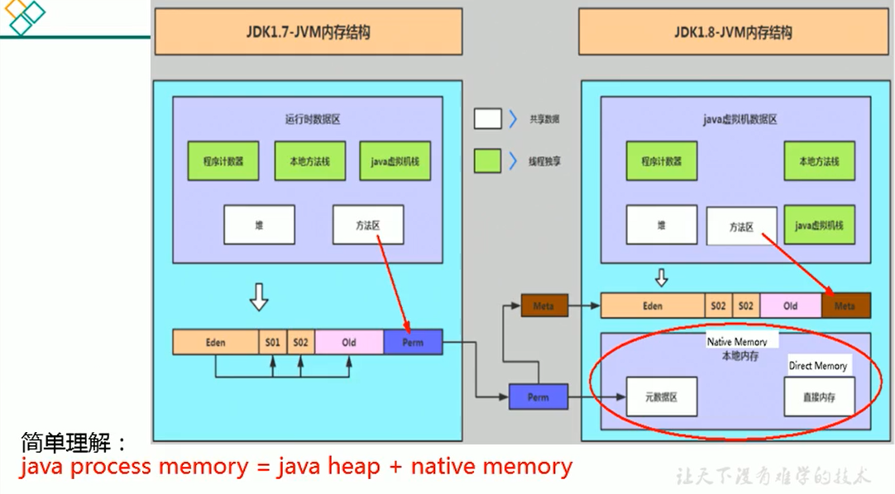
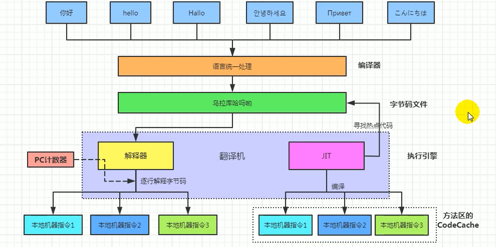
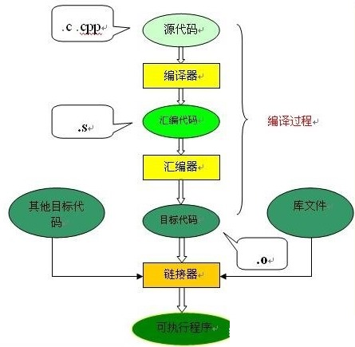
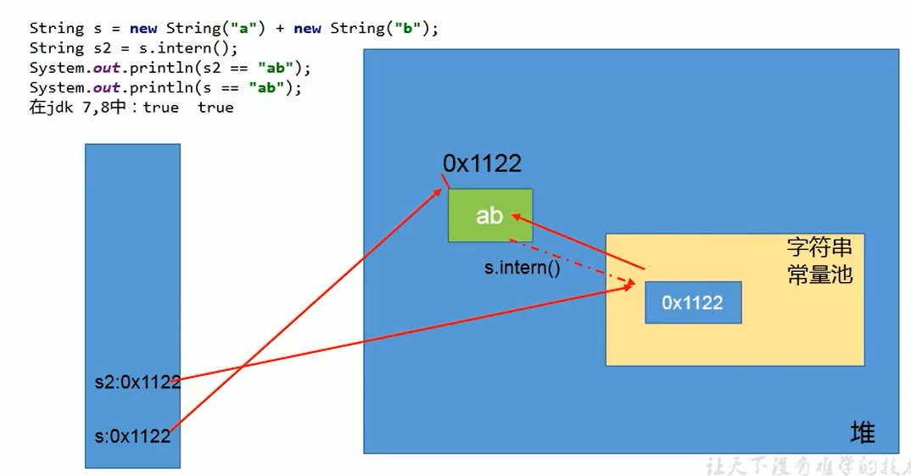

# # 對象實例化內存佈局與訪問定位

## 對象實例化

面試題

- 對像在JVM中是怎麼存儲的？
- 對像頭信息裡面有哪些東西？
- Java對像頭有什麼？

從對象創建的方式 和 步驟開始說


### 對象創建方式

- new：
  - 最常見的方式、
  - 變形一：單例類中調用getInstance的靜態類方法，
  - 變形二：XXXBuilder / XXXFactory的靜態方法
- Class的newInstance方法：
  - 反射的方式`，在JDK9裡面被標記為過時的方法，因為只能調用空參構造器，權限必須是 publi`c
- Constructor的newInstance(XXX)：
  - 反射的方式，`可以調用空參的，或者帶參的構造器，權限沒有要求`
- 使用clone()：
  - 不調用任何的構造器，要求當前的類需要實現Cloneable接口中的clone接口
- 使用序列化：
  - 從文件、網路中取得一個對象的二進制流，
  - 序列化一般用於Socket的網絡傳輸
- 第三方庫 
  - Objenesis

### 創建對象的步驟

#### 1, 判斷對像對應的類是否加載、鏈接、初始化

- 虛擬機遇到一條new指令，首先去檢查這個指令的參數能否在Metaspace的常量池中定位到一個類的符號引用，並且檢查這個符號引用代表的類是否已經被加載，解析和初始化。 （即判斷類元信息是否存在）。
- 如果沒有，那麼在雙親委派模式下，使用當前類加載器以ClassLoader + 包名+ 類名為key進行查找對應的.class文件，
  - 如果沒有找到文件，則拋出ClassNotFoundException異常，
  - 如果找到，則進行類加載，並生成對應的Class對象。

#### 2, 為對象分配內存

- `首先計算對象佔用空間的大小，接著在堆中劃分一塊內存給新對象`。如果實例成員變量是引用變量，僅分配引用變量空間即可，即4個字節大小
  - 如果內存規整：指針碰撞
  - 如果內存不規整
    - 虛擬表需要維護一個列表
    - 空閒列表分配

- 如果`內存是規整的`，那麼虛擬機將採用的是`指針碰撞法（Bump The Point）`來為對象分配內存。
  - 意思是所有用過的內存在一邊，空閒的內存放另外一邊，中間放著一個指針作為分界點的指示器，分配內存就僅僅是把指針指向空閒那邊挪動一段與對像大小相等的距離罷了。
  - 如果垃圾收集器選擇的是Serial ，ParNew這種基於壓縮算法的，虛擬機採用這種分配方式。一般使用帶Compact（整理）過程的收集器時，使用指針碰撞。

- 如果`內存不是規整的`，已使用的內存和未使用的內存相互交錯，那麼虛擬機將採用的是`空閒列表`來為對象分配內存。
  - 意思是虛擬機維護了一個列表，記錄上那些內存塊是可用的，再分配的時候從列表中找到一塊足夠大的空間劃分給對象實例，並更新列表上的內容。這種分配方式成為了 “空閒列表（Free List）”
  - 併發垃圾收集器CMS（標記清除算法）

選擇哪種分配方式由Java堆是否規整所決定，而`Java堆是否規整`又由所`採用的垃圾收集器`是否帶有`壓縮整理功能決定`。

#### 3, 處理並發問題

- 採用CAS配上失敗重試保證更新的原子性
- 每個線程預先分配TLAB - 通過設置 `-XX:+UseTLAB`參數來設置（區域加鎖機制）
  - 在Eden區給每個線程分配一塊區域

#### 4, 初始化分配到的內存（零值出始化）

`所有屬性設置默認值，保證對象實例字段在不賦值可以直接使用`

給對象屬性賦值的操作有：

- 屬性的默認初始化(o)
- 顯示初始化(x)
- 代碼塊中的初始化(x)
- 構造器初始化(x)

#### 5, 設置對象的對像頭

將對象的所屬類（即類的元數據信息）、對象的HashCode和對象的GC信息、鎖信息等數據存儲在對象的對像頭中。這個過程的具體設置方式取決於JVM實現。

#### 6, 執行init方法進行初始化（賦值出始化）

屬性顯示初始化、代碼快中初始化、構造器初始化

在Java程序的視角看來，初始化才正式開始。`初始化成員變量，執行實例化代碼塊，調用類的構造方法，並把堆內對象的首地址賦值給引用變量`

因此一般來說（由字節碼中跟隨invokespecial指令所決定），new指令之後會接著就是執行方法，把對象按照程序員的意願進行初始化，這樣一個真正可用的對象才算完成創建出來。

### conclusion:對象實例化的過程

- 加載類元信息
- 為對象分配內存
- 處理並發問題
- 屬性的默認初始化（零值初始化）
- 設置對像頭信息
- 屬性的顯示初始化、代碼塊中初始化、構造器中初始化

## 對象內存佈局


### 對象頭

對像頭包含了兩部分，分別是 

- 運行時元數據（Mark Word）和 類型指針

如果是數組，還需要記錄數組的長度

#### 運行時元數據

- 哈希值（HashCode）
- GC分代年齡
- 鎖狀態標誌
- 線程持有的鎖
- 偏向線程ID
- 翩向時間戳

#### 類型指針

指向類元數據InstanceKlass，確定該對象所屬的類型。指向的其實是方法區中存放的類元信息

### 實例數據（Instance Data）


### 對其填充(Padding)

- 不是必須的，也沒有特別的含義，僅僅起到佔位符的作用

### 小結


## 對象的訪問定位

JVM是如何通過棧幀中的對象引用訪問到其內部的對象實例呢？


### 對象訪問的兩種方式

句柄訪問


句柄訪問就是說棧的局部變量表中，記錄的對象的引用，然後在堆空間中開闢了一塊空間，也就是句柄池（浪費了點空間）

缺點：

- 需要在堆空間中開闢了一塊空間，也就是句柄池，稍微浪費了點空間

- 訪問對象需要兩步驟（找到句柄，再根據句柄指針找到對象），增加了一次指針定位的時間開銷。

優點：

- reference中存儲穩定句柄地址，對像被移動（垃圾收集時移動對像很普遍）時只會改變句柄中實例數據指針即可，reference本身不需要被修改


### 直接指針（HotSpot採用）


直接指針是局部變量表中的引用，直接指向堆中的實例，在對象實例中有類型指針，指向的是方法區中的對像類型數據

缺點：

- 在對像被移動時reference本身需要被修改。

優點：

- 效率較高，節省了一次指針定位的開銷。

# # 直接內存 Direct Memory

- 不是虛擬機運行時數據區的一部分，也不是《Java虛擬機規範》中定義的內存區域。

- 直接內存是`在Java堆外的、直接向系統申請的內存區間`。

- 來源於NIO，通過存在堆中的`DirectByteBuffer`操作Native內存

- 通常，`訪問直接內存的速度會優於Java堆。即讀寫性能高`。
  - 因此出於性能考慮，讀寫頻繁的場合可能會考慮使用直接內存。
  - Java的NIO庫允許Java程序使用直接內存，用於數據緩衝區

使用下列代碼，直接分配本地內存空間

```java
/*
 * IO				NIO(new IO/ Non-Blocking IO)
 * byte[]/char[]	Buffer
 * Stream			Channel
 * */
public class BufferTest {
	private static final int BUFFER = 1024 * 1024 * 1024; // 1GB

	public static void main(String[] args) {
		/*
		 * public static ByteBuffer allocateDirect(int capacity) { 
		 * 	return new DirectByteBuffer(capacity); 
		 * }
		 */
		ByteBuffer byteBuffer = ByteBuffer.allocateDirect(BUFFER);
		System.out.println("直接分配內存完畢");

		Scanner scanner = new Scanner(System.in);
		scanner.next();

		System.out.println("開始釋放內存");
		byteBuffer = null;
		System.gc();
		scanner.next();

	}
}
```


```java
> jps
1284 BootLanguagServerBootApp
15910 BufferTest
1286 XMLServerLauncher
16041 Jps
1278 
```


## 非直接緩存區和緩存區

原來採用BIO的架構，我們需要從用戶態切換成內核態


NIO的方式使用了緩存區的概念


## 存在的問題

- 也可能導致OutOfMemoryError異常
  - 本地內存OOM：`java.lang.OutOfMemoryError: Direct buffer memory`
  - 本地內存佔用情形，只能利用電腦內存監控相關軟體或程序。任務管理器（Window）, 
  - Eclipse MAT ---> .dump file ---> 看程序內存使用情形 ，如果報 OOM ， .dump file 又小，代表程序可能直接或間接使用到 `DirectByteBuffer`（使用本地內存），超過操作系統能給出的最大內存導致 OOM （ .dump file 看不到本地內存使用情形）

- 由於直接內存在Java堆外，因此它的大小不會直接受限於-xmx指定的最大堆大小，但是系統內存是有限的，Java堆和直接內存的總和依然受限於操作系統能給出的最大內存。

缺點

- 分配回收成本較高
- 不受JVM內存回收管理

直接內存大小可以通過MaxDirectMemorySize設置

如果不指定，默認與堆的最大值-xmx參數值一致




# # 執行引擎

## 執行引擎概述

執行引擎屬於JVM的下層，裡麵包括 解釋器、及時編譯器、垃圾回收器


- 執行引擎是Java虛擬機核心的組成部分之一。 

- “虛擬機”是一個相對於“物理機”的概念，這兩種機器都有代碼執行能力，其區別是物理機的執行引擎是直接建立在處理器、緩存、指令集和操作系統層面上的，而`虛擬機的執行引擎則是由軟件自行實現的`，因此可以不受物理條件製約地定制指令集與執行引擎的結構體系，`能夠執行那些不被硬件直接支持的指令集格式。`

JVM的主要任務是負責裝載字節碼到其內部，但字節碼並不能夠直接運行在操作系統之上，因為字節碼指令並非等價於本地機器指令，它內部包含的僅僅只是一些能夠被JVM所識別的字節碼指令、符號表，以及其他輔助信息。


那麼，如果想要讓一個Java程序運行起來，執行引擎（Execution Engine）的任務就是`將字節碼指令解釋/編譯為對應平台上的本地機器指令才可以`。簡單來說，JVM中的執行引擎充當了將高級語言翻譯為機器語言的譯者。


### 執行引擎的工作流程

- 執行引擎在執行的過程中究竟需要執行什麼樣的字節碼指令完全依賴於PC寄存器。
- 每當執行完一項指令操作後，PC寄存器就會更新下一條需要被執行的指令地址。
- 當然方法在執行的過程中，執行引擎有可能會通過存儲在局部變量表中的對象引用準確定位到存儲在Java堆區中的對象實例信息，以及通過對像頭中的元數據指針定位到目標對象的類型信息。


- 從外觀上來看，所有的Java虛擬機的執行引擎輸入，輸出都是一致的：輸入的是字節碼二進制流，處理過程是字節碼解析執行的等效過程，輸出的是執行過程。

## Java代碼編譯和執行過程

大部分的程序代碼轉換成物理機的目標代碼或虛擬機能執行的指令集之前，都需要經過上圖中的各個步驟

- 前面橙色部分是生成字節碼文件的過程，和JVM無關
- 後面藍色和綠色才是JVM需要考慮的過程


（上圖橘色步驟）Java代碼編譯是由Java源碼編譯器來完成，流程圖如下所示：


（上圖綠色、藍色步驟）Java字節碼的執行是由JVM執行引擎來完成，流程圖 如下所示


我們用一個總的圖，來說說 解釋器和編譯器



### 什麼是解釋器（Interpreter）

- 當Java虛擬機啟動時會根據預定義的規範`對字節碼採用逐行解釋的方式執行`，將每條字節碼文件中的內容“翻譯”為對應平台的本地機器指令執行。

### 什麼是IT編譯器

- JIT（Just In Time Compiler）編譯器：就是虛擬機將源代碼直接編譯成和本地機器平台相關的機器語言。

### 為什麼Java是半編譯半解釋型語言

- JDK1.e時代，將Java語言定位為“解釋執行”還是比較準確的。再後來，Java也發展出可以直接生成本地代碼的編譯器。現在JVM在執行Java代碼的時候，通常都會將解釋執行與編譯執行二者結合起來進行。

翻譯成本地代碼後，就可以做一個緩存操作，存儲在方法區中

## 機器碼、指令、彙編語言

### 機器碼

各種用二進制編碼方式表示的指令，叫做機器指令碼。開始，人們就用它採編寫程序，這就是機器語言。

機器語言雖然能夠被計算機理解和接受，但和人們的語言差別太大，不易被人們理解和記憶，並且用它編程容易出差錯。

用它編寫的程序一經輸入計算機，CPU直接讀取運行，因此和其他語言編的程序相比，執行速度最快。

機器指令與CPU緊密相關，所以不同種類的CPU所對應的機器指令也就不同。

### 指令

由於機器碼是有0和1組成的二進制序列，可讀性實在太差，於是人們發明了指令。

指令就是把機器碼中特定的0和1序列，簡化成對應的指令（一般為英文簡寫，如mov，inc等），可讀性稍好

由於不同的硬件平台，執行同一個操作，對應的機器碼可能不同，所以不同的硬件平台的同一種指令（比如mov），對應的機器碼也可能不同。

### 指令集

不同的硬件平台，各自支持的指令，是有差別的。因此每個平台所支持的指令，稱之為對應平台的指令集。如常見的

- x86指令集，對應的是x86架構的平台
- ARM指令集，對應的是ARM架構的平台

### 彙編語言

由於指令的可讀性還是太差，於是人們又發明了彙編語言。

在彙編語言中，用助記符（Mnemonics）代替機器指令的操作碼，`用地址符號（Symbo1）或標號（Labe1）代替指令或操作數的地址`。在不同的硬件平台，彙編語言對應著不同的機器語言指令集，通過彙編過程轉換成機器指令。

- 由於計算機只認識指令碼，所以用彙編語言編寫的程序還必須翻譯成機器指令碼，計算機才能識別和執行。

### 高級語言

為了使計算機用戶編程序更容易些，後來就出現了各種高級計算機語言。

高級語言比機器語言、彙編語言更接近人的語言當計算機執行高級語言編寫的程序時，仍然需要把程序解釋和編譯成機器的指令碼。完成這個過程的程序就叫做解釋程序或編譯程序。


高級語言也不是直接翻譯成 機器指令，而是翻譯成彙編語言嗎，如下面說的C和C++

#### C、C++源程序執行過程

編譯過程又可以分成兩個階段：編譯和彙編。

編譯過程：是讀取源程序（字符流），對之進行詞法和語法的分析，將高級語言指令轉換為功能等效的彙編代碼

彙編過程：實際上指把彙編語言代碼翻譯成目標機器指令的過程。




### 字節碼

字節碼是一種中間狀態（中間碼）的二進制代碼（文件），它比機器碼更抽象，需要直譯器轉譯後才能成為機器碼

字節碼主要為了實現特定軟件運行和軟件環境、與硬件環境無關。

字節碼的實現方式是通過編譯器和虛擬機器。編譯器將源碼編譯成字節碼，特定平台上的虛擬機器將字節碼轉譯為可以直接執行的指令。

- 字節碼典型的應用為：Java bytecode

## 解釋器

JVM設計者們的初衷僅僅只是單純地為了滿足Java程序實現跨平台特性，因此避免採用靜態編譯的方式直接生成本地機器指令，從而誕生了實現解釋器在運行時採用逐行解釋字節碼執行程序的想法。


為什麼Java源文件不直接翻譯成JMV，而是翻譯成字節碼文件？可能是因為直接翻譯的代碼是比較大的

解釋器真正意義上所承擔的角色就是一個運行時“翻譯者”，將字節碼文件中的內容“翻譯”為對應平台的本地機器指令執行。

當一條字節碼指令被解釋執行完成後，接著再根據PC寄存器中記錄的下一條需要被執行的字節碼指令執行解釋操作。

### 解釋器分類

- 在Java的發展歷史裡，一共有兩套解釋執行器，即古老的字節碼解釋器、現在普遍使用的模板解釋器。

- `字節碼解釋器在執行時通過純軟件代碼模擬字節碼的執行，效率非常低下`。

- 而模板解釋器`將每一條字節碼和一個模板函數相關聯`，模板函數中`直接產生`這條字節碼`執行時的機器碼`，從而很大程度上提高了解釋器的性能。

在HotSpot VM中，解釋器主要由Interpreter模塊和Code模塊構成。

- Interpreter模塊：實現了解釋器的核心功能
- Code模塊：用於管理HotSpot VM在運行時生成的本地機器指令

### 現狀

- 由於解釋器在設計和實現上非常簡單，因此除了Java語言之外，還有許多高級語言同樣也是基於解釋器執行的，比如Python、Per1、Ruby等。但是在今天，`基於解釋器執行已經淪落為低效的代名詞`，並且時常被一些C/C++程序員所調侃。

- 為了解決這個問題，JVM平台支持一種叫作即時編譯的技術。即時編譯的目的是避免函數被解釋執行，而是`將整個函數體編譯成為機器碼，每次函數執行時，只執行編譯後的機器碼即可，這種方式可以使執行效率大幅度提升`。

- 不過無論如何，基於解釋器的執行模式仍然為中間語言的發展做出了不可磨滅的貢獻。

## JIT編譯器

### Java代碼的執行分類

- 第一種是將源代碼編譯成字節碼文件，然後在運行時通過`解釋器`將字節碼文件轉為機器碼執行

- 第二種是編譯執行（直接編譯成機器碼）。現代虛擬機為了提高執行效率，會使用`即時編譯技術（JIT，Just In Time）`將方法編譯成機器碼後再執行

HotSpot VM是目前市面上高性能虛擬機的代表作之一。它`採用解釋器與即時編譯器並存的架構`。在Java虛擬機運行時，解釋器和即時編譯器能夠相互協作，各自取長補短，盡力去選擇最合適的方式來權衡編譯本地代碼的時間和直接解釋執行代碼的時間。

在今天，Java程序的運行性能早已脫胎換骨，已經達到了可以和C/C++ 程序一較高下的地步。

### 問題來了

有些開發人員會感覺到詫異，既然HotSpot VM中已經內置JIT編譯器了，那麼為什麼還需要再使用解釋器來“拖累”程序的執行性能呢？比如JRockit VM內部就不包含解釋器，字節碼全部都依靠即時編譯器編譯後執行。

- JRockit虛擬機是砍掉了解釋器，也就是只採及時編譯器。那是因為呢JRockit只部署在服務器上，一般已經有時間讓他進行指令編譯的過程了，對於響應來說要求不高，等及時編譯器的編譯完成後，就會提供更好的性能

首先明確： `當程序啟動後，解釋器可以馬上發揮作用，省去編譯的時間，立即執行`。編譯器要想發揮作用，把代碼編譯成本地代碼，需要一定的執行時間。但編譯為本地代碼後，執行效率高。

所以： 儘管JRockit VM中程序的執行性能會非常高效，但程序在啟動時必然需要花費更長的時間來進行編譯。對於服務端應用來說，啟動時間並非是關注重點，但對於那些看中啟動時間的應用場景而言，或許就需要採用解釋器與即時編譯器並存的架構來換取一個平衡點。

- 在此模式下，`當Java虛擬器啟動時，解釋器可以首先發揮作用，而不必等待即時編譯器全部編譯完成後再執行`，這樣可以省去許多不必要的編譯時間。`隨著時間的推移，編譯器發揮作用，把越來越多的代碼編譯成本地代碼，獲得更高的執行效率`。

同時，解釋執行在編譯器進行激進優化不成立的時候，作為編譯器的“逃生門”。

## HotSpot JVM執行方式

當虛擬機啟動的時候，`解釋器可以首先發揮作用`，而不必等待即時編譯器全部編譯完成再執行，這樣可以`省去許多不必要的編譯時間`。並且隨著程序運行時間的推移，即時編譯器逐漸發揮作用，根據熱點探測功能，`將有價值的字節碼編譯為本地機器指令`，以換取更高的程序執行效率。

### 案例

注意解釋執行與編譯執行在線上環境微妙的辯證關係。`機器在熱機狀態（執行了一段時間）可以承受的負載要大於冷機狀態（剛啟動）`。如果以熱機狀態時的流量進行切流，可能使處於冷機狀態的服務器因無法承載流量而假死。

- 在生產環境發布過程中，以分批的方式進行發布，根據機器數量劃分成多個批次，每個批次的機器數至多占到整個集群的1/8。
- 曾經有這樣的故障案例：某程序員在發布平台進行分批發布，在輸入發布總批數時，誤填寫成分為兩批發布。如果是熱機狀態，在正常情況下一半的機器可以勉強承載流量，但由於剛啟動的JVM均是解釋執行，還沒有進行熱點代碼統計和JIT動態編譯，導致機器啟動之後，當前1/2發布成功的服務器馬上全部宕機，此故障說明了JIT的存在。 —阿里團隊


### 概念解釋

JIT --> jconsole

- Java 語言的“編譯期”其實是一段“不確定”的操作過程，因為它可能是指一個`前端編譯器`（其實叫“編譯器的前端”更準確一些）把.java文件轉變成.class文件的過程；

- 也可能是指虛擬機的`後端運行期編譯器`（JIT編譯器，Just In Time Compiler）

  把字節碼轉變成機器碼的過程。

- 還可能是指使用靜態提前編譯器（AOT編譯器，Ahead of Time Compiler）直接把.java文件編譯成本地機器代碼的過程。

前端編譯器：Sun的Javac、Eclipse JDT中的增量式編譯器（ECJ）。

JIT編譯器：HotSpot VM的C1、C2編譯器。

AOT 編譯器：GNU Compiler for the Java（GCJ）、Excelsior JET。

#### 熱點探測技術

`一個被多次調用的方法，或者是一個方法體內部循環次數較多的循環體（執行的頻率），都可以被稱之為“熱點代碼”`，因此都可以通過JIT編譯器編譯為本地機器指令。由於這種編譯方式發生在方法的執行過程中，因此被稱之為棧上替換，或簡稱為`OSR（On Stack Replacement）編譯`。

一個方法究竟要被調用多少次，或者一個循環體究竟需要執行多少次循環才可以達到這個標準？必然需要一個明確的閾值，JIT編譯器才會將這些“熱點代碼”編譯為本地機器指令執行。這裡主要`依靠熱點探測功能`。

- `目前HotSpot VM所採用的熱點探測方式是基於計數器的熱點探測`。

- 採用基於計數器的熱點探測，HotSpot V將會為每一個方法都建立2個不同類型的計數器，分別為方法調用計數器（Invocation Counter）和回邊計數器（Back Edge Counter）。
  - 方法調用計數器用於統計方法的調用次數
  - 回邊計數器則用於統計循環體執行的循環次數

#### 方法調用計數器

這個計數器就用於統計方法被調用的次數，它的默認閥值在Client模式下是1500次，在Server模式下是10000次。超過這個閾值，就會觸發JIT編譯。

這個閥值可以通過虛擬機參數` -XX:CompileThreshold `來人為設定。

當一個方法被調用時，會先檢查該方法是否存在被JIT編譯過的版本，如果存在，則優先使用編譯後的本地代碼來執行。如果不存在已被編譯過的版本，則將此方法的調用計數器值加1，然後判斷方法調用計數器與回邊計數器值之和是否超過方法調用計數器的閥值。如果已超過閾值，那麼將會向即時編譯器提交一個該方法的代碼編譯請求。


#### 熱點衰減

如果不做任何設置，方法調用計數器統計的並不是方法被調用的絕對次數，而是一個相對的執行頻率，`即一段時間之內方法被調用的次數`。當超過`一定的時間限度`，如果方法的調用次數仍然不足以讓它提交給即時編譯器編譯，那這個方法的調用計數器就會被`減少一半`，這個過程稱為方法調用計數器熱度的`衰減（Counter Decay） `，而這段時間就稱為此方法統計的`半衰週期（Counter Half Life Time）`

- 半衰週期是化學中的概念，比如出土的文物通過查看C60來獲得文物的年齡

進行熱度衰減的動作是在虛擬機進行垃圾收集時順便進行的，可以使用虛擬機參數`-XX:-UseCounterDecay `來關閉熱度衰減，讓方法計數器統計方法調用的絕對次數，這樣，只要係統運行時間足夠長，絕大部分方法都會被編譯成本地代碼。

另外，可以使用`-XX:CounterHalfLifeTime`參數設置半衰週期的時間，單位是秒。

#### 回邊計數器

它的作用是統計一個方法中循環體代碼執行的次數，在字節碼中遇到控制流向後跳轉的指令稱為“回邊”（Back Edge）。顯然，建立回邊計數器統計的目的就是為了觸發OSR編譯。


### HotSpotVM 可以設置程序執行方法

缺省情況下HotSpot VM是採用解釋器與即時編譯器並存的架構，當然開發人員可以根據具體的應用場景，通過命令顯式地為Java虛擬機指定在運行時到底是完全採用解釋器執行，還是完全採用即時編譯器執行。如下所示：

    -Xint：完全採用解釋器模式執行程序；
    -Xcomp：完全採用即時編譯器模式執行程序。如果即時編譯出現問題，解釋器會介入執行
    -Xmixed：採用解釋器+即時編譯器的混合模式共同執行程序。


or eclipse ---> Run as ---> Run Configurations ---> Argument --->  VM option ---> `-Xint` ...


### HotSpotVM中 JIT 分類

JIT的編譯器還分為了兩種，分別是C1和C2，在HotSpot VM中內嵌有兩個JIT編譯器，分別為Client Compiler和Server Compiler，但大多數情況下我們簡稱為C1編譯器和C2編譯器。開發人員可以通過如下命令顯式指定Java虛擬機在運行時到底使用哪一種即時編譯器，如下所示：

- client：指定Java虛擬機運行在Client模式下，並`使用C1編譯器`；
  - C1編譯器會對字節碼進行`簡單和可靠的優化，耗時短`。以達到更快的編譯速度。

- server：指定Java虛擬機運行在server模式下，並`使用C2編譯器`。
  - C2進行`耗時較長的優化，以及激進優化`。但優化的代碼執行效率更高。 （`使用C++`）（64位操作系統下，默認 server 模式，設置 client 參數會被忽略）

#### C1 和 C2編譯器不同的優化策略

在不同的編譯器上有不同的優化策略，C1編譯器上主要有方法內聯，去虛擬化、元餘消除。

- 方法內聯：將引用的函數代碼編譯到引用點處，這樣可以減少棧幀的生成，減少參數傳遞以及跳轉過程
- 去虛擬化：對唯一的實現樊進行內聯
- 冗餘消除：在運行期間把一些不會執行的代碼折疊掉

C2的優化主要是在全局層面，`逃逸分析是優化的基礎`。基於逃逸分析在C2上有如下幾種優化：

- 標量替換：用標量值代替聚合對象的屬性值
- 棧上分配：對於未逃逸的對象分配對像在棧而不是堆
- 同步消除：清除同步操作，通常指synchronized

#### 分層編譯策略

`分層編譯（Tiered Compilation）策略`：

- 程序解釋執行（不開啟性能監控）可以觸發C1編譯，將字節碼編譯成機器碼，可以進行簡單優化，
- 也可以加上性能監控，C2編譯會根據性能監控信息進行激進優化。

不過在Java7版本之後，一旦開發人員在程序中`顯式指定命令“-server"時，默認將會開啟分層編譯策略`，由C1編譯器和C2編譯器相互協作共同來執行編譯任務。
總結

- 一般來講，JIT編譯出來的機器碼性能比解釋器搞
- C2編譯器啟動時長比C1慢，系統穩定執行以後，C2編譯器執行速度遠快於C1編譯器

### AOT編譯器

jdk9引入了AoT編譯器（靜態提前編譯器，Ahead of Time Compiler）

Java 9引入了實驗性AOT編譯工具aotc。它藉助了Graal編譯器，將所輸入的Java類文件轉換為機器碼，並存放至生成的動態共享庫之中。

所謂AOT編譯，是與即時編譯相對立的一個概念。我們知道，

- 即時編譯JIT指的是在`程序的運行過程中`，將字節碼轉換為可在硬件上直接運行的機器碼，並部署至託管環境中的過程。

- 而AOT編譯指的則是，`在程序運行之前`，便將字節碼轉換為機器碼的過程。
  - `.java -> .class -> (使用jaotc) -> .so`

最大的好處：Java虛擬機加載已經預編譯成二進制庫，可以直接執行。`不必等待及時編譯器的預熱`，減少Java應用給人帶來“第一次運行慢” 的不良體驗

缺點：

- `破壞了 java “ 一次編譯，到處運行”`，必須為每個不同的硬件，OS編譯對應的發行包
- `降低了Java鏈接過程的動態性`，加載的代碼在編譯器就必須全部已知。
- 還需要繼續優化中，最初只支持Linux X64 java base

### 寫到最後

- 自JDK10起，HotSpot又加入了一個全新的及時編譯器：Graal編譯器
  編譯效果短短幾年時間就追評了G2編譯器，未來可期
- 目前，帶著實驗狀態標籤，需要使用開關參數去激活才能使用`-XX:+UnlockExperimentalvMOptions -XX:+UseJVMCICompiler`

# # StringTable

## String 的基本特性

- String：字串，使用一對 ”” 引起來表示
  - `String s1 = "str" `; // 字面量的定義方式 ---> 字串值宣告在字串常量池中，變量 `s1` 儲存地址指向`字串常量池中物件`
  - `String s2 = new String("str");` // new關鍵字，在堆中建立一個對應物件，也在字串常量池中創建對應物件（共生成兩個物件），變量` s2` 儲存地址`指向堆中物件`
- `string` 宣告為 final 的，不可被繼承
- `String` 實現了 `Serializable` 介面：表示字串是支援序列化的。實現了 `Comparable` 介面：表示 `string` 可以比較大小
- string 在 jdk8 及以前內部定義了 `final char[] value` 用於儲存字串資料。JDK9 時改為 `byte[]` 。

[EP 254: Compact Strings](https://openjdk.java.net/jeps/254)

Motivation

The current implementation of the `String` class stores characters in a `char` array, using two bytes (sixteen bits) for each character. Data gathered from many different applications indicates that strings are a major component of heap usage and, moreover, **that most `String` objects contain only Latin-1 characters. Such characters require only one byte of storage, hence half of the space in the internal `char` arrays of such `String` objects is going unused.**

Description

We propose to **change the internal representation of the `String` class from a UTF-16 `char` array to a `byte` array plus an encoding-flag field.** The new `String` class will store characters encoded either as ISO-8859-1/Latin-1 (one byte per character), or as UTF-16 (two bytes per character), based upon the contents of the string. The encoding flag will indicate which encoding is used.

String 類的當前實現將字元儲存在` char 陣列中，每個字元使用兩個位元組(16位)`。從許多不同的應用程式收集的資料表明，字串是堆使用的主要組成部分，而且，`大多數字符串物件只包含拉丁字元。這些字元只需要一個位元組的儲存空間，因此這些字串物件的內部 char 陣列中有一半的空間將不會使用`。

我們建議改變字串的內部表示從utf - 16字元陣列到位元組陣列加一個 `encoding-flag` 欄位。新的String類將根據字串的內容儲存編碼為 `ISO-8859-1/Latin-1` (每個字元一個位元組)或 UTF-16(每個字元兩個位元組)的字元。編碼標誌將指示使用哪種編碼。結論：String 再也不用 char[] 來儲存了，改成了byte [] 加上編碼標記，節約了一些空間。

```java
// 之前
private final char value[];
// 之後
private final byte[] value
```

`同時基於String的資料結構，例如StringBuffer和StringBuilder也同樣做了修改。 `

**String的不可變性**

- String：`代表不可變的字元序列。簡稱：不可變性。`
  - 當對字串重新賦值時，需要重寫指定記憶體區域賦值，不能使用原有的value進行賦值。
  - 當對現有的字串進行連線操作時，也需要重新指定記憶體區域賦值，不能使用原有的value進行賦值。
  - 當呼叫 string 的 replace() 方法修改指定字元或字串時，也需要重新指定記憶體區域賦值，不能使用原有的value 進行賦值。

`通過字面量的方式（區別於new）給一個字串賦值`，此時的`字串值宣告在字串常量池中`。 **示例**

```java
/**
 * String的基本使用:體現String的不可變性
 */
public class StringTest1 {
    @Test
    public void test1() {
        String s1 = "abc";//字面量定義的方式，"abc"儲存在字串常量池中
        String s2 = "abc";
       
        System.out.println(s1 == s2);//判斷地址：true 
        
      	s1 = "hello";
        System.out.println(s1 == s2);//判斷地址：false

        System.out.println(s1);//
        System.out.println(s2);//abc

    }

    @Test
    public void test2() {
        String s1 = "abc";
        String s2 = "abc";
        s2 += "def";
        System.out.println(s2);//abcdef
        System.out.println(s1);//abc
    }

    @Test
    public void test3() {
        String s1 = "abc";
        String s2 = s1.replace('a', 'm');
        System.out.println(s1);//abc
        System.out.println(s2);//mbc
    }
}

true
false
hello
abc
--------
abcdef
abc
----
abc
mbc
```

**面試題**

```java
public class StringExer {
    String str = new String("good");
    char[] ch = {'t', 'e', 's', 't'};

    public void change(String str, char ch[]) {
        str = "test ok";
        ch[0] = 'b';
    }

    public static void main(String[] args) {
        StringExer ex = new StringExer();
        ex.change(ex.str, ex.ch);
        System.out.println(ex.str);//good
        System.out.println(ex.ch);//best
    }

}
// good
// best
```

**注意** **`字串常量池是不會儲存相同內容的字串的`**

- `String 的 string Pool 是一個固定大小的 Hashtab`l，預設值大小長度是1009。如果放進 string Pool 的 string非常多，就會造成 Hash 衝突嚴重，從而導致連結串列會很長，而連結串列長了後直接會造成的影響就是當呼叫string.intern時效能會大幅下降。

  - `jps ---> ip_number  Running_ｐrogram_Name `

  - `jinfo -flag StringTableSize ip_number`

- 使用 `-XX:StringTablesize `可設定 stringTable 的長度

- 在 jdk6 中 stringTable 是固定的，就是 1009 的長度，所以如果常量池中的字串過多就會導致效率下降很快。

- 在 JDK7 中，stringTable 的長度預設值是 60013，stringTablesize 設定沒有要求

- `在 JDK8 中，StringTable 可以設定的最小值為 1009`（小於  1009 會報錯）

## String 的記憶體分配

- 在Java語言中有`8種基本資料型別和一種比較特殊的型別 string`。這些型別為了使它們在執行過程中速度更快、更節省記憶體，都提供了一種常量池的概念。
- 常量池就類似一個 `Java 系統級別提供的快取`。8種基本資料型別的常量池都是系統協調的，`string 型別的常量池比較特殊。它的主要使用方法有兩種。`
  - `直接使用雙引號宣告`出來的 String 物件會`直接儲存在常量池中`。
    - 比如：string info="atguigu.com"；// 字面量定義
  - 如果不是用雙引號宣告的string物件，可以`使用string提供的intern（）方法`
- Java 6 及以前，字串常量池存放在永久代
- `Java 7`中 oracle 的工程師對字串池的邏輯做了很大的改變，即將`字串常量池的位置調整到 Java 堆內`。
  - 所有的字串都儲存在堆（Heap）中，和其他普通物件一樣，這樣可以讓你在進行調優應用時僅需要調整堆大小就可以了。
  - 字串常量池概念原本使用得比較多，但是這個改動使得我們有足夠的理由讓我們重新考慮在Java 7中使用string.intern()。
- `Java8 元空間，字串常量在堆`。


**為什麼StringTable從永久代調整到堆中** 

在JDK 7中，interned 字串不再在 Java 堆的永久生成中分配，而是在 Java 堆的主要部分(稱為年輕代和年老代)中分配，與應用程式建立的其他物件一起分配。此更改將導致駐留在主 Java 堆中的資料更多，駐留在永久生成中的資料更少，因此可能需要調整堆大小。由於這一變化，大多數應用程式在堆使用方面只會看到相對較小的差異，但載入許多類或大量使用字串的較大應用程式會出現這種差異。intern() 方法會看到更顯著的差異。

- `永久代的預設比較小`
- `永久代垃圾回收頻率低`


```java
/*
jdk6: -XX:PermSize=6m -XX:MaxPermSize=6m -Xms6m -Xmx6m
	---> java.lang.OutOfMemoryError: PermGen space
	
jdk8: -XX:MetaspaceSize=6m -XX:MaxMetaspaceSize=6m -Xms6m -Xmx6m
	---> java.lang.OutOfMemoryError: java heap space
*/
public class StringTest3{
  public static void main(String[] args){
    // 使用 Set 保持常量池引用，避免 full gc 回收常量池行為
    Set<String> set = new HashSet<String>();
    // 在 short 可以取值的範圍內足以讓 6MB 的 PerSize 或 heap 產生 OOM 了
    short i = 0; 
    while(true){
      set.add(String.valueOf(i++).intern());
    }
  }
}
```


## String 的基本操作

Java語言規範裡要求完全相同的字串字面量，應該包含同樣的Unicode字元序列（包含同一份碼點序列的常量），並且必須是指向同一個String類例項。

```java
class Memory {
    public static void main(String[] args) {//line 1
        int i = 1;//line 2
        Object obj = new Object();//line 3
        Memory mem = new Memory();//line 4
        mem.foo(obj);//line 5
    }//line 9

    private void foo(Object param) {//line 6
        String str = param.toString();//line 7
        System.out.println(str);
    }//line 8
}
```


- 一旦運行程序，它將所有運行時類加載到堆空間中。在第1行找到main（）方法後，Java運行時將創建要由main（）方法線程使用的堆棧內存。 
- 我們將在第2行創建原始的局部變量，因此將其創建並存儲在main（）方法的堆棧存儲器中。 
- 由於我們是在第3行中創建對象，因此它是在堆內存中創建的，而堆棧內存中包含該對象的引用。
- 當我們在第四行中創建Memory對象時，也會發生類似的過程。
-  現在，當我們在第5行調用foo（）方法時，將在堆棧頂部創建一個塊，以供foo（）方法使用。
- 由於Java是按值傳遞的，因此在第六行的foo（）堆棧塊中創建了對Object的新引用。
- 在第7行創建一個字符串，該字符串進入堆空間的“字符串池”，並在foo（）堆棧空間中為其創建引用。
-  foo（）方法在第8行終止，這時為堆棧中的foo（）分配的內存塊變為可用。 
- 在第9行中，main（）方法終止，並且為main（）方法創建的堆棧存儲器被銷毀。而且，程序在此行結束，因此Java Runtime釋放了所有內存並結束了程序的執行。

## 字串拼接操作

- `常量與常量的拼接結果`在`常量池`，原理是`編譯期優化`
  - 常量 =  字面量定義方式
- 常量池中不會存在相同內容的變數
  - Equals() return false
- 只要`其中有一個是變數，結果就在堆中`。變數拼接的原理是` StringBuilder`
  - 常量+變數 or 變數+常量 --->  StringBuilder
  - 變數+變數 ---> 字串常量或常量引用，則仍然使用`編譯期優化`
- 如果拼接的結果呼叫` intern() `方法，則主動將常量池中`還沒有的`字串物件`放入池中`，並返回此物件地址

`==` : 唯有當兩個參考指向同一物件時，==運算子的結果才為true

`equals` : equals在類別為Java原先就存在時，是比較兩個物件是否為相同類型的類別後再比較其內容值是否相同，是就傳回true，否就傳回false。當要測試的類別是自定類別時，要依自定類別所提供的equals來決定如何比較

```java
public class StringTest5 {
    @Test
    public void test1(){
        String s1 = "a" + "b" + "c";//編譯期優化：等同於"abc"
        String s2 = "abc"; //"abc"一定是放在字串常量池中，將此地址賦給s2
        /*
         * 最終.java編譯成.class,再執行.class
         * String s1 = "abc";
         * String s2 = "abc"
         */
        System.out.println(s1 == s2); //true
        System.out.println(s1.equals(s2)); //true
    }

    @Test
    public void test2(){
        String s1 = "javaEE";
        String s2 = "hadoop";

        String s3 = "javaEEhadoop";
        String s4 = "javaEE" + "hadoop";//編譯期優化
        //如果拼接符號的前後出現了變數，則相當於在堆空間中new String()，具體的內容為拼接的結果：javaEEhadoop
      	//new String() 新對象，新空間
        String s5 = s1 + "hadoop";
        String s6 = "javaEE" + s2;
        String s7 = s1 + s2;

        System.out.println(s3 == s4);//true
        System.out.println(s3 == s5);//false
        System.out.println(s3 == s6);//false
        System.out.println(s3 == s7);//false
        System.out.println(s5 == s6);//false
        System.out.println(s5 == s7);//false
        System.out.println(s6 == s7);//false
        //intern():判斷字串常量池中是否存在javaEEhadoop值，如果存在，則返回常量池中javaEEhadoop的地址；
        //如果字串常量池中不存在javaEEhadoop，則在常量池中載入一份javaEEhadoop，並返回次物件的地址。
        String s8 = s6.intern();
        System.out.println(s3 == s8);//true
    }

    @Test
    public void test3(){
        //直接使用雙引號宣告出來的 String 物件會直接儲存在常量池中
        String s1 = "a";	//字面量定義方式
        String s2 = "b";
        String s3 = "ab";
        /*
        如下的s1 + s2 的執行細節：(變數s是我臨時定義的）
        ① StringBuilder s = new StringBuilder();
        ② s.append("a")
        ③ s.append("b")
        ④ s.toString()  --> 約等於 new String("ab")

        補充：在jdk5.0之後使用的是 StringBuilder（非執行緒安全）,在jdk5.0之前使用的是 StringBuffer（執行緒安全）
        在大部分情況下 StringBuilder > StringBuffer
        建議優先採用 StringBuilder，因為在大多數實現中，它比 StringBuffer 要快。兩者的方法基本相同。
         */
        String s4 = s1 + s2;//
        System.out.println(s3 == s4);//false
    }
    /*
    1. 字串拼接操作不一定使用的是StringBuilder!
       如果拼接符號左右兩邊都是字串常量或常量引用，則仍然使用編譯期優化，即非StringBuilder的方式。
    2. 針對於final修飾類、方法、基本資料型別、引用資料型別的量的結構時，能使用上final的時候建議使用上。
    
    final修飾:
    1、被final修飾的常量，在編譯階段會存入調用類的常量池中。
    2、被final修飾的方法，JVM會嘗試為之尋求內聯，這對於提升Java的效率是非常重要的。因此，假如能確定方法不會被繼承，那麼盡量將方法定義為final的。
    3、final變量可以安全的在多線程環境下進行共享，而不需要額外的同步開銷。
    
    被final修飾的常量，ClassLoader.prepare階段即顯式初始化
     */
    @Test
    public void test4(){
        final String s1 = "a";
        final String s2 = "b";
        String s3 = "ab";
        String s4 = s1 + s2; // 如果拼接符號左右兩邊都是字串常量或常量引用，則仍然使用編譯期優化
        System.out.println(s3 == s4);//true
    }
    //練習：
    @Test
    public void test5(){
        String s1 = "javaEEhadoop";
        String s2 = "javaEE";
        String s3 = s2 + "hadoop";
        System.out.println(s1 == s3);//false

        final String s4 = "javaEE";//s4:常量
        String s5 = s4 + "hadoop";
        System.out.println(s1 == s5);//true

    }

    /*
    體會執行效率：通過StringBuilder的append()的方式新增字串的效率要遠高於使用String的字串拼接方式！
    詳情：① StringBuilder的append()的方式：自始至終中只建立過一個StringBuilder的物件
          使用String的字串拼接方式：建立過多個StringBuilder和String的物件，內存佔用更大，如果進行gc，需要花費額外時間
         ② 使用String的字串拼接方式：記憶體中由於建立了較多的StringBuilder和String的物件，記憶體佔用更大；如果進行GC，需要花費額外的時間。

     改進的空間：在實際開發中，如果基本確定要前前後後新增的字串長度不高於某個限定值highLevel的情況下,建議使用構造器例項化：
               StringBuilder s = new StringBuilder(highLevel);//new char[highLevel]
     */
    @Test
    public void test6(){

        long start = System.currentTimeMillis();

//        method1(100000);//4014
        method2(100000);//7

        long end = System.currentTimeMillis();

        System.out.println("花費的時間為：" + (end - start));
    }

    public void method1(int highLevel){
        String src = "";
        for(int i = 0;i < highLevel;i++){
            src = src + "a";//每次迴圈都會建立一個StringBuilder、String
        }
//        System.out.println(src);

    }

    public void method2(int highLevel){
        //只需要建立一個StringBuilder
        StringBuilder src = new StringBuilder();
        for (int i = 0; i < highLevel; i++) {
            src.append("a");
        }
//        System.out.println(src);
    }
}
```

從上述的結果我們可以知道：

- 如果`拼接符號的前後出現了變數`，則`相當於在堆空間中new String()`，具體的內容為拼接的結果而`呼叫intern方法`，則會判斷字串常量池中是否存在JavaEEhadoop值，如果存在則返回常量池中的值，否者就在常量池中建立。
-  **底層原理** 拼接操作的底層其實使用了StringBuilder

test3()


```java
s1 + s2的執行細節

- StringBuilder s = new StringBuilder();
- s.append(s1);
- s.append(s2);
- s.toString(); -> 類似於new String("ab");
```

在JDK5之後，使用的是StringBuilder，在JDK5之前使用的是StringBuffer

| String                                                       | StringBuffer                                                 | StringBuilder    |
| ------------------------------------------------------------ | ------------------------------------------------------------ | ---------------- |
| String的值是不可變的，這就導致每次對String的操作都會生成新的String物件，不僅效率低下，而且浪費大量優先的記憶體空間 | StringBuffer是可變類，和執行緒安全的字串操作類，任何對它指向的字串的操作都不會產生新的物件。每個StringBuffer物件都有一定的緩衝區容量，當字串大小沒有超過容量時，不會分配新的容量，當字串大小超過容量時，會自動增加容量 | 可變類，速度更快 |
| 不可變                                                       | 可變                                                         | 可變             |
|                                                              | 執行緒安全                                                   | 執行緒不安全     |
|                                                              | 多執行緒操作字串                                             | 單執行緒操作字串 |


注意，如果`左右兩邊如果是變數`的話，就是`需要 new StringBuilder 進行拼接`，但是`如果使用的是 final 修飾，則是從常量池中獲取`。所以說`拼接符號左右兩邊都是字串常量或常量引用` 則`仍然使用編譯器優化`。也就是說被 fina 修飾的變數，將會變成常量，類和方法將不能被繼承。

- 在開發中，能夠使用final的時候，建議使用上

```java
public static void test4() {
    final String s1 = "a";
    final String s2 = "b";
    String s3 = "ab";
    String s4 = s1 + s2;
    System.out.println(s3 == s4);
}
// true
```

- **拼接操作和append效能對比**

```java
    public static void method1(int highLevel) {
        String src = "";
        for (int i = 0; i < highLevel; i++) {
            src += "a"; // 每次迴圈都會建立一個StringBuilder物件
        }
    }

    public static void method2(int highLevel) {
        StringBuilder sb = new StringBuilder();
        for (int i = 0; i < highLevel; i++) {
            sb.append("a");
        }
    }
```

方法 1 耗費的時間：4005ms，方法2消耗時間：7ms結論：

- 通過 StringBuilder 的 append() 方式新增字串的效率，要遠遠高於 String 的字串拼接方法

StringBuilder 好處

- StringBuilder 的 append 的方式，自始至終只建立一個 StringBuilder 的物件
- 對於字串拼接的方式，還需要建立很多StringBuilder物件和 呼叫toString時候建立的String物件
- 記憶體中由於建立了較多的StringBuilder和String物件，記憶體佔用過大，如果進行GC那麼將會耗費更多的時間

改進的空間

- 我們使用的是 StringBuilder 的空參構造器，預設的字串容量是16，然後將原來的字串拷貝到新的字串中， 我們也可以預設初始化更大的長度，減少擴容的次數
- 因此在實際開發中，我們能夠確定，前前後後需要新增的字串不高於某個限定值，那麼建議使用構造器建立一個閾值的長度.

## intern() 的使用

intern 是一個 native 方法，呼叫的是底層 C 的方法 字串池最初是空的，由String類私有地維護。

- 在呼叫 intern 方法時，如果池中已經包含了由 equals(object) 方法確定的與該字串物件相等的字串，則返回池中的字串。
- 否則，該字串物件將被新增到池中，並返回對該字串物件的引用。 

如果`不是用雙引號宣告的 string 物件，可以使用 string 提供的 intern 方法`：intern 方法會從字串常量池中查詢當前字串是否存在，若不存在就會將當前字串放入常量池中。

```java
String myInfo = new string("I love atguigu").intern();
```

也就是說，如果在任意字串上呼叫` string.intern` 方法，那麼其返回結果所指向的那個類例項，必須和直接以常量形式出現的字串例項完全相同。因此，下列表達式的值必定是`true`

```java
（"a"+"b"+"c"）.intern（）=="abc"
```

通俗點講，`Interned string 就是確保字串在記憶體裡只有一份拷貝`，這樣可以節約記憶體空間，加快字串操作任務的執行速度。注意，這個值會被存放在字串內部池（String Intern Pool）。 intern的空間效率測試 我們通過測試一下，使用了intern和不使用的時候，其實相差還挺多的

```java
/**
 * 使用Intern() 測試執行效率
 */
public class StringIntern2 {
    static final int MAX_COUNT = 1000 * 10000;
    static final String[] arr = new String[MAX_COUNT];

    public static void main(String[] args) {
        Integer [] data = new Integer[]{1,2,3,4,5,6,7,8,9,10};
        long start = System.currentTimeMillis();
        for (int i = 0; i < MAX_COUNT; i++) {
            arr[i] = new String(String.valueOf(data[i%data.length])).intern();
        }
        long end = System.currentTimeMillis();
        System.out.println("花費的時間為：" + (end - start));

        try {
            Thread.sleep(1000000);
        } catch (Exception e) {
            e.getStackTrace();
        }
    }
}
```

結論：

- `對於程式中大量使用存在的字串時，尤其存在很多已經重複的字串時，使用intern()方法能夠節省記憶體空間。`

大的網站平臺，需要記憶體中儲存大量的字串。比如社交網站，很多人都儲存：北京市、海淀區等資訊。這時候如果字串都呼叫 intern() 方法，就會很明顯降低記憶體的大小。

```java
// 如何保證變量 s 指向的是字符串常量池中的數據？
// 兩種方式
方式一：// 字面量定義方式
String s = "oneokrock"; 
方式二：// 調用intern()
String s = new String("oneokrock").intern();
String s = new StringBuilder("oneokrock").toString().intern();
```


### 面試題

`new String("ab")`會建立幾個物件

```java
/**
 * 題目：
 * new String("ab")會建立幾個物件？看位元組碼，就知道是兩個。
 *     一個物件是：new關鍵字在堆空間建立的
 *     另一個物件是：字串常量池中的物件"ab"。 位元組碼指令：ldc
 *
 *
 * 思考：
 * new String("a") + new String("b")呢？
 *  物件1： new StringBuilder()	<--- 拼接操作
 *  物件2： new String("a")
 *  物件3： 常量池中的"a"
 *  物件4： new String("b")
 *  物件5： 常量池中的"b"
 *
 *  深入剖析： StringBuilder的toString():
 *      物件6 ：new String("ab")
 *       強調一下，toString()的呼叫，在字串常量池中，沒有生成"ab"
 */
public class StringNewTest {
    public static void main(String[] args) {
//        String str = new String("ab");

        String str = new String("a") + new String("b");
    }
}
```

我們轉換成位元組碼來檢視 ` new String("ab");`

```java
 0 new #2 <java/lang/String>		// 物件1,new關鍵字在堆空間建立的
 3 dup
 4 ldc #3 <ab>		// 物件2,創建字串常量池中的物件"ab"。 位元組碼指令：ldc
 6 invokespecial #4 <java/lang/String.<init>>
 9 astore_1
10 return
```

這裡面就是兩個物件

- 一個物件是：new關鍵字在堆空間中建立
- 另一個物件：字串常量池中的物件

`new String("a") + new String("b") `會建立幾個物件

```java
public class StringNewTest {
    public static void main(String[] args) {
        String str = new String("a") + new String("b");
    }
}
```

StringNewTest 位元組碼檔案為

```java
 0 new #2 <java/lang/StringBuilder>		// 物件1
 3 dup
 4 invokespecial #3 <java/lang/StringBuilder.<init>>
 7 new #4 <java/lang/String>	// 物件2
10 dup
11 ldc #5 <a>	// 物件3
13 invokespecial #6 <java/lang/String.<init>>
16 invokevirtual #7 <java/lang/StringBuilder.append>
19 new #4 <java/lang/String>	// 物件4
22 dup
23 ldc #8 <b>	// 物件5
25 invokespecial #6 <java/lang/String.<init>>
28 invokevirtual #7 <java/lang/StringBuilder.append>
31 invokevirtual #9 <java/lang/StringBuilder.toString>
34 astore_1
35 return
```

StringBuilder.toString() 位元組碼檔案為

- 強調一下，toString()的呼叫，在字串常量池中，沒有生成"ab"。---> 無位元組碼指令：ldc  == 在字串常量池中沒有生成"ab"

```java
 0 new #80 <java/lang/String>	// 物件6
 3 dup
 4 aload_0
 5 getfield #234 <java/lang/StringBuilder.value>
 8 iconst_0
 9 aload_0
10 getfield #233 <java/lang/StringBuilder.count>
13 invokespecial #291 <java/lang/String.<init>>
18 areturn
```


我們建立了6個物件

- 物件1：new StringBuilder()
- 物件2：new String("a")
- 物件3：常量池的 a
- 物件4：new String("b")
- 物件5：常量池的 b
- 物件6：toString中會建立一個 new String("ab")
  - 呼叫toString方法，不會在常量池中生成ab


```java
// StringBuilder.toString() 
@Override
public String toString() {
  // Create a copy, don't share the array
  return new String(value, 0, count);
}
```


### intern的使用：JDK6和JDK7

**JDK 1.6**

```java
// new 關鍵字 vs 雙引號=字面量定義
String s = new String("1");  // new 關鍵字在堆空間建立物件"1",也在字串常量池中建立的物件"1"（共生成兩個物件），變量 s 儲存地址指向"堆"中物件
s.intern(); // 將該物件放入到常量池。但是呼叫此方法沒有太多的區別，因為已經存在了1
String s2 = "1";	// (常量=字面量定義方式 ===> 字串值宣告在字串常量池中) 在常量池中已存在物件"1"，變量 s2 指向"常量池中"已存在物件"1"
System.out.println(s == s2); // jdk6:false , jdk7/8:false


// 字串拼接操作, 接操作的底層其實使用了StringBuilder
String s3 = new String("1") + new String("1"); //  s3變數記錄的地址為 堆空間建立的 new String("11")，由 StringBuilder.toString() 方法生成的，不會在字串常量池中生成對應物件 ===> 只會產生一個"堆"中物件
s3.intern();
/* 在字符串常量池中生成的"11"
			jdk6:建立了一個新的物件 "11"，也就是有了新的地址("字符串常量池中")
			jdk7:
*/
String s4 = "11"; // s4變兩紀錄的地址，是使用上行代碼執行時，在常量池中生成的 "11" 地址
System.out.println(s3 == s4); // jdk6:false , jdk7/8:true
```

輸出結果

```java
false
false
```

new 關鍵字 vs 雙引號=字面量定義 > > >

為什麼物件會不一樣呢？

- new關鍵字，
  - 在堆中建立一個對應物件，
  - 也在字串常量池中創建對應物件
  - （共生成兩個物件），變量` s2` 儲存地址`指向堆中物件`

- 一個是 new 建立的物件，一個是常量池中的物件，顯然不是同一個

如果是下面這樣的，那麼就是 true

```java
String s = new String("1"); // 變量 s 儲存地址為 指向堆中物件
s = s.intern(); // 變更 變量 s 儲存地址為 指向常量池中物件
String s2 = "1";
System.out.println(s == s2); // true，地址相同
```

字串拼接操作 > > >

- 字串拼接操作, 接操作的底層其實使用了StringBuilder 

- s3變數記錄的地址為 堆空間建立的` new String("11")`，由 `StringBuilder.toString() `方法生成的，不會在字串常量池中生成對應物件 ===> 只會產生一個"堆"中物件

而對於下面的字串拼接操作來說，因為` s3變數記錄的地址是 new String("11")`，然後這段程式碼執行完以後，`常量池中不存在 "11"`

為什麼最後輸出的 s3 == s4 會為false呢？ 

- 這是因為在JDK6 中，`s3.intern();` 在字符串常量池中建立了一個新的物件 "11"，也就是有了新的地址（ 在字符串常量池中（位於方法區/永久代中），不同於堆中物件地址）
- 而在 JDK7 中，在 JDK7 中，`s3.intern();` 並沒有在常量池中創建一個新物件，而是創建一個指向堆中`new String("11")`的地址（因為 JDK7 之後，常量池移到堆中，節省空間考量，不在常量池中再創建一個堆中已有的相同物件，而是創建一個引用指向堆中已存在物件）

**JDK7/8中**

```java
// new 關鍵字 vs 雙引號=字面量定義
String s = new String("1");// new 關鍵字在堆空間建立物件"1",也在字串常量池中建立的物件"1"（共生成兩個物件），變量 s 儲存地址指向"堆"中物件
s.intern();
String s2 = "1"; // 變量 s2 指向"常量池中"已存在物件"1"
System.out.println(s == s2); // false


// 字串拼接操作, 接操作的底層其實使用了StringBuilder
String s3 = new String("1") + new String("1"); // 只會產生一個"堆"中物件 "11"
s3.intern(); // 在常量池中創建一個指向堆中物件 "11" 的引用
String s4 = "11"; // s4 指向常量池中"11"的引用，該引用指向堆中物件 "11" 的地址 = 變量 s3 儲存的地址
System.out.println(s3 == s4); // true
```


**擴充套件**

```java
String s3 = new String("1") + new String("1");// 只會產生一個"堆"中物件 "11"
String s4 = "11";  // 在常量池中生成的字串"11"
s3.intern();  // 然後s3就會從常量池中找，發現有了，就什麼事情都不做（因為也沒賦予一個變量）
// String s5 = s3.intern(); // 因為賦予一個變量操作，將常量池中以存在物件"11"地址賦予變量 s5
System.out.println(s3 == s4);
//System.out.println(s5 == s4); // true
```

我們將 s4 的位置向上移動一行，發現變化就會很大，最後得到的是 false 

### 總結

總結 string 的 intern() 的使用：

 `JDK1.6 中`，將這個字串物件嘗試放入串池。

- 如果串池中有，則並不會放入。返回已有的串池中的物件的地址
- 如果沒有，會把此`物件複製一份`，放入串池，並`返回串池中的物件地址`

`JDK1.7起`，將這個字串物件嘗試放入串池。

- 如果串池中有，則並不會放入。返回已有的串池中的物件的地址
- 如果沒有，則會把`物件的引用地址複製一份`，放入串池，並`返回串池中的引用地址`

#### 字串拼接操作 +` intern()`

在JDK6中


- 在JDK6中，在字串常量池中建立一個字串 “ab”

所以上述結果，在JDK6中是：

```java
true
false
```

在JDK8中



在JDK8中，在字串常量池中沒有建立 “ab”，而是將堆中的地址複製到 串池中。

在 JDK 8 中

```java
true
true
```

####  new 關鍵字 vs 雙引號=字面量定義 +` intern()`


### intern()效率測試：空間角度

```java
public class StringTableTest2 {
	static final int MAX_COUNT = 1000 * 10000;
	static final String[] arr = new String[MAX_COUNT];
	
	public static void main(String[] args) {
		Integer[] data = new Integer[] {1,2,3,4,5,6,7,8,9,10};
		
		long start = System.currentTimeMillis();
		for(int i=0; i<MAX_COUNT; i++) {
			//arr[i] = new String(String.valueOf(data[i % data.length])); // Time cost: 4724
			arr[i] = new String(String.valueOf(data[i % data.length])).intern(); // Time cost: 1331
		}
		long end = System.currentTimeMillis();
		System.out.println("Time cost: " + (end - start));
		try {
			Thread.sleep(1000000);
		} catch (Exception e) {
			e.printStackTrace();
		}
		System.gc();
	}
}
```

Not using `intern()` ---> Time cost: 4724


With  `intern()` ---> Time cost: 1331


## StringTable 的垃圾回收

```java
/**
 * String的垃圾回收:
 * -Xms15m -Xmx15m -XX:+PrintStringTableStatistics -XX:+PrintGCDetails
 */
public class StringGCTest {
    public static void main(String[] args) {
        for (int j = 0; j < 100000; j++) {
            String.valueOf(j).intern();
        }
    }
}
```


```java
[GC (Allocation Failure) [PSYoungGen: 4096K->432K(4608K)] 4096K->440K(15872K), 0.0070446 secs] [Times: user=0.00 sys=0.00, real=0.01 secs] ---> StringTable 的垃圾回收
...
StringTable statistics:
Number of buckets    :     60013 =    480104 bytes, avg   8.000
Number of entries    :     35120 =    842880 bytes, avg  24.000
Number of literals   :     35120 =   1975672 bytes, avg  56.255
```


## G1 的String 去重操作

注意這裡說的重複，指的是`在堆中的資料`，而不是常量池中的，因為`常量池中的本身就不會重複`

- 背景：對許多Java應用（有大的也有小的）做的測試得出以下結果：
  - 堆存活資料集合裡面 string 物件佔了25%
  - 堆存活資料集合裡面重複的 string 物件有13.5%
  - string 物件的平均長度是 45
- 許多大規模的 Java 應用的瓶頸在於記憶體，測試表明，在這些型別的應用裡面，`Java 堆中存活的資料集合差不多25% 是 string 物件`。更進一步，這裡面差不多一半string物件是重複的，重複的意思是說： `string.equals（string2）= true` 。`堆上存在重複的 string 物件必然是一種記憶體的浪費`。這個專案將在G1垃圾收集器中實現自動持續對重複的string物件進行去重，這樣就能避免浪費記憶體。

**實現**

- 當垃圾收集器工作的時候，會訪問堆上存活的物件。`對每一個訪問的物件都會檢查是否是候選的要去重的string物件。`
- 如果是，把這個物件的一個引用插入到佇列中等待後續的處理。一個去重的執行緒在後臺執行，處理這個佇列。處理佇列的一個元素意味著從佇列刪除這個元素，然後嘗試去重它引用的string物件。
- 使用一個hashtab1e來記錄所有的被string物件使用的不重複的char陣列。當去重的時候，會查這個hashtable，來看堆上是否已經存在一個一模一樣的char陣列。
- 如果存在，string物件會被調整引用那個陣列，釋放對原來的陣列的引用，最終會被垃圾收集器回收掉。
- 如果查詢失敗，char陣列會被插入到hashtable，這樣以後的時候就可以共享這個陣列了。

**開啟命令列選項**

- UsestringDeduplication（bool）：開啟 string 去重，`預設是不開啟的，需要手動開啟。`
- Printstringbeduplicationstatistics（bool）：列印詳細的去重統計資訊
- stringpeduplicationAgeThreshold（uintx）：達到這個年齡的 string 物件被認為是去重的候選物件