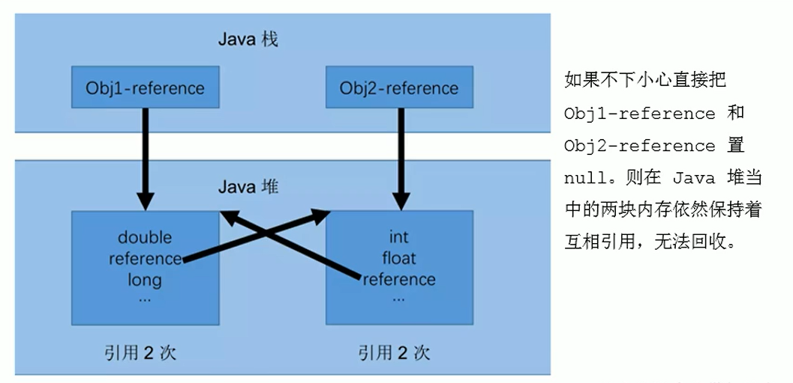
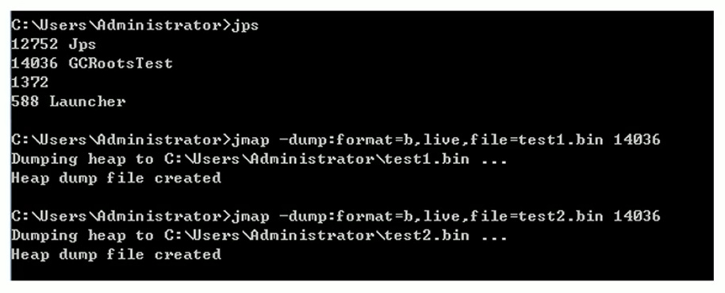

# # 垃圾回收概述

## 概念

這次我們主要關注的是黃色部分，內存的分配與回收


## 什麼是垃圾

在提到什麼是垃圾之前，我們先看下面一張圖


從上圖我們可以很明確的知道，Java 和 C++語言的區別，就在於垃圾收集技術和內存動態分配上，C語言沒有垃圾收集技術，需要我們手動的收集。

垃圾收集，不是Java語言的伴生產物。早在1960年，第一門開始使用內存動態分配和垃圾收集技術的Lisp語言誕生。關於垃圾收集有三個經典問題：

- 哪些內存需要回收？
- 什麼時候回收？
- 如何回收？

垃圾收集機制是Java的招牌能力，極大地提高了開發效率。如今，垃圾收集幾乎成為現代語言的標配，即使經過如此長時間的發展，Java的垃圾收集機制仍然在不斷的演進中，不同大小的設備、不同特徵的應用場景，對垃圾收集提出了新的挑戰，這當然也是面試的熱點。

### 什麼是垃圾？

- `垃圾是指在運行程序中沒有任何指針指向的對象`，這個對象就是需要被回收的垃圾。

如果不及時對內存中的垃圾進行清理，那麼，這些垃圾對象所佔的內存空間會一直保留到應用程序的結束，被保留的空間無法被其它對象使用，甚至可能導致內存溢出。

### 磁盤碎片整理

機械硬盤需要進行磁盤整理，同時還有壞道


### 大廠面試題

- 你知道哪幾種垃圾回收器，各自的優缺點，重點講一下cms和G1？
- JVM GC算法有哪些，目前的JDK版本採用什麼回收算法？
- G1回收器講下回收過程GC是什麼？為什麼要有GC？
- GC的兩種判定方法？ CMS收集器與G1收集器的特點
- 說一下GC算法，分代回收說下垃圾收集策略和算法
- JVM GC原理，JVM怎麼回收內存
- CMS特點，垃圾回收算法有哪些？各自的優缺點，他們共同的缺點是什麼？
- Java的垃圾回收器都有哪些，說下g1的應用場景，平時你是如何搭配使用垃圾回收器的

- 你知道哪幾種垃圾收集器，各自的優缺點，重點講下cms和G1，包括原理，流程，優缺點。垃圾回收算法的實現原理
- 講一講垃圾回收算法。
  什麼情況下觸發垃圾回收？
  如何選擇合適的垃圾收集算法？
  JVM有哪三種垃圾回收器？
- 常見的垃圾回收器算法有哪些，各有什麼優劣？
  System.gc（）和Runtime.gc（）會做什麼事情？
  Java GC機制？ GC Roots有哪些？
  Java對象的回收方式，回收算法。
  CMS和G1了解麼，CMS解決什麼問題，說一下回收的過程。
  CMS回收停頓了幾次，為什麼要停頓兩次?

## 為什麼需要GC

對於高級語言來說，一個基本認知是如果不進行垃圾回收，`內存遲早都會被消耗完`，因為不斷地分配內存空間而不進行回收，就好像不停地生產生活垃圾而從來不打掃一樣。

除了釋放沒用的對象，垃圾回收也可以清除內存裡的記錄碎片。碎片整理將所佔用的堆內存移到堆的一端，以便JVM將整理出的內存分配給新的對象。

隨著應用程序所應付的業務越來越龐大、複雜，用戶越來越多，沒有GC就不能保證應用程序的正常進行。而經常造成STW的GC又跟不上實際的需求，所以才會不斷地嘗試對GC進行優化。

### 早期垃圾回收

在早期的C/C++時代，垃圾回收基本上是手工進行的。開發人員可以使用new關鍵字進行內存申請，並使用delete關鍵字進行內存釋放。比如以下代碼：

```c++
MibBridge *pBridge= new cmBaseGroupBridge（）；
//如果註冊失敗，使用Delete釋放該對象所佔內存區域
if（pBridge->Register（kDestroy）！=NO ERROR）
	delete pBridge；
```

這種方式可以靈活控制內存釋放的時間，但是會給開發人員帶來`頻繁申請和釋放內存的管理負擔`。倘若有一處內存區間由於程序員編碼的問題忘記被回收，那麼就會產生`內存洩漏`，`垃圾對象永遠無法被清除，隨著系統運行時間的不斷增長`，垃圾對象所耗內存可能持續上升，`直到出現內存溢出並造成應用程序崩潰`。

有了垃圾回收機制後，上述代碼極有可能變成這樣

```java
MibBridge *pBridge=new cmBaseGroupBridge();
pBridge->Register(kDestroy);
```

現在，除了Java以外，C#、Python、Ruby等語言都使用了自動垃圾回收的思想，也是未來發展趨勢，可以說這種自動化的內存分配和來及回收方式已經成為了線代開發語言必備的標準。

> 內存溢出 out of memory，是指**程序在申請內存時，沒有足夠的內存空間供其使用**，出現out of memory；
>
> 內存泄露 memory leak，是指**程序在申請內存後，無法釋放已申請的內存空間**，一次內存泄露危害可以忽略，但內存泄露堆積後果很嚴重，無論多少內存，遲早會被占光。
>
> memory leak會最終會導致out of memory！
>
> 內存泄露是指**無用對象（不再使用的對象）持續占有內存或無用對象的內存得不到及時釋放，從而造成的內存空間的浪費稱為內存泄露**。內存泄露有時不嚴重且不易察覺，這樣開發者就不知道存在內存泄露，但有時也會很嚴重，會提示你Out of memory。

### Java垃圾回收機制

> 優點

自動內存管理，無需開發人員手動參與內存的分配與回收，這樣降低內存洩漏和內存溢出的風險

沒有垃圾回收器，java也會和cpp一樣，各種懸垂指針，野指針，洩露問題讓你頭疼不已。

自動內存管理機制，將程序員從繁重的內存管理中釋放出來，可以更專心地專注於業務開發

oracle官網關於垃圾回收的介紹 https://docs.oracle.com/javase/8/docs/technotes/guides/vm/gctuning/toc.html

> 擔憂

對於Java開發人員而言，自動內存管理就像是一個黑匣子，如果過度依賴於“自動”，那麼這將會是一場災難，最嚴重的就會弱化Java開發人員在程序出現內存溢出時定位問題和解決問題的能力。

此時，了解JVM的自動內存分配和內存回收原理就顯得非常重要，只有在真正了解JVM是如何管理內存後，我們才能夠在遇見outofMemoryError時，快速地根據錯誤異常日誌定位問題和解決問題。

當需要排查各種內存溢出、內存洩漏問題時，當垃圾收集成為系統達到更高並發量的瓶頸時，我們就必須對這些“自動化”的技術實施必要的監控和調節。

#### GC主要關注的區域

GC主要關注於 方法區 和堆中的垃圾收集


垃圾收集器可以對年輕代回收，也可以對老年代回收，甚至是全棧和方法區的回收

- 其中，Java堆是垃圾收集器的工作重點

從次數上講：

- 頻繁收集Young區
- 較少收集Old區
- 基本不收集Perm區（元空間）

# # 垃圾回收相關演算法

## 標記階段：引用計數演算法

### 垃圾標記階段：物件存活判斷

- 在堆裡存放著幾乎所有的 Java 物件例項，在 GC 執行垃圾回收之前，`首先需要區分出記憶體中哪些是存活物件，哪些是已經死亡的物`件。只有被標記為己經死亡的物件，GC 才會在執行垃圾回收時，釋放掉其所佔用的記憶體空間，因此這個過程我們可以稱為`垃圾標記階段`。
- 那麼在 JVM 中究竟是如何標記一個死亡物件呢？簡單來說，`當一個物件已經不再被任何的存活物件繼續引用時，就可以宣判為已經死亡`。
- 判斷物件存活一般有兩種方式：**引用計數演算法**和**可達性分析演算法**。

### 方式一：引用計數演算法

- `引用計數演算法（Reference Counting）`比較簡單，`對每個物件`儲存`一個整型的引用計數器屬性`。用於`記錄物件被引用的情況`。
  - 對於一個物件A，只要有任何一個物件引用了A，則A的引用計數器就加1；
  - 當引用失效時，引用計數器就減1。
  - 只要物件A的引用計數器的值為0，即表示物件A不可能再被使用，可進行回收。
- 優點：`實現簡單，垃圾物件便於辨識；判定效率高，回收沒有延遲性。`
- 缺點：
  - 它需要單獨的欄位儲存計數器，這樣的做法增加了`儲存空間的開銷`。
  - 每次賦值都需要更新計數器，伴隨著加法和減法操作，這`增加了時間開銷`。
  - 引用計數器有一個嚴重的問題，即`無法處理迴圈引用的情況`。這是一條致命缺陷，導致在Java的垃圾回收器中沒有使用這類演算法。

**迴圈引用** 當p的指標斷開的時候，`內部的引用形成一個迴圈，這就是迴圈引用，從而造成記憶體洩漏。`


**舉例**

```java
/**
 * -XX:+PrintGCDetails
 * 證明：java使用的不是引用計數演算法
 */
public class RefCountGC {
    //這個成員屬性唯一的作用就是佔用一點記憶體
    private byte[] bigSize = new byte[5 * 1024 * 1024];//5MB

    Object reference = null;

    public static void main(String[] args) {
        RefCountGC obj1 = new RefCountGC();//各佔5MB空間
        RefCountGC obj2 = new RefCountGC();//各佔5MB空間

        obj1.reference = obj2;
        obj2.reference = obj1;

        obj1 = null;
        obj2 = null;
        //顯式的執行垃圾回收行為
        //這裡發生GC，obj1和obj2能否被回收？
        System.gc();

        try {
            Thread.sleep(1000000);
        } catch (InterruptedException e) {
            e.printStackTrace();
        }
    }
}
```

通過 `-XX:+PrintGCDetails` 輸出詳細資訊

```java
[GC (System.gc()) [PSYoungGen: 15497K->696K(76288K)] 15497K->704K(251392K), 0.0013045 secs] [Times: user=0.00 sys=0.00, real=0.00 secs] 
[Full GC (System.gc()) [PSYoungGen: 696K->0K(76288K)] [ParOldGen: 8K->624K(175104K)] 704K->624K(251392K), [Metaspace: 3274K->3274K(1056768K)], 0.0043467 secs] [Times: user=0.05 sys=0.00, real=0.00 secs] 
Heap
 PSYoungGen      total 76288K, used 655K [0x000000076ad80000, 0x0000000770280000, 0x00000007c0000000)
  eden space 65536K, 1% used [0x000000076ad80000,0x000000076ae23ee8,0x000000076ed80000)
  from space 10752K, 0% used [0x000000076ed80000,0x000000076ed80000,0x000000076f800000)
  to   space 10752K, 0% used [0x000000076f800000,0x000000076f800000,0x0000000770280000)
 ParOldGen       total 175104K, used 624K [0x00000006c0800000, 0x00000006cb300000, 0x000000076ad80000)
  object space 175104K, 0% used [0x00000006c0800000,0x00000006c089c178,0x00000006cb300000)
 Metaspace       used 3281K, capacity 4496K, committed 4864K, reserved 1056768K
  class space    used 359K, capacity 388K, committed 512K, reserved 1048576K
```

我們能夠看到，上述進行了GC收集的行為，將上述的新生代中的兩個物件都進行回收了

```java
PSYoungGen: 15490K->808K(76288K)] 15490K->816K(251392K)
// 808K < 5MB+5MB
```

如果使用引用計數演算法，那麼這兩個物件將會無法回收。而現在兩個物件被回收了，說明Java使用的不是引用計數演算法來進行標記的。



**小結**

- 引用計數演算法，是很多語言的資源回收選擇，例如因人工智慧而更加火熱的 `Python，它更是同時支援引用計數和垃圾收集機制`。
- 具體哪種最優是要看場景的，業界有大規模實踐中僅保留引用計數機制，以提高吞吐量的嘗試。
- Java 並沒有選擇引用計數，是因為其存在一個基本的難題，也就是很難處理迴圈引用關係。
- Python 如何解決迴圈引用？
  - 手動解除：很好理解，就是在合適的時機，解除引用關係。
  - 使用弱引用 weakref，weakref 是 Python 提供的標準庫，旨在解決迴圈引用。

## 標記階段：可達性分析演算法

### 方式二：可達性分析（或根搜尋演算法、追蹤垃圾收集）

- 相對於引用計數演算法而言，可達性分析演算法不僅同樣具備實現簡單和執行高效等特點，更重要的是該演算法可`有效地解決在引用計數演算法中迴圈引用的問題，防止記憶體洩漏的發生`。
- 相較於引用計數演算法，這裡的可達性分析就是 Java、C# 選擇的。這種型別的垃圾收集通常也叫作 `追蹤性垃圾收集（Tracing Garbage Collection）` 

### 思路

所謂`"GCRoots”根集合`就是一組必須活躍的引用。基本思路：

- 可達性分析演算法是以`根物件集合（GCRoots）`為起始點，按照從上至下的方式搜尋`被根物件集合所連線的目標物件是否可達`。
- 使用可達性分析演算法後，記憶體中的存活物件都會被根物件集合直接或間接連線著，搜尋所走過的路徑稱為 `引用鏈（Reference Chain）` 
- 如果目標物件沒有任何引用鏈相連，則是不可達的，就意味著該物件己經死亡，可以標記為垃圾物件。
- 在可達性分析演算法中，只有能夠被根物件集合直接或者間接連線的物件才是存活物件。


### 在Java 語言中，GC Roots 包括以下幾類元素？

- `虛擬機器棧中引用的物件`
  - 比如：各個執行緒被呼叫的方法中使用到的引數、區域性變數等。
- `本地方法棧`內JNI（通常說的本地方法）引用的物件
- 方法區中`類靜態屬性引用`的物件
  - 比如：Java類的引用型別靜態變數
- 方法區中`常量引用`的物件
  - 比如：字串常量池（string Table）裡的引用
- 所有被同步鎖 synchronized 持有的物件
- Java虛擬機器內部的引用。
  - 基本資料型別對應的 Class 物件，一些常駐的異常物件（如：NullPointerException、outofMemoryError），系統類載入器。
- 反映java虛擬機器內部情況的 JMXBean、JVMTI 中註冊的回撥、原生代碼快取等。


### 總結

- 除了堆空間外的一些結構，比如 `虛擬機器棧、本地方法棧、方法區、字串常量池` 等地方對堆空間進行引用的，都可以作為 GC Roots 進行可達性分析
- 除了這些`固定的 GC Roots 集合以外`，根據使用者所選用的垃圾收集器以及當前回收的記憶體區域不同，還可以有其他物件`“臨時性”地加入`，共同構成完整 GC Roots 集合。比如：`分代收集和區域性回收（PartialGC`）。
  - 如果只針對Java堆中的某一塊區域進行垃圾回收（比如：典型的只針對新生代），必須考慮到記憶體區域是虛擬機器自己的實現細節，更不是孤立封閉的，這個區域的物件完全有可能被其他區域的物件所引用，這時候就需要一併將關聯的區域物件也加入GCRoots集合中去考慮，才能保證可達性分析的準確性。（例如：新生代物件被老年代物減引用，則老年代也可“臨時性”加入GC Roots 集合）

### 小技巧

- 由於 Root 採用棧方式存放變數和指標，所以如果一個指標，`它儲存了堆記憶體裡面的物件，但是自己又不存放在堆記憶體裡面，那它就是一個 Root`。

### 注意

- 如果要使用可達性分析演算法來判斷記憶體是否可回收，那麼`分析工作必須在一個能保障一致性的快照中進行`。這點不滿足的話分析結果的準確性就無法保證。
- 這點也是`導致GC進行時必須“stop The World”的一個重要原因`。
  - 即使是號稱（幾乎）不會發生停頓的 CMS 收集器中，`列舉根節點時也是必須要停頓的。`

## 物件的 finalization 機制

- Java語言提供了物件終止（finalization）機制來允許開發人員提供`物件被銷燬之前的自定義處理邏輯。`
- 當垃圾回收器發現沒有引用指向一個物件，即：垃圾回收此物件之前，總會先呼叫這個物件的 finalize() 方法。
- `finalize() 方法允許在子類中被重寫`（方法非`private/ final`修飾），`用於在物件被回收時進行資源釋放`。通常在這個方法中進行一些資源釋放和清理的工作，比如關閉檔案、套接字和資料庫連線等。
- 永遠`不要主動呼叫某個物件的 finalize() 方法`，應該交給垃圾回收機制呼叫。理由包括下面三點：
  - 在 finalize() 時可能會導致物件復活。
  - finalize() 方法的執行時間是沒有保障的，它完全由Gc執行緒決定，極端情況下，若不發生GC，則finalize（）方法將沒有執行機會。
  - 因為優先順序比較低，即使主動呼叫該方法，也不會因此就直接進行回收圖片中沒有，不確定
  - 一個糟糕的 finalize() 會嚴重影響 Gc 的效能。
- 從功能上來說，finalize() 方法與 c++ 中的解構函式比較相似，但是Java採用的是基於垃圾回收器的自動記憶體管理機制，所以 finalize() 方法在本質上不同於C++中的解構函式。
- `由於 finalize() 方法的存在，虛擬機器中的物件一般處於三種可能的狀態。`

### 生存還是死亡？

- 如果從所有的根節點都無法訪問到某個物件，說明物件己經不再使用了。一般來說，此物件需要被回收。但事實上，也並非是“非死不可”的，這時候它們暫時處於“緩刑”階段。`一個無法觸及的物件有可能在某一個條件下“復活”自己`，如果這樣，那麼對它的回收就是不合理的，為此，定義虛擬機器中的物件可能的三種狀態。如下：
  - `可觸及的`：從根節點開始，可以到達這個物件。（不是垃圾）
  - `可復活的`：物件的所有引用都被釋放，但是物件有可能在 finalize() 中復活。（復活）
  - `不可觸及的`：物件的 finalize() 被呼叫，並且沒有復活，那麼就會進入不可觸及狀態。不可觸及的物件不可能被複活，因為**`finalize()只會被呼叫一次`**。（真死了）
- 以上 3 種狀態中，是由於finalize() 方法的存在，進行的區分。只有在物件不可觸及時才可以被回收。

**具體過程**

 `判定一個物件 objA 是否可回收，至少要經歷兩次標記過程`：

1. 如果物件 objA 到` GC Roots 沒有引用鏈`，則進行`第一次標記`。
2. 進行篩選，`判斷此物件是否有必要執行 finalize() 方法`
   - 如果物件 objA 沒有重寫 finalize() 方法，或者 finalize() 方法已經被虛擬機器呼叫過，則虛擬機器視為“沒有必要執行”，objA 被判定為不可觸及的。
   - 如果物件 objA 重寫了 finalize() 方法，且還未執行過，那麼 objA 會被插入到 F-Queue 佇列中，由一個虛擬機器自動建立的、`低優先順序`的Finalizer執行緒觸發其 finalize() 方法執行。
   - `finalize() 方法是物件逃脫死亡的最後機會`，稍後 GC 會對 F-Queue 佇列中的物件進行第二次標記。`如果objA 在 finalize() 方法中與引用鏈上的任何一個物件建立了聯絡`，那麼在第二次標記時，objA 會被移出“即將回收”集合（`可復活`）。
     - 之後，物件會`再次出現沒有引用存在的情況`。在這個情況下，`finalize 方法不會被再次呼叫`，物件會直接變成不可觸及的狀態，也就是說，一個物件的 finalize 方法只會被呼叫一次。


**程式碼演示** 我們使用重寫 finalize()方法，然後在方法的內部，重寫將其存放到GC Roots中

```java
/**
 * 測試Object類中finalize()方法，即物件的finalization機制。
 */
public class CanReliveObj {
    public static CanReliveObj obj;//類變數，屬於 GC Root


    //此方法只能被呼叫一次
    @Override
    protected void finalize() throws Throwable {
        super.finalize();
        System.out.println("呼叫當前類重寫的finalize()方法");
        obj = this; //當前 待回收的物件 在finalize()方法中 與 引用鏈上的一個物件obj 建立了聯絡
    }


    public static void main(String[] args) {
        try {
            obj = new CanReliveObj();
            // 物件第一次成功拯救自己
            obj = null;
            System.gc();//呼叫垃圾回收器
            System.out.println("第1次 gc");
            // 因為Finalizer執行緒優先順序很低，讓主線程main 暫停2秒，以等待它 System.gc() 執行
            Thread.sleep(2000);
            if (obj == null) {
                System.out.println("obj is dead");
            } else {
                System.out.println("obj is still alive");
            }
          
            System.out.println("第2次 gc");
            // 下面這段程式碼與上面的完全相同，但是這次自救卻失敗了
            obj = null;
            System.gc();
            // 因為Finalizer執行緒優先順序很低，暫停2秒，以等待它
            Thread.sleep(2000);
            if (obj == null) {
                System.out.println("obj is dead");
            } else {
                System.out.println("obj is still alive");
            }
        } catch (InterruptedException e) {
            e.printStackTrace();
        }
    }
}

// 沒有重寫 finalize() 方法 ＝ 將上述 finalize()方法 註釋掉
第1次 gc
obj is dead // 沒有重寫 finalize() 方法 ，第一次 gc 就掛了
第2次 gc
obj is dead
  
// 呼叫當前類重寫的finalize()方法 ＝ 將上述 finalize()方法 註釋解除
第1次 gc
呼叫當前類重寫的finalize()方法
obj is still alive
第2次 gc
obj is dead
```

在進行第一次清除的時候，我們會執行finalize方法，然後 物件 進行了一次自救操作，但是因為finalize()方法只會被呼叫一次，因此第二次該物件將會被垃圾清除。

## MAT 與 Jprofilter 的 GC Roots 溯源

- MAT是Memory Analyzer的簡稱，它是一款功能強大的Java堆記憶體分析器。用於查詢記憶體洩漏以及檢視記憶體消耗情況。
- MAT是基於Eclipse開發的，是一款免費的效能分析工具。
- 大家可以在[www.eclipse.org/mat/下載並使用MA…](https://www.mdeditor.tw/jump/aHR0cDovL3d3dy5lY2xpcHNlLm9yZy9tYXQvJUU0JUI4JThCJUU4JUJEJUJEJUU1JUI5JUI2JUU0JUJEJUJGJUU3JTk0JUE4TUFU)

> [www.eclipse.org/mat/%E4%B8%…](https://www.mdeditor.tw/jump/aHR0cDovL3d3dy5lY2xpcHNlLm9yZy9tYXQvJUU0JUI4JThCJUU4JUJEJUJEJUU1JUI5JUI2JUU0JUJEJUJGJUU3JTk0JUE4TUFU)

### 方式一：**命令列使用 jmap** **!**




### 方式二：使用JVIsualVM

```java
public class GCRootsTest {
	@SuppressWarnings("resource")
	public static void main(String[] args) {
		List<Object> numList = new ArrayList<>();
		Date birth = new Date();
		
		for(int i=0; i<100; i++) {
			numList.add(String.valueOf(i));
		}
		
		try {
			Thread.sleep(10);
		} catch (InterruptedException e) {
			// TODO Auto-generated catch block
			e.printStackTrace();
		}
		
		System.out.println("data loading completed");
		
		new Scanner(System.in).next();
		
		numList = null;
		birth = null;
		
		System.out.println("numList, birth already release, pointing to null");
		
		new Scanner(System.in).next();
		System.out.println("end");
	}
}
----------------------------------------------------------------
data loading completed 
// JVisualVM --> heap dump
next
numList, birth already release, pointing to null
// JVisualVM --> heap dump
next
end  
  
```


- `捕獲的 heap dump 檔案是一個臨時檔案，關閉 JVisualVM 後自動刪`除，若要保留，需要將其另存為檔案。

- 可通過以下方法捕獲heap dump：在左側“Application"（應用程式）子視窗中右擊相應的應用程式，選擇Heap Dump（堆Dump）。在Monitor（監視）子標籤頁中點選Heap Dump（堆Dump）按鈕。

  

- 本地應用程式的Heap dumps作為應用程式標籤頁的一個子標籤頁開啟。同時，heap dump在左側的Application（應用程式）欄中對應一個含有時間戳的節點。右擊這個節點選擇save as（另存為）即可將heap dump儲存到本地。

  

  

### MAT

- 一種安裝方式是將MAT當做eclipse的插件進行安裝：啟動Eclipse --> Help --> Eclipse Marketplace，然後搜索Memory Analyzer，安裝，重啟eclipse即可。 

  - 在eclipse中安裝mat插件，運行程序，File --> new --> Other --> Heap Dump --> next ，選擇對應的進程, Finish。

- 另外一種安裝方式是將MAT作為一個獨立的軟件進行安裝：去官網http://www.eclipse.org/mat/downloads.php，根據操作系統版本下載最新的MAT。下載後解壓就可以運行了。

  - File --> open file --> choose` .hprof` file （when open MAT, the first page is `overview`, remember to change to  `workbench` beforehand）

  - GCRoot

    

- result

  

  


### MAT是eclipse集成使用

[eclipse 设置 jvm参数 :](https://blog.csdn.net/csdnmrliu/article/details/82490986?utm_medium=distribute.pc_relevant.none-task-blog-BlogCommendFromMachineLearnPai2-2.nonecase&depth_1-utm_source=distribute.pc_relevant.none-task-blog-BlogCommendFromMachineLearnPai2-2.nonecaseMAT)  

[MemoryAnalyzer中文使用指南  ](https://www.defcode01.com/cs106608727/)

[Eclipse Memory Analyzer 使用技巧 ](https://www.itread01.com/p/307383.html)

[JVM heap dump分析](https://www.jianshu.com/p/c34af977ade1)  

[ 10 Tips for using the Eclipse Memory Analyzer](https://eclipsesource.com/blogs/2013/01/21/10-tips-for-using-the-eclipse-memory-analyzer/)

[ Eclipse MAT記憶體分析工具（Memory Analyzer Tool）](https://www.itread01.com/content/1541619079.html)

1. 打開 Windows -> Preferences -> Java -> Installed JREs -> 選中你所使用的 JDK，然後點擊 Edit，會出現如下圖：

2. 修改JVM引數：

   在 Default VM Arguments輸入框內輸入： -Xms512m -Xmx512m

    解釋：

    <span style="color:orange">. -Xms. 是設置java虛擬機的最小分配內存；-Xmx  則是最大分配內存；通常把-Xms和 -Xmx設置為一樣</span>

   我們首先需要獲得一個堆轉儲檔案。通常來說,只要你設定如下所示的 JVM 引數:

   `-XX:+HeapDumpOnOutOfMemoryError`

   JVM 就會在發生記憶體洩露時抓拍下當時的記憶體狀態,也就是我們想要的堆轉儲檔案。

   如果你不想等到發生崩潰性的錯誤時才獲得堆轉儲檔案,也可以通過設定如下 JVM 引數來按需獲取堆轉儲檔案。

   `-XX:+HeapDumpOnCtrlBreak`

3. MAT 不是一個萬能工具,它並不能處理所有型別的堆儲存檔案。但是比較主流的廠家和格式,例如 Sun, HP, SAP 所採用的 HPROF 二進位制堆儲存檔案,以及 IBM 的 PHD 堆儲存檔案等都能被很好的解析

4. 然後為你的eclipse或者TOMCAT加上生產`.hprof `檔案的配置, Run as --> configurations --> 然後就到了引數設定的頁面, 按照A,B的順序設定B引數: (`-XX :+HeapDumpOnOutOfMemoryError`)避免寫錯誤可以copy


那麼這時候就生成了一個檔案` java_pid43984.hprof` ,這個檔案 在你的專案的根目錄下


5. **生成分析報告**    	File  -->   open file -->  來載入需要分析的堆轉儲檔案 ( 在你的專案根目錄下的  java_pid43984 .hprof  )   -->  Leak Suspects Report  

   匯入後，強出上面的對話盒：
   **Leak Suspects Report：** 漏洞疑點報告，自動檢查堆轉儲是否存在泄漏嫌疑，報告哪些物件被儲存起來，為什麼它們沒有被垃圾收集；
   **Component Report：** 元件報告，分析一組物件是否存在可疑的記憶體問題：重複的字串、空集合、終結器、弱引用等
   **Re-open previously run reports：** 開啟以前的執行報告；

6. 可以看到 MAT 工具提供了一個很貼心的功能,將報告的內容壓縮打包到一個 zip 檔案,並把它存放到原始堆轉儲檔案的存放目錄下,這樣如果您需要和同事一起分析這個記憶體問題的話,只需要把這個小小的 zip 包發給他就可以了,不需要把整個堆檔案發給他。並且整個報告是一個 HTML 格式的檔案,用瀏覽器就可以輕鬆開啟。

   


7. 接下來我們就可以來看看生成的報告都包括什麼內容,能不能幫我們找到問題所在吧。您可以點選工具欄上的 Leak Suspects 選單項來生成記憶體洩露分析報告,也可以直接點選餅圖下方的 Reports->Leak Suspects 連結來生成報告。

8. **<mark>分析三步曲</mark>**

   通常我們都會採用下面的“三步曲”來分析記憶體洩露問題:

   首先,對問題發生時刻的系統記憶體狀態獲取一個整體印象。

   第二步,找到最有可能導致記憶體洩露的元凶,通常也就是消耗記憶體最多的物件

   接下來,進一步去檢視這個記憶體消耗大戶的具體情況,看看是否有什麼異常的行為。

   下面將用一個基本的例子來展示如何採用“三步曲”來檢視生產的分析報告

   

9. 在Overview选项中，以饼状图的形式列举出了程序内存消耗的一些基本信息，其中每一种不同颜色的饼块都代表了不同比例的内存消耗情况。

- Histogram可以列出内存中的对象，对象的个数以及大小。

- Dominator Tree可以列出那个线程，以及线程下面的那些对象占用的空间。
- Top consumers通过图形列出最大的object。
- Leak Suspects通过MA自动分析泄漏的原因。

###   **JProfiler**如何判斷什麼原因造成OOM** 

 **JProfiler的GC Roots溯源** 我們在實際的開發中，一般不會查詢全部的GC Roots，可能只是查詢某個物件的整個鏈路，或者稱為GC Roots溯源，這個時候，我們就可以使用JProfiler


當我們程式出現OOM的時候，我們就需要進行排查，我們首先使用下面的例子進行說明

```java
/**
 * -Xms8m -Xmx8m -XX:+HeapDumpOnOutOfMemoryError
 */
public class HeapOOM {
    byte[] buffer = new byte[1 * 1024 * 1024];//1MB

    public static void main(String[] args) {
        ArrayList<HeapOOM> list = new ArrayList<>();

        int count = 0;
        try{
            while(true){
                list.add(new HeapOOM());
                count++;
            }
        }catch (Throwable e){
            System.out.println("count = " + count);
            e.printStackTrace();
        }
    }
}
// java.lang.OutOfMemoryError: Java heap space
// Dumping heap to java_pid7084.hprof ...
// Heap dump file created [7746155 bytes in 0.034 secs]
// count = 6
// java.lang.OutOfMemoryError: Java heap space
// 	at com.atguigu.java.HeapOOM.<init>(HeapOOM.java:12)
// 	at com.atguigu.java.HeapOOM.main(HeapOOM.java:20)
```

上述程式碼就是不斷的建立一個1M小位元組陣列，然後讓記憶體溢位，我們需要限制一下記憶體大小，同時使用 HeapDumpOnOutOfMemoryError 將出錯時候的 dump 檔案輸出

```java
-Xms8m -Xmx8m -XX:HeapDumpOnOutOfMemoryError
```


## 清除階段： 標記-清除演算法

**創建物件步驟中：為物件分配內存，內存不規整（連續），採空間列表方式**

- 當成功區分出記憶體中存活物件和死亡物件後，GC 接下來的任務就是執行垃圾回收，釋放掉無用物件所佔用的記憶體空間，以便有足夠的可用記憶體空間為新物件分配記憶體。
- 目前在JVM中比較常見的三種垃圾收集演算法是
  - `標記一清除演算法（Mark-Sweep）` 
  - `複製演算法（copying）` 
  - `標記-壓縮演算法（Mark-Compact）` 

### 背景

- `標記-清除演算法（Mark-Sweep）` 是一種非常基礎和常見的垃圾收集演算法，該演算法被 J.McCarthy 等人在1960年提出並並應用於 Lisp 語言。

### 執行過程

當堆中的有效記憶體空間（available memory）被耗盡的時候，就`會停止整個程式（也被稱為stop the world）`，然後進行兩項工作，第一項則是標記，第二項則是清除

- 標記：Collector從引用根節點開始遍歷，

  標記所有被引用的物件

  。一般是`在物件的 Header 中記錄為可達物件`。

  - **`標記的是引用的物件，不是垃圾！！`**

- **清除**：Collector對`堆記憶體`從頭到尾進行`線性的遍歷`，如果發現某個物件在其Header中沒有標記為可達物件，則將其回收


### 什麼是清除？

這裡所謂的清除並不是真的置空，而是`把需要清除的物件地址儲存在空閒的地址列表裡`。下次有`新物件需要載入時`，判斷垃圾的位置空間是否夠，如果夠，就`存放覆蓋原有的地址`。關於空閒列表是在為物件分配記憶體的時候 提過

- 如果記憶體規整
  - 採用指標碰撞的方式進行記憶體分配
- 如果記憶體不規整
  - 虛擬機器需要維護一個列表
  - 空閒列表分配

### 缺點

- 標記清除演算法的`效率不算高`（遞歸遍歷＋全數據遍歷＝兩次遍歷）
- 在進行GC的時候，需要停止整個應用程式，使用者體驗較差
- 這種方式清理出來的空閒記憶體是不連續的，`產生內碎片，需要維護一個空閒列表`

## 清除階段：複製演算法

**創建物件步驟中：為物件分配內存，內存規整（連續），採指針碰撞**

物件具體引用方式：

- 句柄引用：java棧中本地變量表中 reference ，指向在堆中句柄池中，維護對物件實例數據、物件類型數據的引用的列表
- 直接引用（java採用）：java棧中本地變量表中 reference ，指向在堆中的物件實例數據，物件實例數據中維護一指針，指向方法區（jdk1.8之後：元空間）中的物件類型數據

### 背景

為了解決標記-清除演算法在垃圾收集效率方面的缺陷，M.L.Minsky 於 1963 年發表了著名的論文，“使用雙儲存區的 Lisp 語言垃圾收集器CA LISP Garbage Collector Algorithm Using Serial Secondary Storage）”。M.L.Minsky在該論文中描述的演算法被人們稱為  `複製（Copying）演算法` ，它也被M.L.Minsky 本人成功地引入到了 Lisp 語言的一個實現版本中。

### 核心思想

`將活著的記憶體空間分為兩塊，每次只使用其中一塊`，在垃圾回收時將正在使用的記憶體中的存活物件複製到未被使用的記憶體塊中，之後清除正在使用的記憶體塊中的所有物件，交換兩個記憶體的角色，最後完成垃圾回收。


把可達的物件，直接複製到另外一個區域中複製完成後，A 區就沒有用了，裡面的物件可以直接清除掉，其實裡面的新生代裡面就用到了複製演算法。


### 優點

- `沒有標記和清除過程，實現簡單，執行高效`
- 複製過去以後保證空間的連續性，`不會出現“碎片”問題`。

### 缺點

- 此演算法的缺點也是很明顯的，就是`需要兩倍的記憶體空間`。
- 對於 G1 這種分拆成為大量 region 的GC，`複製而不是移動`，意味著GC需要維護 region 之間物件引用關係，不管是記憶體佔用或者時間開銷也不小。
  - 物件具體引用方式：直接引用（java採用）

### 特別的

- 如果系統中的垃圾物件很多，複製演算法需要複製的`存活物件數量並不會太大，或者說非常低才行`（老年代大量的物件存活，那麼複製的物件將會有很多，效率會很低）

### 引用場景

在`新生代`，對常規應用的垃圾回收，一次通常可以回收 70% - 99% 的記憶體空間。`回收價效比很高`。所以現在的商業虛擬機器都是用這種收集演算法回收新生代。


## 清除階段：標記-壓縮演算法

**創建物件步驟中：為物件分配內存，內存規整（連續），採指針碰撞**

### 背景

- `複製演算法的高效性是建立在存活物件少、垃圾物件多的前提下的`。這種情況在新生代經常發生，但是在老年代，更常見的情況是大部分物件都是存活物件。如果依然使用複製演算法，由於存活物件較多，複製的成本也將很高。

- 因此，基於`老年代`垃圾回收的特性，需要使用其他的演算法。標記一清除演算法的確可以應用在老年代中，但是該演算法不僅`執行效率低下`，而且在執行完記憶體回收後還會產生`記憶體碎片`，所以JVM的設計者需要在此基礎之上進行改進。
- 標記-壓縮（Mark-Compact）演算法由此誕生。1970年前後，G.L.Steele、C.J.Chene和D.s.Wise等研究者釋出標記-壓縮演算法。在許多現代的垃圾收集器中，人們都使用了標記-壓縮演算法或其改進版本。

### 執行過程

- 第一階段和標記清除演算法一樣，`從根節點開始標記所有被引用物件`
- 第二階段`將所有的存活物件壓縮到記憶體的一端，按順序排放`。之後，清理邊界外所有的空間。


### 標清和標整的區別

- 標記-壓縮演算法的最終效果等同於標記-清除演算法執行完成後，再進行一次記憶體碎片整理，因此，也可以把它稱為標記-清除-壓縮（Mark-Sweep-Compact）演算法。

- 二者的本質差異在於
  - `標記-清除`演算法是一種`非移動式`的回收演算法，
  - `標記-壓縮`是`移動式`的。

- 是否移動回收後的存活物件是一項優缺點並存的風險決策。可以看到，標記的存活物件將會被整理，按照記憶體地址依次排列，而未被標記的記憶體會被清理掉。如此一來，當我們需要給新物件分配記憶體時，JVM只需要持有一個記憶體的起始地址即可，這比維護一個空閒列表顯然少了許多開銷。

### 指標碰撞（Bump the Pointer）

如果記憶體空間以規整和有序的方式分佈，即已用和未用的記憶體都各自一邊，彼此之間維繫著一個記錄下一次分配起始點的標記指標，當為新物件分配記憶體時，只需要通過修改指標的偏移量將新物件的分配在第一個空閒記憶體位置下，這種分配方式就叫做`指標碰撞（Bump the Pointer）`

### 優點

- 消除了標記-清除演算法當中，記憶體區域分散的缺點，我們需要給新物件分配記憶體時，`JVM只需要持有一個記憶體的起始地址即可`。
- 消除了複製演算法當中，記憶體減半的高額代價。

### 缺點

- 從效率上來說，標記-整理演算法要`低於複製演算法`。
- 移動物件的同時，如果物件被其他物件引用，則還`需要調整引用的地址`
- `移動過程中，需要全程暫停使用者應用程式`。即：STW

## 小結

效率上來說，複製演算法是當之無愧的老大，但是卻浪費了太多記憶體。而為了儘量兼顧上面提到的三個指標，標記-整理演算法相對來說更平滑一些，但是效率上不盡如人意，它比複製演算法多了一個標記的階段，比標記-清除多了一個整理記憶體的階段。

|              | 標記清除           | 標記整理/壓縮    | 複製                                  |
| ------------ | ------------------ | ---------------- | ------------------------------------- |
| **速率**     | 中等               | 最慢             | 最快                                  |
| **空間開銷** | 少（但會堆積碎片） | 少（不堆積碎片） | 通常需要活物件的2倍空間（不堆積碎片） |
| **移動物件** | 否                 | 是               | 是                                    |

綜合我們可以找到，沒有最好的演算法，只有最合適的演算法

## 分代收集演算法

前面所有這些演算法中，並沒有一種演算法可以完全替代其他演算法，它們都具有自己獨特的優勢和特點。分代收集演算法應運而生。 

分代收集演算法，是基於這樣一個事實：`不同的物件的生命週期是不一樣的`。

因此，不同生命週期的物件可以採取不同的收集方式，以便提高回收效率。一般是把Java堆分為新生代和老年代，這樣就可以根據各個年代的特點使用不同的回收演算法，以提高垃圾回收的效率。 

在Java程式執行的過程中，會產生大量的物件，其中有些物件是與業務資訊相關，

- `比如Http請求中的Session物件、執行緒、Socket連線，這類物件跟業務直接掛鉤，因此生命週期比較長`。
- 但是還有一些物件，主要是程式執行過程中生成的臨時變數，這些物件生命週期會比較短，比如：`string物件`，由於其不變類的特性，系統會產生大量的這些物件，有些物件甚至只用一次即可回收。

 **目前幾乎所有的GC都採用分代收集（Generational Collecting）演算法執行垃圾回收的。 ** 在 HotSpot 中，基於分代的概念，GC 所使用的記憶體回收演算法必須結合年輕代和老年代各自的特點。

- 年輕代（Young Gen）
  - 年輕代特點：區域相對老年代較小，物件`生命週期短、存活率低，回收頻繁`。這種情況複製演算法的回收整理，速度是最快的。`複製演算法`的效率只和當前存活物件大小有關，因此很適用於年輕代的回收。而複製演算法記憶體利用率不高的問題，通過 hotspot 中的兩個 survivor 的設計得到緩解。

- 老年代（Tenured Gen）
  - 老年代特點：`區域較大，物件生命週期長、存活率高，回收不及年輕代頻繁`。這種情況存在大量存活率高的物件，複製演算法明顯變得不合適。一般是由`標記-清除或者是標記-清除與標記-整理的混合實現`。

- Mark 階段的開銷與`存活物件的數量`成正比。
- Sweep 階段的開銷與所`管理區域的大小`成正相關。
- compact 階段的開銷與`存活物件的資料`成正比。

以HotSpot 中的 `CMS 回收器（老年代）`為例，CMS 是基於 Mark-Sweep 實現的，對於物件的回收效率很高。

- 而對於碎片問題，CMS 採用基於 Mark-Compact 演算法的` Serial old 回收器作為補償措施`：當記憶體回收不佳（碎片導致的Concurrent Mode Failure時），將採用 serial old 執行 FullGC 以達到對老年代記憶體的整理。分代的思想被現有的虛擬機器廣泛使用。幾乎所有的垃圾回收器都區分新生代和老年代

### 增量收集演算法、分區/分割槽演算法

上述現有的演算法，在垃圾回收過程中，應用軟體將處於一種 `stop the Worl`d 的狀態。在 stop the World 狀態下，應用程式所有的執行緒都會掛起，暫停一切正常的工作，等待垃圾回收的完成。如果垃圾回收時間過長，應用程式會被掛起很久，`將嚴重影響使用者體驗或者系統的穩定性`。

為了解決這個問題，即對實時垃圾收集演算法的研究直接導致了增量收集（Incremental Collecting）演算法的誕生。 如果一次性將所有的垃圾進行處理，需要造成系統長時間的停頓，那麼就可以`讓垃圾收集執行緒和應用程式執行緒交替執`行。每次，`垃圾收集執行緒只收集一小片區域的記憶體空間，接著切換到應用程式執行緒。依次反覆，直到垃圾收集完成`。

 總的來說，增量收集演算法的基礎仍是傳統的標記-清除和複製演算法。**增量收集演算法**通過對執行緒間衝突的妥善處理**，`允許垃圾收集執行緒以分階段的方式完成標記、清理或複製工作`。** 

**缺點**

使用這種方式，由於在垃圾回收過程中，間斷性地還執行了應用程式程式碼，所以能減少系統的停頓時間。但是，因為`執行緒切換和上下文轉換的消耗`，會使得垃圾回收的總體成本上升，`造成系統吞吐量的下降。` 

**分區/分割槽演算法**

一般來說，`在相同條件下，堆空間越大，一次Gc時所需要的時間就越長`，有關GC產生的停頓也越長。為了更好地控制GC產生的停頓時間，將一塊大的記憶體區域`分割成多個小塊，根據目標的停頓時間，每次合理地回收若干個小區間`，而不是整個堆空間，從而`減少一次GC所產生的停頓`。

- 分代演算法將按照物件的`生命週期長短`劃分成兩個部分，
- 分割槽演算法將整個`堆空間`劃分成`連續的不同小區間`。

 每一個小區間都獨立使用，獨立回收。這種演算法的好處是可以控制一次回收多少個小區間。


**寫到最後**

注意，這些只是基本的演算法思路，實際GC實現過程要複雜的多，目前還在發展中的前沿GC都是複合演算法，並且並行和併發兼備。