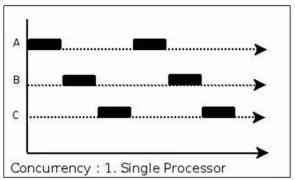
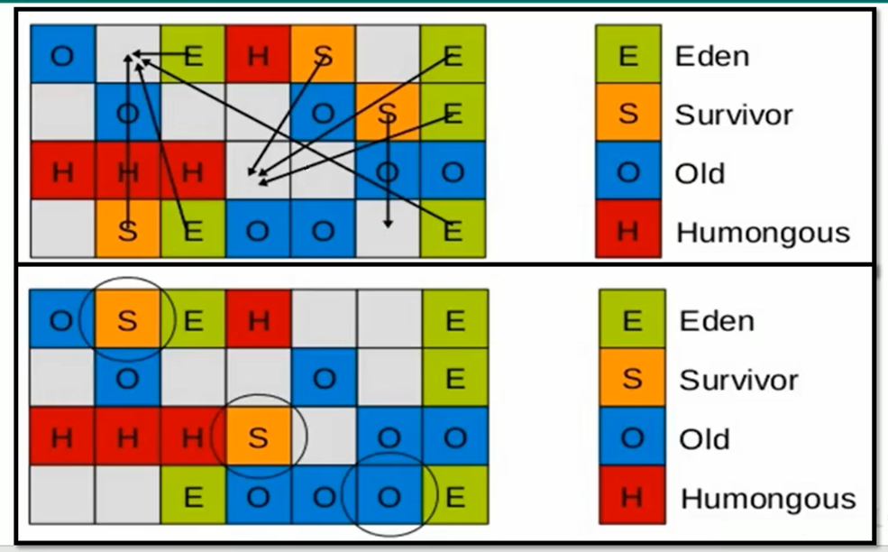
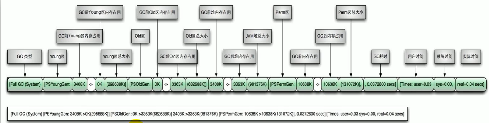
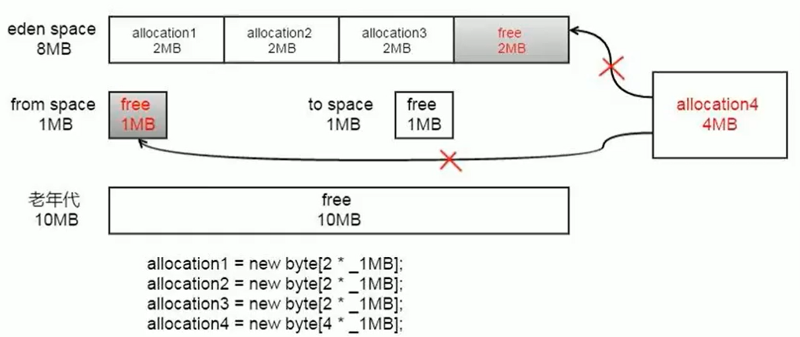

# # 垃圾回收相關概念

## System.gc()的理解

- 在默認情況下，通過 `system.gc（）`者 `Runtime.getRuntime().gc() `的調用，會顯式觸發`FullGC`，`同時對老年代和新生代進行回收`，嘗試釋放被丟棄對象佔用的內存。

- 然而system.gc() )調用附帶一個免責聲明，`無法保證對垃圾收集器的調用。 (不能確保立即生效)`

JVM實現者可以通過system.gc() 調用來決定JVM的GC行為。而一般情況下，垃圾回收應該是自動進行的，無須手動觸發，否則就太過於麻煩了。在一些特殊情況下，如我們正在編寫一個性能基準，我們可以在運行之間調用System.gc()

代碼演示是否出發GC操作

```java
/**
 * System.gc()
 */
public class SystemGCTest {
  public static void main(String[] args) {
    new SystemGCTest();
    System.gc(); // 提醒JVM進行垃圾回收，不能確保立即生效
    // Runtime.getRuntime().gc() 就是 System.gc() 的底層，與 System.gc() 作用一樣
    // System.runFinalization(); // 會強制調用 使用引用的對象的 finalize()方法`
  }

  @Override
  protected void finalize() throws Throwable {
    super.finalize();
    System.out.println("SystemGCTest 執行了 finalize方法");
  }
}
```

運行結果，但是不一定會觸發銷毀的方法，調用`System.runFinalization()會強制調用使用引用的對象的finalize()方法`

SystemGCTest 執行了 finalize方法

### 手動GC來理解不可達對象的回收

代碼如下所示：

```java
/**
 * 局部變量回收
   */
public class LocalVarGC {

  /**
    * 觸發Minor GC沒有回收對象，然後在觸發Full GC將該對象存入old區
    */
  public void localvarGC1() {
    byte[] buffer = new byte[10*1024*1024];
    System.gc();
  }

  /**
    * 觸發YoungGC的時候，已經被回收了
    */
  public void localvarGC2() {
    byte[] buffer = new byte[10*1024*1024];
    buffer = null;
    System.gc();
  }

  /**
    * 觸發YoungGC的時候，沒有被回收，FullGC byte[10*1024*1024]從新生代移至老年代，不會被回收
    * 不會被回收，因為它還存放在局部變量表索引為1的槽中（maximun local variables:2 ）（非靜態方法，局部變量表索引 0 的槽 為 this）
    */
  public void localvarGC3() {
    {
      byte[] buffer = new byte[10*1024*1024];
    }
    System.gc();
  }

  /**
    * 會被回收，因為:它還存放在局部變量表索引為1的槽中，但是後面定義的value把這個槽給替換了(已經出了buffer的作用域)
    * 觸發YoungGC的時候，就被回收了
    */
  public void localvarGC4() {
    {
      byte[] buffer = new byte[10*1024*1024];
    }
    int value = 10;
    System.gc();
  }

  /**
 			第一次 System.gc(); localvarGC1()：觸發Minor GC沒有回收對象，然後在觸發 Full GC 將該數組 存入old區
 			第二次 System.gc(); localvarGC5()：觸發Minor GC沒有回收對象，觸發 Full GC 時，老年代中的數組被回收
    */
  public void localvarGC5() {
    localvarGC1();
    System.gc();
  }

  public static void main(String[] args) {
    LocalVarGC localVarGC = new LocalVarGC();
    localVarGC.localvarGC3();
  }
}
```


## 內存溢出(outofMemoryError)

內存溢出相對於內存洩漏來說，儘管更容易被理解，但是同樣的，內存溢出也是引發程序崩潰的罪魁禍首之一。

由於GC一直在發展，所有一般情況下，除非應用程序佔用的內存增長速度非常快，造成垃圾回收已經跟不上內存消耗的速度，否則不太容易出現ooM的情況。

大多數情況下，GC會進行各種年齡段的垃圾回收，實在不行了就放大招，來一次`獨占式的Fu11GC操作`，這時候會回收大量的內存，供應用程序繼續使用。

`javadoc中對outofMemoryError的解釋是，沒有空閒內存，並且垃圾收集器也無法提供更多內存。`

首先說沒有空閒內存的情況：說明Java虛擬機的堆內存不夠。原因有二：

1. Java虛擬機的堆內存設置不夠。
   - 比如：可能存在內存洩漏問題；也很有可能就是堆的大小不合理，比如我們要處理比較可觀的數據量，但是沒有顯式指定JVM堆大小或者指定數值偏小。我們可以通過參數-Xms 、-Xmx來調整。

2. 代碼中創建了大量大對象，並且長時間不能被垃圾收集器收集（存在被引用）
   - 對於老版本的oracle JDK，因為永久代的大小是有限的，並且JVM對永久代垃圾回收（如，常量池回收、卸載不再需要的類型）非常不積極，所以當我們不斷添加新類型的時候，永久代出現OutOfMemoryError也非常多見，尤其是在運行時存在大量動態類型生成的場合；類似intern字符串緩存佔用太多空間，也會導致OOM問題。對應的異常信息，會標記出來和永久代相關：`“java.lang.OutOfMemoryError:PermGen space"`。
   - 隨著`元數據區`的引入，方法區內存已經不再那麼窘迫，所以相應的ooM有所改觀，出現OOM，異常信息則變成了`：“java.lang.OutofMemoryError:Metaspace"`。直接內存不足，也會導致OOM。

這裡面隱含著一層意思是，在拋出OutofMemoryError之前，通常垃圾收集器會被觸發，盡其所能去清理出空間。

- 例如：在引用機制分析中，涉及到JVM會去嘗試回收`軟引用指向的對像`等。在
- java.nio.BIts.reserveMemory（）方法中，我們能清楚的看到，System.gc（）會被調用，以清理空間。

當然，也不是在任何情況下垃圾收集器都會被觸發的

- 比如，我們去分配一個超大對象，類似一個超大數組超過堆的最大值，JVM可以判斷出垃圾收集並不能解決這個問題，所以直接拋出OutofMemoryError。

## 內存洩漏(Memory Leak)

也稱作“存儲滲漏”。`嚴格來說`，`只有對像不會再被程序用到了，但是GC又不能回收他們的情況，才叫內存洩漏。`

但實際情況很多時候`一些不太好的實踐（或疏忽）會導致對象的生命週期變得很長甚至導致OOM`，也可以叫做`寬泛意義上的“內存洩漏”`。

儘管內存洩漏並不會立刻引起程序崩潰，但是一旦發生內存洩漏，程序中的可用內存就會被逐步蠶食，直至耗盡所有內存，最終出現outofMemory異常，導致程序崩潰。

注意，這裡的存儲空間並不是指物理內存，而是指虛擬內存大小，這個虛擬內存大小取決於磁盤交換區設定的大小。

- 買房子：80平的房子，但是有10平是公攤的面積，我們是無法使用這10平的空間，這就是所謂的內存洩漏


Java使用可達性分析算法，最上面的數據不可達，就是需要被回收的。後期有一些對像不用了，按道理應該斷開引用，但是存在一些鏈沒有斷開，從而導致沒有辦法被回收。

舉例

- 單例模式

  `單例的生命週期和應用程序是一樣長的`，所以單例程序中，如果`持有對外部對象的引用的話，那麼這個外部對像是不能被回收的`（被單例對象引用的對象，生命週期和單例對象一樣長），則會導致內存洩漏的產生。

- 一些提供close的資源未關閉導致內存洩漏

  數據庫連接（dataSourse.getConnection() ），網絡連接（socket）和io連接`必須手動close，否則是不能被回收的`。

## Stop The World

stop-the-world，簡稱STw，`指的是GC事件發生過程中，會產生應用程序的停頓`。停頓產生時整個應用程序線程都會被暫停，沒有任何響應，有點像卡死的感覺，這個停頓稱為STW。

可達性分析算法中枚舉根節點（GC Roots）會導致所有Java執行線程停頓。

- 分析工作必須在一個能確保一致性的快照中進行
- 一致性指整個分析期間整個執行系統看起來像被凍結在某個時間點上
- `如果出現分析過程中對象引用關係還在不斷變化，則分析結果的準確性無法保證`

被STW中斷的應用程序線程會在完成GC之後恢復，頻繁中斷會讓用戶感覺像是網速不快造成電影卡帶一樣，所以我們需要減少STw的發生。

STW事件和採用哪款GC無關, `所有的GC都有這個事件`。

哪怕是G1也不能完全避免Stop-the-world情況發生，只能說垃圾回收器越來越優秀，回收效率越來越高，`盡可能地縮短了暫停時間`。

`STW是JVM在後台自動發起和自動完成的`。在用戶不可見的情況下，把用戶正常的工作線程全部停掉。

開發中不要用system.gc() 會導致stop-the-world的發生。

## 垃圾回收的並行與並發

### 並發(concurrent)

在操作系統中，是指`一個時間段中`有幾個程序都`處於已啟動運行到運行完畢之間`，且這幾個程序都是`在同一個處理器上運行`。

並發不是真正意義上的“同時進行”，只是CPU把一個時間段劃分成幾個時間片段（時間區間），然後在這幾個時間區間之間來回切換，由於CPU處理的速度非常快，只要時間間隔處理得當，即可讓用戶感覺是多個應用程序同時在進行。



### 並行(parallel)

當系統`有一個以上CPU時`，當一個CPU執行一個進程時，另一個CPU可以執行另一個進程，`兩個進程互不搶占CPU資源，可以同時進行`，我們稱之為並行（Parallel）。

其實決定並行的因素不是CPU的數量，而是CPU的核心數量，比如一個CPU多個核也可以並行。

適合科學計算，後台處理等弱交互場景


### 並發和並行對比

並發，指的是多個事情，在`同一時間段內`同時發生了。

並行，指的是多個事情，在`同一時間點上`同時發生了。

並發的多個任務之間是互相搶占資源的。並行的多個任務之間是不互相搶占資源的。

`只有在多CPU或者一個CPU多核的情況中，才會發生並行`。

否則，看似同時發生的事情，其實都是並發執行的。

### 垃圾回收的並行與並發

並發和並行，在談論垃圾收集器的上下文語境中，它們可以解釋如下：

- 並行（Parallel）：指多條垃圾收集線程並行工作，但此時用戶線程仍處於等待狀態。如ParNew、Parallel Scavenge、Parallel old；

- 串行（Serial）
      - 相較於並行的概念，單線程執行。
      - 如果內存不夠，則程序暫停，啟動JM垃圾回收器進行垃圾回收。回收完，再啟動程序的線程。


並發和並行，在談論垃圾收集器的上下文語境中，它們可以解釋如下：

並發（Concurrent）：指`用戶線程與垃圾收集線程同時執行`（但不一定是並行的，可能會交替執行），垃圾回收線程在執行時不會停頓用戶程序的運行。

- `用戶程序在繼續運行，而垃圾收集程序線程運行於另一個CPU上`；

- 如：CMS、G1


## 安全點與安全區域

### 安全點

程序執行時並非在所有地方都能停頓下來開始GC，只有在特定的位置才能停頓下來開始GC，這些位置稱為“安全點（Safepoint）”。

Safe Point的選擇很重要，`如果太少可能導致GC等待的時間太長，如果太頻繁可能導致運行時的性能問題`。大部分指令的執行時間都非常短暫，通常會根據`“是否具有讓程序長時間執行的特徵”`為標準。比如：選擇一些執行時間較長的指令作為Safe Point，`如方法調用、循環跳轉和異常跳轉等`。

如何在cc發生時，檢查所有線程都跑到最近的安全點停頓下來呢？

- 搶先式中斷：`（目前沒有虛擬機採用了）`首先中斷所有線程。如果還有線程不在安全點，就恢復線程，讓線程跑到安全點。
- 主動式中斷：設置一個中斷標誌，各個線程運行到Safe Point的時候主動輪詢這個標誌，如果中斷標誌為真，則將自己進行中斷掛起。 （`有輪詢的機制`）

### 安全區域

Safepoint 機制保證了程序執行時，在不太長的時間內就會遇到可進入GC的Safepoint。但是，程序“不執行”的時候呢？例如線程處於sleep-狀態或Blocked 狀態，這時候線程無法響應JVM的中斷請求，“走”到安全點去中斷掛起，JVM也不太可能等待線程被喚醒。對於這種情況，就需要安全區域（Safe Region）來解決。

`安全區域是指在一段代碼片段中，對象的引用關係不會發生變化，在這個區域中的任何位置開始Gc都是安全的`。我們也可以把Safe Region看做是被擴展了的Safepoint。

執行流程：

- 當線程運行到Safe Region的代碼時，首先標識已經進入了Safe Relgion，如果這段時間內發生GC，JVM會忽略標識為Safe Region狀態的線程
- 當線程即將離開Safe Region時，會檢查JVM是否已經完成GC，如果完成了，則繼續運行，否則線程必須等待直到收到可以安全離開Safe Region的信號為止；

## 再談引用

我們希望能描述這樣一類對象：當內存空間還足夠時，則能保留在內存中；如果內存空間在進行垃圾收集後還是很緊張，則可以拋棄這些對象。

【既偏門又非常高頻的面試題】強引用、軟引用、弱引用、虛引用有什麼區別？具體使用場景是什麼？在JDK1.2版之後，Java對引用的概念進行了擴充，將引用分為：

- 強引用（Strong Reference）
- 軟引用（Soft Reference）
- 弱引用（Weak Reference）
- 虛引用（Phantom Reference）

`這4種引用強度依次逐漸減弱`。

除強引用外，其他3種引用均可以在`java.1ang.ref`包中找到它們的身影。如下圖，顯示了這3種引用類型對應的類，開發人員可以在應用程序中直接使用它們。


Reference子類中只有終結器引用是包內可見的，其他3種引用類型均為public，可以在應用程序中直接使用

- 強引用（StrongReference）：最傳統的“引用”的定義，是指在程序代碼之中普遍存在的引用賦值，即類似“object obj=new Object（）”這種引用關係。`無論任何情況下，只要強引用關係還存在，垃圾收集器就永遠不會回收掉被引用的對象`。（死都不回收）
- 軟引用（SoftReference）：在系統`將要發生內存溢出之前，將會把這些對象列入回收範圍之中進行第二次回收`。如果這次回收後還沒有足夠的內存，才會拋出內存流出異常。（內存不夠時回收：緩存）
- 弱引用（WeakReference）：被弱引用關聯的對像`只能生存到下一次垃圾收集之前`。當垃圾收集器工作時，無論內存空間是否足夠，都會回收掉被弱引用關聯的對象。（發現及回收：緩存）
- 虛引用（PhantomReference）：一個對像是否有虛引用的存在，完全不會對其生存時間構成影響，也無法通過虛引用來獲得一個對象的實例。`為一個對象設置虛引用關聯的唯一目的就是能在這個對像被收集器回收時收到一個系統通知`。（對象回收跟蹤）

### 再談引用：強引用（Strong Reference）

在Java程序中，最常見的引用類型是強引用（`普通系統99%以上都是強引用`），也就是我們最常見的普通對象引用，也是默認的引用類型。

當在Java語言中使用new操作符創建一個新的對象，並將其賦值給一個變量的時候，這個變量就成為指向該對象的一個強引用。

`強引用的對像是可觸及的，垃圾收集器就永遠不會回收掉被引用的對象。`

- 對於一個普通的對象，如果`沒有其他的引用關係`，只要`超過了引用的作用域`或者`顯式地將相應（強）引用賦值為nu11`，就是可以當做垃圾被收集了，當然具體回收時機還是要看垃圾收集策略。

- 相對的，軟引用、弱引用和虛引用的對像是`軟可觸及、弱可觸及和虛可觸及`的，在一定條件下，都是可以被回收的。所以，`強引用是造成Java內存洩漏的主要原因之一`。
  舉例

強引用的案例說明

```java
StringBuffer str = new StringBuffer("hello mogublog");
```

局部變量str指向stringBuffer實例所在堆空間，通過str可以操作該實例，那麼str就是stringBuffer實例的強引用對應內存結構：


如果此時，在運行一個賦值語句

````java
StringBuffer str = new StringBuffer("hello mogublog");
StringBuffer str1 = str;
````

對應的內存結構為:


那麼我們將 str = null; 則 原來堆中的對像也不會被回收，因為還有其它對象指向該區域

```java
public class StrongReferenceTest{
  public static void main(String[] args){
    StringBuffer str = new StringBuffer("Hello");
    StringBuffer str1 = str;
    
    str = null;
    System.gc();
    
    try{
      Thread.sleep(3000);
    }catch(InterruptedException e){
      e.printStackTrace();
    }
    System.out.println(str1);
  }
}
```


總結

本例中的兩個引用，都是強引用，強引用具備以下特點：

- 強引用可以直接訪問目標對象。
- 強引用所指向的對像在任何時候都不會被系統回收，虛擬機寧願拋出OOM異常，也不會回收強引用所指向對象。
- 強引用可能導致內存洩漏。

### 再談引用： 軟引用（Soft Reference）

軟引用是用來描述一些還有用，但非必需的對象。只被軟引用關聯著的對象，`在系統將要發生內存溢出異常前，會把這些對象列進回收範圍之中進行第二次回收`，如果這次回收還沒有足夠的內存，才會拋出內存溢出異常。

- 第一次回收：不可課觸及/不可達的 強引用對象，
- 二次回收：可課觸及/可達的 軟/弱對象

注意，這裡的第一次回收是不可達的對象

軟引用通常用來實現內存敏感的緩存。比如：`高速緩存`就有用到軟引用。如果還有空閒內存，就可以暫時保留緩存，當內存不足時清理掉，這樣就保證了使用緩存的同時，不會耗盡內存。

垃圾回收器在某個時刻決定回收軟可達的對象的時候，會清理軟引用，並可選地把引用存放到一個`引用隊列（Reference Queue）`。

- 類似弱引用，只不過Java虛擬機會盡量讓軟引用的存活時間長一些，迫不得已才清理。

`一句話概括：當內存足夠時（不一定要到報OOM才回收，老年代剩餘空間很少時也會回收弱引用），不會回收軟引用可達的對象。內存不夠時，會回收軟引用的可達對象`

在JDK1.2版之後提供了SoftReference類來實現軟引用

```java
// 聲明強引用
Object obj = new Object();
// 創建一個軟引用
SoftReference<Object> sf = new SoftReference<>(obj);
obj = null; //銷毀強引用，這是必須的，不然會存在強引用和軟引用

// or 
SoftReference<Object> sf = new SoftReference<>(new Object());
```

### 再談引用：弱引用（Weak Reference）

- `發現即回收`

弱引用也是用來描述那些非必需對象，`只被弱引用關聯的對像只能生存到下一次垃圾收集發生為止`。在系統GC時，只要發現弱引用，不管系統堆空間使用是否充足，都會回收掉只被弱引用關聯的對象。

但是，由於`垃圾回收器的線程通常優先級很低`，因此，並不一定能很快地發現持有弱引用的對象。在這種情況下，`弱引用對象可以存在較長的時間`。

弱引用和軟引用一樣，在構造弱引用時，也可以指定一個引用隊列，當弱引用對像被回收時，就會加入指定的`引用隊列`，通過這個隊列可以跟踪對象的回收情況。

`軟引用、弱引用都非常適合來保存那些可有可無的緩存數據`。如果這麼做，當系統內存不足時，這些緩存數據會被回收，不會導致內存溢出。而當內存資源充足時，這些緩存數據又可以存在相當長的時間，從而起到加速系統的作用。

在JDK1.2版之後提供了WeakReference類來實現弱引用

```java
// 聲明強引用
Object obj = new Object();
// 創建一個弱引用
WeakReference<Object> sf = new WeakReference<>(obj);
obj = null; //銷毀強引用，這是必須的，不然會存在強引用和弱引用
```

弱引用對象與軟引用對象的最大不同就在於，

- 軟引用對象當GC在進行回收時，需要通過算法檢查是否回收軟引用對象，
- 而對於弱引用對象，GC總是進行回收。弱引用對象更容易、更快被GC回收。

面試題：你開發中使用過WeakHashMap嗎？

WeakHashMap用來存儲圖片信息，可以在內存不足的時候，及時回收，避免了OOM

### 再談引用：虛引用（Phantom Reference）

也稱為“幽靈引用”或者“幻影引用”，是所有引用類型中最弱的一個

一個對像是否有虛引用的存在，完全不會決定對象的生命週期。如果一個對象僅持有虛引用，那麼它和沒有引用幾乎是一樣的，隨時都可能被垃圾回收器回收。

`它不能單獨使用，也無法通過虛引用來獲取被引用的對象`。當試圖通過虛引用的`get（）方法取得對象時，總是null`

`為一個對象設置虛引用關聯的唯一目的在於跟踪垃圾回收過程。比如：能在這個對像被收集器回收時收到一個系統通知。`

`虛引用必須和引用隊列一起使用`。虛引用在`創建時必須提供一個引用隊列作為參數`。當垃圾回收器準備回收一個對象時，如果發現它還有虛引用，就會在回收對像後，將這個虛引用加入引用隊列，以通知應用程序對象的回收情況。

`由於虛引用可以跟踪對象的回收時間，因此，也可以將一些資源釋放操作放置在虛引用中執行和記錄。`

- 虛引用無法獲取到我們的數據

在JDK1.2版之後提供了PhantomReference類來實現虛引用。

```java
// 聲明強引用
Object obj = new Object();
// 聲明引用隊列
ReferenceQueue phantomQueue = new ReferenceQueue();
// 聲明虛引用（還需要傳入引用隊列）
PhantomReference<Object> sf = new PhantomReference<>(obj, phantomQueue);
obj = null;
```


案例

我們使用一個案例，來結合虛引用，引用隊列，finalize進行講解

```java
public class PhantomReferenceTest {
  // 當前類對象的聲明
  public static PhantomReferenceTest obj;
  // 引用隊列
  static ReferenceQueue<PhantomReferenceTest> phantomQueue = null;

  @Override
  protected void finalize() throws Throwable { // finalize()方法只能被調用一次
    super.finalize();
    System.out.println("調用當前類的finalize方法");
    obj = this;
  }
  
  public static void main(String[] args) {
    Thread thread = new Thread(() -> {
      while(true) {
        if (phantomQueue != null) {
          PhantomReference<PhantomReferenceTest> objt = null; // 變量作用域提升
          try {
            objt = (PhantomReference<PhantomReferenceTest>) phantomQueue.remove();
          } catch (Exception e) {
            e.getStackTrace();
          }
          if (objt != null) {
            System.out.println("追踪垃圾回收過程：PhantomReferenceTest實例被GC了");
          }
        }
      }
    }, "t1");
    thread.setDaemon(true); //設置為守護線程，當程序中沒有非守護線程時，守護線程也就執行結束
    thread.start();

    phantomQueue = new ReferenceQueue<>();
    obj = new PhantomReferenceTest();
    // 構造了PhantomReferenceTest對象的虛引用，並指定了引用隊列
    PhantomReference<PhantomReferenceTest> phantomReference = new PhantomReference<>(obj, phantomQueue);
    try {
      System.out.println(phantomReference.get());
      // 去除強引用
      obj = null;
      // 第一次進行GC，由於對象可複活，GC無法回收該對象
      System.out.println("第一次GC操作");
      System.gc();
      Thread.sleep(1000);
      if (obj == null) {
        System.out.println("obj 是 null");
      } else {
        System.out.println("obj 不是 null");
      }
      System.out.println("第二次GC操作");
      obj = null;
      // 第二次進行GC，由於 finalize() 方法只能被調用一次，對象一定會被回收，一但將虛引用對象回收，就會將此虛引用存放到引用隊列中
      System.gc();
      Thread.sleep(1000);
      if (obj == null) {
        System.out.println("obj 是 null");
      } else {
        System.out.println("obj 不是 null");
      }
    } catch (Exception e) {
      e.printStackTrace();
    } finally {

    }
  }
}

// 最後運行結果
null
第一次GC操作
調用當前類的finalize方法
obj 不是 null
第二次GC操作
追踪垃圾回收過程：PhantomReferenceTest實例被GC了
obj 是 null
```

從上述運行結果我們知道，第一次嘗試獲取虛引用的值，發現無法獲取的，這是因為虛引用是無法直接獲取對象的值，然後進行第一次gc，因為會調用finalize方法，將對象復活了，所以對像沒有被回收，但是調用第二次gc操作的時候，因為finalize方法只能執行一次，所以就觸發了GC操作，將對象回收了，同時將會觸發第二個操作就是將回收的值存入到引用隊列中。

## 終結器引用

它用於實現對象的finalize() 方法，也可以稱為終結器引用

無需手動編碼，其內部配合引用隊列使用

在GC時，終結器引用入隊。由Finalizer線程通過終結器引用找到被引用對象調用它的finalize()方法，第二次GC時才回收被引用的對象

# # 常見垃圾回收器

## GC 分類與效能指標

垃圾收集器沒有在規範中進行過多的規定，可以由不同的廠商、不同版本的 JVM 來實現。 由於 JDK 的版本處於高速迭代過程中，因此 Java 發展至今已經衍生了眾多的 GC 版本。 從不同角度分析垃圾收集器，可以將 GC 分為不同的型別。

> Java不同版本新特性
>
> - 語法層面：Lambda表示式、switch、自動拆箱裝箱、enum
> - API層面：Stream API、新的日期時間、Optional、String、集合框架
> - 底層優化：JVM優化、GC的變化、元空間、靜態域、字串常量池位置變化

### 垃圾收集器分類

#### 按執行緒數分

`垃圾回收執行緒數`，可以分為`序列/串行`垃圾回收器和`並行`垃圾回收器。


序列回收指的是在同一時間段內只允許有一個 CPU 用於執行垃圾回收操作，此時工作執行緒被暫停，直至垃圾收集工作結束。

- 在諸如單 CPU 處理器或者較小的應用記憶體等硬體平臺不是特別優越的場合，序列回收器的效能表現可以超過並行回收器和併發回收器。所以，`序列回收預設被應用在客戶端的 Client 模式下的 JVM 中`
- 在併發能力比較強的 CPU 上，並行回收器產生的停頓時間要短於序列回收器。

和序列回收相反，並行收集可以運用多個 CPU 同時執行垃圾回收，因此提升了應用的吞吐量，不過並行回收仍然與序列回收一樣，採用獨佔式，使用了“stop-the-world”機制。

#### 按工作模式分

按照`工作模式`分，可以分為 `併發式垃圾回收器` 和 `獨佔式垃圾回收器` 。

- 併發式垃圾回收器與應用程式執行緒交替工作，以儘可能減少應用程式的停頓時間。
- 獨佔式垃圾回收器（Stop the world）一旦執行，就停止應用程式中的所有使用者執行緒，直到垃圾回收過程完全結束。


#### 按碎片處理方式分

`按碎片處理方式`分，可分為 `壓縮武垃圾回收器` 和 `非壓縮式垃圾回收器` 。

- 壓縮式垃圾回收器會在回收完成後，對存活物件進行壓縮整理，消除回收後的碎片。
  - 再分配物件空間使用：指針碰撞
- 非壓縮式的垃圾回收器不進行這步操作。
  - 再分配物件空間使用：空間列表

#### 按工作的記憶體區間分

又可分為 `年輕代垃圾回收器` 和 `老年代垃圾回收器` 。

#### 評估GC的效能指標

- `吞吐量：執行使用者程式碼的時間佔總執行時間的比例`
  - （總執行時間 = 程式的執行時間 + 記憶體回收的時間）
  - 吞吐量 = 程式的執行時間/總執行時間
- **垃圾收集開銷**：吞吐量的補數，垃圾收集所用時間與總執行時間的比例。
- **暫停時間 STW**：`執行垃圾收集時，程式的工作執行緒被暫停的時間`。
- **收集頻率**：相對於應用程式的執行，收集操作發生的頻率。
- **記憶體佔用**：`Java堆區所佔的記憶體大小`。
- **快速**：一個物件從誕生到被回收所經歷的時間。

吞吐量、暫停時間、記憶體佔用 這三者共同構成一個“不可能三角”。三者總體的表現會隨著技術進步而越來越好。一款優秀的收集器通常最多同時滿足其中的兩項。 這三項裡，`暫停時間的重要性日益凸顯`。因為隨著硬體發展，記憶體佔用多些越來越能容忍，硬體效能的提升也有助於降低收集器執行時對應用程式的影響，即提高了吞吐量。而記憶體的擴大，對延遲反而帶來負面效果。 簡單來說，主要抓住兩點：

- 吞吐量
- 暫停時間

**效能指標：吞吐量（throughput）** 吞吐量就是CPU用於執行使用者程式碼的時間與CPU總消耗時間的比值，即 `吞吐量=執行使用者程式碼時間 /（執行使用者程式碼時間+垃圾收集時間）` 

- 比如：虛擬機器總共運行了100分鐘，其中垃圾收集花掉1分鐘，那吞吐量就是99%。

這種情況下，應用程式能容忍較高的暫停時間，因此，高吞吐量的應用程式有更長的時間基準，快速響應是不必考慮的吞吐量優先，意味著在單位時間內，STW 的時間最短：0.2+0.2=0.4


**效能指標：暫停時間（pause time）** “暫停時間”是指一個時間段內應用程式執行緒暫停，讓Gc執行緒執行的狀態例如，GC期間1ee毫秒的暫停時間意味著在這1e0毫秒期間內沒有應用程式執行緒是活動的。暫停時間優先，意味著儘可能讓單次STW的時間最短：0.1+0.1 + 0.1+ 0.1+ 0.1=0.5


**吞吐量vs暫停時間** 

高吞吐量較好因為這會讓應用程式的終端使用者感覺只有應用程式執行緒在做“生產性”工作。直覺上，吞吐量越高程式執行越快。 

低暫停時間（低延遲）較好因為從終端使用者的角度來看不管是 GC 還是其他原因導致一個應用被掛起始終是不好的。這取決於應用程式的型別，有時候甚至短暫的 200 毫秒暫停都可能打斷終端使用者體驗。因此，具有低的較大暫停時間是非常重要的，特別是對於一個互動式應用程式。 

不幸的是`”高吞吐量”和”低暫停時間”是一對相互競爭的目標（矛盾）`。 

- 因為如果選擇以吞吐量優先，那麼必然需要`降低記憶體回收的執行頻率`，但是這樣會導致GC需要更長的暫停時間來執行記憶體回收。 
- 相反的，如果選擇以低延遲優先為原則，那麼為了降低每次執行記憶體回收時的暫停時間，也只能`頻繁地執行記憶體回收`，但這又引起了年輕代記憶體的縮減和導致程式吞吐量的下降。 

在設計（或使用）GC演算法時，我們必須確定我們的目標：一個GC演算法只可能針對兩個目標之一（即只專注於較大吞吐量或最小暫停時間），或嘗試找到一個二者的折衷。 

現在標準：**`在最大吞吐量優先的情況下，降低停頓時間`**


## 不同的垃圾回收器概述

垃圾收集機制是 Java 的招牌能力，極大地提高了開發效率。這當然也是面試的熱點。那麼，Java 常見的垃圾收集器有哪些？

> GC 垃圾收集器是和 JVM 一脈相承的，它是和 JVM 進行搭配使用，在不同的使用場景對應的收集器也是有區別

**垃圾回收器發展史** 

有了虛擬機器，就一定需要收集垃圾的機制，這就是 Garbage Collection，對應的產品我們稱為 Garbage Collector。

- 1999年隨JDK 1.3.1 一起來的是序列方式的 SerialGc，它是第一款 GC。ParNew 垃圾收集器是 Serial 收集器的多執行緒版本
- 2002年2月26日，Parallel GC 和 Concurrent Mark Sweep GC 跟隨 JDK1.4.2 一起釋出·
- Parallel GC 在 JDK6 之後成為 HotSpot 預設 GC。
- 2012年，在 JDK1.7u4 版本中，G1 可用。
- 2017年，JDK9 中 G1 變成預設的垃圾收集器，以替代 CMS。
- 2018年3月，JDK10中G1垃圾回收器的並行完整垃圾回收，實現並行性來改善最壞情況下的延遲。

分水嶺

- 2018年9月，JDK11釋出。引入Epsilon 垃圾回收器，又被稱為 "No-Op(無操作)“ 回收器。同時，引入ZGC：可伸縮的低延遲垃圾回收器（Experimental）
- 2019年3月，JDK12 釋出。增強 G1，自動返回未用堆記憶體給作業系統。同時，引入Shenandoah GC：低停頓時間的GC（Experimental）。·2019年9月，JDK13釋出。增強ZGC，自動返回未用堆記憶體給作業系統。
- 2020年3月，JDK14 釋出。刪除 CMS 垃圾回收器。擴充套件 ZGC 在 macos 和 Windows 上的應用

**7種經典的垃圾收集器**

- 序列回收器：Serial、Serial old
- 並行回收器：ParNew、Parallel Scavenge、Parallel old
- 併發回收器：CMS、G11


**7款經典收集器與垃圾分代之間的關係**


- 新生代收集器：Serial、ParNew、Paralle1 Scavenge；
- 老年代收集器：Serial old、Parallel old、CMS；
- 整堆收集器：G1；

**垃圾收集器的組合關係**


- 兩個收集器間有連線，表明它們可以搭配使用：Serial/Serial old、Serial/CMS、ParNew/Serial old、ParNew/CMS、Parallel Scavenge/Serial 0ld、Parallel Scavenge/Parallel 0ld、G1；
- 其中Serial old 作為 CMS 出現"Concurrent Mode Failure"失敗的後備預案。
- （紅色虛線）由於維護和相容性測試的成本，在 JDK 8 時將 Serial+CMS、ParNew+Serial old 這兩個組合宣告為廢棄（JEP173），並在 JDK9 中完全取消了這些組合的支援（JEP214），即：移除。
- （綠色虛線）JDK14中：棄用 Parallel Scavenge 和 Serialold GC 組合（JEP366）
- （青色虛線）JDK14中：刪除 CMS 垃圾回收器（JEP363）

為什麼要有很多收集器，一個不夠嗎？

- `因為Java的使用場景很多，移動端，伺服器等`。所以就需要針對不同的場景，提供不同的垃圾收集器，提高垃圾收集的效能。

- 雖然我們會對各個收集器進行比較，但並非為了挑選一個最好的收集器出來。沒有一種放之四海皆準、任何場景下都適用的完美收集器存在，更加沒有萬能的收集器。所以`我們選擇的只是對具體應用最合適的收集器`。

**如何檢視預設垃圾收集器**

-  `-XX:+PrintcommandLineFlags` ：檢視命令列相關引數（包含使用的垃圾收集器） 
- 使用命令列指令： `jinfo -flag ` 相關垃圾回收器引數 程序ID
  -  `jinfo -flag UseParallelGC 924` 
  - `+:using`
  - `-:not using`

## Serial 回收器： 串行/序列回收

- Serial 收集器是最基本、歷史最悠久的垃圾收集器了。JDK1.3 之前回收新生代唯一的選擇。
- Serial 收集器作為 `HotSpot 中 client 模式下的預設新生代垃圾收集器`。
- Serial 收集器`採用 複製演算法、序列回收和"stop-the-World"機制的方式執行記憶體回收。`
- 除了年輕代之外，Serial收集器還提供用於執行老年代垃圾收集的 Serial old 收集器。`Serial old收集器同樣也採用了序列回收和"stop the World"機制，只不過記憶體回收演算法使用的是 標記-壓縮演算法。`
  - Serial old 是執行在 Client 模式下預設的老年代的垃圾回收器
  - Serial old 在 Server 模式下主要有兩個用途：
    - 與新生代的 Parallel scavenge 配合使用
    - 作為老年代 CMS 收集器的後備垃圾收集方案


這個收集器是一個單執行緒的收集器，但它的“單執行緒”的意義並不僅僅說明它`只會使用一個 CPU 或一條收集執行緒去完成垃圾收集工作`，更重要的是在它進行垃圾收集時，`必須暫停其他所有的工作執行緒，直到它收集結束（Stop The World）`

- 優勢：`簡單而高效`（與其他收集器的單執行緒比），對於限定單個 CPU 的環境來說，Serial收集器由於沒有執行緒互動的開銷，專心做垃圾收集自然可以獲得最高的單執行緒收集效率。
- 執行在client模式下的虛擬機器是個不錯的選擇。
- 在使用者的桌面應用場景中，可用記憶體一般不大（幾十MB至一兩百MB），可以在較短時間內完成垃圾收集（幾十ms至一百多ms），只要不頻繁發生，使用序列回收器是可以接受的。
- 在 HotSpot 虛擬機器中，使用`-XX：+UseSerialGC` 引數，可以`指定年輕代和老年代 都 使用序列收集器`。
  - 等價於新生代用 Serial GC，且老年代用 Serial old GC

**總結** 

這種垃圾收集器大家瞭解，`現在已經不用序列的了`。而且在`限定單核 cpu 才可以用`。現在都不是單核的了。對於互動較強的應用而言，這種垃圾收集器是不能接受的。一般在 Java web 應用程式中是不會採用序列垃圾收集器的。

## ParNew 回收器：並行回收

- 如果說 serial GC 是年輕代中的單執行緒垃圾收集器，那麼 ParNew 收集器則是 serial 收集器的多執行緒版本。
  - Par 是 Parallel 的縮寫，New：只能處理的是新生代
- ParNew 收集器除了採用`並行回收`的方式執行記憶體回收外，兩款垃圾收集器之間幾乎沒有任何區別。ParNew 收集器在年輕代中同樣也是`採用複製演算法、"stop-the-World"機制`。
- ParNew 是很多 JVM 執行在 Server 模式下`新生代`的預設垃圾收集器。


- 對於`新生代`，回收次數頻繁，使用`並行方式`高效。
- 對於`老年代`，回收次數少，使用`序列方式`節省資源。（CPU並行需要切換執行緒，序列可以省去切換執行緒的資源）
- 由於ParNew收集器是基於並行回收，那麼是否可以斷定 ParNew 收集器的回收效率在任何場景下都會比 serial 收集器更高效？
  - ParNew 收集器執行在多 CPU 的環境下，由於可以充分利用多CPU 、多核心等物理硬體優勢，可以更快速地完成垃圾收集，提升程式的吞吐量。
  - 但是在`單個 CPU 的環境下 ParNew 收集器不必 Serial 收集器更高效`。雖然 Serial 收集器是基於序列回收，但是由於 CPU 不需要頻繁地做任務切換，因此可以有效避免多執行緒互動過程中產生的一些額外開銷。
- 因為除 Serial 外，目前只有 ParNew GC 能與 CMS 收集器配合工作

在程式中，開發人員可以通過選項"-XX：`+UseParNewGC`"手動指定使用ParNew收集器執行記憶體回收任務。它表示年輕代使用並行收集器，不影響老年代。 `-XX:ParallelGCThreads` 限制執行緒數量，預設開啟和CPU資料相同的執行緒數。

## Parallel Scanvage回收器：吞吐量優先

- HotSpot 的年輕代中除了擁有 ParNew 收集器是基於並行回收的以外，Parallel Scavenge 收集器同樣也採用了`複製演算法、並行回收和"Stop the World"機制。`
- 那麼Parallel 收集器的出現是否多此一舉？
  - 和ParNew收集器不同，ParallelScavenge 收集器的`目標則是達到一個可控制的吞吐量（Throughput）`，它也被稱為吞吐量優先的垃圾收集器。
  - 自適應調節策略也是 Parallel Scavenge 與 ParNew 一個重要區別。
- 高吞吐量則可以高效率地利用 CPU 時間，儘快完成程式的運算任務，主要`適合在後臺運算而不需要太多互動的任務（和用戶無互動，不需考慮低延遲）`。因此，常見在伺服器環境中使用。例如，那些執行批量處理、訂單處理、工資支付、科學計算的應用程式。
- Parallel 收集器在 JDK1.6 時提供了用於執行老年代垃圾收集的 Parallel old收集器，用來代替老年代的 serialold收集器。
- `Parallel old 收集器採用了標記-壓縮演算法`，但同樣也是基於`並行回收和"stop-the-World"機制`。


在程式吞吐量優先的應用場景中，Parallel 收集器和Parallel old收集器的組合，在server模式下的記憶體回收效能很不錯。`在Java8中，預設是此垃圾收集器`。

 **引數配置**

- `-XX：+UseParallelGC` 手動指定年輕代使用 Parallel 並行收集器執行記憶體回收任務。

- ```
  -XX：+UseParalleloldcc
  ```

   手動指定老年代都是使用並行回收收集器。

  - 分別適用於新生代和老年代。`預設 jdk8 是開啟的`。
  - 上面兩個引數，預設開啟一個，另一個也會被開啟。（`互相啟用`）

- ```
  -XX:ParallelGcrhreads
  ```

  設定年輕代並行收集器的執行緒數。一般地，最好與 CPU 數量相等，以避免過多的執行緒數影響垃圾收集效能。

  - 在預設情況下，當 CPU 數量小於 8 個，ParallelGcThreads 的值等於 CPU 數量。
  - 當 CPU 數量大於 8 個，ParallelGCThreads 的值等於 3+[5*CPU Count]/8]

- ```
  -XX:MaxGCPauseMillis
  ```

   設定垃圾收集器最大停頓時間（即STW的時間）。單位是毫秒。

  - 為了儘可能地把停頓時間控制在 MaxGCPauseMills 以內，收集器在工作時會調整 Java 堆大小或者其他一些引數。
  - 對於使用者來講，停頓時間越短體驗越好。但是在伺服器端，我們注重高併發，整體的吞吐量。所以伺服器端適合 Parallel，進行控制。
  - `該引數使用需謹慎`。

- ```
  -XX:GCTimeRatio
  ```

   垃圾收集時間佔總時間的比例（=1/（N+1））。用於衡量吞吐量的大小。

  - 取值範圍（0，100）。預設值99，也就是垃圾回收時間不超過 1。
  - 與前一個 `-XX:MaxGCPauseMillis` 引數有一定矛盾性。暫停時間越長，Radio 引數就容易超過設定的比例。

- ```
  -XX:+UseAdaptivesizepplicy
  ```

   設定 Parallel scavenge 收集器具有自適應調節策略

  - 在這種模式下，年輕代的大小、Eden 和 Survivor 的比例、晉升老年代的物件年齡等引數會被自動調整，已達到在堆大小、吞吐量和停頓時間之間的平衡點。
  - 在手動調優比較困難的場合，可以直接使用這種自適應的方式，僅指定虛擬機器的最大堆、目標的吞吐量（GCTimeRatio）和停頓時間（MaxGCPauseMills），讓虛擬機器自己完成調優工作。

## CMS 回收器：低延遲

- 在 JDK1.5 時期，Hotspot 推出了一款在強互動應用中幾乎可認為有劃時代意義的垃圾收集器：`CMS（Concurrent-Mark-Sweep`）收集器，這款收集器是 HotSpot 虛擬機器中第一款真正意義上的併發收集器，**`它第一次實現了讓垃圾收集執行緒與使用者執行緒同時工作`**。
- CMS 收集器的關注點是儘可能縮短垃圾收集時使用者執行緒的停頓時間。停頓時間越短（低延遲）就越適合與使用者互動的程式，良好的響應速度能提升使用者體驗。
  - 目前很大一部分的 Java 應用集中在`網際網路站或者 B/S 系統的服務端上，這類應用尤其重視服務的響應速度，希望系統停頓時間最短`，以給使用者帶來較好的體驗。CMS 收集器就非常符合這類應用的需求。
- CMS 的垃圾收集演算法採用`標記-清除演算法，並且也會"stop-the-world"`
- 不幸的是，CMS 作為`老年代的收集器`，卻無法與JDK1.4.0中已經存在的新生代收集器 Parallel Scavenge 配合工作，所以在 JDK1.5 中使用CMS來收集老年代的時候，`新生代只能選擇 ParNew 或者 Serial 收集器中的一個`。
- 在 G1 出現之前，CMS 使用還是非常廣泛的。一直到今天，仍然有很多系統使用 CMS GC。


CMS整個過程比之前的收集器要複雜，整個過程分為4個主要階段，即初始標記階段、併發標記階段、重新標記階段和併發清除階段。(涉及STW的階段主要是：初始標記 和 重新標記)

- **初始標記**（Initial-Mark）階段：在這個階段中，程式中所有的工作執行緒都將會因為“stop-the-world”機制而出現短暫的暫停，這個階段的主要任務`僅僅只是標記出GCRoots能直接關聯到的物件`。一旦標記完成之後就會恢復之前被暫停的所有應用執行緒。由於直接關聯物件比較小，所以這裡的`速度非常快`。
- **併發標記**（Concurrent-Mark）階段：從 GC Roots 的`直接關聯物件開始遍歷整個物件圖的過程`，這個過程`耗時較長`但是`不需要停頓使用者執行緒`，可以與垃圾收集執行緒一起併發執行。
- **重新標記**（Remark）階段：由於在併發標記階段中，程式的工作執行緒會和垃圾收集執行緒同時執行或者交叉執行，因此`為了修正併發標記期間，因使用者程式繼續運作而導致標記產生變動的那一部分物件的標記記錄`，這個階段的停頓時間通常會比初始標記階段稍長一些，但也遠比並發標記階段的時間短。
- **併發清除**（Concurrent-Sweep）階段：此階段`清理刪除掉標記階段判斷的已經死亡的物件，釋放記憶體空間`。由於`不需要移動存活物件`，所以這個階段也是可以與使用者執行緒同時併發的。

儘管CMS收集器採用的是併發回收（非獨佔式），但是在其`初始化標記和再次標記這兩個階段中仍然需要執行“Stop-the-World”機制暫停程式中的工作執行緒`，不過暫停時間並不會太長，因此可以說明目前所有的垃圾收集器都做不到完全不需要“stop-the-World”，只是儘可能地縮短暫停時間。

由於最耗費時間的併發標記與併發清除階段都不需要暫停工作，所以`整體的回收是低停頓的`。 

另外，由於在垃圾收集階段使用者執行緒沒有中斷，所以`在CMS回收過程中，還應該確保應用程式使用者執行緒有足夠的記憶體可用`。因此，CMS收集器不能像其他收集器那樣等到老年代幾乎完全被填滿了再進行收集，`而是當堆記憶體使用率達到某一閾值時，便開始進行回收`，以確保應用程式在CMS工作過程中依然有足夠的空間支援應用程式執行。要是CMS執行期間預留的記憶體無法滿足程式需要，就會出現一次`“Concurrent Mode Failure” `失敗，這時虛擬機器將`啟動後備預案`：臨時啟用 `Serial old 收集器（多核環境性能差）`來重新進行`老年代的垃圾收集`，這樣`停頓時間就很長`了。 

CMS 收集器的垃圾收集演算法採用的是**`標記清除演算法`**，這意味著每次執行完記憶體回收後，由於被執行記憶體回收的無用物件所佔用的記憶體空間極有可能是不連續的一些記憶體塊，不可避免地將會產生一些`記憶體碎片`。那麼CMS在為新物件分配記憶體空間時，將無法使用指標碰撞（Bump the Pointer）技術，而只能夠選擇`空閒列表（Free List）執行記憶體分配`。


### CMS為什麼不使用標記整理演算法？

答案其實很簡答，因為當併發清除的時候，用Compact整理記憶體的話，原來的使用者執行緒使用的記憶體還怎麼用呢？`要保證使用者執行緒能繼續執行，前提的它執行的資源不受影響嘛。Mark Compact更適合“stop the world” 這種場景下使用。`

- 優點
  - 併發收集
  - 低延遲
- 缺點
  - `會產生記憶體碎片`，導致併發清除後，使用者執行緒可用的空間不足。在無法分配大物件的情況下，不得不提前觸發 Full GC。
  - `CMS 收集器對 CPU 資源非常敏感`。在併發階段，它雖然不會導致使用者停頓，但是會因為佔用了一部分執行緒而導致應用程式變慢，總吞吐量會降低。
  - `CMS 收集器無法處理浮動垃圾`。可能出現“Concurrent Mode Failure"失敗而導致另一次 Full GC 的產生。在併發標記階段由於程式的工作執行緒和垃圾收集執行緒是同時執行或者交叉執行的，那麼`在併發標記階段如果產生新的垃圾物件，CMS將無法對這些垃圾物件進行標記，最終會導致這些新產生的垃圾物件沒有被及時回收`，從而只能在下一次執行GC時釋放這些之前未被回收的記憶體空間。

### 設定的引數

- ```
  -XX：+UseConcMarkSweepGC
  ```

   手動指定使用CMS收集器執行記憶體回收任務。

  - 開啟該引數後會自動將 `-xx：+UseParNewGC` 開啟。即：ParNew（Young區用）+CMS（OLd區用）+Serial old的組合。

- ```
  -XX:CMSInitiatingoccupanyFraction
  ```

   設定堆記憶體使用率的閾值，一旦達到該閾值，便開始進行回收。

  - JDK5 及以前版本的預設值為 68，即當老年代的空間使用率達到 68%時，會執行一次 CMS 回收。`JDK6及以上版本預設值為92%`
  - 如果記憶體增長緩慢，則可以設定一個稍大的值，大的閥值可以有效降低 CMS 的觸發頻率，減少老年代回收的次數可以較為明顯地改善應用程式效能。反之，如果應用程式記憶體使用率增長很快，則應該降低這個閾值，以避免頻繁觸發老年代序列收集器。`因此通過該選項便可以有效降低 Full GC 的執行次數`。

- ```
  -XX：+UseCMSCompactAtFullCollection
  ```

   用於指定在執行完 Full

  - GC後對記憶體空間進行壓縮整理，以此避免記憶體碎片的產生。不過由於記憶體壓縮整理過程無法併發執行，所帶來的問題就是停頓時間變得更長了。

- `-XX:CMSFullGCsBeforecompaction` 設定在執行多少次 Full GC 後對記憶體空間進行壓縮整理。

- ```
  -XX:ParallelcMSThreads
  ```

   設定 CMS 的執行緒數量。

  - CMS 預設啟動的執行緒數是（Parallel GCThreads+3）/4，ParallelGCThreads是年輕代並行收集器的執行緒數。`當 CPU 資源比較緊張時，受到 CMS 收集器執行緒的影響`，應用程式的效能在垃圾回收階段可能會非常糟糕。

### 小結

HotSpot 有這麼多的垃圾回收器，那麼如果有人問，Serial GC、Parallel GC、Concurrent Mark Sweep GC這三個Gc有什麼不同呢？請記住以下口令：

- 如果你想要`最小化地使用記憶體和並行開銷`，請選` Serial GC (+Serial old)`；
- 如果你想要`最大化應用程式的吞吐量`，請選` Parallel GC (+ Parallel old)`；
- 如果你想要`最小化GC的中斷或停頓時間`，請選 `CMS GC (+ ParNew)`。

### JDK後續版本中CMS的變化

- `JDK9 新特性：CMS 被標記為 eprecate 了 `（JEP291）
  - 如果對 JDK9 及以上版本的 HotSpot 虛擬機器使用引數 `-XX： +UseConcMarkSweepGC` 來開啟CMS收集器的話，使用者會收到一個警告資訊，提示 CMS 未來將會被廢棄。
- `JDK14 新特性：刪除 CMS 垃圾回收器`（JEP363）
  - 移除了 CMS 垃圾收集器，如果在JDK14中使用 `- XX：+UseConcMarkSweepGC` 的話，JVM 不會報錯，只是給出一個 warning 資訊，但是不會 exit。JVM 會自動回退以預設 GC 方式啟動JVM。


## G1 回收器：區域劃分代式

**既然我們已經有了前面幾個強大的GC，為什麼還要釋出Garbage First（G1）？** 

`原因就在於應用程式所應對的`業務越來越龐大、複雜，使用者越來越多，沒有GC就不能保證應用程式正常進行，而經常造成 STW 的 GC 又跟不上實際的需求，所以才會不斷地嘗試對 GC 進行優化。G1（Garbage-First）垃圾回收器是在 Java7 update4 之後引入的一個新的垃圾回收器，是當今收集器技術發展的最前沿成果之一。與此同時，為了適應現在`不斷擴大的記憶體和不斷增加的處理器數量`，進一步降低暫停時間（pause time），同時兼顧良好的吞吐量。

**`官方給G1設定的目標是在延遲可控的情況下獲得儘可能高的吞吐量，所以才擔當起“全功能收集器”的重任與期望`**。

### 為什麼名字叫 Garbage First(G1)呢？

- 因為 G1 是一個並行回收器，它把堆記憶體分割為很多`不相關的區域（Region）（物理上不連續的）`。使用不同的Region 來表示 Eden、倖存者 0 區，倖存者 1 區，老年代等。
- G1 GC 有計劃地避免在整個 Java 堆中進行全區域的垃圾收集。G1 跟蹤各個 Region 裡面的垃圾堆積的價值大小（回收所獲得的空間大小以及回收所需時間的經驗值），在後臺維護一個優先列表，`每次根據允許的收集時間，優先回收價值最大的 Region`。
- 由於這種方式的`側重點在於回收垃圾最大量的區間（Region），所以我們給 G1 一個名字：垃圾優先（Garbage First）`。
- G1（Garbage-First）是一款面向服務端應用的垃圾收集器，`主要針對配備多核 CPU 及大容量記憶體的機器`，以極`高概率`滿足 GC 停頓時間的同時，還兼具高吞吐量的效能特徵。
- 在 JDK1.7 版本正式啟用，移除了 Experimenta1 的標識，`是 JDK9 以後的預設垃圾回收器`，取代了 CMS 回收器以及 Parallel+Parallel old組合。被 oracle 官方稱為`“全功能的垃圾收集器”`。
- 與此同時，CMS 已經在 JDK9 中被標記為廢棄（deprecated）。在 jdk8 中還不是預設的垃圾回收器，需要使用 `-XX：+UseG1GC` 來啟用。

### G1垃圾收集器的優點

與其他 GC 收集器相比，G1 使用了全新的`分割槽演算法`，其特點如下所示：

 **並行與併發**

- 並行性：G1 在回收期間，可以有多個 GC 執行緒同時工作，有效利用多核計算能力。此時使用者執行緒STW
- 併發性：G1 擁有與應用程式交替執行的能力，部分工作可以和應用程式同時執行，因此，一般來說，不會在整個回收階段發生完全阻塞應用程式的情況

**分代收集**

- 從分代上看，`G1 依然屬於分代型垃圾回收器`，它會區分年輕代和老年代，年輕代依然有 Eden 區和 Survivor 區。但從堆的結構上看，它不要求整個Eden區、年輕代或者老年代都是連續的，也不再堅持固定大小和固定數量。
- `將堆空間分為若干個區域（Region），這些區域中包含了邏輯上的年輕代和老年代`。
- 和之前的各類回收器不同，它同時`兼顧年輕代和老年代`。對比其他回收器，或者工作在年輕代，或者工作在老年代；

**G1所謂的分代，不是這樣的**


而是這樣的一個區域


**空間整合**

- CMS：“標記-清除”演算法、記憶體碎片、若干次 GC 後進行一次碎片整理
- G1 將記憶體劃分為一個個的 region。記憶體的回收是以 region 作為基本單位的。`Region之間是複製演算法`，但`整體上實際可看作是標記-壓縮（Mark-Compact）演算法`，兩種演算法都`可以避免記憶體碎片`。這種特性有利於程式長時間執行，分配大物件時不會因為無法找到連續記憶體空間而提前觸發下一次 GC。尤其是當 Java 堆非常大的時候，G1 的優勢更加明顯。

**可預測的停頓時間模型（即：軟實時soft real-time）** 

這是 G1 相對於 CMS 的另一大優勢，G1 除了追求低停頓外，還能建立可預測的停頓時間模型，`能讓使用者明確指定在一個長度為 M 毫秒的時間片段內，消耗在垃圾收集上的時間不得超過 N 毫秒`。

- 由於分割槽的原因，G1 可以只選取部分割槽域進行記憶體回收，這樣縮小了回收的範圍，因此對於全域性停頓情況的發生也能得到較好的控制。
- G1 跟蹤各個 Region 裡面的垃圾堆積的價值大小（回收所獲得的空間大小以及回收所需時間的經驗值），在後臺維護一個優先列表，`每次根據允許的收集時間，優先回收價值最大的 Region`。保證了 G1 收集器在有限的時間內可以獲`取儘可能高的收集效率`。
- 相比於 CMS GC，G1未必能做到 CMS 在最好情況下的延時停頓，但是最差情況要好很多。

### G1垃圾收集器的缺點

相較於CMS，G1還不具備全方位、壓倒性優勢。比如在使用者程式執行過程中，G1 無論是為了垃圾收集產生的`記憶體佔用（Footprint）`還是`程式執行時的額外執行負載（overload）`都要比CMS要`高`。

從經驗上來說，在`小記憶體`應用上CMS的表現大概率會優於G1，而G1在`大記憶體`應用上則發揮其優勢。平衡點在6-8GB之間。

### G1引數設定

- `-XX:+UseG1GC` ：手動指定使用 G1 垃圾收集器執行記憶體回收任務
- `-XX:G1HeapRegionSize` 設定每個 Region 的大小。值是2的冪，範圍是 1 MB到 32 MB之間，目標是根據最小的 Java 堆大小劃分出約2048個區域。預設是堆記憶體的1/2000。
- `-XX:MaxGCPauseMillis ` :設定期望達到的最大Gc停頓時間指標（JVM會盡力實現，但不保證達到）。預設值是200ms。
- `-XX:+ParallelGcThread` 設定STW工作執行緒數的值。最多設定為 8。
- `-XX:ConcGCThreads` 設定併發標記的執行緒數。將n設定為並行垃圾回收執行緒數（ParallelGcThreads）的 1/4 左右。
- `-XX:InitiatingHeapoccupancyPercent` 設定觸發併發Gc週期的Java堆佔用率閾值。超過此值，就觸發GC。預設值是45。

### G1收集器的常見操作步驟

G1 的設計原則就是簡化 JVM 效能調優，開發人員只需要簡單的三步即可完成調優：

- 第一步：開啟 G1 垃圾收集器
- 第二步：設定堆的最大記憶體
- 第三步：設定最大的停頓時間

G1中提供了三種垃圾回收模式：YoungGC、Mixed GC和Full GC，在不同的條件下被觸發。

### G1收集器的適用場景

- `面向服務端應用，針對具有大記憶體、多處理器的機器`。（在普通大小的堆裡表現並不驚喜）
- 最主要的應用是`需要低 GC 延遲，並具有大堆的應用程式`提供解決方案；
- 如：在堆大小約 6GB 或更大時，可預測的暫停時間可以低於 0.5秒；（G1通過每次只清理一部分而不是全部的Region的增量式清理來保證每次GC停頓時間不會過長）。 用來替換掉JDK1.5中的CMS收集器；在下面的情況時，使用 61 可能比 CMS 好：
  - 超過 50% 的 Java 堆被活動資料佔用；
  - 物件分配頻率或年代提升頻率變化很大；
  - GC 停頓時間過長（長於0.5至1秒）
- HotSpot 垃圾收集器裡，除了61以外，其他的垃圾收集器使用內建的 JVM 執行緒執行 GC 的多執行緒操作，而 G1 GC 可以採用應用執行緒承擔後臺執行的 GC 工作，即當 JVM 的 GC 執行緒處理速度慢時，系統會呼叫應用程式執行緒幫助加速垃圾回收過程。

### 分割槽Region：化整為零

使用 G1 收集器時，它將整個 Java 堆劃分成約 2048 個大小相同的獨立 Region 塊，每個 Region 塊大小根據堆空間的實際大小而定，整體被控制在 1MB 到 32MB 之間，且為 `2 的 N 次冪`，即 1MB，2MB，4MB，8MB，16MB，32MB。可以通過 `-XX:G1HeapRegionsize` 設定。`所有的 Region 大小相同，且在 JVM 生命週期內不會被改變`。

雖然還保留有新生代和老年代的概念，但新生代和老年代不再是物理隔離的了，它們都是一部分 Region（不需要連續）的集合。通過 Region 的動態分配方式實現邏輯上的連續。


- 一個 region 有可能屬於 Eden，Survivor或者 old/Tenured 記憶體區域。但是`一個 region 只可能屬於一個角色（清空以後可以緩角色）`。圖中的 E 表示該 region 屬於 Eden記憶體區域，s 表示屬於 survivor 記憶體區域，o 表示屬於 old 記憶體區域。圖中空白的表示未使用的記憶體空間。
- G1 垃圾收集器還增加了一種新的記憶體區域，叫做 Humongous 記憶體區域，如圖中的 H 塊。主要用於儲存大物件，`如果超過 1.5 個 region，就放到 H`。

**設定H的原因：** 

對於堆中的物件，預設直接會被分配到老年代，但是如果它是一個短期存在的大物件就會對垃圾收集器造成負面影響。為了解決這個問題，G1劃分了一個Humongous區，它用來專門存放大物件。`如果一個 H 區裝不下一個大物件，那麼 G1 會尋找連續的H區來儲存`。為了能找到連續的H區，有時候不得不啟動 Full Gc。G1 的大多數行為都把H區作為老年代的一部分來看待。 **每個Region都是通過指標碰撞來分配空間**


**G1垃圾回收器的回收過程** 

G1GC 的垃圾回收過程主要包括如下三個環節：

- 年輕代GC（Young GC）
- 老年代併發標記過程（Concurrent Marking）
- 混合回收（Mixed GC）

（如果需要，單執行緒、獨佔式、高強度的 FullGC 還是繼續存在的。它針對 GC 的評估失敗提供了一種失敗保護機制，即強力回收。）


順時針，young gc->young gc+concurrent mark->Mixed GC順序，進行垃圾回收。

應用程式分配記憶體，當`年輕代的Eden區用盡時開始年輕代回收過程`；G1的年輕代收集階段是一個`並行的獨佔式收集器`。在年輕代回收期，G1GC 暫停所有應用程式執行緒，啟動多執行緒執行年輕代回收。然後`從年輕代區間移動存活物件到 Survivor 區間或者老年區間，也有可能是兩個區間都會涉及`。 

當堆記憶體使用達到一定值（預設45%）時，開始`老年代併發標記過程`。 

標記完成馬上開始混合回收過程。對於一個混合回收期，G1GC 從老年區間移動存活物件到空閒區間，這些空閒區間也就成為了老年代的一部分。和年輕代不同，老年代的 G1 回收器和其他 GC 不同，`G1 的老年代回收器不需要整個老年代被回收，一次只需要掃描/回收一小部分老年代的Region就可以了`。同時，這個老年代Region是和年輕代一起被回收的。 

舉個例子：一個Web伺服器，Java程序最大堆記憶體為4G，每分鐘響應1500個請求，每45秒鐘會新分配大約2G的記憶體。

G1會每45秒鐘進行一次年輕代回收，每31個小時整個堆的使用率會達到45%，會開始老年代併發標記過程，標記完成後開始四到五次的混合回收。 


**Remembered Set（記憶集）**

- 一個物件被不同區域引用的問題
- 一個Region不可能是孤立的，一個Region中的物件可能被其他任意Region中物件引用，判斷物件存活時，是否需要掃描整個Java堆才能保證準確？
- 在其他的分代收集器，也存在這樣的問題（而G1更突出）
- 回收新生代也不得不同時掃描老年代？
- 這樣的話會降低MinorGC的效率；

**解決方法：**

- 無論 G1 還是其他分代收集器，JVM 都是使用 Remembered Set 來避免全域性掃描：
- `每個 Region 都有一個對應的 Remembered Set；`
- 每次 Reference 型別資料寫操作時，都會產生一個 Write Barrier 暫時中斷操作；
- 然後`檢查將要寫入的引用指向的物件是否和該 Reference 型別資料在不同的 Region`（其他收集器：檢查老年代物件是否引用了新生代物件）；
- 如果`不同，通過 cardTable 把相關引用資訊記錄到引用指向物件的所在 Region 對應的 Remembered Set 中`；
- 當進行垃圾收集時，在 GC 根節點的列舉範圍加入 Remembered Set；就可以保證不進行全域性掃描，也不會有遺漏。


### G1回收過程-年輕代GC

JVM啟動時，G1 先準備好 Eden 區，程式在執行過程中不斷建立物件到 Eden 區，`當 Eden 空間耗盡時（主動觸發），G1 會啟動一次年輕代垃圾回收過程`。

- `年輕代垃圾回收只會回收 Eden 區和 Survivor 區（被動回收）`

YGC 時，首先 G1 停止應用程式的執行（stop-The-World），G1 建立回收集（Collection Set），回收集是指需要被回收的記憶體分段的集合，年輕代回收過程的回收集包含年輕代 Eden 區和 Survivor 區所有的記憶體分段。



然後開始如下回收過程：

- 第一階段，掃描根

根是指 static 變數指向的物件，正在執行的方法呼叫鏈條上的區域性變數等。根引用連同 RSet 記錄的外部引用作為掃描存活物件的入口。

- 第二階段，更新RSet

處理 dirty card queue（見備註）中的 card ，更新 RSet。此階段完成後，`RSet 可以準確的反映 老年代 對 所在的記憶體分段中(mainly young) 物件的引用`。

- 第三階段，處理RSet

識別被老年代物件指向的 Eden 中的物件，這些被指向的 Eden 中的物件被認為是存活的物件。

- 第四階段，複製物件。

此階段，物件樹被遍歷，Eden 區記憶體段中存活的物件會被複制到 Survivor 區中空的記憶體分段，Survivor 區記憶體段中存活的物件如果年齡未達閾值，年齡會加1，達到閥值會被會被複制到 old 區中空的記憶體分段。如果 Survivor 空間不夠，Eden 空間的部分資料會直接晉升到老年代空間。

- 第五階段，處理引用

處理 Soft，Weak，Phantom，Final，JNI Weak 等引用。最終 Eden 空間的資料為空，GC 停止工作，而目標記憶體中的物件都是連續儲存的，沒有碎片，所以複製過程可以達到記憶體整理的效果，減少碎片。


### G1回收過程-併發標記過程

- 初始標記階段：標記從根節點直接可達的物件。這個階段是 STW 的，並且會觸發一次年輕代 GC。
- 根區域掃描（Root Region Scanning）：G1 GC 掃描 survivor 區直接可達的老年代區域物件，並標記被引用的物件。這一過程必須在 young GC 之前完成。
- 併發標記（Concurrent Marking）：在整個堆中進行併發標記（和應用程式併發執行），此過程可能被youngGC 中斷。在併發標記階段，`若發現區域物件中的所有物件都是垃圾，那這個區域會被立即回收`。同時，併發標記過程中，會計算每個區域的物件活性（區域中存活物件的比例）。
- 再次標記（Remark）：（前一步驟併發，所以需要再次標記修正）由於應用程式持續進行，需要修正上一次的標記結果。是STW的。G1 中採用了比 CMS 更快的初始快照演算法：snapshot-at-the-beginning（SATB）。
- 獨佔清理（cleanup，STW）：計算各個區域的存活物件和GC回收比例，並進行排序，識別可以混合回收的區域。為下階段做鋪墊。是 STW 的。這個階段並不會實際上去做垃圾的收集
- 併發清理階段：識別並清理完全空閒的區域。

### G1回收過程 - 混合回收

當越來越多的物件晉升到老年代 old region 時，為了避免堆記憶體被耗盡，虛擬機器會觸發一個混合的垃圾收集器，即Mixed GC，該演算法並不是一個 old GC，除了回收整個 Young Region，還會回收一部分的old Region。這裡需要注意：**`是一部分老年代，而不是全部老年代（優先回收物件活性低＝效益高優先）`**。可以選擇哪些 old Region進行收集，從而可以對垃圾回收的耗時時間進行控制。也要注意的是`Mixed GC 並不是Full GC`。


- 併發標記結束以後，老年代中百分百為垃圾的記憶體分段被回收了，部分為垃圾的記憶體分段被計算了出來。預設情況下，這些老年代的記憶體分段會分 8 次（可以通過 `-XX:G1MixedGCCountTarget` 設定）被回收
- 混合回收的回收集（Collection Set）包括八分之一的老年代記憶體分段，Eden 區記憶體分段，Survivor 區記憶體分段。混合回收的演算法和年輕代回收的演算法完全一樣，只是回收集多了老年代的記憶體分段。具體過程請參考上面的年輕代回收過程。
- 由於老年代中的記憶體分段預設分8次回收，`G1 會優先回收垃圾多的記憶體分段。垃圾佔記憶體分段比例越高的，越會被先回收`。並且有一個閾值會決定記憶體分段是否被回收，`-XX:G1MixedGCLiveThresholdPercent` ，預設為65%，意思是垃圾佔記憶體分段比例要達到 65% 才會被回收。如果垃圾佔比太低，意味著存活的物件佔比高，在複製的時候會花費更多的時間。
- 混合回收並不一定要進行8次。有一個閾值  `-XX:G1HeapWastePercent` ，預設值為10%，意思是允許整個堆記憶體中有 10% 的空間被浪費，意味著如果發現可以回收的垃圾佔堆記憶體的比例低於10%，則不再進行混合回收。因為 GC 會花費很多的時間但是回收到的記憶體卻很少。

### G1回收可選的過程 - Full GC

- G1 的初衷就是要避免 Full GC 的出現。但是如果上述方式不能正常工作，G1`會停止應用程式的執行（stop-The-world）`，使用`單執行緒`的記憶體回收演算法進行垃圾回收，效能會非常差，應用程式停頓時間會很長。
- 要避免 Full GC的發生，一旦發生需要進行調整。什麼時候會發生 Full GC呢？比如`堆記憶體太小`，當 G1 在複製存活物件的時候沒有空的記憶體分段可用，則會回退到 full gc，這種情況可以通過增大記憶體解決。 導致G1 Full GC的原因可能有兩個：
  - Evacuation 的時候沒有足夠的 to-space 來存放晉升的物件；
  - 併發處理過程完成之前空間耗盡。

### G1 回收的優化建議

從 oracle 官方透露出來的資訊可獲知，回收階段（Evacuation）其實本也有想過設計成與使用者程式一起併發執行，但這件事情做起來比較複雜，考慮到 G1 只是回一部分 Region，停頓時間是使用者可控制的，所以並不迫切去實現，而`選擇把這個特性放到了G1之後出現的低延遲垃圾收集器（即ZGC）中`。另外，還考慮到 G1不是僅僅面向低延遲，停頓使用者執行緒能夠最大幅度提高垃圾收集效率，為了保證吞吐量所以才選擇了完全暫停使用者執行緒的實現方案。

- 年輕代大小
  - 避免使用 `-Xmn` 或 `-XX:NewRatio` 等相關選項顯式設定年輕代大小
  - 固定年輕代的大小會覆蓋暫停時間目標
- 暫停時間目標不要太過嚴苛
  - G1 GC 的吞吐量目標是90%的應用程式時間和 10% 的垃圾回收時間
  - 評估 G1GC 的吞吐量時，暫停時間目標不要太嚴苛。目標太過嚴苛表示你願意承受更多的垃圾回收開銷，而這些會直接影響到吞吐量。

### 垃圾回收器總結

截止 JDK1.8，一共有 7 款不同的垃圾收集器。每一款的垃圾收集器都有不同的特點，在具體使用的時候，需要根據具體的情況選用不同的垃圾收集器。


`GC發展階段：Serial=> Parallel（並行）=> CMS（併發）=> G1 => ZGC` **垃圾回收器組合** 不同廠商、不同版本的虛擬機器實現差距比較大。HotSpot虛擬機器在JDK7/8後所有收集器及組合如下圖（更新至 Jdk14）

紅線：jdk8 時 deprecated ， jdk9 時 removed

綠線：jdk9 時 deprecated ， jdk14 時 CMS GC removed


**怎麼選擇垃圾回收器**

- Java垃圾收集器的配置對於 JVM 優化來說是一個很重要的選擇，選擇合適的垃圾收集器可以讓 JVM 的效能有一個很大的提升。
- 怎麼選擇垃圾收集器？
  - 優先調整堆的大小讓 JVM 自適應完成。
  - 如果記憶體小於 100M，使用序列收集器
  - 如果是單核、單機程式，並且沒有停頓時間的要求，序列收集器
  - 如果是多 CPU、需要高吞吐量、允許停頓時間超過 1 秒，選擇並行或者 JVM 自己選擇
  - 如果是多 CPU、追求低停頓時間，需快速響應（比如延遲不能超過1秒，如網際網路應用），使用併發收集器
  - 官方推薦 G1，效能高。現在`網際網路的專案，基本都是使用G1`。
- 最後需要明確一個觀點：
  - 沒有最好的收集器，更沒有萬能的收集
  - 調優永遠是針對特定場景、特定需求，不存在一勞永逸的收集器

## G1 回收器：區域化分代式

通過閱讀 GC 日誌，我們可以瞭解 Java 虛擬機器記憶體分配與回收策略。 記憶體分配與垃圾回收的引數列表

- `-XX:+PrintGc` 輸出 GC 日誌。類似：`-verbose:gc`
- `-XX:+PrintGcDetails` 輸出 Gc 的詳細日誌
- `-XX:+PrintGcTimestamps` 輸出 Gc 的時間戳（以基準時間的形式）
- `-XX:+PrintGCDatestamps ` 輸出 Gc 的時間戳（以日期的形式，如2013-05-04T21：53：59.234+0800）
- `-XX:+PrintHeapAtGC` 在進行 Gc 的前後打印出堆的資訊
- `-Xloggc:../logs/gc.1og` 日誌檔案的輸出路徑

> **-verbose:gc**` -XX:+PrintGc` 

開啟GC日誌:`-verbose:gc` 這個只會顯示總的GC堆的變化，如下：


引數解析


> **PrintGCDetails** 

開啟GC日誌 :`-verbose:gc -XX:+PrintGCDetails` 輸入資訊如下


引數解析


**補充**

- [GC"和"[Full GC"說明了這次垃圾收集的停頓型別，如果有"Full"則說明GC發生了"stop The World"
- 使用 Serial 收集器在新生代的名字是Default New Generation，因此顯示的是"[DefNew"
- 使用 ParNew 收集器在新生代的名字會變成"ParNew"，意思是"Parallel New Generation"
- 使用 Parallel scavenge 收集器在新生代的名字是”PSYoungGen"
- 老年代的收集和新生代道理一樣，名字也是收集器決定的
- 使用G1收集器的話，會顯示為"garbage-first heap"

- Allocation Failure 表明本次`引起 GC 的原因`是因為在年輕代中沒有足夠的空間能夠儲存新的資料了。

-  `[PSYoungGen：5986K->696K（8704K）]5986K->704K（9216K）` 中括號內：GC回收前年輕代大小，回收後大小，（年輕代總大小）括號外：GC回收前年輕代和老年代大小，回收後大小，（年輕代和老年代總大小）

- user 代表使用者態回收耗時，sys核心態回收耗時，rea實際耗時。由於多核的原因，時間總和可能會超過rea1時間


**Young GC圖片**


**FullGC圖片**



**GC 回收舉例我們編寫一個程式，用來說明 GC 收集的過程**

```java
/**
 *  -XX:+PrintCommandLineFlags
 *
 *  -XX:+UseSerialGC:表明新生代使用Serial GC ，同時老年代使用Serial Old GC
 *
 *  -XX:+UseParNewGC：標明新生代使用ParNew GC
 *
 *  -XX:+UseParallelGC:表明新生代使用Parallel GC
 *  -XX:+UseParallelOldGC : 表明老年代使用 Parallel Old GC
 *  說明：二者可以相互啟用
 *
 *  -XX:+UseConcMarkSweepGC：表明老年代使用CMS GC。同時，年輕代會觸發對ParNew 的使用
 */
/**
 * GC 收集的過程
 */
public class GCUseTest {
    static final Integer _1MB = 1024 * 1024;
    public static void main(String[] args) {
        byte [] allocation1, allocation2, allocation3, allocation4;
        allocation1 = new byte[2 *_1MB];
        allocation2 = new byte[2 *_1MB];
        allocation3 = new byte[2 *_1MB];
        allocation4 = new byte[4 *_1MB];
    }
}

```

我們設定JVM啟動引數

```java
-Xms10m -Xmx10m -XX:+PrintGCDetails
```

JDK7 : 

1. 首先我們會將 3 個 2M的陣列存放到 Eden 區，
2. 然後後面 4M 的陣列來了後，將無法儲存，因為 Eden區只剩下 2M 的剩餘空間了，那麼將會進行一次 Young GC 操作，將原來 Eden 區的內容，存放到Survivor 區，
3. 但是 Survivor 區也存放不下，那麼就會直接晉級存入Old 區。



4. 然後我們將 4M 物件存入到 Eden 區中


JDK8 :   當Eden區只剩下 2M 的剩餘空間，4MB大對象直接放入老年代


可以用一些工具去分析這些GC日誌常用的日誌分析工具有：GCViewer、GCEasy、GCHisto、GCLogViewer、Hpjmeter、garbagecat等

## 垃圾回收器總結

GC 仍然處於飛速發展之中，目前的預設選項 G1 GC 在不斷的進行改進，很多我們原來認為的缺點，例如序列的 FullGC、Card Table 掃描的低效等，都已經被大幅改進，例如，JDK10以後，Full GC已經是並行執行，在很多場景下，其表現還略優於 Parallel GC 的並行Full GC實現。 即使是 SerialGC，雖然比較古老，但是簡單的設計和實現未必就是過時的，它本身的開銷，不管是 GC相關資料結構的開銷，還是執行緒的開銷，都是非常小的，所以隨著雲端計算的興起，在 serverless 等新的應用場景下，Serial GC 找到了新的舞臺。 比較不幸的是CMSGC，因為其演算法的理論缺陷等原因，雖然現在還有非常大的使用者群體，但在JDK9中已經被標記為廢棄，並在 JDK14 版本中移除。**


## 垃圾回收器的新發展

GC仍然處於飛速發展之中，目前的默認選項G1GC在不斷的進行改進，很多我們原來認為的缺點，例如串行的Fu11GC、Card Table掃描的低效等，都已經被大幅改進，例如，`JDK10以後，Fu11GC已經是並行運行`，在很多場景下，其表現還略優於ParallelGC的並行Ful1GC實現。

即使是SerialGC，雖然比較古老，但是簡單的設計和實現未必就是過時的，它本身的開銷，不管是GC相關數據結構的開銷，還是線程的開銷，都是非常小的，所以隨著雲計算的興起，`在serverless等新的應用場景下，Serial Gc找到了新的舞台。`

比較不幸的是CMSGC，因為其算法的理論缺陷等原因，雖然現在還有非常大的用戶群體，但在JDK9中已經被標記為廢棄，並在JDK14版本中移除


> Epsilon

Epsilon:A No-Op GarbageCollector（Epsilon垃圾回收器，"No-Op（無操作）"回收器）http://openidk.iava.net/iep s/318

> ZGC

ZGC:A Scalable Low-Latency Garbage Collector（Experimental）（ZGC：可伸縮的低延遲垃圾回收器，處於實驗性階段）

現在G1回收器已成為默認回收器好幾年了。我們還看到了引入了兩個新的收集器：ZGC（JDK11出現）和Shenandoah（Open JDK12）

- 主打特點：低停頓時間

> Open JDK12的Shenandoash GC

Open JDK12的shenandoash GC：低停頓時間的GC（實驗性）

Shenandoah，無疑是眾多GC中最孤獨的一個。是第一款不由oracle公司團隊領導開發的Hotspot垃圾收集器。不可避免的受到官方的排擠。比如號稱openJDK和OracleJDk沒有區別的Oracle公司仍拒絕在oracleJDK12中支持Shenandoah。

Shenandoah垃圾回收器最初由RedHat進行的一項垃圾收集器研究項目Pauseless GC的實現，`旨在針對JVM上的內存回收實現低停頓的需求`。在2014年貢獻給OpenJDK。

Red Hat研發Shenandoah團隊對外宣稱，Shenandoah垃圾回收器的暫停時間與堆大小無關，這意味著無論將堆設置為200MB還是200GB，99.9%的目標都可以把垃圾收集的停頓時間限制在十毫秒以內。不過實際使用性能將取決於實際工作堆的大小和工作負載。


這是RedHat在2016年發表的論文數據，測試內容是使用Es對200GB的維基百科數據進行索引。從結果看：

- 停頓時間比其他幾款收集器確實有了質的飛躍，但也未實現最大停頓時間控制在十毫秒以內的目標。而吞吐量方面出現了明顯的下降，總運行時間是所有測試收集器裡最長的。

總結

- shenandoah Gc的弱項：高運行負擔下的吞吐量下降。
- shenandoah GC的強項：低延遲時間。

> 革命性的ZGC


zGC與shenandoah目標高度相似，在盡可能對吞吐量影響不大的前提下，實現在任意堆內存大小下都可以把垃圾收集的停頗時間限制在十毫秒以內的低延遲。

《深入理解Java虛擬機》一書中這樣定義zGC：2GC收集器是一款基於Region內存佈局的，（暫時）不設分代的，使用了讀屏障、染色指針和內存多重映射等技術來實現可並發的標記-壓縮算法的，以低延遲為首要目標的一款垃圾收集器。

ZGC的工作過程可以分為4個階段：並發標記 - 並發預備重分配 - 並發重分配 - 並發重映射 等。

ZGC幾乎在所有地方並發執行的，除了初始標記的是STw的。所以停頓時間幾乎就耗費在初始標記上，這部分的實際時間是非常少的。


停頓時間對比


雖然ZGC還在試驗狀態，沒有完成所有特性，但此時性能已經相當亮眼，用“令人震驚、革命性”來形容，不為過。未來將在服務端、大內存、低延遲應用的首選垃圾收集器。


JDK14之前，2GC僅Linux才支持。

儘管許多使用zGc的用戶都使用類Linux的環境，但在Windows和macos上，人們也需要zGC進行開發部署和測試。許多桌面應用也可以從ZGC中受益。因此，2GC特性被移植到了Windows和macos上。

現在mac或Windows上也能使用zGC了，示例如下：

-XX:+UnlockExperimentalVMOptions-XX：+UseZGC

> AliGC

AliGC是阿里巴巴JVM團隊基於G1算法，面向大堆（LargeHeap）應用場景。指定場景下的對比：


當然，其它廠商也提供了各種別具一格的GC實現，例如比較有名的低延遲GC Zing