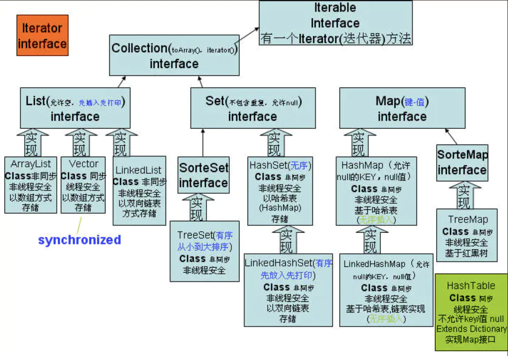
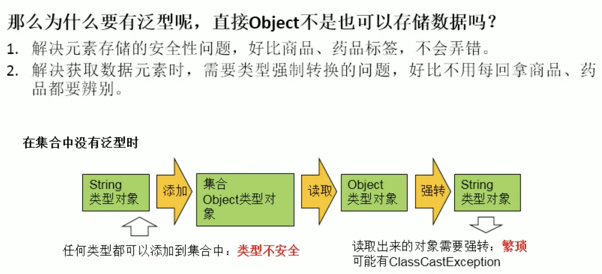

## # java集合概述

> Eclipse command+o --> quick outline

java集合框架

    Collection接口API
    
    Iterator接口API
    
    Collection子接口之一：List接口
        ArrayList
        LinkedList
        Vector
    
    Collection子接口之二：Set接口
        HashSet
        LinkedHashSet
        TreeSet
    
    Map接口
        HashMap
        LinkedHashMap
        TreeMap
        Hashtable
    
    Collection工具類


1. 面向對象語言對事物的體現都是以對象的形式，為了方便對多個對象的操作，就要對對象進行存儲。
2. 使用Array數組存儲對方具有一些弊端，而java集合就像一種容器，可以動態的把多個對象的引用放入容器中。
3. java集合類可以用於數量不等的多個對象，還可以用於保存具有映射關係的關聯數組。

- java集合分為Collection和Map兩種體系
  - Collection接口
    - Set：元素無序、不可重複的集合
    -  List：元素有序，可以重複 -- 動態數組
  - Map接口：具有映射關係"key-value"對的集合

### |> Collection接口繼承樹


Collection

- 方法iterator() 返回對像類型為Iterator ListIterator

- 實現接口子類(若需要線程安全的，可以用Collections同步方法捷解決)

  - List 元素有序（遍歷順序為添加順序），可重複

    - ArrayList 元素在內存中連續存儲，
      - 讀取性能好，
      - 線程不安全
    -  LinkedList 元素在內存中不連續，通過鍊錶維護元素的插入順序
      - 寫刪性能好，
      - 讀取性能不錯，線程不安全
    - Vector 線程安全，使用方法大體與ArrayList相同，效率低，不建議使用

  - Set 元素無序，不可重複

    - HashSet 元素對象的hashCode()值決定改元素存儲的位置，遍歷順序與插入順序不同，

      - 判斷兩個對像是否相同：先通過元素對象的hashCode是否想等、不等不相同，若hashCode值相等，再通過equals比較
      - 線程不安全，

    - LinkedHashSet 使用鍊錶維護元素插入順序，遍歷順序為插入順序。

      - 元素存儲位置、比較兩個元素是否相同的方法同HashSet，
      - 線程不安全

    - SortedSet

      - TreeSet 元素必須為同一個類的，自然排序：有對象的int compareTo(Object o)決定；

        定制排序：創建一個實現了Comparator接口的對象,重寫int compare(Object o1, Object o2)方法，把該對像傳入TreeSet構造器；
        比較兩個元素是否相同的方法同HashSet，
        線程不安全

- 集合API都位於java.util包內

- List、Set元素在添加、修改是都會把類型轉為Object，所以獲取出來的類型也是Object，如果要操作獲取出來的數據，需要進行一次類型強

對象排序接口

- Comparable
- Comparator

### |> Map接口繼承樹


- Map key-value鍵值對，或叫entry，key不能重複，value可以重複

  Set keySet();

  Collection values();

  Set entrySet();

  - HashMap entry順序由key的int hashCode()決定，遍歷順序與插入順序不同，與存儲順序相同，

  - LinkedHaspMap 使用鍊錶維護entry插入順序，遍歷順序為entry插入順序。

  - Hashtable 線程安全，比較老

    - Properties 處理屬性文件

  - SortedMap

    - TreeMap key必須為同一個類的，

      entry存儲順序由Set keySet()決定，同與TreeSet。其實TreeSet可用看成所有value為空的特殊TreeMap

- Map中的key、value在添加、修改是都會把類型轉為Object，所以獲取出來的類型也是Object，如果要操作獲取出來的數據，需要進行一次類型強轉

### |> collection接口

- Collection是List、Set、Queue接口的父類，該接口定義的方法可以操作List、Set、Queue集合
- 該接口不提供任何實現，有具體的子接口實現
- java 5之前，java集合會丟失所有對象的數據類型，把所有對象當成Object類型處理；
  從java 5增加了泛型，java集合可以記住集合中對象的數據類型

#### Collection接口方法

> CollectionTest.java

```java
Collection
向 Collection 接口的實現類的對象中添加 obj 時，要求所在的類要重寫 equals()
+ 存儲對象可以考慮：數組、集合
+ 數組存儲對象特點
    - 一旦創建，其長度不可變
    - 真實的數組存放的對像個數不可知
+ 集合
    - Collection接口
        |--List接口，存儲有序的、可以重複的元素
            |--ArrayList（元素內存中存儲是連續的）、LinkedList（鍊式列表，應用場景：頻繁插入/刪除）、Vector(比較古老、線程安全，比較慢)
        |--Set接口，存儲無序、不可重複的元素
            |--HashSet、LinkedHashSet、TreeSet
    - Map接口，存儲"鍵-值"對數據
        |--HashMap、LinkedHashMap、TreeMap、Hashtable(子類：Properties)
```


```java
int size() 返回集合中元素的個數
boolean add(E e) 向集合中添加一個元素
boolean addAll(Collection coll) 將一個集合所有元素添加到當前集合中
查看所有元素 System.out.println(Collection實例);
boolean isEmpty() 判斷集合是否為空，是返回true，否則false
void clear() 清空合集所有元素
boolean contains(Object obj) 判斷集合中是否包含指定的元素obj，如果包含返回true，否則false。// ---> 判斷方法：用到了類中的equals(Object o)方法。若使用了自定義類要重寫equals()方法

boolean containsAll(Collection coll) 判斷當前集合是否包含coll集合中所有的元素。即判斷一個集合是否為當前集合的子集
boolean retainAll(Collectoin coll) 先求集合coll與當前集合的交集，再清空當前集合所有元素，最後把交集集合添加到當前集合中// ---> 即 當前集合 = 當前集合 ∩ coll集合

boolean remove(Object obj) 刪除集合中的obj元素。若刪除成功返回true,否則返回false
boolean removeAll(Collection coll) 從當前集合中刪除與另外一個集合coll的交集所有元素。即 當前集合 - coll集合的差集。
boolean equals(Object obj) 判斷一個集合obj與當前集合兩者所有的元素是否都相等。
int hashCode() 獲取當前集合的hash值
Object[] toArray() 將集合轉化成數組
Iterator iterator() 返回一個Iterator接口實現類對象，可用於遍歷集合。該方法返回的對像類型為Iterator，有boolean hasNext()、Object next()方法
```


```java
/*
+ contains(Object obj) 判斷集合中是否包含指定的元素obj，如果包含返回true，否則false。
	- 判斷方法：用到了類中的 equals(Object o) 方法。若使用了自定義類要重寫 equals() 方法
	- 如果沒有重寫對象 Object 中的 equals 方法，默認如下：

	    @Override
	    public boolean equals(Object o) {
	    	return super.equals(o);
	    }
	   
	- 繼續查看Object類中的equals方法，源碼如下：
	
	    public boolean equals(Object o) {
	        return this == o;
	    }

	- 使用“==”比較對象的地址，如果是同一對象即地址相同的情況下，才會返回true，
	  而對於對象屬性值相同但地址不同的不同對象，始終返回false！
*/
```

[正確認識Arrays.asList方法](https://codertw.com/%E7%A8%8B%E5%BC%8F%E8%AA%9E%E8%A8%80/11906/)

```java
/*
	List<String> array1 = Arrays.asList("Welcome", "to","Java", "world");
  	array1.add("Cool~~~");
  	---> java.lang.UnsupportedOperationException
  	
	- Arrays的asList方法使用的ArrayList類是一個內部定義的類，而不是java.util.ArrayList類。 
	- 從這個內部類ArrayList的實現可以看出，它繼承了抽象類java.util.AbstractList<E>, 
	  但是沒有重寫 add 和 remove 方法，沒有給出具體的實現。
	- 預設情況下，java.util.AbstractList類在add、set以及remove方法中，
	  直接會丟擲UnsupportedOperationException異常。
	- 正是因為java.util.Arrays類的內部類ArrayList ---> 沒有重寫add和remove方法，
	  所以，當我們呼叫其 add , remove 方法時，其實就是呼叫了AbstractList類的add方法，
	  結果就是直接丟擲UnsupportedOperationException異常。
	  由於Arrays的內部類ArrayList ---> 重寫了set方法，所以 set 正常執行，
	  不會再丟擲UnsupportedOperationException異常。
	  
+ Arrays工具類提供了一個方法asList, 使用該方法可以將一個變長引數或者陣列轉換成List 。
    - 生成的List的長度是固定的；
    - 能夠進行修改操作（比如，修改某個位置的元素）；
    - 不能執行影響長度的操作（如add、remove等操作）。會丟擲UnsupportedOperationException異常。

    Arrays.asList比較適合那些已經有陣列資料或者一些元素，而需要快速構建一個List，只用於讀取操作，而不進行新增或刪除操作的場景。
+ 如果，想要根據已知陣列資料，快速獲取一個可進行增刪改查的列表List，一個比較簡單的方法如下：

    - 重新使用java.util.ArrayList包裝一層。
		
		// 使用變長引數
		List<String> array1 = new ArrayList<>(Arrays.asList("Welcome", "to", "Java", "world"));
		System.out.println(array1);	// [Welcome, to, Java, world]
		array1.add("Cool~~~");
		System.out.println(array1);	// [Welcome, to, Java, world, Cool~~~]	
*/
```


#### 使用Iterator接口遍歷集合元素

> CollectionIterator.java

- Iterator對象稱為迭代器（設計模式的一種），主要用於遍歷Collection集合元素
- 所有實現了Collection接口的集合類都有一個iterator()方法，用以返回一個實現了Iterator接口的對象，該對像有boolean hasNext()，E next()、void remove()方法，E格式泛型
- Iterator僅用於遍歷集合，Iterator本身並沒有提供承裝對象的能力。如果需要創建Iterator對象， 必須有一個別迭代的集合

Iterator接口方法

| 方法              | 方法描述                                         |
| ----------------- | ------------------------------------------------ |
| boolean hasNext() | iteration迭代器中還有元素則返回true,否則false    |
| E next()          | 返回iteration迭代器中的下一個元素                |
| void remove()     | 從集合中移除迭代器返回的最後一個元素（可選操作） |

```java
在調用it.next()方法之前必須要調用it.hasNext()進行檢測。若不調用，且下一條記錄無效，直接調用it.next()會拋出NoSuchElementException異常
```

```java
/*
+ iterator() 返回一個Iterator接口實現類對象，可用於遍歷集合
	- 內部方法：hasNext() next()
 	- 集合對象每次調用 iterator() 方法，都得到一個"全新"的迭代器對象，
 		默認游標都在集合的第一個元素之前
 	- 內部定義 remove() 方法，可以在遍歷的時候，刪除集合中的元素，此方法不同於集合中直接調用 remove()
 	- 如果還未調用 next() 或在上一次調用 next() 方法時候已經調用 remove() 方法，在調用 remove() 都會報 IllegalStateException

 */
```


```java
@Test
public void test1() {
  // remove 集合中 "Atom"
  Iterator it = c1.iterator();
  while (it.hasNext()) {
    // it.remove(); // 報 IllegalStateException
    Object obj = it.next();
    if("Atom".equals(obj)) {
      it.remove();
      // it.remove(); // 報 IllegalStateException
    }
  }
  // 遍歷集合
  Iterator it2 = c1.iterator();
  while (it2.hasNext()) {
    System.out.println(it2.next());
  }
}

@Test
public void test2() {
  // 從集合中移除迭代器返回的最後一個元素（可選操作）
  Iterator it = c1.iterator();
  it.next();
  it.remove();
  System.out.println(c1);
}

@Test
public void test3() {
  // 錯誤的寫法，跳著輸出（只打印偶數位置）報 NoSuchElementException 異常
  System.out.println("===");
  Iterator it = c1.iterator();
  while ((it.next()) != null) { 
    // 直接調.next()方法，取得第1個值：22 ===> 22!=null --> true ===> 進入while{}，再調用.next()方法，打印第2個值：MM
    System.out.println(it.next()); // MM alisha NoSuchElementException
  }

  // 錯誤的寫法，無限循環
  // 集合對象每次調用 iterator() 方法，都得到一個"全新"的迭代器對象，默認游標都在集合的第一個元素之前。
  System.out.println("===");
  while (c1.iterator().hasNext()) { // 每當調用 .iterator()，都得到一個"全新"的迭代器對象
    System.out.println(c1.iterator().next()); 
    // 新的迭代器對象，默認游標都在集合的第一個元素之前，調用 next() ---> 永遠只輸出第一個元素
  }
}
```


for增強版遍歷集合元素--foreach

- java 5提供了foreach迭代訪問集合，同時也可用遍歷數組

  ```java
  @Test
  public void test4() {
    // jdk5.0 新增 foreach 循環，用於遍歷集合、數組
    // 增強for循環，類似 python中的for i in obj:
    // for( 集合中元素的類型 局部變量： 集合對象)
    System.out.println("增強for循環遍歷集合");
    for (Object o : c1) { // debug --> 內部依然調用迭代器
      System.out.println(o);
    }
    System.out.println("---foreach----");
    c1.forEach(System.out::println);
  
  }
  ```

  

##### List接口

- 用數組存儲數據有局限性，數組長度不可變，存放數據個數不確定

- List集合類中元素` 有序、不可重複`，集合中的每個 元素都有一個對應的順序索引
- List容器中的元素都有一個整數的索引記錄在容器中的位置，可根據索引獲取該元素

- JDK API中List接口的實現類常用的有：ArrayList、LinkedList、Vector

```java
在集合Collection類的基礎上添加下面的方法 ---> List接口提供的額外方法
    Object get(int index) // 獲取指定下標元素
    void add(int index, Object ele) // 指定下標插入一個元素
    boolean addAll(int index, Collection eles) // 把一個集合所有元素插入指定下標處
  	boolean addAll(Collection<? extends E> c);
    Object remove(int index) // 移除指定下標的元素
    Object set(int index, Object ele) // 重置指定下標元素值(更新)
    int indexOf(Object obj) // 給定對象首次出現的下標位置，沒有則返回 -1
    int lastIndexOf(Object obj) // 給定對象最後一次出現的下標位置，沒有則返回 -1
    List subList(int fromIndex, int toIndex) // List切片處理，截取[開始下標，結束下標)為新的List，注意是左閉(contain)右開(no contain)，相當於取一個子集
  * List常用方法
    - 增 add(Object obj)
    - 刪 remove(int index)
    - 改 set(int index, Object obj)
    - 查 get(int index)
    - 插 add(int index, Object obj)
    - 長度 size()
  	- 遍歷
  	  1. Iterator
  		2. 增強for循環
  		3. normal for
---------------------------------------------------------
/* 
區分 List 中 Object remove(int index)
			--> List list = new ArrayList();
和 Collection 中 boolean remove(Object obj)
 			--> Collection c1 = new ArrayList();
*/
List list = new ArrayList();
list.add()...
System.out.println(list); //[11, 88, 99, 22.22, 22, 33, 44]
list.remove(0);
System.out.println("remove by index --> "+list);
// if you want to remove by a specific element rather than index
list.remove(new Integer(33));
System.out.println("remove by element --> "+list);

// remove by index --> [88, 99, 22.22, 22, 33, 44]
// remove by element --> [88, 99, 22.22, 22, 44]
```

###### List接口實現類之一：ArrayList

- ArrayList時List接口的典型實現類
- ArrayList本質上是對象引用的一個變長數組，底層是`Object[] elementData`用儲存
- ArrayList是線程不安全的，Vector時線程安全的（不推薦使用，效率低）
- Arrays.asList(Object...) 方法返回的List集合既不是ArrayList實例也不是Vector實例。
- Arrays.asList(Object...) 返回值是一個固定長度的List集合

```java
// JDK1.7 ：單例模式中的餓漢式
List list = new ArrayList(); // 底層創建了長度為 10 的 Object[] 數組 : elementData
list.add(11); // elemantData[0] = new Integer(11);
// 當長度超過 ArrayList() 的數組容量，則擴容（默認擴容後，長度為原來的1.5倍），同時將原有數組中的值複製到新的數組中
// 結論：建議開發中多用帶參構造器，List list = new ArrayList(int initialCapacity)，以避免頻繁動態擴容
```

底層實現原理：

```java
// JDK.13
public class ArrayList<E> extends AbstractList<E>
        implements List<E>, RandomAccess, Cloneable, java.io.Serializable
---------------------------------------------------------
private static final int DEFAULT_CAPACITY = 10;

private static final Object[] DEFAULTCAPACITY_EMPTY_ELEMENTDATA = {};// 不會立即創建 == 不會立即 new Object[]，比較不佔用內存
transient Object[] elementData; 

public ArrayList(int initialCapacity) {
  if (initialCapacity > 0) {
    this.elementData = new Object[initialCapacity];
  } else if (initialCapacity == 0) {
    this.elementData = EMPTY_ELEMENTDATA;
  } else {
    throw new IllegalArgumentException("Illegal Capacity: "+ 
                                       initialCapacity);
  }
}		

/**
* Constructs
*/
public ArrayList(Collection<? extends E> c) {
  elementData = c.toArray();
  if ((size = elementData.length) != 0) {
    if (elementData.getClass() != Object[].class)
      elementData = Arrays.copyOf(elementData, size, Object[].class);
  } else {
    // replace with empty array.
    this.elementData = EMPTY_ELEMENTDATA;
  }
}
------------------------------------------------------
// JDK.13 ---> 延遲數組的創建：單例模式中的懶漢式，節省內存
/**
* Constructs an empty list with an initial capacity of ten.
*/
public ArrayList() {
  this.elementData = DEFAULTCAPACITY_EMPTY_ELEMENTDATA;
}

public boolean add(E e) {
  modCount++;
  add(e, elementData, size);
  return true;
}
|
private void add(E e, Object[] elementData, int s) {
  if (s == elementData.length)
    elementData = grow();
  elementData[s] = e;
  size = s + 1;
}
|
private Object[] grow() {
  return grow(size + 1);
}
|
private Object[] grow(int minCapacity) {
  int oldCapacity = elementData.length;
  // 動態擴容
  if (oldCapacity > 0 || elementData != DEFAULTCAPACITY_EMPTY_ELEMENTDATA) {
    int newCapacity = ArraysSupport.newLength(oldCapacity,
             minCapacity - oldCapacity, /* minimum growth */
             oldCapacity >> 1           /* preferred growth */);
    return elementData = Arrays.copyOf(elementData, newCapacity);
  } else { // 等到實際 add value 時，才 new Object[10]: elementData，並執行 add 方法：elemantData[0] = new Integer(11);
    return elementData = new Object[Math.max(DEFAULT_CAPACITY, minCapacity)];
  }
}
```

###### List實現類之二：LinkedList

- 對於頻繁插入或刪除元素操作的List，建議使用LinkedList，效率高，遍歷時也有不錯的效率 ---> 雙向鏈錶

```java
List list = new LinkedList();
list.add(76); // 將 76 封裝到 Node 中，創建 Node 對象 , Node --> 體現了 LinkedList 的雙向鏈錶說法
```

底層實現原理：

```java
public class LinkedList<E>
    extends AbstractSequentialList<E>
    implements List<E>, Deque<E>, Cloneable, java.io.Serializable{
  //...
  transient Node<E> first; // default = null
	transient Node<E> last; // default = null
  //...
}

private static class Node<E> {
  E item;
  Node<E> next;
  Node<E> prev;

  Node(Node<E> prev, E element, Node<E> next) {
    this.item = element;
    this.next = next;
    this.prev = prev;
  }
}
-------------------------------------------------------------
public void addLast(E e) {
  linkLast(e);
}
|
void linkLast(E e) { // 形成雙向鏈錶結構
  final Node<E> l = last;
  final Node<E> newNode = new Node<>(l, e, null);
  last = newNode;
  if (l == null)
    first = newNode;
  else
    l.next = newNode;
  size++;
  modCount++;
}
```


```java
基於Collectoin接口新的增方法
    boolean add(E e) // 在最後一個位置插入一個元素，成功則返回true,否則返回false
    void add(int index, E element) // 在指定位置插入給定元素
    void addFirst(E e) // 在第一個位置插入一個元素
    void addLast(E e) // 在最後一個位置插入一個元素
    E remove(int index) // 移除指定下標的元素，並返回該元素
    E removeFirst() // 移除第一個元素，並返回該元素
    E removeLast() // 移除最後一個元素，並返回該元素
    E set(int index, E element) // 更新指定位置的元素，並返回該元素(未更新之前的)
    E get(int index) // 獲取下標元素
    E getFirst() // 獲取第一個元素
    E getLast() // 獲取最後一個元素
    Object clone() // 深度克隆當前集合，但集合元素的內部並未克隆，Returns a shallow copy of this {@code LinkedList}. (The elements themselves are not cloned.)
```

###### List實現類之三：Vector

- Vector是一個古老的集合，JDK1.0就有了(List-->JDK1.2)。大多數操作與ArrayList相同，底層是`Object[] elementData`用儲存，
- 區別之處就是Vector是線程線程安全的，但效率低
- 在各種List中，最好把ArrayList作為缺省選擇。當插入、刪除頻繁時，使用LinkedList；Vector比ArrayList慢很多，盡量避免使用
- Vector 有一個子類 Stack

底層實現原理：

```java
public class Vector<E>
    extends AbstractList<E>
    implements List<E>, RandomAccess, Cloneable, java.io.Serializable
{
  	// 底層是 Object[] elementData 用儲存
    protected Object[] elementData;
  	// 立即創建 == 立即 new Object[10]，佔用內存
   	public Vector() {
        this(10);
    }
  	// synchronized ---> 線程線程安全的
    public synchronized boolean add(E e) { 
      modCount++;
      add(e, elementData, elementCount);
      return true;
    }
  	// 當長度超過 Vector() 的數組容量，則擴容（默認擴容後，長度為原來的2倍），同時將原有數組中的值複製到新的數組中
//...
```


```java
基於Collectoin新增方法
    void addElement(Object obj)
    void insertElementAt(Object obj,int index)
    void setElementAt(Object obj,int index)
    void removeElement(Object obj)
    void removeAllElements()
```

###### ListIterator接口

```java
List額外提供了一個listIterato()方法，該方法返回一個ListItera對象，ListIte繼承了Iterator接口，提供專門操作List的方法
    void add()
    boolean hasPrevios()
    Object prevois()
    boolean hasNext()
    Object next()
    int nextIndex()
    int previousIndex()
    void remove()
    void set(E e)
    void add(E e)
```

###### Iterator與ListIterator主要區別

- 都有hasNext()、next()方法，可以實現順序遍歷。
- 但ListIterator有boolean hasPrevios()、Object prevois() 可以實現逆向遍歷。
- ListIterator可以定位當前元素的索引尾椎，方法int nextIndex()、int previousIndex()，Iterator無此功能
- ListIterator有add()方法，可以向List中插入元素，Iterator無此方法
- 都可以刪除元素，當ListIterator可以用 set(Object e) 修改元素對象，因為ListIterator的這些功能，可以實現對LinkedList等List數據結構的操作。

##### Set接口

- Set接口是Collection的子接口，Set接口沒有提供額外的方法
- 存儲的元素是`無序,不可重複的`.
- 無序性:不是隨機性,是指元素在底層存儲的位置是無序,按照一定的方法來確定順序的.
- 不可重複性:不能像Set中添加相同的元素,也添加不進去
- Set判斷兩個對像是否相同，不是使用==運算符，而是根據對象的boolean equals()方法判斷

```java
+ 集合
- Collection接口
    |--Set接口，存儲無序、不可重複的元素,
								常用方法都是Collection接口裡定義的
        |--HashSet: HashSet 是 Set 接口的主要實現類，線程不安全，集合元素可以是null
        		|--LinkedHashSet: LinkedHashSet 是 HashSet 的子類
            		 		對於頻繁遍歷操作，LinkedHashSe t效率高於 HashSet
        |--TreeSet: TreeSet是SortedSet接口的實現類，可以確保集合中元素處於排序狀態
        			向TreeSet集合中添加的元素必須是同一種類型的數據,不包含自動轉換的過來的數據
        			
------------------------------------------------------------
+ Set特點
	- 存儲的元素是無序,不可重複的.
	1. 無序性 : 不等於隨機性。指元素在底層存儲的位置並非按照數組索引的順序添加，而是跟據數據的哈希值.
 			隨機性：是指元素在底層存儲的位置是無序
	2. 不可重複性 : 保證添加的元素按照 equals 判斷時，不能返回 true ---> 相同的元素只能有一個
	
------------------------------------------------------------
+ Set要求(包括HashSet、LinkedHashSet)
	- 當向HashSet添加元素時,首先調用此對象所在類的int hashCode()方法,計算此對象的哈希值,此哈希值決定了此對像在HashSet中的存儲位置.
		- 若此位置還沒有存儲對象,則此對象直接存儲到這個位置.
		- 若這個位置有存儲了對象,那麼在通過調用該對象的boolean equals()方法比較這兩個對像是否相同,如果equals()返回false則添加後面這個元素到HashSet中,否則不添加
    
  -1. 添加到Set中的元素所在類,一定要重寫equals()、hashCode()方法
	-2. hashCode()方法與equals()方法返回值方向要求一致.即返回表示相同或是不相同
  	- 重寫小技巧：對象中用作 equals() 比較方法的 Field ，都應用來計算 hashCode 值。
    
+ Set要求(TreeSet）
     - 自然排序: calss implements Comparable: compareTo(Object o)
		 - 定制排序:	new Comparator: compare(Object o1, Object o2)
```


###### Set實現類之一：HashSet

- HashSet時Set接口的主要實現類，大多數時候都是使用這種

- 使用Hash算法來存儲集合中的元素，具有較好的存取、查找性能

- 存儲順序、遍歷順序與元素插入順序不同

- 線程不安全

- 集合元素可以是null

- 當向 HashSet 集合中存入一個元素時，HashSet 會調用該對象的 hashCode() 方法來得到該對象的 hashCode 值，然後根據 hashCode 值決定該對像在 

- HashSet 中的存儲位置
  HashSet 集合判斷兩個元素相等的標準：兩個對象通過int hashCode()方法比較相等，並且兩個對象的boolean equals() 方法返回值也相等

- 當向Set添加Ａ元素時，首先調用Ａ元素對象所在類的hashCode()方法，計算此Ａ元素的哈希值，此哈希值接著通過某種算法，計算出在HashSet底層數組中的存放位置（即為：數組索引位置），判斷數組此位置上市否以有元素：

  - 若此位置還沒有存儲其他元素對象，則此對象Ａ元素直接存儲到這個位置 ----> 情況1

  - 若這個位置有存儲了其他對象元素Ｂ（或是以鏈錶形式存在的多個元素），則比較元素Ａ與元素Ｂ 的 hash值：

    - 如果hash值不相同，則元素Ａ添加成功（以鏈錶型式）----> 情況2

    - 如果hash值不相同，進而需要調用Ａ元素對象的equals()方法比較這兩個對像是否相同，

      - equals() 返回 true 則Ａ元素添加失敗

      - equals() 返回 false 則Ａ元素添加成功 ---> 情況3

        對於添加成功的情況2、情況3：與已經存在索引位置數據，以鍊錶的方式儲存

        JDK 7：元素Ａ（新添加的元素）放到數組中，指向原來元素（數組外鏈錶）

        JDK 8：原來的元素在數組中，指向元素Ａ（新添加的元素）（數組外鏈錶）

        七上(新元素放到array) 八下 (新元素放到linkedList)


底層實現原理：

```java
public class HashSet<E>
    extends AbstractSet<E>
    implements Set<E>, Cloneable, java.io.Serializable
{
  	private transient HashMap<E,Object> map;
  
    public HashSet() {
        map = new HashMap<>();
    }
  // ...
  	public boolean add(E e) {
        return map.put(e, PRESENT)==null;
    }
  // Dummy value to associate with an Object in the backing Map
    private static final Object PRESENT = new Object(); // static 全局唯一共享對象
  // ...
}
```

Example : 

```java
public class SetTest {
	@Test
	public void test() {
		System.out.println("**********************");
		HashSet set = new HashSet();
		Dog dog1 = new Dog("AA", 1001);
		Dog dog2 = new Dog("BB", 1002);
		
		set.add(dog1); // hashCode ....
		set.add(dog2); // hashCode ....
		System.out.println(set); 
    // [Dog{ name='AA', age=1001}, Dog{ name='BB', age=1002}]
		
		dog1.setName("CC");
		set.remove(dog1); // hashCode ....
		System.out.println(set); 
    // [Dog{ name='CC', age=1001}, Dog{ name='BB', age=1002}]
    
		set.add(new Dog("CC", 1001)); // hashCode ....
		System.out.println(set); 
    // [Dog{ name='CC', age=1001}, Dog{ name='CC', age=1001}, Dog{ name='BB', age=1002}]
		set.add(new Dog("AA", 1001)); // hashCode ....
									  							// equals .... 
		System.out.println(set); 
    // [Dog{ name='CC', age=1001}, Dog{ name='CC', age=1001}, Dog{ name='AA', age=1001}, Dog{ name='BB', age=1002}]
								 
		System.out.println("*********************");
	}
}

class Dog {
    private String name;
    private int age;
    static private int init = 100;
    // ...
    @Override
    public boolean equals(Object o) {
    	System.out.println("equals ....");
        if (this == o) return true;
        if (o == null || getClass() != o.getClass()) 
          return false;
        Dog dog = (Dog) o;
        if (age != dog.age) 
          return false;
        return name != null ? name.equals(dog.name) : dog.name == null;
    }

    @Override
    public int hashCode() {
    	System.out.println("hashCode ....");
        int result = name != null ? name.hashCode() : 0;
        result = 31 * result + age;
        return result;
//        return ++init;
//        return 3;
    }
}
```


###### hashCode()方法

- 如果兩個元素的 equals() 方法返回 true，但它們的 hashCode() 返回值不相等，hashSet 將會把它們存儲在不同的位置，但依然可以添加成功。
- 對於存放在Set容器中的對象，對應的類一定要重寫equals()和hashCode(Object obj)方法，以實現對象相等規則
- 重寫 hashCode() 方法的基本原則
  - 在程序運行時，同一個對像多次調用 hashCode() 方法應該返回相同的值
  - 當兩個對象的 equals() 方法比較返回 true 時，這兩個對象的 hashCode() 方法的返回值也應相等
  - 對象中用作 equals() 方法比較的 Field，都應該用來計算 hashCode 值


###### Set實現類之二：LinkedHashSet


適用場景：頻繁的遍歷，較少的插入、刪除

- LinkedHashSet 是 HashSet 的子類
- LinkedHashSet 根據元素的 hashCode 值來決定元素的存儲位置，但它同時使用鍊錶維護元素的次序，這使得元素看起來是以插入順序保存的 --->` 對於頻繁遍歷操作，LinkedHashSe t效率高於 HashSet`
- LinkedHashSet插入性能略低於 HashSet，但在迭代訪問 Set 裡的全部元素時有很好的性能
- LinkedHashSet 不允許集合元素重複
- addAll(Set obj) 在當前集合最後添加obj集合中的元素,添加順序按照obj集合的順序

###### Set實現類之三：TreeSet


- TreeSet是SortedSet接口的實現類，TreeSet可以確保集合中元素處於排序狀態
- 向TreeSet集合中`添加的元素必須是同一種類型的數據,不包含自動轉換的過來的數據` ，相同類才能比較---> ClassCastException異常,cannot be cast to class java.lang.Comparable

```java
/*
- 自然排序
TreeSet是用類 implements Comparable<Object> 重寫的方法compareTo(Object o) 來比較兩個添加元素是否相同
相同 ---> compareTo return 0
*/
public class Person implements Comparable<Object> {
    private String name;
    private int age;
// ... 
    @Override
  
  	// name大到小, age小到大排序
    public int compareTo(Object o) {
        if (o instanceof Person) {
            Person p = (Person) o;
//          return this.name.compareTo(p.name); // 只要 name 相同就視為相同，不考慮 age ，小到大排序
	          int compare = -this.name.compareTo(p.name); // 只要 name 相同就視為相同，不考慮 age ，大到小排序
            if (compare != 0) {
                return compare;
            }else{
              	return Intrger.compare(this.age, p.age);
            }
        }else{
          	throw new RuntimeException("the input type don't match") // 1.報錯
            // return 0; // 2. return 0 代表數據添加相同數據，TreeSet不能放相同數據＝新數據添加失敗
        }
    }
}
-------------------------------------
Person{  name='BB', age=10 }
Person{  name='MM', age=10 }
Person{  name='GG', age=12 }
Person{  name='CC', age=18 }
```


```java
/*
 TreeSet定制排序
*/

// set1:創建一個實現了Comparator接口的對象,重寫int compare(Object o1, Object o2)方法
Comparator comparator = new Comparator() {
  @Override
  public int compare(Object o1, Object o2) {
    if (o1 instanceof Person && o2 instanceof Person) {
      Person p1 = (Person) o1;
      Person p2 = (Person) o2;
      return Integer.compare(p1.getAge(), p2.getAge());
    }else {
      throw new RuntimeException("輸入的數據類型不匹配");// 1.報錯
      // return 0; // 2. return 0 代表數據添加相同數據，TreeSet不能放相同數據＝新數據添加失敗
    }

  }
};
System.out.println("========================");
// set2:把set1中創建的comparator對像以形參傳入TreeSet構造器
TreeSet tset4 = new TreeSet(comparator);
tset4.add(new Person("GG", 12)); // 當Person未實現Comparable接口,報:java.lang.ClassCastException: class com.java.www.Person cannot be cast to class java.lang.Comparable
tset4.add(new Person("CC", 18));
tset4.add(new Person("BB", 10));
tset4.add(new Person("MM", 10));

Iterator ite = tset4.iterator();
while (ite.hasNext()) {
  System.out.println(ite.next());
}
-------------------------------------
Person{  name='BB', age=10 }
Person{  name='GG', age=12 }
Person{  name='CC', age=18 }
```


常用方法

```java
// 常用方法
  Comparator comparator() 返回對象的comparator方法
  Object first() 獲取第一個元素
  Object last() 獲取最後一個元素
  Object lower(Object e) 返回此 set 中嚴格小於給定元素的最大元素；如果不存在這樣的元素，則返回null。
  Object higher(Object e) 返回此 set 中嚴格大於給定元素的最小元素；如果不存在這樣的元素，則返回null
  SortedSet subSet(fromElement, toElement) 返回此 set 的部分視圖，其元素從fromElement（包括）到toElement（不包括），範圍：[fromElement, toElement)
                                                                                                SortedSet headSet(toElement) 返回此 set 的部分視圖，其元素嚴格小於toElement
                                                                                                SortedSet tailSet(fromElement) 返回此 set 的部分視圖，其元素大於等於fromElement
// + TreeSet 兩種排序方法：自然排序和定制排序。默認情況下，TreeSet 採用自然排序
                                                                                                
//  	- 自然排序(使用compareTo方法進行比較是否相同)
/*
- 自然排序
TreeSet是用類 implements Comparable<Object> 重寫的方法compareTo(Object o) 來比較兩個添加元素是否相同
相同 ---> compareTo() return 0
*/                                                                                          
                                                                                                
    如果試圖把一個對象添加到使用自然排序的 TreeSet 時，則該對象的類必須實現 Comparable 接口，
    String、int、float、long等已經重寫int compareTo(Object o)方法,這些類型數據組成的TreeSet默認從小到大排序
    自定義的來要實現java.lang.Comparable接口並重寫int compareTo(Object o)方法,compareTo()方法返回值為0時,表示這兩個對象相同在此方法中,指定該類按照哪些屬性排序.
    向TreeSet集合中添加元素時,首先調用對象的int compareTo(Object o)方法進行比較,若返回值為0,則認為這兩個對像是相同的. 這通情況下該元素就添加不進來
    對於 TreeSet 集合而言，它判斷兩個對像是否相等的唯一標準是：兩個對象通過 compareTo(Object obj) 方法比較返回值
    int compareTo(Object o)、int hashCode()、boolean equals()三個方法取值方向要求同時一致,
                                                                                                
//		- 定制排序(使用與不能更改類的場景)
/*
- 自然排序
TreeSet是用重寫的方法 compare(Object o1, Object o2) 來比較兩個添加元素是否相同
相同 ---> compare() return 0
*/                                                                                                 
                                                                                                
    set1:創建一個實現了Comparator接口的對象,重寫int compare(Object o1, Object o2)方法
    利用int compare(T o1,T o2)方法，比較o1和o2的大小：如果方法返回正整數，則表示o1大於o2；如果返回0，表示相等；返回負整數，表示o1小於o2。
    int compare(Object o1, Object o2)、int hashCode()、boolean equals()三個方法取值方向要求同時一致
    set2:把set1中創建的comparator實例以形參傳入TreeSet構造器
    此時，仍然只能向TreeSet中添加類型相同的對象。否則發生ClassCastException異常
    使用定制排序是不需要實現自定義類的Comparable接口,如果有實現,則定制排序優先
    使用定制排序判斷兩個元素相等的標準是：通過Comparator比較兩個元素返回了0
```
#### review 

```java
自定義類需要重寫的方法＝所添加的元素，其所屬類必需要重寫的方法：
Collection : equals()		--> contains()/remove()/retainsAll()需要
List : equals()
Set : 1. (HashSet, LinkedHashSet): equals(), hashCode()
			2. (TreeSet): 
					- 自然排序 : calss implements Comparable: compareTo(Object o)
					- 定制排序 : new Comparator: compare(Object o1, Object o2)
            
List interface method:
  * List常用方法
    - 增 add(Object obj)
    - 刪 remove(int index)  移除指定下標的元素  /// Collection boolean remove(Object obj) 刪除集合中的obj元素。若刪除成功返回true,否則返回false
    - 改 set(int index, Object obj)
    - 查 get(int index)
    - 插 add(int index, Object obj)
    - 長度 size() 返回集合中元素的個數
  	- 遍歷
  	  1. Iterator
  		2. 增強for循環
  		3. normal for
---------------------------------------------------------
Arrays ---> Collection :
// 數組 ---> 集合：調用Arrays類靜態方法 asList(T...t)
List<String> list = Arrays.asList(new String[] {"dd", "yy", "uu"});
// List<String> list = Arrays.asList({"dd", "yy", "uu"}); work as well
System.out.println(list); // [dd, yy, uu]
// becarefull
// int為基本類型，asList參數接受對象 ---> 直接將所有元素視為一的個對象，不用個別裝箱
List<int[]> list2 = Arrays.asList(new int[] {123,456,789});
System.out.println(list2); // [[I@1ffe63b9]
System.out.println(list2.size()); // 1

// Integer為對象，個別元素皆為對象
List list4 = Arrays.asList(new Integer[] {123,456,789});
System.out.println(list4); // [123, 456, 789]
System.out.println(list4.size()); // 3
List list3 = Arrays.asList(123,567);
System.out.println(list3); // [123, 567]

Collection --> Arrays :
Object[] arr = list4.toArray();
for(int i=0; i<arr.length; i++) {
  System.out.println(arr[i]);
}
// 123
// 456
// 789
```


### |> Map接口

- Map與Collection並列存在。用於保存具有映射關係的數據:Key-Value，稱為entry
- Map 中的 key 和 value 都可以是任何引用類型的數據
- Map 中的 key 用Set來存放，不允許重複，即同一個 Map 對象所對應的類，須重寫hashCode()和equals()方法
- 常用String類作為Map的"鍵"
- key 和 value 之間存在單向一對一關係，即通過指定的 key 總能找到唯一的、確定的 value

```java
Collection接口
Map接口 雙列數據 y=f(x) ---> x不可重複、無序， y 可重複、無序
    |-- HashMap: Map接口的主要實現類，存儲順序由key的hash值決定
      						線程不安全的，效率高，允許使用null鍵和null值
        |-- LinkedHashMap: 保證遍歷 Map 元素時，可以按照添加順序實現遍歷，原因：在原有的 HashMap 底層結構基礎上，添加一對指針，指向前一個和後一個元素。對於頻繁的遍歷操作，效率比 HashMap 高
          
    |-- TreeMap: 保證按照添加進Map中元素的key指定屬性進行排序。所有元素key的對象必須是同一個類，key對象為自定義類對象時要求實現Comparable接口並重寫int compareTo(Object obj)方法
      	底層使用紅黑樹
      
    |-- Hashtable：古老的實現類，線程安全的，效率低，不建議使用
      					不允許使用null鍵和null值 --> NullPointerException
        |-- Properties: 常用來處理屬性文件。健和值都為String類型

		HashMap的底層: 數組 + 鍊錶 (JDK7 before)
          				數組 + 鍊錶 + 紅黑樹 (JDK8)
          
Map:
    - Map 中的 key：無序、不可重複的，使用Set存儲 ---> key 所在的類要重寫 equals() 和 hashCode() --> 以 HashMap 為例
    - Map 中的 value：無序、可以重複，使用Collection存儲 ---> value 所在的類要重寫 equals()
    - 一個鍵值對： Key-Value構成一個 entry 對象
    - Map 中的 entry：無序、不可重複的，使用Set存儲
      
		- put()添加元素到map時，如果前面已經存在一個相同的key，那麼新的key對應的value將覆蓋舊的value

Map常用方法

添加、刪除操作方法
      
Object put(Object key, Object value) 添加、或更新一個元素到HashMap中
Object remove(Object key) 刪除指定key的元素
void putAll(Map t) 把Map t中所有元素添加到當前Map中
void clear() 清除當前map中所有元素
				hmap1.clear();
        System.out.println(hmap1.size()); // 0
        System.out.println(hmap1); // {}

元素查詢操作方法

Object get(Object key) 獲取指定key的元素，若key不存在則返回null
boolean containsKey(Object key) 當前map所有的key中是否包含指定key，是返回true,否則false
boolean containsValue(Object value) 當前map所有的value中是否包含指定的value，是返回true,否則false
int size() 返回map元素個數
boolean isEmpty() 當前map是否為空，是返回true,否則false
boolean equals(Object obj) 當前map與指定的obj map是否相等，即所有entry相等

元視圖操作方法

Set keySet() 獲取當前map所有的key，值為Set
Collection values() 獲取當前map所有的value，值為Collection
Set entrySet() 獲取當前map所有的entry，值為Set
```


```java
public void clear() {
  Node<K,V>[] tab;
  modCount++;
  if ((tab = table) != null && size > 0) {
    size = 0;
    for (int i = 0; i < tab.length; ++i)
      tab[i] = null;
  }
}
public boolean isEmpty() {
  return size == 0;
}
```

`Iterator 只提供 Collection 使用，不包括 Map` ---> 遍歷 Map，先利用 

1. `.keySet()`（取得 Set）
2. `.values()`（取得Collection）
3. `.entrySet();`（取得 Set）

再利用 `.iterator();`或 for 循環增強 遍歷

```java
// Set keySet() 獲取當前map所有的key，值為Set
Set kset1 = hmap1.keySet();
System.out.println(kset1);
// [null, 33, Person{  name='小張', age=23 }, k1, k2, true]

// Collection values() 獲取當前map所有的value，值為Collection，順序與keySet()對應
Collection vs = hmap1.values();
System.out.println(vs);
// [null, 33, 阿里山人, 11, 22, 3.14]

// Set entrySet() 獲取當前map所有的entry，值為Set
Set entrys = hmap1.entrySet();
System.out.println(entrys);
// [null=null, 33=33, Person{  name='小張', age=23 }=阿里山人, k1=11, k2=22, true=3.14]

// 遍歷key --> .keySet();
Set kset2 = hmap1.keySet();
for (Object k : kset2) {
  System.out.println(k);
}
System.out.println();

// 遍歷values --> .values();
Collection vs2 = hmap1.values();
Iterator ite = vs2.iterator();
while (ite.hasNext()) { // 也可以用增強for循環（foreach）
  System.out.println(ite.next());
}
System.out.println();

// 遍歷 key-value，即遍歷entrys

// 方式一:通過key遍歷entrys
Set kset3 = hmap1.keySet();
for (Object key: kset3) {
  System.out.println(key + "-->" + hmap1.get(key));
}
System.out.println();

// 方式二：通過 entrySet()遍歷 --> .entrySet();
Set entryset2 = hmap1.entrySet();
for (Object o : entryset2) {
  // entrySet 集合中的元素都是 entry
  Map.Entry entry = (Map.Entry) o;
  System.out.println(entry.getKey() +" --> "+ entry.getValue());
}

Iterator it = entryset2.iterator();
while (it.hasNext()) {
  // Object object = it.next();
  // Map.Entry entry = (Map.Entry) object;
  Map.Entry entry = (Map.Entry) it.next(); // entry 直接打印為 key=value
  System.out.println(entry.getKey() + " : " + entry.getValue());
}
--------------------------------
Map.Entry
interface Entry<K, V> {
        K getKey();
        V getValue();
        V setValue(V value);
  // ...
}
```


#### Map接口實現類之一：HashMap

HashMap特點

- entry順序存儲順序與key的hash值有關，與put添加的順序無關
- HashMap是 Map 接口使用頻率最高的實現類
- 允許使用null鍵和null值，與HashSet一樣，不保證映射的順序
- HashMap 判斷兩個 key 相等的標準是：兩個 key 通過 equals() 方法返回 true，hashCode 值也相等
- HashMap 判斷兩個 value相等的標準是：兩個 value 通過 equals() 方法返回 true

```java
Map創建對象時指定初始值

// 其他類型的Map類也類似

HashMap hmap = new HashMap() {
    { // 匿名內部類
        put("type", "支出");
        put("price", price);
        put("item", item);
    }
};

// 注意： 慎用， 非靜態內部類/ 匿名內部類包含了外圍實例的引用， 如果擁有比外部類更長的生命週期，有內存洩露隱患
```

HashMap底層實現原理：

```java
// JDK7
+ HashMap底層實現原理：
  - HashMap map = new HashMap();
		實例化後，底層創建了長度為16的一維數組 Entry[] table
    ...可能經過多次 put...
  - map.put(key1, value1);
		首先，調用 key1 所在類的 hashCode()方法，計算此 key1 的哈希值，此哈希值接著通過某種算法，得到在 Entry[] 數組中的存放位置。
  		- 若此位置上的數據為空，此時 key1-value1 添加成功 -- case 1
      - 若此位置上的數據不為空，（意味著此位置已經存在一個或多個數據（以鍊錶形式存在）），比較 key1 和此位置已經存在一個或多個數據的哈希值
					- 如果 key1 的 hash值與已經存在的數據的 hash值不相同，則 key1-value1 添加成功 -- case 2
  				- 如果 key1 的 hash 值與已經存在的數據（key2-value2）的 hash值相同，進而需要調用 key1 對象的 equals() 方法比較
								- equals() 返回 false , 此時 key1-value1 添加成功
								- equals() 返回 true 則使用 value2(new value) 替換 value1(old) 值 -- case 3
    
case 2 and case 3 --> 此時 key1-value1 和原來數據以鍊錶的方式儲存
擴容：當超出 threshold （且要存放的位置非空），默認擴容為原來數組的2倍，並重新計算哈希值，複製到擴容後的新數組。
      
// JDK8
diffrnrnce:
1. new HashMap(); 實例化時，底層沒有創建了長度為16的數組
2. 底層數組是：Node[], not Entry[]
3. 首次調用 put() 方法，底層創建長度為16的數組
4. HashMap的底層: 數組 + 鍊錶 (JDK7 before)
          			 數組 + 鍊錶 + 紅黑樹 (JDK8)
   當數組的某一個索引位置上的元素以鍊錶形式存在的個數 > 8 且當前數組長度 > 64 時，此時索引位置上的所有數據改為使用紅黑樹儲存
5. 七上(新元素放到array) 八下 (新元素放到linkedList)
```

```java
// JDK 13
transient Node<K,V>[] table;

public HashMap() {
  this.loadFactor = DEFAULT_LOAD_FACTOR; 
}

public V put(K key, V value) {
  return putVal(hash(key), key, value, false, true);
}
|
final V putVal(int hash, K key, V value, boolean onlyIfAbsent,
                 boolean evict) {
  Node<K,V>[] tab; Node<K,V> p; int n, i;
  if ((tab = table) == null || (n = tab.length) == 0)
    n = (tab = resize()).length; // 首次添加---> resize()
  if ((p = tab[i = (n - 1) & hash]) == null)
    // 若此位置上的數據為空，此時 key1-value1 添加成功 -- case 1
    tab[i] = newNode(hash, key, value, null);
  else {
    Node<K,V> e; K k;
    // 若此位置上的數據不為空，（意味著此位置已經存在一個或多個數據（以鍊錶形式存在）），比較 key1 和此位置已經存在一個或多個數據的哈希值
    if (p.hash == hash &&
        ((k = p.key) == key || (key != null && key.equals(k))))
      e = p; 
    else if (p instanceof TreeNode)
      e = ((TreeNode<K,V>)p).putTreeVal(this, tab, hash, key, value);
    else {
      for (int binCount = 0; ; ++binCount) {
        if ((e = p.next) == null) { // 遍歷到鍊錶的最末，沒下一個可以比較，且前面都不相同
          p.next = newNode(hash, key, value, null); // 將新加入的數據放到鍊錶的最末
          if (binCount >= TREEIFY_THRESHOLD - 1) // 當數組的某一個索引位置上的元素以鍊錶形式存在的個數 > 8 
            treeifyBin(tab, hash);  // 此時索引位置上的所有數據改為使用紅黑樹儲存
          break;
        }
        if (e.hash == hash &&
            ((k = e.key) == key || (key != null && key.equals(k)))) // 遍歷到鍊錶時，遇到相同 hash, key 
          break; // break ---> if (e != null) 用 value2 替換 value1 值
        p = e;
      }
    }
    // equals() 返回 true 則使用 value2 替換 value1 值 -- case 3
    if (e != null) { // existing mapping for key
      V oldValue = e.value;
      if (!onlyIfAbsent || oldValue == null)
        e.value = value;
      afterNodeAccess(e);
      return oldValue;
    }
  }
  ++modCount;
  if (++size > threshold)
    resize();
  afterNodeInsertion(evict);
  return null;
}
|
final Node<K,V>[] resize() {
  Node<K,V>[] oldTab = table;
  int oldCap = (oldTab == null) ? 0 : oldTab.length;
  int oldThr = threshold;
  int newCap, newThr = 0;
  if (oldCap > 0) {
    if (oldCap >= MAXIMUM_CAPACITY) {
      threshold = Integer.MAX_VALUE;
      return oldTab;
    }
    else if ((newCap = oldCap << 1) < MAXIMUM_CAPACITY &&
             oldCap >= DEFAULT_INITIAL_CAPACITY)
      newThr = oldThr << 1; // double threshold
  }
  else if (oldThr > 0) // initial capacity was placed in threshold
    newCap = oldThr;
  else {               // zero initial threshold signifies using defaults
    newCap = DEFAULT_INITIAL_CAPACITY;	// 16
    newThr = (int)(DEFAULT_LOAD_FACTOR * DEFAULT_INITIAL_CAPACITY);	// 16*0.75 = 12
  }
  if (newThr == 0) {
    float ft = (float)newCap * loadFactor;
    newThr = (newCap < MAXIMUM_CAPACITY && ft < (float)MAXIMUM_CAPACITY ?
              (int)ft : Integer.MAX_VALUE);
  }
  threshold = newThr;
  @SuppressWarnings({"rawtypes","unchecked"})
  Node<K,V>[] newTab = (Node<K,V>[])new Node[newCap];// 實例化長度為16的數組
  table = newTab;
  if (oldTab != null) {
    // ...
  }
  return newTab;
}
|
final void treeifyBin(Node<K,V>[] tab, int hash) {
  int n, index; Node<K,V> e;
  // 當數組的某一個索引位置上的元素以鍊錶形式存在的個數 > 8 (putVal())且當前數組長度 > 64 (treeifyBin)時，此時索引位置上的所有數據改為使用紅黑樹儲存
  if (tab == null || (n = tab.length) < MIN_TREEIFY_CAPACITY)
    resize();
  else if ((e = tab[index = (n - 1) & hash]) != null) {
    TreeNode<K,V> hd = null, tl = null;
    do {
      TreeNode<K,V> p = replacementTreeNode(e, null);
      if (tl == null)
        hd = p;
      else {
        p.prev = tl;
        tl.next = p;
      }
      tl = p;
    } while ((e = e.next) != null);
    if ((tab[index] = hd) != null)
      hd.treeify(tab);
  }
}

static final int hash(Object key) {
  int h;
  return (key == null) ? 0 : (h = key.hashCode()) ^ (h >>> 16);
}
-------------------------------------------------------------
static class Node<K,V> implements Map.Entry<K,V> {
        final int hash;
        final K key;
        V value;
        Node<K,V> next;
  // ...
}
```


Map特點

- Map的key、value都可以為null
- key、entry使用Set存儲，不可重複，value使用Collection存儲，可以重複
  put()添加元素到map時，如果前面已經存在一個相同的key，那麼新的key對應的value將覆蓋舊的value
- Map接口的常用實現類：HashMap、LinkedHashMap、TreeMap、Properties


##### Map接口實現類之二：LinkedHashMap

- LinkedHashMap 是 HashMap 的子類
- 與LinkedHashSet類似，`LinkedHashMap 可以維護 Map 的迭代順序（使用鍊錶）：迭代順序與 Key-Value 對的插入順序一致`

LinkedHashMap底層實現原理：

```java
public LinkedHashMap() {
  super(); //  相同：HashMap 的 method : put() ,putVal()
  accessOrder = false;
}
// 不同：重寫 Node<K,V> 
Node<K,V> newNode(int hash, K key, V value, Node<K,V> e) {
  LinkedHashMap.Entry<K,V> p =
    new LinkedHashMap.Entry<>(hash, key, value, e);
  linkNodeLast(p);
  return p;
}
|
static class Entry<K,V> extends HashMap.Node<K,V> {
  // 保證遍歷 Map 元素時，可以按照添加順序實現遍歷，
  // 原因：在原有的 HashMap 底層結構基礎上，添加一對指針，指向前一個和後一個元素。對於頻繁的遍歷操作，效率比 HashMap 高
  Entry<K,V> before, after;  
  Entry(int hash, K key, V value, Node<K,V> next) {
    super(hash, key, value, next);
  }
}
```

比較：LinkedHashMap,  HashMap 內部類

```java
static class Node<K,V> implements Map.Entry<K,V> {
        final int hash;
        final K key;
        V value;
        Node<K,V> next;
  // ...
}
```


#### Map接口實現類之三：TreeMap

- TreeMap存儲 Key-Value 對時，需要根據 key-value 對進行排序。 TreeMap 可以保證所有的 Key-Value 對處於有序狀態

- TreeMap 的 Key 的排序:自然排序、定制排序-->` 都是按 key 進行排序`

  - 自然排序：

    TreeMap 的所有的 Key 必須實現 Comparable 接口並重寫int compareTo(Object obj)方法，而且所有的 Key 應該是同一個類的對象，否則將會拋出 ClasssCastException

  - 定制排序：

    創建 TreeMap 時，傳入一個 Comparator 對象，要求重寫Comparator接口中的int compare(Object o1, Object o2)，該對象負責對 TreeMap 中的所有 key 進行排序。此時不需要 Map 的 Key 實現 Comparable 接口

- 使用自定義類作為TreeMap的key，所屬類需要重寫equals()和hashCode()方法，且equals()方法返回true時，compareTo()方法應返回0

- 若使用自定義類作為TreeMap的key，所屬類需要重寫equals()和hashCode()方法，且equals()方法返回true時，compareTo()方法應返回0

```java
/*
TreeMap
* 按照添加進Map中元素的key指定屬性進行排序。所有元素key的對象必須是同一個類，key對象為自定義類對象時要求實現Comparable接口並重寫int compareTo(Object obj)方法
    * 自然排序，用對像中的int compareTo(Object obj)方法進行比較排序
    * 定制排序，TreeMap中傳入Comparator接口實現實例，要求重寫Comparator接口中的int compare(Object o1, Object o2)
* */
```


#### Map接口實現類之四：Hashtable

- Hashtable是個古老的 Map 實現類，線程安全。
- 與HashMap不同，Hashtable 不允許使用 null 作為 key 和 value
- 與HashMap一樣，Hashtable 也不能保證其中 Key-Value 對的順序
- Hashtable判斷兩個key相等、兩個value相等的標準，與hashMap一致

##### Map接口實現類之五：Properties

- Properties 類是 Hashtable 的子類，該對像用於處理屬性文件
- 由於屬性文件裡的 key、value 都是字符串類型，所以 Properties 裡的 key 和 value 都是字符串類型
- 存取數據時，建議使用setProperty(String key,String value)方法和getProperty(String key)方法


### |> 操作集合的工具類：Collections

- `Collections時一個操作List、Set、Map等集合的工具類`

  操作數組的工具類：Arrays

- Collections 中提供了一系列靜態的方法對集合元素進行排序、查詢和修改等操作，還提供了對集合對象設置不可變、對集合對象實現同步控制等方法

- Collections常用方法（均為static方法）

```java
## 排序操作

reverse(List l) 反轉List l中元素的順序
shuffle(List l) 對List l集合元素進行隨機排序
sort(List l) 根據元素的自然順序對指定List l集合元素按升序排序
sort(List l, Comparator c) 根據指定的Comparator c生產的順序對List l集合元素進行排序
swap(List l, int i, int j) 將指定List l集合中i與j處的元素進行交換

## 查找、替換

Object max(Collection c) 根據元素的自然順序，返回給定集合中位置最大的元素
Object max(Collection c, Comparator com) 根據Comparator com指定的順序，返回給定集合中位置最大的元素
Object min(Collection) 根據元素的自然順序返，回給定集合中位置最小的元素
Object min(Collection c, Comparator com) 根據Comparator com指定的順序，返回給定集合中位置最小的元素
int frequency(Collection c, Object o) 返回指定命令中指定元素出現的次數
void copy(List dest, List src) 將List src中的元素複製到 List dest中，dest的長度必須>= src的長度
boolean replaceAll(List l, Object oldVal, Object newVal) 使用新值newVal替換List l中所舊值oldVal

## 同步控制，可以解決多線程並發訪問集合時的線程安全問題
// ArrayList 和 HashMap 都是線程不安全的，如果程序要求線程安全，可以將 ArrayList 和 HashMap 轉為線程安全的，利用 synchronizedList(List list) 和 synchronizedMap(Map map)
static<T> Collection<> synchronizedCollection(Collection<T> c)
static<T> List<> synchronizedList(List<T> l)
static<T> Map<K,V> synchronizedMap(Map<K,V> m)
static<T> Set<T> synchronizedSet(Set<T> s)
static<T> SortedMap<K,V> synchronizedSortedMap(SortedMap<K,V> m)
static<T> SortedSet<T> synchronizedSortedSet(SortedSet<T> s)
```

`Collections.copy(List dest, List src)`

```java
System.out.println(lis1); // [33, 22, 44, 22, 11, 55]
// void copy(List dest, List src) 將List src中的元素複製到 List dest中
List dest = Arrays.asList(new Object[lis1.size()]);
// List lis3 = new ArrayList(); // 錯誤寫法：複製到此List中時 --> IndexOutOfBoundsException ---> because srcSize > dest.size()

System.out.println(dest.size());  // = lis1.size() = 6
Collections.copy(dest, lis1); 
// [null, null, null, null, null, null]
System.out.println("dest: " + dest);
// lis3: [33, 22, 44, 22, 11, 55]


// synchronizedXxx() 方法，線程安全
 Map hmap1 = Collections.synchronizedMap(new HashMap());
-------------------------------------------------------------
public static <T> void copy(List<? super T> dest, List<? extends T> src) {
  int srcSize = src.size();
  if (srcSize > dest.size())
    throw new IndexOutOfBoundsException("Source does not fit in dest");

  if (srcSize < COPY_THRESHOLD ||
      (src instanceof RandomAccess && dest instanceof RandomAccess)) {
    for (int i=0; i<srcSize; i++)
      dest.set(i, src.get(i));
  } else {
    ListIterator<? super T> di=dest.listIterator();
    ListIterator<? extends T> si=src.listIterator();
    for (int i=0; i<srcSize; i++) {
      di.next();
      di.set(si.next());
    }
  }
}
```


#### 其他

Enumeration迭代器是Iterator迭代器的古老版本

> canner異常處理


> List中元素為對象，通過對像中的指定屬性進行排序


> List、Set、Map在創建對象時指定初始值

```java
/*
* List、Set、Map在創建對象時指定初始值
* 格式: new List/Set/Map實現類() {{}};
 * 外面的這個 {} 為匿名類，裡面的{}為靜態代碼塊。
 * 這種方式只有jdk >= 9 才支持
 *
* 注意： 慎用， 非靜態內部類/ 匿名內部類包含了外圍實例的引用， 如果擁有比外部類更長的生命週期，有內存洩露隱患。
* 另外這種方式生成的對像沒有被序列化，正常方式是已經序列化的
* */
    @Test
    public void test1() {
		List<String> list = new ArrayList<>() { // 創建一個繼承於ArrayList 匿名子類對象
            // 靜態代碼塊，在加載類的時候就執行
            {
                add("我的樓蘭--雲朵"); // this.add("我的樓蘭--雲朵");
                add("你還是從前的你嗎--天籟天");
                add("我是你的格桑花--欣寶兒");
            }
        };
        System.out.println(list);
    }

    @Test
    public void test2() {
        Set<Integer> set1 = new LinkedHashSet<>() {{
            add(3);
            add(1);
            add(4);
        }};
        System.out.println(set1);
    }

    @Test
    public void test3() {
        Map<String, Boolean> map1 = new TreeMap<>() {{
            put("apple", true);
            put("juice", false);
            put("tasty", true);
        }};
        System.out.println(map1);
    }
```


> List與Set互轉

因為List和Set都實現了Collection接口，且`addAll(Collection<? extends E> c);`方法，因此可以採用`addAll()`方法將List和Set互相轉換；

另外，List和Set也提供了`Collection<? extends E> c`作為參數的構造函數，
因此通常採用構造函數的形式完成互相轉化。

```java
//List轉Set
Set<String> set = new HashSet<>(list);

//Set轉List
List<String> list1 = new ArrayList<>(set);
```

> Array與Set互轉

```java
//array轉set
String[] s = new String[]{"A", "B", "C", "D","E"};
Set<String> set = new HashSet<>(Arrays.asList(s));
System.out.println("set: " + set);

//set轉array
String[] sArr = set.toArray();
```

上述列出的互相轉換離不開`Arrays.asList()`和`Collection.toArray()`兩個重要的方法

## # 泛型

### |> 泛型概述

- 概念：泛型將接口的概念進一步延伸，"泛型"字面意思就是廣泛的類型，類、接口和方法代碼可以應用於非常廣泛的類型，

- 代碼與它們能夠操作的數據類型不再綁定在一起，同一套代碼，可以用於多種數據類型，

- 這樣，不僅可以復用代碼，降低耦合，同時，還可以提高代碼的可讀性和安全性。

- 泛型作用

  - 把集合中元素、類、接口的內容限制為指定的數據類型，但未使用之前(實例化之前)又不能確定是哪種數據類型，在實例化時指定數據類型
  - 解決元素存儲的安全性問題
  - 解決獲取數據元素時，需要類型強轉的繁瑣問題

  

### |> 泛型的使用

- 泛型的聲明
- 符號：<>
- 格式：<類型列表>, 如, <String, Integer>，可以寫多個數據類型

```java
interface List<T> 和class TestGen<K, V>	其中，T、K、V不代表值，而是表示類型。
// 這裡使用任意字母都可以，通常大寫。常用T表示，T是Type的縮寫
```

- 泛型的實例化

```java
一定要在類名後面指定類型參數的值(類型)
如：
List<String> strList = new ArrayList<>();
Iterator<Customer> iterator = customer.iterator();

T只能是類，不能用基本數據類型填充
  如果實例化時，沒有指定泛型的類型，默認類型為 java.lang.Object 類型
```

泛型的幾個重要使用地方

    - 在集合中使用泛型
    - 自定義泛型類
    - 泛型方法
    - 泛型接口

### |> 泛型類規則

```java
- 泛型類對象實例化時不指定泛型，默認類型為 Object
  
- 泛型不同的引用不能相互賦值
  ArrayList<Object> list = null;
  ArrayList<String> list2 = new ArrayList<>();
	list = list2; // 編譯時報錯
//although 在編譯時 ArrayList<Object> 和 ArrayList<String> 是兩種類型，但是運行時只有一個 ArrayList 被加載到 JVM 中

- 加入集合中的對像類型必須與指定的泛型類型一致
  public class Customer<T> {
    private long id;
    private String name;
    private T t;
    private List<T> list = new ArrayList<>();
    public List<T> getList() {
          return list;
      }

      public void add(T t) {
          list.add(t);
      }
    //...
  }
- 靜態方法中不能使用類的泛型，因為靜態方法在類加載時就確定了
  
- catch的異常類型不能為泛型
  
- 構造器中不能使用泛型（實例化時會加，因此構造器不用寫泛型）
	/*
    構造器不能使用泛型，錯誤寫法
    public Customer<T>(long id, String name) {
        this.id = id;
        this.name = name;
    }
    */

    public Customer(long id, String name) {
        this.id = id;
        this.name = name;
    }

- 泛型如果不指定，將被擦除，泛型對應類均按照 Object 處理，但不等價於 Object ，泛型要使用就醫路都要用，不用就一路都不用
  
- 不能使用 new T[] ，但可以 (T[]) new Object[capacity]強轉
  參考：ArrayList 源碼，Object[] elementData，而非泛型餐數類型數組
  // ...
  T orderT;
	public Order(){
    // T[] arr = new T[10]; // 編譯時報錯
    T[] arr = (T[]) new Object[10];
      
  }

class Father<T1, T2>{}
	// 子類不保留父類泛型
    // 1) 沒有類型：擦除
    class Son1 extends Father{} 
    // == class Son1 extends Father<Object, Object>{}
    // 2) 具體類型
    class Son2 extends Father<Integer, String>{} 
  
  // 子類保留父類泛型
    // 1) 全部保留
    class Son3<T1, T2> extends Father<T1, T2>{} 
    // 2) 部分保留
    class Son3<T2> extends Father<Integer, T2>{} 
---------------------------------------------------------
	// 子類不保留父類泛型
    // 1) 沒有類型：擦除
    class Son1<A, B> extends Father{} 
    // == class Son1 extends Father<Object, Object>{}
    // 2) 具體類型
    class Son2<A, B> extends Father<Integer, String>{} 
  
  // 子類保留父類泛型
    // 1) 全部保留
    class Son3<T1, T2, A, B> extends Father<T1, T2>{} 
    // 2) 部分保留
    class Son3<T2, A, B> extends Father<Integer, T2>{} 
```


#### 泛型接口

- 與泛型類相似

```java
// 示例
public interface USB<T> {
    public abstract void start(T t);
    void stop(T t);
}
```


#### 泛型方法

- 普通類(非泛型類)、泛型類中都可以定義泛型方法。
- `可以是靜態方法，因為類型調用時才決定，和類初始化無關`。
- 在泛型方法中定義泛型參數，參數的類型就是傳入數據的類型，和類的泛型參數無關

```java
泛型方法格式：

[訪問權限] <泛型> 返回類型 方法名([泛型標識] 參數名稱) [throws 異常類型類表] {

}
示例
public class Order<T> {
  	// ...
    public <E> List<E> copyFromArrayTolist(E[] arr){
        ArrayList<E> list = new ArrayList<>();
      	for(E e : arr){
          	list.add(e);
        }
      return list;
    }
}
@Test
public void test(){
  Order<String> order = new Order<>();
  Integer[] arr = new Integer[]{1, 2, 3, 4, 5};
  // 泛型方法在調用時，指名泛型參數的類型
  List<Integer> list = order.copyFromArrayTolist(arr);
  system.out.println(list);
}
```


```java
public class DAO<T> { // 表的共性操作 DAO
    private List<T> list = new ArrayList<>();
    // 構造器
    public DAO() {
        super();
    }
    // 方法，CRUD

    public void add(T t) {
        list.add(t);
    }
    public T get(int index) {
        return list.get(index);
    }
    public List<T> getList() {
        return list;
    }
    public void update(int index, T t) {
        list.set(index, t);
    }
    public void delete(int index) {
        list.remove(index);
    }
  	// 泛型方法
  	// 例如：獲取表中一共多少紀錄，修改時間 : E = Integer /Date
  	public <E> E getValue() {
    		return null;
    }
}
---------------------------------------------------------
public class Student {
    private long id = 0;
    private String name;
    private String email;
    private MyDate birthday;
    private URI photo;
    private static long count = 1;
  //...
}
---------------------------------------------------------
public class StudentDAO extends DAO<Student>{ // 只能操作某一個表的 DAO
}
---------------------------------------------------------
  @Test
  public void test6() {
  /*
    DAO模擬測試
   * */
  DAO<Student> dao = new StudentDAO<>();
  Student s1 = new Student("Mary", "mary@gmail.com", new MyDate(1999, 2, 1));
  Student s2 = new Student("Rucy", "rucy@gmail.com", new MyDate(2008, 10, 1));
  Student s3 = new Student("Nacy", "nacy@gmail.com", new MyDate(2002, 12, 25));
  Student s4 = new Student("Farrency", "farrency@gmail.com", new MyDate(2014, 11, 3));
  dao.add(s1);
  dao.add(s2);
  dao.add(s3);
  dao.add(s4);

  List<Student> list = dao.getList();
  System.out.println(list);

  Student ss = list.get(2);
  System.out.println(ss);
}
```


#### 泛型與繼承的關係

```
							List
           /				\
 List<Object>				List<String>
```


```java
* 若B是A的一個子類型（子類或者子接口），而G是具有泛型聲明的類或接口，G<B>並不是G<A>的子類型！(兩者是併列關係)
  那麼List<B>不是List<A>的子類，List<A>與List<B>類型不一樣
	List<Object> list = null;
  List<String> list2 = new ArrayList<>();
	list = list2; // 編譯時報錯

* 類Ａ是Ｂ的父類: A<G> 是 B<G> 的父類
	List<String> list = null;
  ArrayList<String> list2 = new ArrayList<>();
  list = list2; // ok


* 子類不為泛型類：繼承時指定父類泛型中的類型，例如class SubCustomer class SubCustomer extends Customer<Integer> { // 這裡SubCustomer就不為泛型了，已經指定確定的類型
}
SubCustomer subc = new SubCustomer()

  
* 子類仍為泛型類：繼承時子類使用泛型，例如class SubCustomer2<T> public class SubCustomer2<T> extends Customer<T> { // SubCustomer2仍為泛型
}
// 泛型繼承關係 測試
SubCustomer2<String> subc1 = new SubCustomer2<>();
```


#### 泛型通配符

- 作用：兼容多種泛型類型

```java
* 類型通配符符號：<?>
  如List<?>, Map<?, ?>

* List<A>、List<B> ... ... 共同父類： List<?>  

* 讀取 List<?> 對象list中的元素時，永遠是安全的，因為不管list的元素真實類型是什麼，list包含都是Object

* 寫入、修改list中的元素時，不行，因為我們不知道list的元素類型，唯一例外的是null，null是所有類的成員

* <? extends A>
  只能存放A及其子類，元素可以增查改刪

* <? super A>
  只能存放A及其父類

* <? extends Comparable> 只允許泛型為實現Comparable接口的實現類的引用調用

* 不能向聲明為通配符的集合中添加、修改元素(當元素為null除外)，但可以獲取、刪除元素
```

```java
// 通配符
List<?> list = null;
List<Object> list1= new ArrayList<>();
List<String> list2 = new ArrayList<>();
list = list1;
list = list2;

Iterator<?> ite = list7.iterator();
while (ite.hasNext()) {
  Object obj = ite.next(); // 獲取的值類型為Object
  System.out.println(obj);
}
```

