## # File類

```java
* java.io.File類，文件和目錄路徑的抽象表示形式，與平台無關

* File能新建、刪除、重命名文件和目錄，但不能訪問文件內容。操作文件內容需要使用IO流

File對象可以作為參數給 new 流對象時的構造器參數

File類常見的構造器
    public File(String pathname)
		File file1 = new File("readme.txt");// 只有一層的文件名，getParent()獲取的父路徑為null，獲取getPath也只能獲取到當前的文件名
    以pathname為路徑創建File對象，可以是絕對路徑或者相對路徑，如果pathname是相對路徑，則默認的當前路徑在系統屬性user.dir中存儲

    public File(String parent, String child)

    以parent為父路徑，child為子路徑創建的File對象

File類的靜態屬性 String separator 存儲了當前系統的路徑分隔符。

    在UNIX中，此字段為‘/’，在Windows中，為‘\’，windows的路徑分隔符也可以寫成'/'
    File file2 = new File("E:\dev\java_2019\day15\testLab\lab1");
    File file3 = new File("E:/dev/java_2019//day15/testLab/lab1/qq.exe");
```

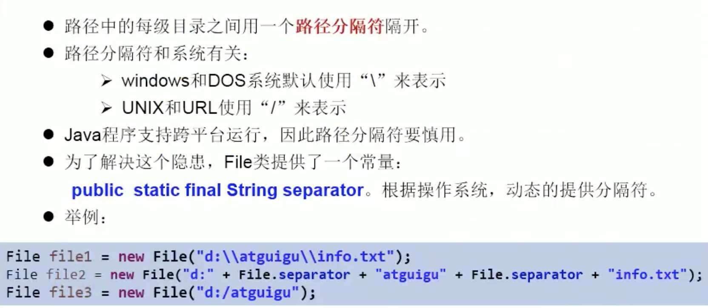

### File類方法

訪問文件名

```java
String getName() 獲取文件名
String getPath() 獲取路徑
String getAbsoluteFile() 獲取文件絕對路徑
String getAbsolutePath() 獲取目錄絕對路徑
String getParent() 獲取父路徑(上層文件路徑，若無返回null)
  File file1 = new File("hello.txt"); 
	// create lala.txt under same 目錄 of hello.txt
  File destFile = new File(file1.getParent(), "lala.txt");
	boolean newFile = destFile.createNewFile();
	if(newFile){
    	System.out.println("successfully create new file");
  }
    
boolean renameTo(File newFile) 重命名文件或目錄，當目標文件名、目錄名存在時，則重名失敗
  File file1 = new File("hello.txt"); //relative pth
	File file2 = new File("newfilename or path+name");
  file1.renameTo(file2);
 // 想保證返回 true ，需要 file1 在磁碟中存在，且 file2 不能在磁碟中存在
```

文件檢測

```java
boolean isFile() 是否為文件
boolean isDirectory() 是否為目錄
boolean exists() 是否存在
boolean canWrite() 是否能寫
boolean canRead() 是否可讀
boolean canExecute() 是否可執行
```

獲取常規文件信息

```java
long lastModified() 返回文件、目錄修改時間戳,獲取最後一次修改時間，毫秒
long length() 字節長度，The length, in bytes, of the file denoted by this abstract pathname  獲取文件長度（即：字節數），不能獲取目錄長度
```

文件相關操作

```java
boolean createNewFile() 創建新文件，父目錄不存在時，報IOException異常；若文件存在，創建失敗
boolean mkdir()
boolean delete() 刪除文件或空目錄，非空目錄刪除失敗
```

目錄相關操作

```java
boolean mkDir() 創建目錄，父目錄不存在時創建失敗
boolean mkDirs() 創建多層目錄，若父目錄不存在時，父目錄一同創建
String[] list() 列出指定路徑下的文件和目錄，只顯示當前層的，返回String數組
  File file1 = new File("hello.txt");
	String list = file.list();
	for(String s : list){
     System.out.println(s);
  }

File[] listFiles() 列出指定路徑下的文件和目錄，只顯示當前層的，返回File數組
  File[] files = file.listFiles();
	for(File f : files){
     System.out.println(f);
  }
```

設置屬性

```java
boolean setReadOnly()
boolean setLastModified()
boolean setWritable()
boolean setExecutable()
```


```java
// 列出file目錄下級內容，僅列出一級的話，使用 File 類 String[] list() 比較簡單
public static void printSubFile(File dir){
  File[] subfiles = dir.listFiles();
  for(File f : subfiles){ // directory
    if(f.isDirectory()){
    	printSubFile(f);
    }else{ // file
      System.out.println(f.getAbsolutePath());
    }
  }
}
// 列出file目錄下級內容，如果還有下級，街哲列出
public static void printSubFiles(File file){
  if(file.isFile()){
    System.out.println(file);
  }else{
    File[] all = file.listFiles();
    for(File f : all){
      // all[i] is file --> print
      // all[i] is dir ---> printSubFiles
      printSubFiles(f);
    }
  }
}
```


## # JAVA IO原理

- IO流用來處理設備之間的數據傳輸
- java程序中，對於數據的輸入/輸出操作以流(stream)的方式進行
- java.io包下提供了各種流類和接口，用以獲取不同各類的數據，並通過標準的方法輸入和輸出數據
- 輸入(Input): 從外部讀取數據(硬盤、U盤，網絡存儲的數據)到程序(內存)
  輸出(Output): 將程序數據輸出到硬盤、U盤、網絡、屏幕等

### |> 流的分類

    按操作數據單位分類：
        字節流bytes stream (8 bit)
        字符流character stream (16 bit)
    
    按數據流的方向分類
        輸入流
        輸出流
    
    按流的角色分類
        節點流
        處理流(節點流外在包一層)


### |> 流的抽象基類

| 流方向 |    字節流    | 字符流 |
| :----: | :----------: | :----: |
| 輸入流 | InputStream  | Reader |
| 輸出流 | OutputStream | Writer |

### |>I O流體系

| 分类              |                       字節輸入流(byte)                       |                       字節輸出流(byte)                       |                       字符輸入流(char)                       |                       字符輸出流(char)                       |
| :---------------- | :----------------------------------------------------------: | :----------------------------------------------------------: | :----------------------------------------------------------: | :----------------------------------------------------------: |
| 抽象基類_         |                         InputStream                          |                         OutputStream                         |                            Reader                            |                            Writer                            |
| 訪問文件(節點流)_ |  FileInputStream  int read()是阻塞的 `read(byte[] buffer)`   | FileOutputStream `write(byte[] buffer, 0, len)`) / `flush()` |                FileReader `read(char[] cbuf)`                |           FileWriter `write(char[] cbuf, 0, len)`            |
| 訪問數组_         |                     ByteArrayInputStream                     |                    ByteArrayOutputStream                     |                       CharArrayReader                        |                       CharArrayWriter                        |
| 訪問管道_         |                       PipedInputStream                       |                      PipedOutputStream                       |                         PipedReader                          |                         PipedWriter                          |
| 訪問字符串_       |                                                              |                                                              |                         StringReader                         |                         StringWriter                         |
| 缓冲流_           | BufferedInputStream  int read()非阻塞的 `read(byte[] buffer)` | BufferedOutputStream  flush() 每次寫入後執行一次，保證最後的緩衝內容也被寫入`write(byte[] buffer, 0, len)`) / `flush()` | BufferedReader  String readLine() 讀取的內容不包括行尾的換行符`read(char[] cbuf)` / `readLine()` | BufferedWriter   flush() 每次寫入後執行一次，保證最後的緩衝內容也被寫入`write(char[] cbuf, 0, len)` / `flush()` |
| 轉换流_           |                                                              |                                                              |                      InputStreamReader                       |                      OutputStreamWriter                      |
| 對象流_           |                      ObjectInputStream                       |                      ObjectOutputStream                      |                                                              |                                                              |
| 打印流(輸出)_     |                                                              |                         PrintStream                          |                                                              |                         PrintWriter                          |
| 推回輸入流_       |                     PushbackInputStream                      |                                                              |                        PushbackReader                        |                                                              |
| 數據流(特殊流)_   |                       DataInputStream                        |                       DataOutputStream                       |                                                              |                                                              |


### |> 節點流

```java
/*
FileInputStream, FileOutputStream
## 英文字符一個字節，中文字符兩個字節，UTF-8編碼的字符有1-3個字節，第一個字節會標識長度

## IO流的分類
按操作數據單位分類：字節流bytes stream(8 bit)、字符流character stream(16 bit)
按數據流的方向分類：輸入流、輸出流
按流的角色分類：節點流、處理流

## IO的類體系
流方向 			抽象基類 			節點流(文件流)實現類 				緩衝流(處理流的一種，可以提升效率) 			其他
字節流.輸入 		InputStream 	FileInputStream(read()是阻塞的) 	BufferedInputStream (read()非阻塞的)
字節流.輸出 		OutputStream 	FileOutputStream 				BufferedOutputStream 					Buffered.OutputStream.flush() 每次寫入後執行一次，保證最後的緩衝內容也被寫入
字符流.輸入 		Reader 			FileReader 						BufferedReader 							BufferedReader.readLine() 讀取的內容不包括行尾的換行符
字符流.輸出 		Writer 			FileWriter 						BufferedWriter 							BufferedWriter.flush() 每次寫入後執行一次，保證最後的緩衝內容也被寫入

FileInputStream 從硬盤讀取文件到程序(內存)
FileInputStream.read() 是阻塞的， int read(byte[] b)
BufferedInputStream.read() 非阻塞的

FileOutputStream：void write(byte[], int startIndex, int endIndex);
FileReader: int read(char[] c)
FileWriter: void write(char[], int startIndex, int endIndex)
* */


// 中文一個字 ＝ 3 byte，用字節流存取的話可能會有亂碼問題。 
// ---> 搬運過程查看(InputStreamReader 查看文檔)才會有亂碼問題 ---> 如果只是複製文件是可以的用字節流(僅把流當搬運工，不在乎過程，結果是一樣的)，但查看文檔(=搬運過程查看)就要用字符流
// 大容器char 放進 小容器byte ---> 分斷放
  
例如：
hello世界

若用 byte[] b = new byte[3];存取，
byte[]	hel
byte[]	lo(世的第1個byte) 
byte[]	(世的第2,3個byte)+(界的第1個byte)
byte[]	(界的第2,3個byte)

  
  
1. 字符流:read(char[] cbuf) 文本數據 = 文本文件(.txt, .java, .c, .cpp) ---> 字符流：char 處理，但只是複製文件是可以的用字節流(僅把流當搬運工，不在乎過程，結果是一樣的)
2. 字節流:read(byte[] buffer) 非文本數據 = 二進位文件(.jpg, .mp3, .mp4, .avi, .doc, .ppt...) ---> 字節流：byte 處理。非文本數據就一定不能字節流，就算只是當文件複製時的搬運工，複製的結果檔案和原來的檔案是不同的
```

[判斷是否讀取到文件結尾問題](https://blog.csdn.net/xiaotaiyangzuishuai/article/details/88320545)

>在c語言中，判斷文件結尾有兩種方法，第一種是使用feof()函數,feof（fp）用於測試fp所指向的文件的當前狀態是否為“文件結束”。如果是，函數則返回的是非0值(真)，否則為0(假)，要注意的是，feof()是先讀文件在判斷是不是到達文件結束，所以當使用feof()作為循環判斷條件的話，就需要注意一種情況，就是當文件為空的時候，它也會讀取一次文件內容然後再跳出循環，所以有可能會讀取到一些不可知的內容出來。
>
>EOF是文本文件結束的標誌。在文本文件中，數據是以字符的ASCⅡ代碼值的形式存放，ASCII代碼值的範圍是0～255，EOF的16進制代碼為0xFF(十進制為-1)，因此可以用EOF作為文件結束標誌。但是如果文件格式為二進製文件，就不適合用EOF來判斷文件到達結尾了，因為有可能文件中也存在一個數據為0xFF，這樣當讀取到這個數據是，就無法判斷是到達文件結尾,還是讀取到的是文件的內容了。
>
>- 注意，feof()與EOF不同：feof()是函數，用來檢測文件的結束；
>- EOF是End Of File 的縮寫，是C語言中標準庫中定義的宏，定義為：#define EOF (-1 )。
>
>二進製文件和文本文件的區別：
>
>C語言支持的是流式文件，它把文件看作由一個一個的字符（字節）數據組成的序列。根據數據的組織和操作形式，可以分為ASCII文件和二進製文件。
>
>- ASCII文件又稱為文本文件，它是在一個字節的存儲單元上存放一個字符（在外存中存放的是該字符的ASCII碼，每個字符將佔一個字節）。
>- 二進製文件是把內存中的數據按其在內存中的存儲格式在磁盤上原樣保存。對字符而言，由於其外存存儲格式和內存表示格式相同，所以，在外存上也存放每個字符的ASCII碼。

#### # 字符流：char[] ---> 只適用文本數據(.txt, .java, .c, .cpp)

##### FileReader --> for char

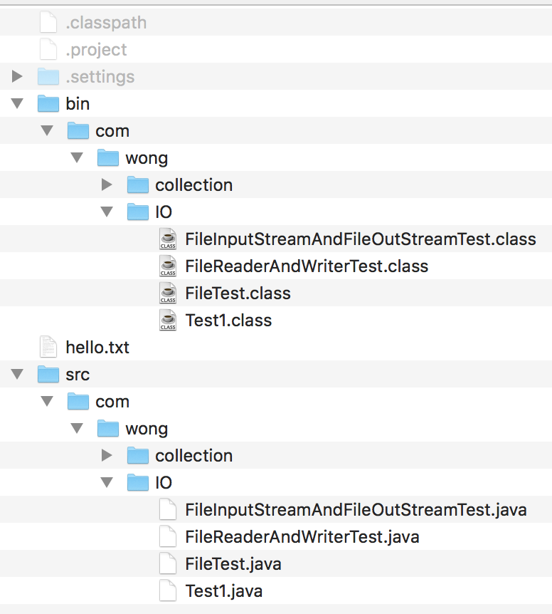

```java
+ JVM 垃圾回收機制，至回收 JVM 堆內存裡的對象空間，
+ 對於物理連接，比如數據庫連接、輸入輸出留、Socket連接無能為力，必須手動關閉
+ 異常處理：為了保證資源一定可以執行關閉，使用 try-catch-finally 較佳，可以保證拋出異常時，finally帶罵快仍會執行。
  
@Test
public void test1() {
  /*
        FileInputStream 從文件一次一個字節的讀取
        FileInputStream.read()，讀取一個字節，返回值為字節個數，到文件末尾時返回-1
        不能讀取含中文的文本，可能會有亂碼，轉為字節數與字符數不好匹配,可以讀取英文字符及非文本的文件
        * */

  // 1. 實例化一個File類對象＝要操作的文件
  File file1 = new File("hello.txt");

  FileReader fr = null;
  try {
    // 2.創建一個FileInputStream類的對象＝提供具體的流
    fr = new FileReader(file1);
    /*
    // 3. 數據的讀入
    // read() 返回讀入的一個字節，如果達到文件末尾，return -1
    int b = fis.read();
    while (b != -1) {
        System.out.print((char) b);
        b = fis.read();
    }
     */
    
    // 上面代碼片段可簡寫如下
    // 3. 調用FileInputStream對象read()方法，該方法調用一次返回一個字節(對應一個int值)，當讀取文件結尾時，返回-1
    for (int b; (b = fr.read()) != -1; ) {
      System.out.print((char) b);
    }


  } catch (IOException e) {
    e.printStackTrace();
  } finally {
    if (fr != null) { // in case that， fis 還沒實例化，就拋出異常 = fis not exit = null
      try {
        // 4. 關閉輸入流
        fr.close();
      } catch (IOException e) {
        e.printStackTrace();
      }
    }
  }
}
```


```java
// 錯誤寫法
		char[] cbuff = new char[7];
		int len;
		// 返回每次讀入 cbuff 數組中的字符個數，如果達到文件末尾，返回 -1
		while((len = fr.read(cbuff)) != -1) {
			for(int i=0; i<cbuff.length; i++) {
        // 每次都打印 cbuff 數組長度 ： 錯誤寫法
				System.out.println(cbuff[i]);
			}
		}

hello.txt:
Testing success
012345601234560
------------------------------ console ---------------------
Testing successsucces
012345601234560
  
char[7] 1 = Testing
						0123456
char[7] 2 =  succes
						0123456
char[7] 3 = ssucces
						0123456
// 將每次讀入字符放入同一個 char[] array ，新值將舊值覆蓋，到文件末只有一個字符未輸出，因此只有 char[0] 被更改為新值，其餘皆為舊值
---------------------------------------------------------------
 // 正確寫法 : 每次打印讀入長度
  while((len = fr.read(cbuff)) != -1) {
    for(int i=0; i< len; i++) {
      System.out.println(cbuff[i]);
    }
  }

  while((len = fr.read(cbuff)) != -1) { 
    String str = new String(cbuff, 0, len);
    System.out.println(str);
  }
---------------------------------------------------------------
hello.txt
Testing
 succes
s
```

##### FileWriter ---> for char

```java
@Test
	public void test2() {
		// 1. 創建一個File對象，指定要寫入的文件路徑 ---> 指名寫出道的文件
		File file2 = new File("hello.txt");
		
		FileWriter fw = null;
		try {
			
			// 2. 創建一個 FileWriter 的對象，將File的對像作為形參傳給 FileWriter 創建對象構造器中 
			// ---> 用於數據寫出
			// second parameter --> append to the file or 覆蓋 file
			// FileWriter(file2) / FileWriter(file2,flase) --> 文檢存在：覆蓋
			// FileWriter(file2,true) ---> 追加至文件尾
			fw = new FileWriter(file2,true);
			
			// 寫入操作 : 文檢存在：覆蓋，文件不存在：創建 ---> new FileWriter(file2,false);
			fw.write("I have a dream");
		} catch (IOException e) {
			e.printStackTrace();
		} finally {
			// 關閉輸出流
			if(fw != null)
				try {
					fw.close();
				} catch (IOException e) {
					e.printStackTrace();
				}
		}	
	}
```

##### FileReader+FileWriter=複製文本文件

```java
public void copyFile(String src, String dest) {
  /*
        使用字符流形式 複製文本文件，只適用於復製文本文件
        * */
  File f1 = new File(src);
  File f2 = new File(dest);

  FileReader fr = null;
  FileWriter fw = null;
  try {
    fr = new FileReader(f1);
    fw = new FileWriter(f2);

    char[] c = new char[32];
    int len; // 記錄每次讀入到 c 數組的字符個數
    while ((len = fr.read(c)) != -1) {
      fw.write(c, 0, len); // 每次寫出 len 個字符
    }
  } catch (IOException e) {
    e.printStackTrace();
  } finally {
    try {
      // 不區分先後
      if(fw != null)
      	fw.close();
    } catch (IOException e) {
      e.printStackTrace();
    }
    try {
      // 不區分先後
      if(fr != null)
    	  fr.close();
    } catch (IOException e) {
      e.printStackTrace();
    }
  }
}

@Test
public void test3() {
  String s1 = "hello.txt";
  String s2 = "hello2.txt";

  copyFile(s1, s2);
}
```

#### # 字節流：byte[] --> 非文本數據(.jpg, .mp3, .mp4, .avi, .doc, .ppt...)

```java
public boolean copyFile(String src, String dest) {
  /*
        複製文件，所有類型的文件
        src: 源文件路徑
        dest: 目標文件路徑
        * */
  File f1 = new File(src);
  File f2 = new File(dest);

  FileInputStream fis = null;
  FileOutputStream fos = null;

  try {
    fis = new FileInputStream(f1);
    fos = new FileOutputStream(f2);
    byte[] b = new byte[24];
    int len;
    while ((len = fis.read(b)) != -1) {
      fos.write(b, 0, len);
    }
  } catch (IOException e) {
    e.printStackTrace();
  } finally {
    if (fos != null) {
      try {
        fis.close();
      } catch (IOException e) {
        e.printStackTrace();
      }
    }
    if (fis != null) {
      try {
        fos.close();
      } catch (IOException e) {
        e.printStackTrace();
      }
    }
  }
  boolean bool = false;
  if (f1.length() == f2.length()) {
    bool = true;
  }
  return bool;
}

@Test
public void test5() {
  String s1 = "image.png";
  String s2 = "image2.png";
  boolean b = copyFile(s1, s2);
  System.out.println(b);
}
```

### |>  節點流和處理流

```java
節點流可以從一個特定的數據源讀寫數據
    一般是一次一個字節或字符地操作
    FileInputStream
    FileOutputStream
    FileReader
    FileWriter
處理流是"連接"在已經存在的流(節點流或處理流)之上，通過對數據的處理為程序提供更強大的讀寫功能，對流的繼續封裝處理
    一般是一次多個字節或字符地操作
    BufferedInputStream
    BufferedOutputStream
    BufferedReader
    BuffereWriter
```


####  節點流

#####  inputStream、Reader

```java
InputStream、Reader是所有輸入流的基類
InputStream 方法(典型實現類：FileInputStream)
    int read()
    int read(byte[] b)
    int read(byte[] b, int off, int len)
    void close()
Reader 方法(典型實現類：FileReader)
    int read()
    int read(char[])
    int read(char[] c, int off, int len)
    void close()
打開的IO流需要顯式的關閉，IO資源不屬於內存時的資源。 JVM不會自動關閉
```

##### OutputStream、Writer

```java
OutputStream、Writer是所有輸出類的基類
OutputStream 方法(典型實現類：FileOutputStream)
    void write(int b)
    void writer(byte[] b)
    void write(byte[] b, int off, int len)
    void flush()
    void close() 需要先刷新，再關閉流對象
Writer 方法(典型實現類：FileWriter)
    void write(int c)
    void writer(char[] cbuf)
    void write(char[] cbuf, int off, int len)
    void write(String str) // 因為字符流以字符為單位在操作，String就是char[]數組
    void write(String str, int off, int len)
    void flush()
    void close()
```

####  處理流之一：緩衝流

```java
為了提高數據讀寫的速度，JavaAPI提供了帶緩衝功能的流類，在使用這些流類時，會創建一個內部緩衝區數組
根據數據操作單位可以把緩衝流分類
    字節緩衝流
        BufferedInputStream
        BufferedOutputStream
    字符緩衝流
        BufferedReader
        BufferedWriter
緩衝流要"套接"在相應有節點流上，對讀寫的數據提供了緩衝的功能，提高了讀寫的效率，同時增加了一些新的方法
對於輸出的緩衝流，寫出的數據會先在內存中緩存，使用flush()會使內存中的數據立刻寫出
```


```java
public
class BufferedInputStream extends FilterInputStream {
	// 
    private static int DEFAULT_BUFFER_SIZE = 8192; // 內部提供了緩衝區
    public BufferedInputStream(InputStream in) { // constructor
        this(in, DEFAULT_BUFFER_SIZE);
    }
```

BufferedReader  And  BufferedWriter  Test

```java
public class BufferedReaderAndBufferedWriterTest {
    public void copyFile(String src, String dest) {
        /*
        利用BufferedReader、BufferedWriter實現文件複製
        * */
        // 1. 創建File對象
        File f1 = new File(src);
        File f2 = new File(dest);

        BufferedReader br = null;
        BufferedWriter bw = null;

        try {
            // 2. 創建字符流對象
            FileReader fr = new FileReader(f1);
            FileWriter fw = new FileWriter(f2);

            // 3.創建緩衝字符流對象
            br = new BufferedReader(fr);
            bw = new BufferedWriter(fw);

            // 4. 讀取、寫入操作
            // 第一種讀取方式，一次讀取多個字符
// char[] c = new char[1024];
// int len;
// while ((len = br.read(c)) != -1) {
// bw.write(c, 0, len);
// bw.flush();
// }

            // 第二種讀取方式，一次讀取一行，內容不包括換行符
            String str = null;
            while ((str = br.readLine()) != null) {
              // bw.write(str + "\n");
                bw.write(str);
                bw.newLine(); // 新起一行
                bw.flush();
            }
        } catch (IOException e) {
            e.printStackTrace();
        } finally {
            // 關閉緩衝流
            if (bw != null)
              try {
                bw.close(); // 同時會自動關閉字符流
              } catch (IOException e) {
                e.printStackTrace();
              }
            if (br != null)
              try {
                br.close(); // 同時會自動關閉字符流
              } catch (IOException e) {
                e.printStackTrace();
              }
        }
    }

    @Test
    public void test1() {
        String s1 = "hello.txt";
        String s2 = "hello2.txt";
        copyFile(s1, s2);
    }
}
```

BufferedInputStream  And  BufferedOutput  Test

```java
public class BufferedInputStreamAndBufferedOutputTest {
    public void copyFile(String src, String dest) {
        /*
        BufferedInputStream, BufferedOutputStream 實現文件的複制
        * */

        // 1. 創建File文件對象
        File f1 = new File(src);
        File f2 = new File(dest);

        BufferedInputStream bis = null;
        BufferedOutputStream bos = null;
        try {
            // 2. 創建輸入流、輸出流對象
            FileInputStream fr = new FileInputStream(f1);
            FileOutputStream fw = new FileOutputStream(f2);

            // 3. 創建緩衝輸入流、緩衝輸出流對象
            bis = new BufferedInputStream(fr);
            bos = new BufferedOutputStream(fw);

            byte[] b = new byte[1024]; // 一次讀取1024個字節
            int len;
            // 4. 讀取、寫入
            while ((len = bis.read(b)) != -1) { // 這裡也可以不傳，BufferedInputStream.read()有一個默認長度的字節數組來接受，默認大小為8192
                bos.write(b, 0, len);
                bos.flush(); // 刷新輸出緩衝流，防止有未寫的
            }
        } catch (IOException e) {
            e.printStackTrace();
        } finally {
            // 5. 關閉緩衝流
            if (bos != null)
              try {
                bos.close(); // 會同自動關閉相應的fr流
              } catch (IOException e) {
                e.printStackTrace();
              }
            if (bis != null)
              try {
                bis.close(); // 會同自動關閉相應的fr流
              } catch (IOException e) {
                e.printStackTrace();
              }
        }
    }

    @Test
    public void test1() {
        String s1 = "image.png";
        String s2 = "image3.png";
        copyFile(s1, s2);
    }
}
```

圖片加密操作 example

```java
	@Test
	public void test3(){
		FileInputStream fis = null;
		FileOutputStream fos = null;
		try {
      // 圖片解密操作 = fis fos 輸入的文件對調
      // 同一個值,做兩次異或運算＝原本的值 ---> m^n^n = m
			fis = new FileInputStream("image.png");
			fos = new FileOutputStream("imagesecrete.png");
			
			byte[] buffer = new byte[1024];
			int len;
			while((len = fis.read(buffer)) != -1) {
				// wrong : buffer remain unchange, only change local b
//			for(byte b : buffer) {
//				b = (byte) (b^5);
//			}
				for(int i=0; i<len; i++) {
					buffer[i] = (byte)(buffer[i]^5);
				}
				fos.write(buffer, 0 ,len);
			}
		} catch (IOException e) {
			e.printStackTrace();
		}finally {
			if(fos != null)
				try {
					fos.close();
				} catch (IOException e) {
					e.printStackTrace();
				}
			if(fis != null)
				try {
					fis.close();
				} catch (IOException e) {
					e.printStackTrace();
				}
		}
	}
```


#### 處理流之二：轉換流

```java
轉換流提供了在字節流和字符流之間的轉換
Java API提供一兩個轉換流
    InputStreamReader 字節流 轉換成 字符流，解碼過程
    OutputStreamWriter 字符流 轉換成 字節流，編碼過程
字節流中的數據都是字符時，轉換成字符流操作更高效
很多時候會使用轉換流來處理亂碼問題，實現編碼和解碼問題
  
  解碼：字節、字節數組 --->  字符數組、字符串
  編碼：字符數組、字符串 ---> 字節、字節數組
// 後綴 Reader, Writer ---> 轉換流屬於字符流
```

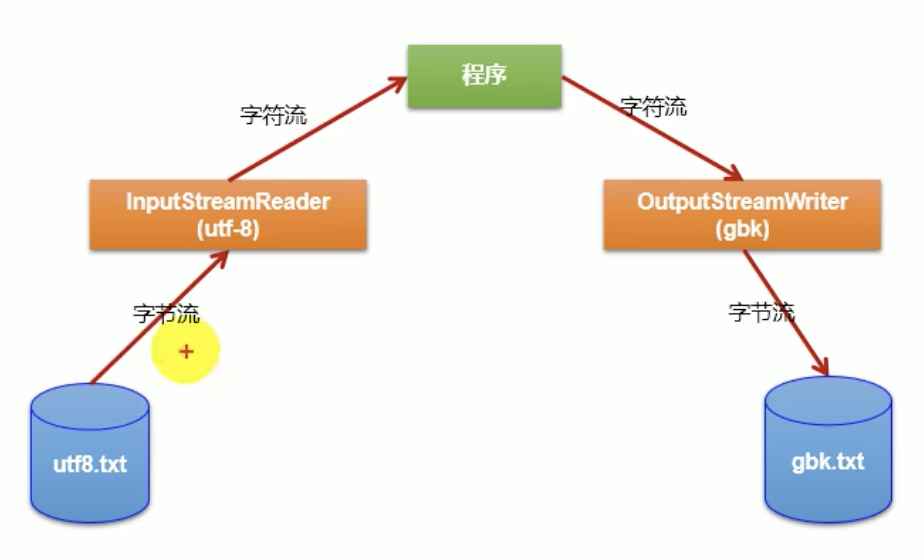

##### InputStreamReader

```java
用於將字節流中讀取到的字節按指定字符集解碼成字符。需要和InputStream“套接”
構造器
    public InputStreamReader(InputStream in)
    public InputStreamReader(InputStream, String chasetName) // chasetName＝要讀取的檔案儲存時，使用的字符集格式
  文件編碼方式(例如"UTF-8")，決定的解析時使用的字符集(也只能是"UTF-8")
  
    InputStreamReader isr = new InputStreamReader(System.in, "UTF-8")
```

##### OutputStreamWriter

```java
用於將要寫入到字節流中的字符按指定字符集編碼成字節。需要和OutputStream“套接”
構造器
    public OutputStreamWriter(OutputStream out)
    public OutputStreamWriter(OutputStream out, String charsetName) // chasetName＝輸出的檔案儲存時，想用的存字符集格式  
```
##### 字符集

> 常見的編碼表 p600

```java
ASCII：美國標准信息交換碼
用一個字節的7位可以表示。一個字節共8位byte中用7了位 = 2^7=128
  
ISO8859-1：拉丁碼表。歐洲碼表
用一個字節的8位表示。
  
GB2312：中國的中文編碼表。最多兩個字節編碼所有字符，以最高位來判斷：0 --> 表示一個字節解碼成一個字符,1---> 表示兩個字節解碼成一個字符
GBK：中國的中文編碼表升級，融合了更多的中文文字符號。最多兩個字節編碼所有字符，以最高位來判斷：0 --> 表示一個字節解碼成一個字符,1---> 表示兩個字節解碼成一個字符
  
Unicode：國際標準碼，融合了多種文字。
所有文字都用兩個字節來表示,Java語言使用的就是unicode ---> 2^16
  
UTF-8：用1-4個字節來表示一個字符。1-6
```

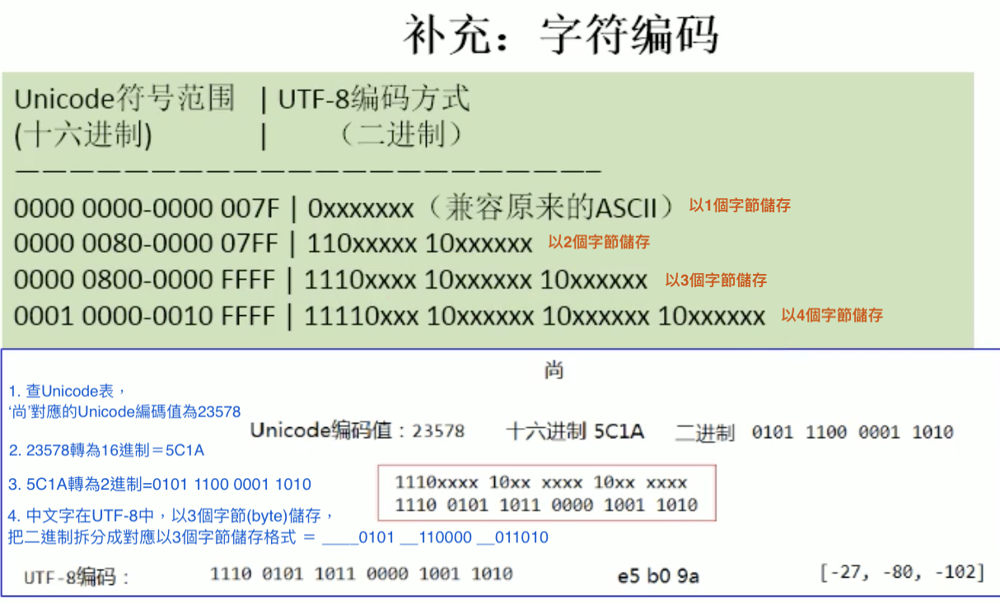

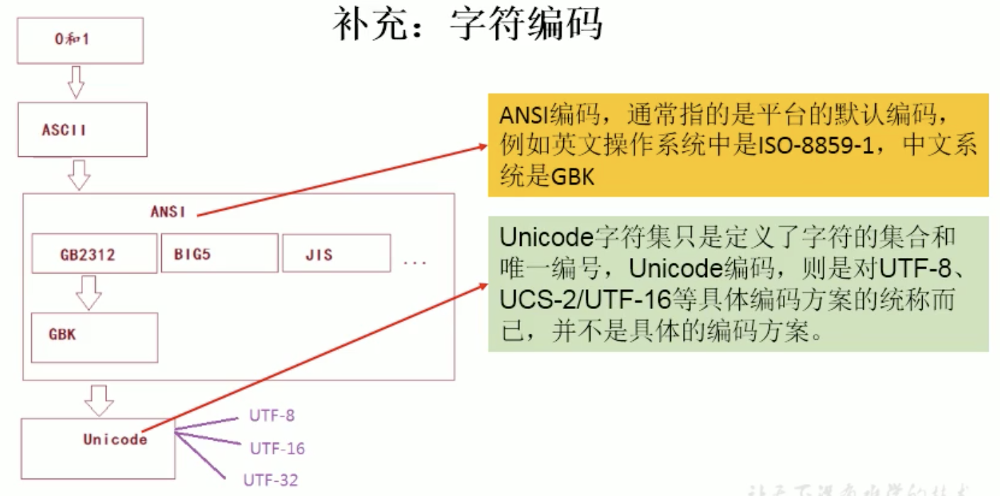

> 字符編碼、解碼(字節數組與字符數組互轉時才需要指定字符集)

```java
解碼：字節數組 -> 字符串
編碼：字符串 -> 字節數組
轉換流的編碼應用
    可以將字符按指定編碼格式存儲
    可以對文本數據按指定編碼格式來解讀
    指定編碼表的動作由構造器完成
```

#####  InputStreamReader And OutputStreamWriter Test

```java
FileInputStream --> byte --> InputStreamReader --> char --> OutputStreamWriter --> byte --> FileOutputStream
  
@Test
public void test2() throws IOException {
  // 1.造文件、流
  File file1 = new File("hello.txt");
  File file2 = new File("hello_gbk.txt");

  FileInputStream fis = new FileInputStream(file1);
  FileOutputStream fos = new FileOutputStream(file2);
	
  InputStreamReader isr = new InputStreamReader(fis, "UTF-8");
  OutputStreamWriter osw = new OutputStreamWriter(fos, "gbk");
	// 2.讀寫過程
  char[] cbuf = new char[20];
  int len;
  while((len = isr.read(cbuf)) != -1) {
    osw.write(cbuf, 0 ,len);
  }
	// 3.關閉資源
  isr.close();
  osw.close();
}
```


#### 處理之三：標準輸入輸出流(字節流)

```java
System.in和System.out分別代表了系統標準的輸入和輸出設備
默認輸入設備是鍵盤，輸出設備是顯示器（控制台）
System.in的類型是InputStream
System.out的是類型是PrintStream，它是OutputStream子類FileOutputStream子類
通過System類的setIn，setOut方法對默認設備進行改變。
    public static void setIn(InputStream in)
    public static void setOut(PrintStream out)
```


```java
// 1. 使用Scanner實現， 調用next()返回一個字符串
// 2. 使用System.in實現。 System.in(byte) --> 轉換流 --> (char)BufferedReader 的 readLine()

@Test
public void test1() {
  BufferedReader br = null;

  try {
    // 接受標準輸入流
    // InputStream is = System.in;
    // 輸入流字節流 轉 字符流
    InputStreamReader isr = new InputStreamReader(System.in);

    br = new BufferedReader(isr);

    while (true) {
      System.out.println("請從輸入任意字符串（e或exit退出）：");
      String s = br.readLine();
      if ("e".equalsIgnoreCase(s) || "exit".equalsIgnoreCase(s)) {
        System.out.println("exit the program");
        break;
      }
      String s2 = s.toUpperCase();
      System.out.println(s2);
    }
  } catch (IOException e) {
    e.printStackTrace();
  } finally {
    if (br != null) {
      try {
        br.close();
      } catch (IOException e) {
        e.printStackTrace();
      }
    }
  }

}
```


#### 處理流之四：打印流

```java
// 實現將基本類型的數據格式，轉化為字符串輸出
// public void print(int i) { write(String.valueOf(i)); }
在整個IO包中，打印流是輸出信息最方便的類
PrintStream（字節打印流）和PrintWriter（字符打印流）
    提供了一系列重載的print和println方法，用於多種數據類型的輸出
    PrintStream和PrintWriter的輸出不會拋出異常
    PrintStream和PrintWriter有自動flush功能
    System.out返回的是PrintStream的實例
```

#### 處理流之五：數據流DataInputStream、DataOutputStream

```java
為了方便操作java語言的基本數據類型的數據，可以使用數據流
數據流有兩個類
    DataInputStream 數據輸入流，套接在InputStream 節點流上
    DataOutputStream 數據輸出流，套接在OutputStream 節點流上
DataInputStream 方法
    boolean readBoolean()
    char readChar()
    double readDouble()
    long readLong()
    String readUTF()
    byte readByte()
    float readFloat()
    short readShort()
    int readInt()
    void readFully(byte[] b)
DataOutputStream方法
    void writeBoolean(boolean v)
    void writeChar(int v)
    void writeDouble(double v)
    void writeLong(long v)
    void writeUTF(String str)
    int writeUTF(String str, DataOutput out)
    void writeByte(int v)
    void writeFloat(float v)
    void wirteInt(int v)
    void writeBytes(String s)
    void writeChars(String s)
    void write(byte b[], int off, int len)
    void write(int b)
    void flush() 示例
    DataInputStream、DataOutputStream Test
```
#### 處理流之六：對象流

```java
ObjectInputStream、ObjectOutputStream

    用於存儲和讀取 對象 或 基本數據類型數據 的處理流，它的強大之處是可以把對象寫入到存儲設備中，也能把對像從 外部設備中讀取出來

序列化(Serialize):用ObjectOutputStream類將對象寫入IO流中
反序列化(Deserialize):用ObjectInputStream類從IO流中恢復對象

    ObjectOutputStream、ObjectInputStream不能序列化 static 和transient 修飾的成員變量，序列化讀出來是 null（static 和transient不歸類管）

  
/*

- 對象流使用注意，讀取時報java.io.EOFException異常

- new ObjectOutputStream(new FileOutputStream("file.txt")) 一創建對象流，file.txt文件內容就被替換成4個字節的內容，準備後續的寫入。

- 如果同時開了 ObjectInputStream、ObjectOutputStream，
ObjectInputStream的實例化和操作必須放在ObjectOutputStream的實例化和操作的前面，才能保證正常的讀取文件內容，否則內容已經被替換成4個字節內容，所有就報EOFException異常了。

- 建議不同時打開ObjectInputStream、ObjectOutputStream，
對象輸入流讀取操作完後，關閉對象輸入流，再打開對象輸出流操作

*/
```


##### 對象的序列化

```java
+ 對象序列化機制
-	對象序列化
    允許把內存中的java對象換成與平台無關的二進制流，從而允許把這種二進制流持久地保存到 硬盤上，或通過網絡將這種二進制流傳輸到另一個網絡節點

-	對象反序列化 
當其他程序獲取了這種二進制流，就可以恢復成原來的java對象
  
  
序列化的好處在於可將任何實現了Serializable接口的對象轉化為字節數據，使其在保存和傳輸時可被還原
序列化是 RMI（Remote Method Invoke – 遠程方法調用）過程的參數和返回值都必須實現的機制，而 RMI 是 JavaEE 的基礎。因此序列化機制是 JavaEE 平台的基礎
如果需要讓某個對象支持序列化機制，則必須讓其類是可序列化的，為了讓某個類是可序列化的，該類必須實現如下兩個接口之一：
    Serializable
    Externalizable
  
----------------------------------------------------------------
如果需要讓某個對象支持序列化機制，則必須讓其類是可序列化的，
  
1. 該類必須實現 Serializable 接口
2. 凡是實現Serializable接口的類都有一個表示序列化版本標識符的靜態變量
    private static final long serialVersionUID;
    serialVersionUID用來表明類的不同版本間的兼容性
    如果類沒有顯示定義這個靜態變量，它的值是Java運行時環境根據類的內部細節自動生成的。若類的源代碼作了修改，serialVersionUID 可能發生變化。故建議，顯示聲明
顯示定義serialVersionUID的用途
    希望類的不同版本對序列化兼容，因此需確保類的不同版本具有相同的serialVersionUID
    不希望類的不同版本對序列化兼容，因此需確保類的不同版本具有不同的serialVersionUID
3. 除了當前類需要實現 Serializable 接口之外，還必須保證其內部所有屬性也必須是可序列化的（默認情況下，基本數據類型可序列化）
```

使用對象流序列化對象

```java
// 序列化和反序列化順序一致
若某個類實現了Serializable就扣，該類的實例對象就是可以序列化的
    創建一個ObjectOutputStream對象
    調用ObjectOutputStream對象的wirteObject(T 對象)方法輸出可序列化對象。沒寫一次，執行以下flush()
反序列化
    創建一個ObjectInputStream對象
    調用readObject()方法讀取流中的對象
注意，如果某個類的變量不是基本數據類型或String類型，而是另一個引用類型，這個引用類型必須是可序列化的， 否者使用了該類的Field的類也不能序列化
```


```java
public class ObjectInputStreamAndObjectOutputSteamTest {
  @Test
  public void test1() {
    // 將對象寫入文件
    Person p1 = new Person("atom", 23, new Pet("dog"));
    Person p2 = new Person("emac", 22, new Pet("bird"));

    ObjectOutputStream oos = null;
    try {
      // 1.
      File file = new File("object.dat");
      // 2.
      FileOutputStream fos = new FileOutputStream(file);
      oos = new ObjectOutputStream(fos);
      // 3.
      oos.writeObject(new String("使用對象流序列化String對象"));
      oos.flush();

      oos.writeObject(p1); // 寫入的對象p1所屬類要序列化，未實現序列化報 NotSerializableException 異常
      oos.flush();
      oos.writeObject(p2);
      oos.flush();
    } catch (IOException e) {
      e.printStackTrace();
    } finally {
      if (oos != null) {
        try {
          // 4.
          oos.close();
        } catch (IOException e) {
          e.printStackTrace();
        }
      }
    }
  }

  @Test
  public void test2() {
    // 將對像從文件中讀取
    ObjectInputStream ois = null;
    try {
      // 1. 創建File對象
      File file = new File("object.dat");
      // 2. 創建FileInputStream對象
      FileInputStream fis = new FileInputStream(file);
      // 3. 創建ObjectInputStream對象
      ois = new ObjectInputStream(fis);
      Object obj = ois.readObject();
      String string = (String)obj;
      System.out.println(string);

      Object p1 = ois.readObject();
      Object p2 = ois.readObject();
      System.out.println(p1);
      System.out.println(p2);
    } catch (IOException e) {
      e.printStackTrace();
    } catch (ClassNotFoundException e) {
      e.printStackTrace();
    } finally {
      if (ois != null) {
        try {
          ois.close();
        } catch (IOException e) {
          e.printStackTrace();
        }
      }
    }
  }
}
```


##### RandomAccessFile類

這裡的隨機指：可任意位置讀寫文件

```java
1. RandomAccessFile 直接繼承 java.lang.Object,實現了DataInput 和 DataOutput 接口
2. RandomAccessFile 即可以充當輸入流，又可以充當輸出流，也可以同時充當輸入流、輸出流(但是一個流對應一個功能，讀或寫)
3. 屬於字節流
4. 若輸出的文件不存在，則創建；若存在，則覆蓋內容（默認從頭開始覆蓋）
RandomAccessFile類支持"隨機訪問"的方式，程序可以直接跳到文件的任意位置讀、寫文件
    支持值訪問部分文件內容
    可以向已存在的文件後追加內容
RandomAccessFile對象包含一個文件指針，用以標示當前讀寫出的位置， RandomAccessFile類對象可以移動文件指針
    long getFilePointer() 獲取文件指針的位置
    void seek(long pos) 將文件指針定位到pos位置（開始覆蓋位置）
  	void seek(long Fle.len) 將文件指針定位到文件末尾位置=追加
RandomAccessFile類的構造器
    public RandomAccessFile(File file, String mode)
    public RandomAccessFile(String fileName, String mode)
創建RandomAccessFile類實例需要製定mode訪問模式，mode有以下4種
    r 以只讀模式打開
    rw 以讀寫模式打開文件
    rwd 以讀寫模式打開文件,同步文件內容的更新
    rws 以讀寫模式打開文件,同步文件內容和元數據的更新
```

RandomAccessFile 實現複製文件

```java
public void copyFile(String src, String dest) {
  /*
        RandomAccessFile 實現複製文件
        * */
  File f1 = new File(src),
  f2 = new File(dest);
  RandomAccessFile raf1 = null,
  raf2 = null;
  try {
    raf1 = new RandomAccessFile(f1, "r");
    raf2 = new RandomAccessFile(f2, "rw");

    byte[] b = new byte[1024];
    int len;
    while ((len = raf1.read(b)) != -1) {
      raf2.write(b, 0, len);
    }
  } catch (IOException e) {
    e.printStackTrace();
  } finally {
    try {
      if (raf1 != null) {
        raf1.close();
      }
      if (raf2 != null) {
        raf2.close();
      }
    } catch (IOException e) {
      e.printStackTrace();
    }
  }
}

@Test
public void test1() {
  String s1 = "hello.txt",
  s2 = "hello5.txt";
  copyFile(s1, s2);
}
```

RandomAccessFile 實現在指定位置開始寫入(插入不覆蓋)

```java
@Test
public void test2() {
  // 在指定位置開始寫入(插入不覆蓋)
  File file = new File("hello.txt");
  RandomAccessFile raf = null;
  try {
    raf = new RandomAccessFile(file, "rw");
    // 移動文件指針，保存指針3之後的所有數據到 StringBuilder 中
    raf.seek(3);
    StringBuilder builder = new StringBuilder((int) new File("helo.txt").length());
    byte[] buffer = new byte[20];
    int len;
    while((len=raf.read(buffer)) != -1) {
      builder.append(new String(buffer, 0, len));
    }
    // 調回指針3，寫入 insert
    raf.seek(3);
    raf.write("insert".getBytes());
    // 繼續將 StringBuilder 中數據寫到文件中
    raf.write(builder.toString().getBytes());

  } catch (IOException e) {
    e.printStackTrace();
  } finally {
    if (raf != null) {
      try {
        raf.close();
      } catch (IOException e) {
        e.printStackTrace();
      }

    }
  }
}
```

BufferedReader

```java

```


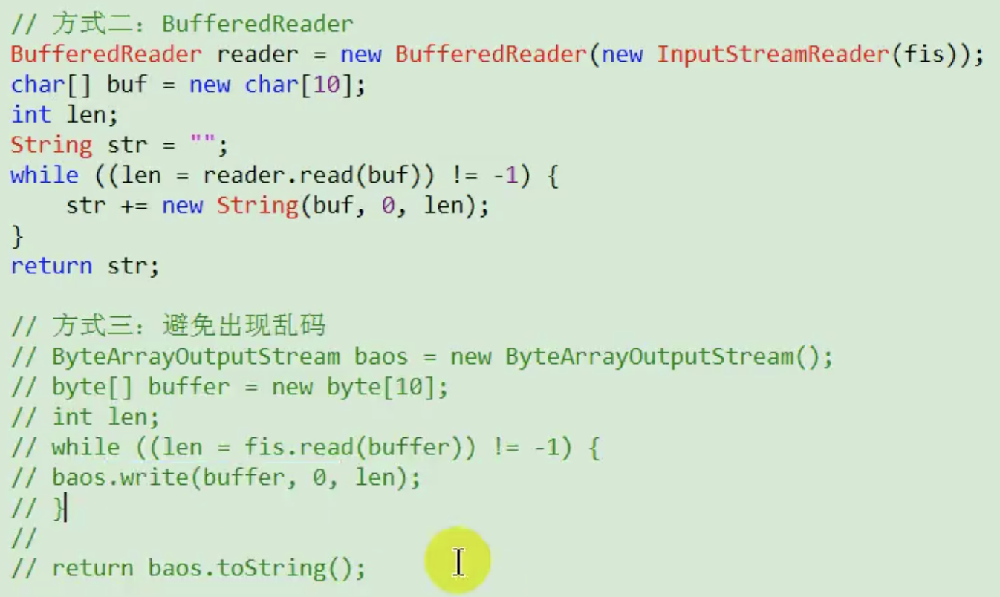


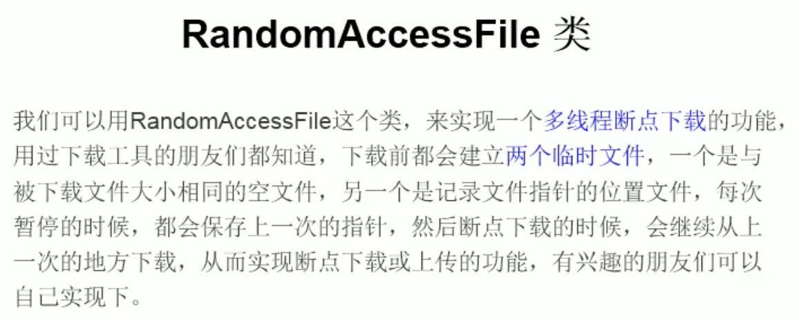

### |> 流的基本應用小總結

    流是用來處理數據的
    處理數據時，一定要先明確數據源、數據目的地
        數據源可以是文件，可以是鍵盤
        數據目的地可以是文件、顯示器及其他設備
    流只是幫助數據進行傳輸，並對傳輸的數據進行處理，如過濾處理、轉換處理
    字節流-緩衝流
        輸入流 InputStream - FileInputStream - BufferedInputStream
        輸出流 OutputStream - FileOutputStream - BufferedOutputStream
    字符流-緩衝流
        輸入流 Reader - FileReader - BufferedReader
        輸出流 Writer - FileWriter - BufferedWriter
    轉換流
        InputStreamReader 字節流 轉 字符流
        OutputStreamWriter 字符流 轉 字節流
    對象流
        ObjectInputStream
        ObjectOutputStream
        序列化、反序列化
    RandomAccessFile隨機存取文件


## # NIO概述

```java
Java NIO(New IO, Non-blocking IO)是從java 1.4開始加入。可以替代原來的java IO接口。
IO是面向流，NIO是面向緩衝區，基於通道的IO操作。 NIO效率更高。
NIO.2 JDK7發布，對NIO進行極大擴展，增強對文件處理和文件系統特性支持。
  
java.nio.channels.Channel
    |--FileChannel 處理本地文件
    |--SocketChannel TCP網絡編程中客戶端的Channel
    |--ServerSocketChannel TCP網絡編程中服務器的Channel
    |--DatagramChannel UDP網絡編程中發送端和接受端的Channel
    |--Pipe管道
      |--SinkChannel
      |--SourceChannel
```

Path,Paths,Files

```ajva
早期java只提供一個File類來訪問文件系統，但File類的功能有限，且大多數方法僅返回失敗，不會提供異常訊息。
```


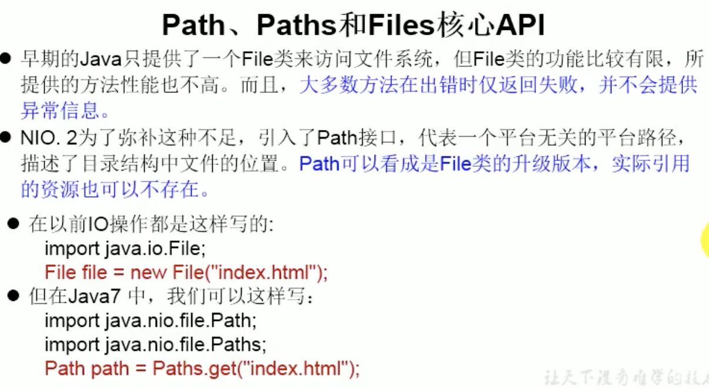


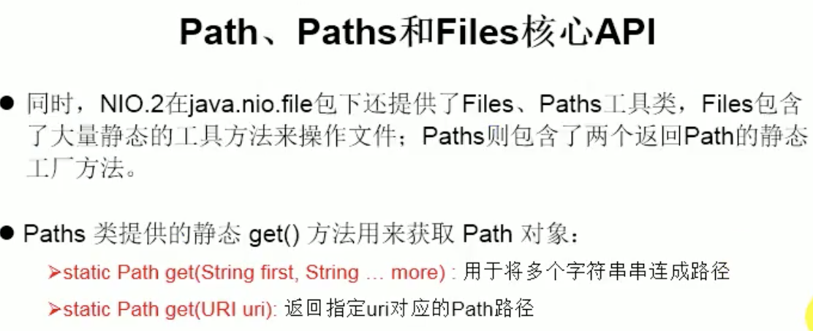

### |> NIO與IO的區別

|     內容     |           IO           |            NIO             |
| :----------: | :--------------------: | :------------------------: |
|  面向的對象  | 面向流 Stream Oriented | 面向緩衝區 Buffer Oriented |
|  IO是否阻塞  |  阻塞IO(Blocking IO)   | 非阻塞IO(Non Blocking IO)  |
| 是否有選擇器 |           無           |      選擇器 Selector       |


### |> Channel通道與Buffer緩衝區

java NIO系統的核心在於:Channel通道與Buffer緩衝區。通道表示打開到IO設備的連接(如文件、socket)。使用NIO系統，需要分配用於讀寫數據的緩衝區。 Channel：負責連接傳輸 Buffer：負責存儲

#### Buffer緩衝區

```java
+ 緩衝區（Buffer）概念
	- 一個用於特定基本數據類型的容器。
	- 由 java.nio 包定義的，所有緩衝區都是 Buffer 抽像類的子類

+ Buffuer用途
  
  - Java NIO 中的 Buffer 主要用於與NIO通道進行交互，
  - 1. 從in通道讀取數據是寫入緩衝區，
  - 2. 從緩衝區讀取數據到out通道中

  - Buffer存儲數據的是一個數組，

  - Buffer	子類
   根據數據類型不同(boolean 除外) ，有以下 Buffer 常用子類
   static XxxBuffer allocate(int capacity) : 創建一個容量為 capacity 的 XxxBuffer 對象
       ByteBuffer
       CharBuffer
       ShortBuffer
       IntBuffer
       LongBuffer
       FloatBuffer
       DoubleBuffer
```

緩衝區的基本屬性

```java
capacity容量
  表示Buffer能存放的數據個數，即存放數據的數組長度，
  不能為負數，並且創建後不能更改

limit限制
  第一個不應該讀取或寫入的數據的索引，即位於 limit 後的數據
  不可讀寫。緩衝區的限制不能為負，並且不能大於其容量

position位置
  下一個要讀取或寫入的數據的索引。緩衝區的位置不能為
  負，並且不能大於其限制

mark標記
  用於標記當前偏移位置的變量，-1表示還未標記過

  
  以上幾個屬性存在的關係
  不變式: mark <= position <= limit <= capacity
```

Buffer常用方法

```java
Buffer clean()
  清空此緩衝區並返回此緩衝區.
  public Buffer clear() {
      position = 0;
      limit = capacity;
      mark = -1;
      return this;
  }

Buffer flip()
  將緩衝區設置數據讀取模式，執行flip()後，就可以通過get讀取數據
  將緩衝區的limit設置為當前位置position，並將當前位置position充值為0
  public Buffer flip() {
      limit = position;
      position = 0;
      mark = -1;
      return this;
  }

int capacity() 
  返回capacity容量值
    
int limit()	
  返回此緩衝區當前的limit值
    
int position()  
  返回此緩衝區當前的position值
    
Buffer limit(int newLimit) 
  將緩衝區limit值設置為newLimit, 並返回一個此緩衝區
    
Buffer position(int newPosition) 
  將緩衝區position值設置為newPosition, 並返回一個此緩衝區
    
boolean hasRemaining()
  從目前的position到limit是否有元素, true:有， false:無
    
int remaining() 
    從目前的position到limit的元素個數
    
Buffer mark()
    記錄當前的position位置，即mark = position
    
Buffer reset()
  position恢復到mark記錄的位置，可用於再重讀等需求。當 mark >= 0，則position = mark
    
Buffer rewind()
    倒回起點，取消標記，可重複讀。
    public Buffer rewind() {
        position = 0;
        mark = -1;
        return this;
    }
```

Buffer數據操作方法

```java
獲取 Buffer 中的數據
  get() 讀取單個字節
  get(byte[] dst) 批量讀取多個(dst長度)字節到 dst 數組中
  get(int index) 讀取指定索引位置的字節(不會移動 position)
  
放入數據到 Buffer 中
  put(byte b) 將給定單個字節寫入緩衝區的當前位置
	put(byte[] src) 將 src 中的字節寫入緩衝區的當前位置
	put(int index, byte b) 將指定字節寫入緩衝區的索引位置(不會移動 position)
```


#### 直接緩衝區與非直接緩衝區

```java

字節緩衝區要么是直接的，要么是非直接的。如果為直接字節緩衝區，
則 Java 虛擬機會盡最大努力直接在此緩衝區上執行本機 I/O 操作。
也就是說，在每次調用基礎操作系統的一個本機 I/O 操作之前（或之後），
虛擬機都會盡量避免將緩衝區的內容複製到中間緩衝區中（或從中間緩衝區中復制內容）。

直接字節緩衝區可以通過調用此類的 allocateDirect() 工廠方法來創建。
此方法返回的緩衝區進行分配和取消分配所需成本通常高於非直接緩衝區。

直接緩衝區的內容可以駐留在常規的垃圾回收堆之外，
因此，它們對應用程序的內存需求量造成的影響可能並不明顯。
所以，建議將直接緩衝區主要分配給那些易受基礎系統的本機 I/O 操作影響的大型、持久的緩衝區。
一般情況下，最好僅在直接緩衝區能在程序性能方面帶來明顯好處時分配它們。

直接字節緩衝區還可以通過 FileChannel 的 map() 方法 將文件區域直接映射到內存中來創建。
該方法返回MappedByteBuffer。 Java 平台的實現有助於通過 JNI 從本機代碼創建直接字節緩衝區。
如果以上這些緩衝區中的某個緩衝區實例指的是不可訪問的內存區域，
則試圖訪問該區域不會更改該緩衝區的內容，
並且將會在訪問期間或稍後的某個時間導致拋出不確定的異常。

字節緩衝區是直接緩衝區還是非直接緩衝區可通過調用其 isDirect() 方法來確定。
提供此方法是為了能夠在性能關鍵型代碼中執行顯式緩衝區管理。

```

#### HeapByteBuffer與DirectByteBuffer

```java

		HeapByteBuffer非直接緩衝(堆緩衝區)

是寫在jvm堆上面的一個buffer，底層的本質是一個數組，用類封裝維護了很多的索引（make/limit/position/capacity等）
優點：由於內容維護在jvm裡，所以把內容寫進buffer裡速度會快些；並且，可以更容易回收

創建方式：XxxBuffer.allocate(int capacity)

    DirectByteBuffer直接緩衝區

底層的數據其實是維護在操作系統的內存中，而不是jvm裡，DirectByteBuffer里維護了一個引用address指向了數據，從而操作數據
優點：跟外設（IO設備）打交道時會快很多，因為外設讀取jvm堆裡的數據時，不是直接讀取的，而是把jvm裡的數據讀到一個內存塊裡，再在這個塊裡讀取的，如果使用DirectByteBuffer，則可以省去這一步，實現zero copy（零拷貝）

創建方式：ByteBuffer.allocateDirect(int capacity)
只有ByteBuffer能創建直接緩衝區

    DirectByteBuffer的必要性

外設之所以要把jvm堆裡的數據copy出來再操作，不是因為操作系統不能直接操作jvm內存，
而是因為jvm在進行gc（垃圾回收）時，會對數據進行移動，一旦出現這種問題，外設就會出現數據錯亂的情況
```

### |> Channel通道

```java
由 java.nio.channels 包定義的。
Channel 表示 IO 源與目標打開的連接。
Channel 類似於傳統的“流”。
只不過 Channel 本身不能直接訪問數據，
Channel 只能與Buffer 進行交互。
```


通道示意圖

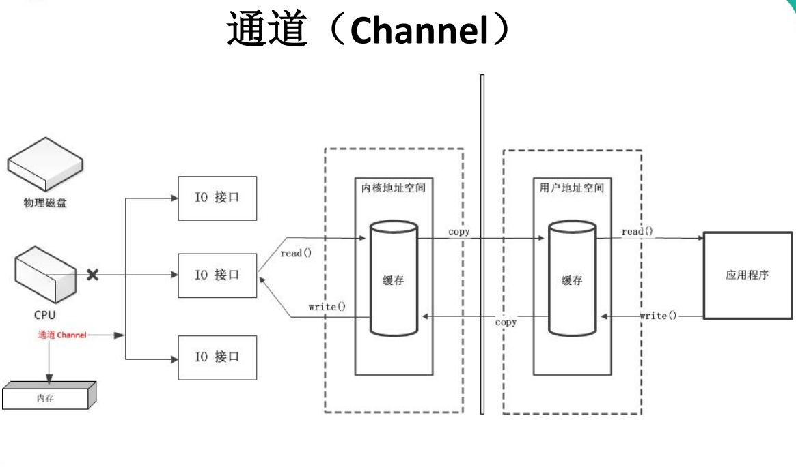

Channel接口的主要實現類

```java
FileChannel
用於讀取、寫入、映射和操作文件的通道。

DatagramChannel
通過 UDP 讀寫網絡中的數據通道。

SocketChannel
通過 TCP 讀寫網絡中的數據。

ServerSocketChannel
可以監聽新進來的 TCP 連接，對每一個新進來的連接都會創建一個 SocketChannel。
```

獲取通道方式

```java
方式1
  對支持通道的對象調用 getChannel()方法
  FileInputStream
  FileOutputStream
  RandomAccessFile
  DatagramSocket
  Socket
  ServerSocket
  
方式2
	使用 Files 類的靜態方法 newByteChannel() 獲取字節通道

方式3
	通過通道的靜態方法 open() 打開並返回指定通道
```

通道的數據傳輸

```java
1. 從Channel中讀取數據寫到Buffer中

    ByteBuffer byteBuffer = ByteBuffer.allocate(1024);
    inChannel.read(byteBuffer)

2. 讀取Buffer中數據寫到Channel中

    byteBuffer.flip();
    outChannel.write(byteBuffer);
    // 每次讀取完緩衝區數據後，做清空處理
    byteBuffer.clear();
```

### |> 分散讀取Scatter和聚集寫入Gather

- 分散讀取：把通道中的數據分段寫到多個緩衝區，寫滿一個再換下一個聚集寫入：把多個緩衝區中的數據逐個緩衝區數據寫到通道，讀取完一個緩衝區再讀下一個

通道之間的數據傳輸

```java
long transferTo(long position, long count, WritableByteChannel target)

將此通道的數據從position位置開始，count個字節傳輸到target通道

long transferFrom(ReadableByteChannel src, long position, long count)

將通道ReadableByteChannel數據從position位置開始，count個字節傳輸到此通道
```


FileChannel常用方法

```java
int read(ByteBuffer dst)
從 Channel 中讀取數據到 ByteBuffer

long read(ByteBuffer[] dsts)
將 Channel 中的數據“分散”到 ByteBuffer[]

int write(ByteBuffer src)
將 ByteBuffer 中的數據寫入到 Channel

long write(ByteBuffer[] srcs)
將 ByteBuffer[] 中的數據“聚集”到 Channel

long position()
返回此通道的文件位置

FileChannel position(long p)
設置此通道的文件位置

long size()
返回此通道的文件的當前大小

FileChannel truncate(long s)
將此通道的文件截取為給定大小

void force(boolean metaData)
強制將所有對此通道的文件更新寫入到存儲設備中
```


### |> 非阻塞式NIO、阻塞式NIO、與阻塞式IO

    IO流都是阻塞式的
    
    當一個線程調用 read() 或 write() 時，該線程被阻塞，
    直到有一些數據被讀取或寫入，該線程在此期間不能執行其他任務。
    因此，在完成網絡通信進行 IO 操作時，由於線程會阻塞，
    所以服務器端必須為每個客戶端都提供一個獨立的線程進行處理，
    當服務器端需要處理大量客戶端時，性能急劇下降。

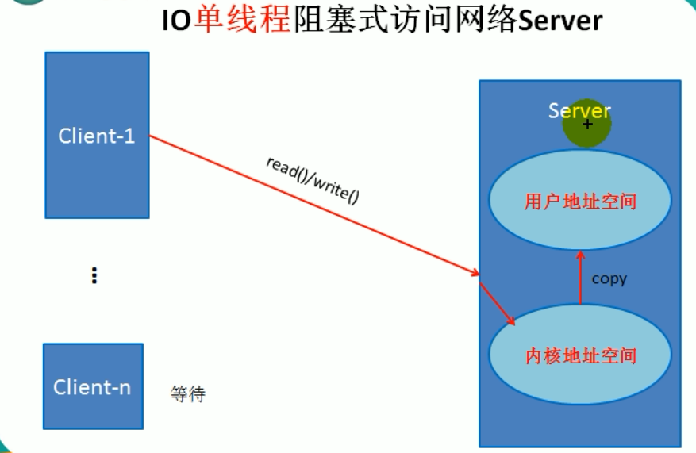

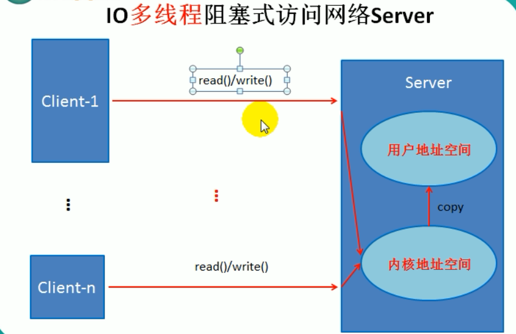


    NIO可配置為非阻塞模式
    
    當線程從某通道進行讀寫數據時，若沒有數據可用時，該線程可以進行其他任務。
    線程通常將非阻塞 IO 的空閒時間用於在其他通道上執行 IO 操作，
    所以單獨的線程可以管理多個輸入和輸出通道。
    因此，NIO 可以讓服務器端使用一個或有限幾個線程來同時處理連接到服務器端的所有客戶端

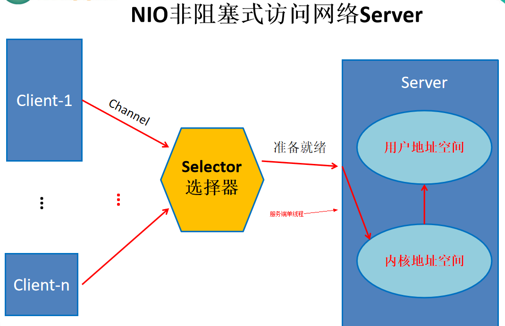


#### NIO TCP socket編程


#### NIO UDP socket編程


#### 選擇器Selector

```java
選擇器（Selector） 是 SelectableChannle 對象的多路復用器，
Selector 可以同時監控多個 SelectableChannel 的 IO 狀況，
也就是說，利用 Selector 可使一個單獨的線程管理多個 Channel。
Selector 是非阻塞 IO 的核心。
```


選擇器Selector的應用

```java
當調用 register(Selector sel, int ops) 將通道註冊選擇器時， 選擇器對通道的監聽事件，需要通過第二個參數 ops 指定。

可以監聽的事件類型（可使用 SelectionKey 的四個常量表示）：
    讀 : SelectionKey.OP_READ （1 << 0, 即1）
    寫 : SelectionKey.OP_WRITE （1<<2, 即4）
    連接 : SelectionKey.OP_CONNECT （1<<3, 即8）
    接收 : SelectionKey.OP_ACCEPT （1<<4, 即16）

若註冊時不止監聽一個事件，則可以使用“位或”操作符連接
  // 註冊"監聽事件類型"
  serverSocketChannel.register(selector, SelectionKey.OP_READ | SelectionKey.OP_WRITE)
```

SelectionKey常用方法

```java
SelectionKey

表示 SelectableChannel 和 Selector 之間的註冊關係。
每次向選擇器註冊通道時就會選擇一個事件(選擇鍵)。
選擇鍵包含兩個表示為整數值的操作集。
操作集的每一位都表示該鍵的通道所支持的一類可選擇操作。


SelectionKey常用方法

int interestOps()
獲取感興趣事件集合

int readyOps()
獲取通道已經準備就緒的操作的集合

SelectableChannel channel()
獲取註冊通道

Selector selector()
返回選擇器

boolean isReadable()
檢測 Channal 中讀事件是否就緒

boolean isWritable()
檢測 Channal 中寫事件是否就緒

boolean isConnectable()
檢測 Channel 中連接是否就緒

boolean isAcceptable()
檢測 Channel 中接收是否就緒
```

Selector常用方法

```java
Set keys()
所有的 SelectionKey 集合。代表註冊在該Selector上的Channel

selectedKeys()
被選擇的 SelectionKey 集合。返回此Selector的已選擇鍵集

int select()
監控所有註冊的Channel，當它們中間有需要處理的 IO 操作時，該方法返回，
並將對應得的 SelectionKey 加入被選擇的SelectionKey 集合中，
該方法返回這些 Channel 的數量。
  
int select(long timeout)
可以設置超時時長的 select() 操作

int selectNow()
執行一個立即返回的 select() 操作，該方法不會阻塞線程

Selector wakeup()
使一個還未返回的 select() 方法立即返回

void close()
關閉該選擇器
```


#### 網絡編程常用Channel

```java
- SocketChannel
    Java NIO中的SocketChannel是一個連接到TCP網絡套接字的通道

    操作步驟：
    * 打開 SocketChannel
    * 讀寫數據
    * 關閉 SocketChannel

  
- ServerSocketChannel
  	Java NIO中的 ServerSocketChannel 是一個可以監聽新進來的TCP連接的通道，就像標準IO中 的ServerSocket一樣

  
- DatagramChannel
    Java NIO中的DatagramChannel是一個能收發UDP包的通道

    操作步驟：
    * 打開 DatagramChannel
    * 接收/發送數據
    * 關閉通道
```


#### 字符集編碼與解碼

```java
Charset 字符集 編碼：字符數組 -> 字節數組 解碼：字節數組 -> 字符數組
  
返回指定字符集名的字符集
Charset charset = Charset.forName("GBK");

獲取編碼器
CharsetEncoder encoder = charset.newEncoder();

獲取解碼器
CharsetDecoder decoder = charset.newDecoder();
    encoder.encode()編碼
    decoder.decode()解碼
```


#### Pipe管道

```java
Java NIO 管道是2個線程之間的單向數據連接。
Pipe有一個source通道和一個sink通道。
數據會被寫到sink通道，從source通道讀取
```

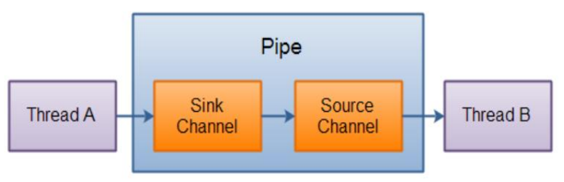


### |> NIO2 Path、Paths、Files

```java
java 7對原來的NIO進一步加強

java.nio.file.Path 接口代表一個平台無關的平台路徑，
描述了目錄結構中文件的位置

Path接口

Path可以看成是File類的升級
```


Paths類

```java
只有一個私有的構造器，private Paths() { }

只有兩個靜態方法
    public static Path get(String first, String... more)

        根據給定的一個或多個字符串創建Path對象，最終是調用了Path.of(first, more)

    public static Path get(URI uri)

    解析根據給定的uri並創建Path對象，最終是調用了Path.of(uri)。
    只能解析file文件系統資源，無法解析URL資源
```

Files類

```java
java.nio.file.Files 用於操作文件或目錄的工具類
```


自動資源管理

```java
Java 7 增加了自動資源管理((Automatic Resource Management, ARM),
該特性以 try 語句的擴展版為基礎。
自動資源管理主要用於，
當不再需要文件（或其他資源）時，
可以防止無意中忘記釋放它們

                 
- 自動資源管理基於 try 語句的擴展形式

    try (需要關閉的資源聲明) {
        //可能發生異常的語句
    } catch(異常類型 變量名) {
        //異常的處理語句
    }
    ……
    finally {
        //一定執行的語句
    }

當 try 代碼塊結束時，自動釋放資源。
因此不需要顯示的調用 close() 方法。
該形式也稱為“帶資源的 try 語句”

注意：
①try 語句中聲明的資源被隱式聲明為 final ，資源的作用局限於帶資源的 try 語句
②可以在一條 try 語句中管理多個資源，每個資源以“;” 隔開即可。
③需要關閉的資源，必須實現了 AutoCloseable 接口或其自接口 Closeable
```


