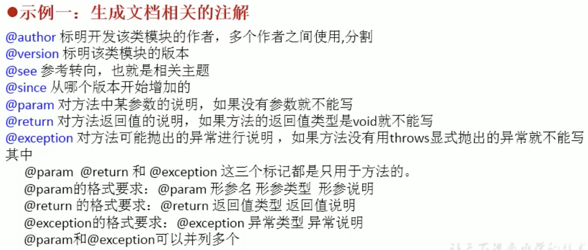
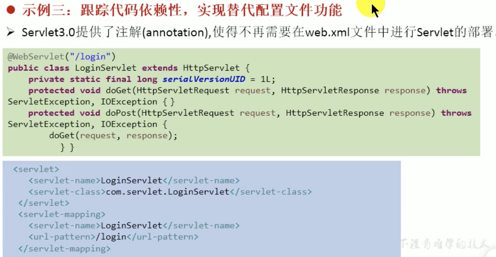
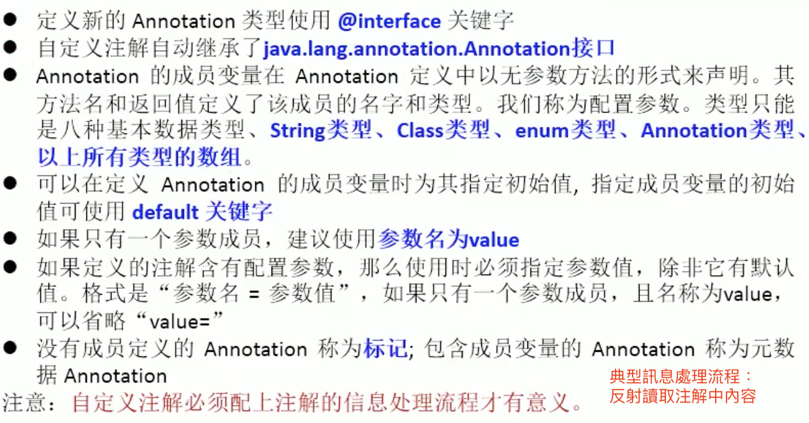
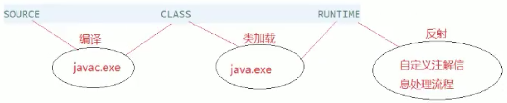
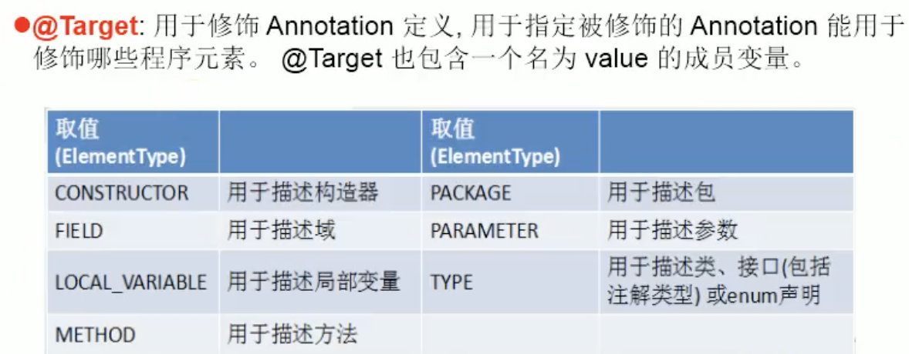
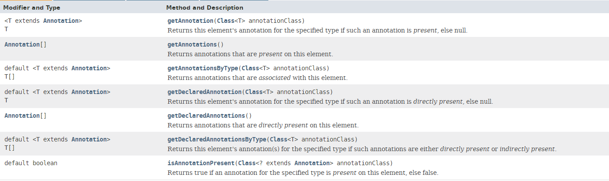

## # 枚舉類

### 枚舉類概述

    JDK 1.5之前需要自定義枚舉類
    JDK 1.5新增enum關鍵字用於定義枚舉類
    若枚舉類只有一個成員，則可用作為一種單例模式的實現方式

枚舉類的屬性

    枚舉類對象的屬性不應被改動，所以需要用private final修飾
    枚舉類的屬性應該在構造器中為其賦值
    若枚舉類顯示的定義了帶參的構造器，則在列出枚舉類對象時也必須傳入參數

#### 自定義枚舉類

    [實例變量] 屬性，聲明為private final
    [構造器] private構造器，並初始化屬性
    [方法] 提供public方法訪問屬性
    [類變量] 在內的內部創建枚舉類的實例，將類的對象聲明public static final

SpringTest

```java
/*
 * 一、枚舉類使用
 * 1. 枚舉類理解：類的對象只有有限個、確定的。稱之枚舉類
 * 2. 當需要定義一組常量時，強烈建議使用枚舉類
 * 3. 如果枚舉類中只有一個對象，則可以作為單例模式的實現方式
 * 
 * 二、如何定義枚舉類
 * 方式一：jdk5.0 之前，自定義枚舉類
 * 方式二：jdk5.0，可以使用 enum 關鍵字定義枚舉類
 * */
public class SpringTest {
	public static void main(String[] args) {
		Season season = Season.AUTUMN;
		System.out.println(season);
	}
}
// 自定義枚舉類，方式一
class Season{
	
	// 1.聲明對象屬性：private final修飾
	private final String seasonName;
	private final String seasonDesc;
	
	// 2.私有化類的構造器（final修飾需定義時復值）
	private Season(String seasonName, String seasonDesc) {
		this.seasonName = seasonName;
		this.seasonDesc = seasonDesc;
	}
	
	// 3.提供當前枚舉類的多個對象：public static final 的
	public static final Season SPRING = new Season("spring", "flower blossom");
	public static final Season SUMMER = new Season("summer", "ice cream");
	public static final Season AUTUMN = new Season("autumn", "yellow leaf");
	public static final Season WINTER = new Season("winter", "do tou want to build a snowman");
	
	// 4.其他訴求，獲取枚舉對象屬性
	public String getSeasonName() {
		return seasonName;
	}
	public String getSeasonDesc() {
		return seasonDesc;
	}
	
	@Override
	public String toString() {
		return "Season [seasonName=" + seasonName + ", seasonDesc=" + seasonDesc + "]";
	}
}
```

#### enum枚舉類

```java
/*
 * 使用 enum 關鍵字定義枚舉類
 * 定義的枚舉類默認繼承於 class java.lang.Enum
 * 
 * */
public class SeasonTest2 {
	public static void main(String[] args) {
		Season2 season2 = Season2.SPRING;
		System.out.println(season2);
		System.out.println(Season2.class.getSuperclass()); // class java.lang.Enum
	}
}

// 方式二：jdk5.0，可以使用 enum 關鍵字定義枚舉類
enum Season2 {
	// 1.提供當前枚舉類的多個對象：
	SPRING("spring", "flower blossom"),
	SUMMER("summer", "ice cream"),
	AUTUMN("autumn", "yellow leaf"),
	WINTER("winter", "do tou want to build a snowman");
	
	// 1.聲明對象屬性：private final修飾
	private final String seasonName;
	private final String seasonDesc;

	// 2.私有化類的構造器（final修飾需定義時復值）
	private Season2(String seasonName, String seasonDesc) {
		this.seasonName = seasonName;
		this.seasonDesc = seasonDesc;
	}

	// 4.其他訴求，獲取枚舉對象屬性
	public String getSeasonName() {
		return seasonName;
	}

	public String getSeasonDesc() {
		return seasonDesc;
	}

}
```


### enum枚舉類與普通類的區別

```java
使用 enum 定義的枚舉類默認繼承了 java.lang.Enum 類
格式 enum ClassName { }
必須在類的第一行列出聲明枚舉類實例對象，不要其他修飾（效果相當於public static final），使用","分隔多個實例對象，;結尾，不需要new關鍵字
屬性是使用private final修飾
無修飾的構造器，默認已經被private修飾，寫上也可以
JDK 1.5 中可以在switch表達式中使用enum定義的枚舉類的實例對像作為表達式，case子句可以直接使用枚舉類實例對象的名字，無需添加枚舉類作為限定
```

enum枚舉類常用方法

```java
T[] values() 獲取枚舉類的所有實例組成的數組，返回值為數組T[]
T valueOf(String instanceName) 通過實例名獲取類對應的實例對象，不存在的實例名，報 IllegalArgumentException 異常
toString() 返回當前枚舉類對象常量名稱
```


枚舉類實現接口

```java
與普通類一樣，所以可以實現一個或多個接口
  
可以在枚舉類中實現接口
  
也可以每個實例對像中都實現接口，這是與一般類不同的，可以讓不同的枚舉類對象調用各自重寫的方法，執行效果
```


```java
interface Info {
  void show();
}

enum Season3 implements Info {
  // 創建類的實例對像只能放在最前面，多個實例之間用","分隔,
  SPRING ("spring", "春暖"),
  SUMMER ("summer", "夏熱"),
  AUTUMN ("autumn", "秋涼"),
  WINTER ("winter", "冬寒");

  // 1 屬性，聲明為private final
  private final String seasonName;
  private final String seasonDesc;

  // 構造器，默認已經是 private
  Season3(String seasonName, String seasonDesc) {
    this.seasonName = seasonName;
    this.seasonDesc = seasonDesc;
  }

  // 方法...

  @Override
  // 可以在枚舉類中實現接口
  public void show() {
    System.out.println("四季之一: " + seasonName);
  }

}


enum Season4 implements Info {

  // 特殊的實現
  // 每個實例對像中都實現接口
  SPRING ("spring", "春暖") {
    public void show() {
      System.out.println("春眠不覺曉");
    }
  },
  SUMMER ("summer", "夏熱") {
    public void show() {
      System.out.println("夏日炎炎");
    }
  },
  AUTUMN ("autumn", "秋涼") {
    public void show() {
      System.out.println("秋風煞爽");
    }
  },
  WINTER ("winter", "冬寒") {
    public void show() {
      System.out.println("千里冰封，萬里雪飄");
    }
  };
	// ...
}
```


## # 註解Annotation

### 註解概述

- 註解不是註釋

- Annotation 其實就是代碼裡的`特殊標記`， 這些標記可以在編譯、 類加載、 運行時被讀取,，並執行相應的處理.，通過使用Annotation， `可以在不改變原有邏輯的情況下，在源文件中嵌入一些補充信息`
- JDK 1.5開始開始，java增加了Annotation註解，用於對元數據(MetaData)的支持
- Annotation 可以像修飾符一樣被使用, 可用於修飾`包,類, 構造器, 方法, 成員變量, 參數, 局部變量的聲明`,，這些信息被保存在 Annotation 的 `“name=value”` 對中
- Annotation 能被用來為程序元素(類, 方法, 成員變量等) 設置元數據
  符號：@
- 框架＝注解＋反射＋設計模式



示例二：在編譯時進行格式檢查（JDK內置三個基本注解）

```java
@Override 限定重寫父類方法，該註釋只能用於方法，顯式的指明方法要重寫，如果權限修飾、方法名等有錯誤能有提示
@Deprecated 用於表示某個程序元素（類，方法等）已經過時，仍能正常正常運行和使用，一般表示有更好的方法，建議使用新方法，生成的doc api中有Deprecated標識
@SuppressWarnings 抑制編譯器警告
```



### 自定義註解



```java
格式：public @interface MyAnnotation { }
定義新的 Annotation 類型使用 @interface 關鍵字
Annotation 的成員變量在 Annotation 定義中以無參數方法的形式來聲明. 其方法名和返回值定義了該成員的名字和類型.
可以在定義 Annotation 的成員變量時為其指定初始值, 指定成員變量的初始值可使用 default 關鍵字

public @interface MyAnnotation{
    String name() default "atguigu";
}

沒有成員定義的 Annotation 稱為標記; 包含成員變量的 Annotation 稱為元數據 Annotation
```


### 元註解

- JDK 的元註解 用於修飾其他註解 定義

- > 元數據：
  >
  > (修飾)String name =（數據） "atom";

4個元註解

```java
1. @Retention 指定註解的生命週期，可以保留到哪個階段，

    舉例：@Retention(RetentionPolicy.RUNTIME)

  @Retention(value) value成員變量必須指定下面中的一個值：
  RetentionPolicy.SOURCE 編譯器直接丟棄這種策略的註釋
  RetentionPolicy.CLASS 編譯器將把註釋記錄在 class 文件中. 當運行 Java 程序時, JVM 不會保留註解。這是默認值 // 默認值
    RetentionPolicy.RUNTIME 編譯器將把註釋記錄在 class 文件中. 當運行 Java 程序時, JVM 會保留註釋. 程序可以通過反射獲取該註釋 // 能通過反射獲取的註釋只能是顯示定義 @Retention(RUNTIME)

2. @Target 用於修飾 Annotation 定義, 用於指定被修飾的 Annotation 能用於修飾哪些程序元素
@Target(value) value可選值(以數組形式傳)：

    TYPE, FIELD, METHOD, PARAMETER, CONSTRUCTOR, LOCAL_VARIABLE, ANNOTATION_TYPE, PACKAGE, TYPE_PARAMETER, TYPE_USE, MODULE
      
      default ＝ 不限制

3. @Documented 用於指定被該元 Annotation 修飾的 Annotation 類將被 javadoc 工具提取成文檔
    // 表示所修飾的注解在被 javadoc 解析時，保留下來
		// 定義為Documented的註解必須設置Retention值為RUNTIME

4. @Inherited 被它修飾的 Annotation 將具有繼承性.如果某個類使用了被 @Inherited 修飾的 Annotation, 則其子類將自動具有該註解
```






### 提取Annotation信息

JDK 1.5 在 java.lang.reflect 包下新增了 AnnotatedElement 接口, 該接口代表程序中可以接受註解的程序元素




### 內置註解源碼

```java
// SuppressWarnings
@Target({TYPE, FIELD, METHOD, PARAMETER, CONSTRUCTOR, LOCAL_VARIABLE, MODULE})
@Retention(RetentionPolicy.SOURCE)
public @interface SuppressWarnings {
    String[] value();
}


// Override
@Target(ElementType.METHOD)
@Retention(RetentionPolicy.SOURCE)
public @interface Override {
}


// Deprecated
@Documented
@Retention(RetentionPolicy.RUNTIME)
@Target(value={CONSTRUCTOR, FIELD, LOCAL_VARIABLE, METHOD, PACKAGE, MODULE, PARAMETER, TYPE})
public @interface Deprecated {
    String since() default "";
    boolean forRemoval() default false;
}
```

### jdk8可重複注解

Before JDK8

```java
@Target({TYPE, FIELD, METHOD, PARAMETER, CONSTRUCTOR, LOCAL_VARIABLE, MODULE})
@Retention(RetentionPolicy.RUNTIME)
public @interface MyAnnotation {
		// String[] value();
    // 也可以定義帶默認值的
    String[] value() default {"hehe"};
}

public @interface MyAnnotation2 {
	MyAnnotation[] value();
}

@MyAnnotation2({@MyAnnotation(value = { "a" }), @MyAnnotation(value = { "f" })})
class Person{
  // ...
}
```

after JDK8

1. 在 MyAnnotation 上聲明 @Repeatable ，成員值為 MyAnnotation2.class
2. MyAnnotation2 的 @Target 和 @Retention 和 @Inherited 等元注解和 MyAnnotation 相同

```java
@Target({TYPE, FIELD, METHOD, PARAMETER, CONSTRUCTOR, LOCAL_VARIABLE, MODULE})
@Repeatable(MyAnnotation2.class) // JDK8
// 沒有定義 @Retention，默認的生命週期 CLASS
public @interface MyAnnotation {
		// String[] value();
    // 也可以定義帶默認值的
    String[] value() default {"hehe"};
}

@Retention(RetentionPolicy.RUNTIME) // MyAnnotation2 的生命週期不能短於 MyAnnotation（引用註解）
@Target({TYPE, FIELD, METHOD, PARAMETER, CONSTRUCTOR, LOCAL_VARIABLE, MODULE}) // @Target 範圍需和 MyAnnotation（引用註解）一致
public @interface MyAnnotation2 {
	MyAnnotation[] value();
}

// after jdk8
@MyAnnotation(value = { "a" })
@MyAnnotation(value = { "f" })
class Person {
  
}
```

### jdk8類型注解

Target.class

```java
@Documented
@Retention(RetentionPolicy.RUNTIME)
@Target(ElementType.ANNOTATION_TYPE)
public @interface Target {
    ElementType[] value();
}
```

ElementType.class

```java
public enum ElementType {
    /** Class, interface (including annotation type), or enum declaration */
    TYPE,

    /** Field declaration (includes enum constants) */
    FIELD,

    /** Method declaration */
    METHOD,

    /** Formal parameter declaration */
    PARAMETER,

    /** Constructor declaration */
    CONSTRUCTOR,

    /** Local variable declaration */
    LOCAL_VARIABLE,

    /** Annotation type declaration */
    ANNOTATION_TYPE,

    /** Package declaration */
    PACKAGE,

    /**
     * Type parameter declaration
     *
     * @since 1.8
     */
    TYPE_PARAMETER,

    /**
     * Use of a type
     *
     * @since 1.8
     */
    TYPE_USE,

    /**
     * Module declaration.
     *
     * @since 9
     */
    MODULE
}
```

ElementType.TYPE_PARAMETER：表示該注解能寫在類型變量的聲明語句中（如：泛型聲明）

ElementType.TYPE_USE：表示該注解能寫在使用類型的任何語句中


```java
@Target({TYPE, FIELD, METHOD, PARAMETER, CONSTRUCTOR, LOCAL_VARIABLE, TYPE_PARAMETER}) // add TYPE_PARAMETER
@Repeatable(MyAnnotation2.class) // JDK8
// 沒有定義 @Retention，默認的生命週期 CLASS
public @interface MyAnnotation {
		// String[] value();
    // 也可以定義帶默認值的
    String[] value() default {"hehe"};
}

class Generic<@MyAnnotation T>{
  
}

@Target({TYPE, FIELD, METHOD, PARAMETER, CONSTRUCTOR, LOCAL_VARIABLE, TYPE_PARAMETER, TYPE_USE}) // add TYPE_USE
@Repeatable(MyAnnotation2.class) // JDK8
// 沒有定義 @Retention，默認的生命週期 CLASS
public @interface MyAnnotation {
		// String[] value();
    // 也可以定義帶默認值的
    String[] value() default {"hehe"};
}

class Generic<@MyAnnotation T>{
  public void show() throws @MyAnnotation RuntimeException{
    ArrayList<@MyAnnotation String> list = new ArrayList<>();
    int num = (@MyAnnotation int) 10L;
  }
}
```


