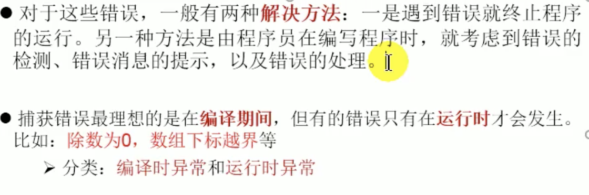
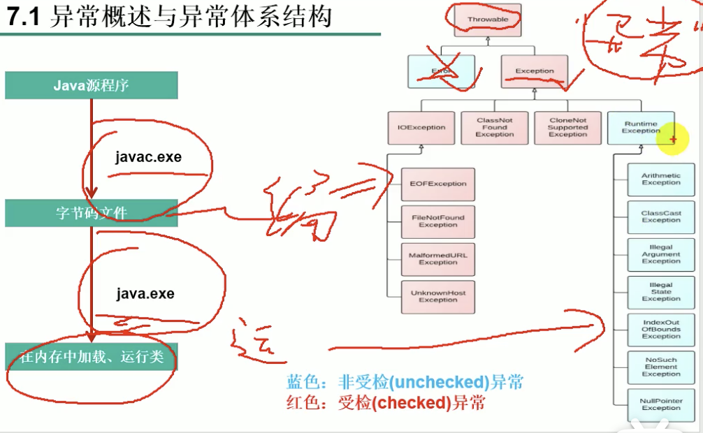
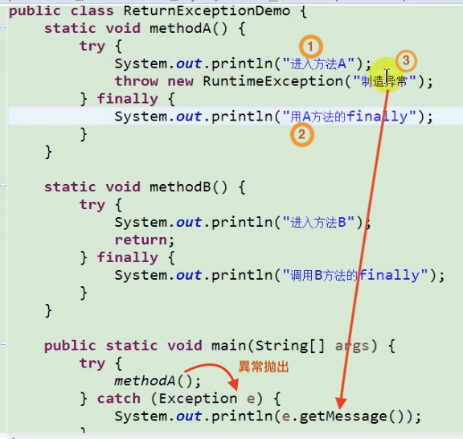
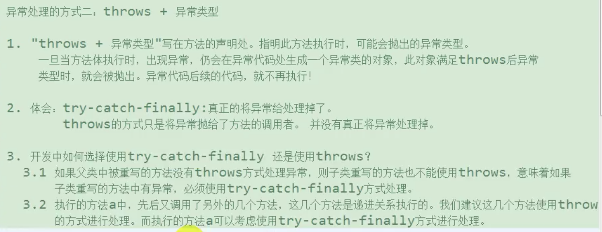
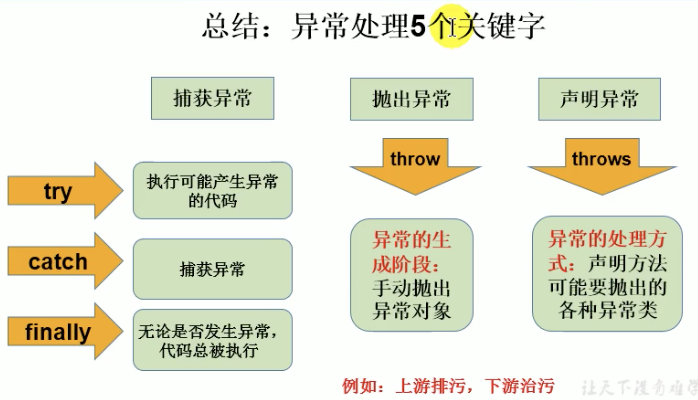

## # 異常處理

異常的定義

```java
什麼是異常
在java語言中，將程序執行中發生的不正常的情況稱為“異常”，
不包括開發過程中的語法錯誤和邏輯錯誤
java.lang.Throwable
```


分類

```java
+ Error 錯誤，無法解決，程序中不進行處理
	- java虛擬機無法解決的嚴重問題，如JVM系統內部錯誤，資源耗盡等

+ Exception 異常，要求在編寫程序時，就要考慮到這些異常的處理
	- 因其他編程錯誤或偶然外因導致的一般性問題。如空指針、網絡中斷等
```

Error

```java
public class ErrorTest{
  public static void main(String[] args){
    marn(args); // StackOverflowError 栈溢出
    Integer[] arr = new Integer[1024*1024*1024]; // OutOfMemoryError: Java heap space
  }
}
```


Exception



    + 編譯時異常，
    	- 在編譯期間會出現的異常
    	- 執行javac 命令時，出現異常，必須處理（將異常進行捕獲，轉化為運行時異常），否則編譯出錯不能運行
      - Exception的子類中除了RuntimeException以外的
    
    + 運行時異常
    	- 執行java命令時，出現異常，可不處理
    	- RuntimeException的所有子類

異常解決方法

    + 遇到錯誤就終止程序
    + 由程序員在編寫程序時，就考慮到錯誤的檢測、錯誤消息的提示及錯誤的處理

異常特點

    執行一個程序時，如果出現異常，那麼異常後面的代碼就不再執行

### java異常類層次



```java
Object
    |--- java.lang.Throwable
        |--- java.lang.Error 程序中不進行處理
  					|--- StackOverflowError 栈溢出
  					|--- OutOfMemoryError: Java heap space
        |--- java.lang.Exception
            |--- 編譯時異常(checked)一定要處理，不然不能運行， 使用 try-catch-finally 處理編譯時異常，使程序在編譯時不再報錯，但運行時仍可能出現錯誤，相當於使用 try-catch-finally 將錯誤延遲到運行時出現
  							|--- IOException
  	  							|--- FileNotFoundException
  							|--- ClassNotFoundException
            |--- 運行時異常(unchecked)（RuntimeException）實際開發中常見，沒必要處理＝不處理
  							|--- NullPointerException
                |--- ArrayIndexOutOfBoundsException
                |--- ClassCastException
                |--- NumberFormatException
                |--- InputMismatchException
                |--- ArithmaticException
```


### 異常處理機制

```java
異常處理的抓拋模型
異常類對象的生成
    由虛擬機自動生成，自動拋出異常
    由開發人員手動創建，手動拋出異常
如果一個方法內拋出異常，該異常對象會被拋給調用者方法中處理。
如果異常沒有在調用者方法里處理,它繼續被拋給這個調用方法的上層方法。
這個過程將一起繼續下去，直到異常被。這個過程被稱為捕獲異常 (catch)
如果一個異常回到main()方法，並且main()也不處理，則程序運行終止
程序員通常只能處理Exception，而對Error無能為力
```

### 如何處理異常

```java
產生異常 -
過程 1 ： 拋--執行代碼時，一旦出現異常，就會在異常的代碼處理生成一個應對的異常類的對象，並將此對象拋出（分為自動拋出、手動拋出）
    一旦拋出此異常類的對象，其後代碼就不再執行
    此異常類的對象拋給方法的調用者(java運行時系統)
  	關於異常對象的產生： 1. 系統自動生成對象
  									  2. 手動的生成一個對象，並拋出(throw)
 
處理異常  - 
過程 2 ：抓--可以理解為異常處理方式，抓住上一步拋出的異常類的對象。
  如何抓取＝異常處理方式
      1. 異常處理方式一：抓取異常(捕獲異常) try-catch-finally
      2. 異常處理方式二：聲明拋出異常 throws
```

[要抓還是要拋？](https://openhome.cc/Gossip/Java/Throw.html)

- 如果方法設計流程中可能引發例外，而你設計時並沒有充足的資訊知道該如何處理（例如不知道程式庫會用在什麼環境），那麼可以拋出例外，讓呼叫方法的客戶端來處理。---> throws + 異常類型

  - 操作物件的過程中如果會拋出受檢例外`(Exception)`，但目前環境資訊不足以處理例外，所以無法使用`try`、`catch`處理時，可由方法的客戶端依當時呼叫的環境資訊進行處理。
    - 為了告訴編譯器這件事實，必須在方法上使用`throws`宣告此方法會拋出的例外類型或父類型，編譯器才會讓你通過編譯。
  - 如果你認為客戶端呼叫方法的時機不當引發了某個錯誤，希望客戶端準備好前置條件，再來呼叫方法，這時可以拋出非受檢例外讓客戶端得知此情況，如果是非受檢例外 ` (Error, RuntimeException)`，編譯器不會要求明確使用`try`、`catch`或在方法上使用`throws`宣告，因為Java的設計上認為，非受檢例外是程式設計不當引發的臭蟲，例外應自動往外傳播，不應使用`try`、`catch`處理，而應改善程式邏輯來避免引發錯誤。

- 在例外發生時，可使用`try`、`catch`處理當時環境可進行的例外處理，當時環境下無法決定如何處理的部份，可以拋出由呼叫方法的客戶端處理。如果想先處理部份事項再拋出，

  ```java
  StringBuilder builder = new StringBuilder();
  try {
    Scanner scanner = new Scanner(new FileInputStream(name));
    while(scanner.hasNext()) {
      builder.append(scanner.nextLine());
      builder.append('\n');
    }
  } catch (FileNotFoundException ex) { // 進行完部份錯誤處理之後
    ex.printStackTrace(); 
    throw ex; // 再拋出
  }
  return builder.toString();
  ```

- 在`catch`區塊進行完部份錯誤處理之後，可以使用`throw`（注意不是`throws`）將例外再拋出，實際上，你可以在任何流程中拋出例外，不一定要在`catch`區塊中，在流程中拋出例外，就直接跳離原有的流程，可以拋出受檢或非受檢例外，

  - 如果拋出的是受檢例外  `(Exception)`，表示你認為客戶端有能力且應處理例外，此時必須在方法上使用`throws`宣告，
  - 如果拋出的例外是非受檢例外 ` (Error, RuntimeException)`，表示你認為客戶端呼叫方法的時機出錯了，拋出例外是要求客戶端修正這個臭蟲再來呼叫方法，此時也就不用使用`throws`宣告。

#### 異常處理方式一：抓取異常 try-catch-finally

> 真的把異常處理掉了

```java
try-catch-finally

try {
    // 可能出現異常的代碼
} catch(Exception1 e) {
    // 異常1處理方法
} catch(Exception2 e) {
    // 異常2處理方法
} catch(Exception3 | Exception4 | Exception5 e) {
    // 異常2處理方法
    e.printStackTrace();
} finally {
    // 一定要執行的代碼
}
```

***注意***

```java
+ finally 是可選的
  - finally 中的語句一定會被執行。不管try、catch中是否仍有異常未被處理，以及是否有return語句，除了是明確指定退出程序外，如System.exit(1)

+ 使用 try 將可能出錯的異常代碼包裝起來，執行過程中一但出現異常，就會生成一個對應異常類對象，根據此對象類型，去 catch 中進行匹配
  - try 塊內聲明的變量為局部變量。出了try { }就不能被調用了
  - try-catch 可以嵌套
    
+ catch 語句內對異常的處理
    getMessage() -- 返回String關鍵錯誤信息
    printStackTrace() -- 打印異常類名和異常信息，以及異常出現在程序中的位置。返回值void
    - 可以多個catch語句，try中拋出的異常類對像從上往下匹配catch中的異常類的類型，一旦匹配就執行catch中的代碼 執行完就跳出後面的catch語句（在沒有 finally 的情況，繼續執行其後代碼）
    - 如果異常處理了，其後的代碼繼續執行
    - 對於運行時異常，可以不顯式的進行處理；對於編譯時異常，必須要顯式的進行處理
    - 若catch中多個異常類型是"並列"關係，哪個在上都可以
    - 若catch中多個異常類型是"包含"關係，子類異常類必須放在父類異常類的上面進行處理，否則編譯報錯。
    - 一個catch抓取多個異常時，多個異常類型之間用 "|" 分隔
    - Exception1 - Exception5:異常對應的類

      
-------------------------------------------------------
1. 使用 try-catch-finally 處理編譯時異常，是使程序在編譯時不再報錯，但運行時仍可能報錯。相當於使用 try-catch-finally 將一個編譯時可能出現的異常，延遲到運行時出現。
2. 開發中，由於運行時異常較常見，所以通常不針對運行時異常編寫 try-catch-finally ，針對編譯時異常，一定要考慮異常處理。
```

try-catch-finally Example:

```java
public class FinallyTest2 {
	@Test
	public void test() {
	  int i = result3(); 
	  System.out.println(i);
	  System.out.println("--------------");
	  int a = result2(); 
	  System.out.println(a);
	}

	public int result3() {
	  try {
	    int[] arr = new int[10]; //  "我是finally塊"  1
	    //System.out.println(arr[10]); //error -->  java.lang.ArrayIndexOutOfBoundsException:  "我是finally塊"  3
	    return 1;
	  } catch(Exception e) {
	    e.printStackTrace();
	    return 3;
	  } finally {
	    System.out.println("我是finally塊");
	  }
	}

	@SuppressWarnings("finally")
	public int result2() {
	  try {
	    int[] arr = new int[10]; 
	    System.out.println(arr[10]); //error --> java.lang.ArrayIndexOutOfBoundsException: "我是finally塊" 2
	    return 1;
	  } catch(Exception e) {
	    e.printStackTrace();
	    return 3;
	  } finally {
	    System.out.println("我是finally塊");
	    return 2;
	  }
	}
}
```



#### 異常處理方式二：聲明拋出異常 throws + 異常類型

> 只是將異常拋給方法調用者，並沒有真的把異常處理掉了

```java
+ 在方法的聲明處，顯式的拋出該異常對象的類型
  
+ 如果一個方法中(包括編譯、運行時)肯能出現某種異常，但是並不能確定如何處理這種異常，則此方法應顯式的聲明拋出異常，表明該方法將不對這些異常進行處理，而由該方法的調用者負責處理

+ 在方法中聲明用 throws + 異常類型 語句可以聲明拋出異常的列表，
throws的異常列表可以是方法中產生的異常類型，也可以是它的父類

	格式：public void readFile() throws FileNotFoundException, IOException { }

+ 當在此方法內部出現異常時，會拋出一個異常類的對象，拋給方法的調用者
  - throws + 異常類型 : 只是異常拋給方法的調用者，沒有將異常真地處理掉
  - try-catch-finally : 將異常真地處理掉
    
  （在異常代碼快生成一個異常類的對象，此對象滿足 throws 後異常類型，就會被拋出，異常代碼後續的代碼，就不再執行）

+ 異常對象可以逐層向上拋，一直到main方法中。在向上拋的時候，可以用try-catch-finally進行處理

+ main()方法中拋出異常時到JVM中
```




重寫方法聲明拋出異常的原則

```java
子類重寫方法拋出的異常類型，不能拋出比被重寫方法（父類）範圍更大的異常類型。
在多態的情況下，對 method()方法的調用時異常的捕獲按照父類聲明的異常處理
```

#### 手動拋出異常 throw

```java
Java異常類對象除在程序執行過程中出現異常時由系統自動生成並拋出，也可根據需要人工創建並拋出。
    首先要生成異常類的對象，讓後通過throw語句拋出異常對象

    IOException e = new IOException(); throw e;

    拋出的異常對象必須是Throwable或其子類的實例
    - 通常為 java.lang.Exception 或 RuntimeException（運行時異常，不需處理）
      
```


```java
public class StudentTest{
  public static void main(String[] args){
    try{
      Student s = new Student();
      s.regist(-1001);
      System.out.println(s); 
    }catch(Exception e){
      // e.printStackTrace();
      System.out.println(e.getMessage());// "你輸入的數據是非法的"
    }
  }
}
class Student{
  private int id;
  public void regist(int id) throw Exception{
    if(id > 0){
      this.id = id;
    }else{
      // System.out.println("你輸入的數據是非法的"); // 你輸入的數據是非法的 Student[id=0]
      // throw new RuntimeException("你輸入的數據是非法的"); // 運行時異常，不需處理
      throw new Exception("你輸入的數據是非法的");
      // throw new MyException("不能輸入負數"); // 自定義異常類
      // throw + 只能是異常類對象
    }
  }
  toString ...
}
```


自定義異常類

```java
- 一般的，用戶定義的異常類都是RuntimeException的子類
- 通常要編寫幾個重載的構造器
- 同樣可以通過throw拋出自定義異常類的對象
- 自定義異常最重要的是異常類的名字，當異常出現時，可以根據名字判斷異常類型

如何自定義異常類
  1. 繼承現有的異常類結構：RuntimeException、Exception
  2. 提供全局常量：serialVersionUID
  3. 提供重載構造器
  
public class MyException extends RuntimeException {
  static final long serialVersionUID = 1L;
  public MyException() {
  }
  public MyException(String message) {
    super(message);
  }
}
```


```java
/*
編寫應用程序EcmDef.java，接收命令行的兩個參數，要求不能輸入負數，計算兩數相除。
對數據類型不一致(NumberFormatException)、缺少命令行參數(ArrayIndexOutOfBoundsException、
  除0(ArithmeticException)及輸入負數(EcDef 自定義的異常)進行異常處理。
提示：
(1)在主類(EcmDef)中定義異常方法(ecm)完成兩數相除功能。
(2)在main()方法中使用異常處理語句進行異常處理。
(3)在程序中，自定義對應輸入負數的異常類(EcDef)。
(4)運行時接受參數 java EcmDef 20 10
//args[0]=“20” args[1]=“10”
(5)Interger類的static方法parseInt(String s)將s轉換成對應的int值。如int a=Interger.parseInt(“314”); //a=314;
* */

public class EcmDef {
    public static void main(String[] args) {
        try {
            String a = args[0];
            String b = args[1];
            int x = Integer.parseInt(a);
            int y = Integer.parseInt(b);
            System.out.println(ecm(x, y));
        } catch (NumberFormatException e) {
            System.out.println(e.getMessage());
            System.out.println("對數據類型不一致");
        } catch (ArrayIndexOutOfBoundsException e) {
            System.out.println("缺少命令行參數");
        } catch (ArithmeticException e) {
            System.out.println(e.getMessage());
            System.out.println("除數不能為0");
        } catch (EcDef e) {
            System.out.println(e.getMessage());
        }
    }

    public static double ecm(int a, int b) throws EcDef {
        if (a < 0 || b < 0) {
            throw new EcDef("輸入的數不能為負數");
        }
        return a / b;
    }
}

class EcDef extends Exception {
    /*
    自定義異常類型
    * */
    static final long serialVersionUID = -3387516993124229999L;
    // 構造器
    public EcDef() {
        super();
    }
    public EcDef(String message) {
        super(message);
    }
}
// For input string: "abc"
// 對數據類型不一致
```

Eclipse --> run as --> Run Configurations 


### 異常處理小結



    java異常處理模型：抓拋模型
    
    拋
        自動拋出
        手動拋出：throw 異常類的實例對象
        
    抓
        try-catch-finally
        throws 異常的類型列表 （在方法聲明處，{ }前），相當於把已抓取的異常拋出給其調用者

異常處理5個關鍵字

```java
抓
    try-catch-finally
    throws 異常類型列表 （方法聲明處聲明異常）

拋
    自動
    thow 異常實例 （異常處）
```


其他
java對像在內存中的結構

```java
棧(stack)
    局部變量
    對象的引用名
    數組的引用名
堆(heap)
    new出來的對象
方法區(method area)
    字符串常量池
靜態域(static area)
    存放類中靜態的變量
```