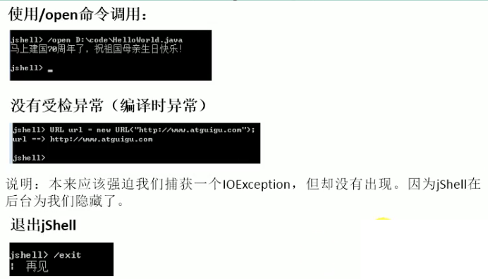

## # Java 8新特性

本章內容

    Lambda表達式
    函數式接口
    方法引用/構造器引用
    Stream API
        並行流
        串行流
    接口的增強
        接口的靜態方法
        接口的默認方法
    Optional類
    新的時間API
    其他新特性
        重複註解
        類型註解
        通用目標類型推斷
        JDK的更新
            集合的流式操作
            並發
            Arrays
            Number和Math
            IO/NIO的改進
            Reflection獲取形參名
            String: join()
            Files
        新編譯工具：jjs、jdeps
        JVM中Metaspace取代PermGen空間

### Java8新特性簡介

- Java 8 (又稱為 jdk 1.8) 是 Java 語言開發的一個主要版本，
- Java 8 是oracle公司於2014年3月發布
  - 速度更快
  - 代碼更少(增加了新的語法:Lambda表達式)
  - 強大的|Stream API
  - 便於並行
  - 最大化減少空指針異常:Optional類
  - Nashorn引擎，允許在JVM上運行JavaScript應用（`jdk8/bin/jjs.exe` --->` jjs program.js`）

#### Stream的並行流與串行流

- 並行流就是把一個內容分成多個數據塊，並用不同的線程分別處理每個數據塊的流。相比串行流，`並行流可以很大程度上提高程序的執行效率。`
  
- Java 8中，Stream API可以通過 parallel()把此流轉為並行流，sequential()把此流轉為為順序流。

### Lambda表達式

為什麼使用Lambda表達式

- Lambda 可理解為一個`匿名內部類的方法`，
- 我們可以把 Lambda 表達式理解為是`一段可以傳遞的代碼`（將代碼像數據一樣進行傳遞）。
- 使用它可以寫出更簡潔、更靈活的代碼。
- 作為一種更緊湊的代碼風格，使Java的語言表達能力得到了提升。

舉例：

之前的方式

```java
/**
 * 實現接口的匿名內部類實例，之前的方式
 */
@Test
public void test1() {
  	// ex1:
    Runnable runnable = new Runnable() {
        @Override
        public void run() {
            System.out.println("匿名內部類實例");
        }
    };
 		runnable.run();
    // or
    Thread t = new Thread(runnable);
    t.start();
  	
  	// ex2:
  	Comparator<Integer> comparator2 = new Comparator<>() {
      @Override
      public int compare(Integer o1, Integer o2) {
        return Integer.compare(o1, o2);
      }
		};
		int compare = comparator2.compare(43, 76);
		System.out.println(compare);
}
```

Lambda表達式

```java
/**
 * Lambda表達式
 */		
@Test
public void test2() {
  // ex1:
  Runnable runnable = () -> System.out.println("Hello Lambda");
  
  // ex2:
  // Lambda表達式
  Comparator<Integer> comparator2 = (o1, o2) -> {
    return Integer.compare(o1, o2);
  };
  int compare = comparator2.compare(43, 76);
  System.out.println(compare);
  
  // 方法引用
  Comparator<Integer> comparator3 = Integer::compare;
  System.out.println(comparator3.compare(43, 76));
}
```

Lambda表達式格式

```java
-> : lambda操作符(或叫箭頭操作符)
->的左邊: lambda形參列表 (其實就是接口中的抽象方法的形參列表)
->的右邊: lambda體 (其實就是接口抽象方法的重寫後的方法體)
```

Lambda表達式的本質

- 創建一個`實現函數式接口`的`匿名內部類`的`實例`，函數式接口就是有且僅有一個抽象方法的接口
- 由於 Lambda 表達式就是一個函數式接口的實例，所以以前用匿名實現類表示的，現在都可以用 Lambda 表達式來寫
- 所以Lambda表達式是對象寫lambda表達式時，要清楚要實現的函數式接口那個抽象方法的結構，方法名，形參列表，返回值
- `函數式接口的定義 只包含一個抽象方法的接口，稱為函數式接口`

Lambda表達式的6種語法格式

```java
// --- 語法格式1：無參, 無返回值 --- 
    Runnable r2 = () -> System.out.println("菩提本無樹,明鏡亦非台;本來無一物,何處惹塵埃。");
    r2.run();


// --- 語法格式2：有一個參數，無返回值 --- 
    Consumer<String> con2 = (String s) -> System.out.println(s);
    con2.accept("一個是聽的人信了，一個是說的人信了");


// --- 語法格式3：數據類型可以省略，因為可由編譯器推斷得出，稱為"類型推斷" --- 
    Consumer<String> consumer = (String s) -> System.out.println(s);
    consumer.accept("一個是聽的人信了，一個是說的人信了");
    System.out.println("\n// --------------------\n");

    // Lambda 簡化寫法
    Consumer<String> consumer2 = (s) -> System.out.println(s);


// --- 語法格式4：Lambda 值需要一個參數時，參數的小括號可以省略 --- 
    Consumer<String> consumer = s -> System.out.println(s);
    consumer.accept("千里冰封，萬里雪飄。");


// --- 語法格式5：Lambda 需要兩個或兩個以上的參數，有多條執行語句，並且可以有返回值 --- 
    Comparator<Integer> comparator1 = (o1, o2) -> {
        System.out.println(o1);
        System.out.println(o2);
        return o1.compareTo(o2);
    };
    System.out.println("比較結果：" + comparator1.compare(10, 18));


// --- 語法格式6：當Lambda體只有一條語句時，若有return與大括號，可以一起省略，且這兩者要麼一起省略，要麼一起保留 --- 
    Comparator<Integer> com1 = (o1, o2) -> {
        return o1.compareTo(o2);
    };
    System.out.println(com1.compare(33, 44));
    System.out.println("\n// --------------------\n");

    // Lambda 簡略寫法
    Comparator<Integer> com2 = (o1, o2) -> o1.compareTo(o2);
    System.out.println(com2.compare(33, 44));
```

語法格式總結

```java
語法格式總結
() -> {}

->左邊: Lambda 形參列表的參數類型可以省略(類型推斷)
     如果lambda形參列表只有一個參數時，包裹形參列表的小括號()可以省略
     
->右邊: Lambda體使用一對{ }包裹，
     如果lambda體只有一條語句時(包括只有一條return語句)，可以一起省略一對{ }和return關鍵字,
     這種情況下的{}與return要麼一起省略，要麼一起保留
```

### 函數式(Functional)接口

- `只包含一個抽象方法的接口，稱為函數式接口`
- 可以通過Lambda表達式來創建該接口的對象 （若Lambda表達式拋出一個受檢異常(即：非運行時異常)，那麼該異常需要在被實現的目標接口的抽象方法上進行聲明）
- 我們可以在一個接口上使用@FunctionalInterface註解， 這樣做可以檢查它是否是一個函數式接口。同時javadoc也會包含一條@FunctionalInterface註解聲明，說明這個接口是一個函數式接口
- 在java.util.function包下定義了Java8的豐富的函數式接口

java內置的函數式接口

| 函數接口                  | 抽象方法                       | 備注                          |
| ------------------------- | ------------------------------ | ----------------------------- |
| 消費型接口:Consumer<T>    | void accept(T t)               |                               |
| 供给型接口:Supplier<T>    | T get()                        |                               |
| 函數型接口:Function<T, R> | R apply(T t)                   | R為返回的類型                 |
| 斷定型接口:Predicate<T>   | boolean test(T t)              |                               |
| BiFunction<T, U, R>       | R apply(T t, U u)              | Function的子接口，R為返回類型 |
| UnaryOperate<T>           | T apply(T t)                   | BiFunction的子接口            |
| BinaryOperate<T, T>       | T apply(T t1, T t2)            |                               |
| BiConsumer(T, U)          | void accept(T t, U u)          |                               |
| BiPredicate<T, U>         | boolean test(T t, U u)         |                               |
| ToIntFunction<T>          | int applyAsInt(T value)        |                               |
| ToLongFunction<T>         | long applyAsLong(T value);     |                               |
| ToDoubleFunction<T>       | double applyAsDouble(T value); |                               |
| IntFunction<R>            | R apply(int value);            |                               |
| LongFunction<R>           | R apply(long value);           |                               |
| DoubleFunction<R>         | R apply(long value);           |                               |


舉例

```java
/**
 * 根據給定的規則，過濾指定集合中字符串，並返符合條件的元素組成的新的集合。具體規則有Predicate的test方法決定
 * @param list
 * 指定的集合
 * @param predicate
 * 判斷規則
 * @return 返符合條件的元素組成的新的集合
 */
public List<String> filterString(List<String> list, Predicate<String> predicate) {
  ArrayList<String> filterList = new ArrayList<>();
  for (String s : list) {
    if (predicate.test(s)) {
      filterList.add(s);
    }
  }
  return filterList;
}

/**
 * 過濾list中含"a"的元素
 */
@Test
public void test2() {
  List<String> list = Arrays.asList("asd", "ffg", "ksa", "wav", "poc");
  List<String> list1 = filterString(list, new Predicate<String>() {
    @Override
    public boolean test(String s) {
      return s.contains("a");
    }
  });
  System.out.println(list1);

  System.out.println("\n// --------------------\n");

  // lambda寫法
  List<String> list2 = filterString(list, s -> s.contains("京"));
  System.out.println(list2);
}
```

#### 方法引用method references

- 當要傳遞給Lambda體的操作，已經有實現的方法了，可以使用方法引用
  格式：使用操作符`"::" `將類(或對象) 與方法隔開。`類::方法名`，`對象::方法名`

方法引用的本質

- 方法引用可以看作是Lambda表達式深層次的表達，換句話說，`方法引用本質就是lambada表達式，也就是函數式接口的匿名內部的實例`，
- lambda表達式作為實現函數式接口的匿名內部的實例，所以方法引用也是實現函數式接口的匿名類的實例
- 要求：`實現接口的 抽象方法的 參數列表和返回值類型，必須與方法引用的 方法的 參數列表和返回值類型`。

方法引用三種使用情況

- 情況1： 對象::非靜態方法名
- 情況2： 類::靜態方法名
- 情況3： 類::非靜態方法名

```java
方法引用的要求（正對情況1、情況2）---> 要求函數式接口中抽象方法的形參列表、返回值類型 與 引用方法的形參列表、返回值類型要相同
例如：
/*
 情況一：對象::非靜態方法名
 Consumer  void accept(T t)
 PrintStream  void println(T t)
*/
Consumer<String> con = x -> System.out.println(x);
// 等同於
Consumer<String> con1 = System.out::println;
con1.accept("hello1");
// or
PrintStream ps = System.out;
Consumer<String> con2 = ps::println;
con2.accept("hello2");

// 因為：
Consumer中的void accept(T t)
PrintStream中的void println(T t) 把此方法當作實現了Consumer接口的方法

/*
	情況一：對象::非靜態方法名(必須通過實例對象調用)
	Supplier T get()
	Employee String getName()
*/
  Employee emp = new Employee(1001, "atom", 23, 37640);
	Supplier<String> sup1 = () -> emp.getName();
	System.out.println(sup1.get());
// same as
	Supplier<String> sup2 = emp::getName;
	System.out.println(sup2.get());
  
  
  /**
  * 情況二：類::靜態方法名
  * Comparator中的int compare(T t1,T t2)
  * Integer中的int compare(T t1,T t2)
  */
  @Test
  public void test3() {
    Comparator<Integer> comparator = (t1, t2) -> Integer.compare(t1, t2);
    System.out.println(comparator.compare(90, 120));

    System.out.println("\n// --------------------\n");

    // 方法引用
    Comparator<Integer> comparator1 = Integer::compare;
    System.out.println(comparator1.compare(90, 120));
  }

------------------------------------------------------

/**
* 情況三：類::實例方法名
* Comparator中的int comapre(T t1,T t2)
* String中的int t1.compareTo(t2)
  */
@Test
public void test5() {
  Comparator<String> comparator = (t1, t2) -> t1.compareTo(t2);
  System.out.println(comparator.compare("abc", "abd"));

  System.out.println("\n// --------------------\n");

  // 方法引用
  Comparator<String> comparator1 = String::compareTo;
  System.out.println(comparator1.compare("abc", "abd"));
}


// Function R apply(T t)
// Employ String getName();
@Test
public void test6() {
  Employee emp = new Employee(1001, "atom", 23, 37640);
  Function<Employee, String> func1 = e -> e.getName();
  System.out.println(func1.apply(emp));
  
  System.out.println("\n// --------------------\n");
  
  Function<Employee, String> func2 = Employee::getName;
  System.out.println(func2.apply(emp));
}
```

#### 構造器引用

與方法引用類似，函數式接口中抽象方法的參數列表 與 構造器的參數列表一致
Fcuntion的返回值為構造器所屬類的類型

舉例

空參構造器

```java
/**
     * 構造器引用
     * 空參構造器
     *
     * Supplier中的T get()
     * Employee 空參構造器: Employee(), 調用其空參構造器創建對象，Employee e = new Employee();
     */
    @Test
    public void test1(){
        // 創建一個 匿名內部類實現接口的對象
        Supplier<Employee> supplier = new Supplier<Employee>() {
            @Override
            public Employee get() {
                return new Employee();
            }
        };
        System.out.println(supplier.get());

        System.out.println("\n// --------------------\n");
    
        // lambda寫法
        Supplier<Employee> supplier1 = () -> new Employee();
        System.out.println(supplier1.get());
        System.out.println("\n// --------------------\n");
    
        // 構造器引用
        Supplier<Employee> supplier2 = Employee::new;
        System.out.println(supplier2.get());
    }
```

一個參數構造器

```java
/**
     * 構造器引用
     * 一個參數構造器
     *
     * Function中的R apply(T t)
     */
    @Test
    public void test2(){
        // lambda寫法
        Function<Integer, Employee> func = id -> new Employee(id);

        System.out.println(func.apply(1001));
        System.out.println("\n// --------------------\n");
    
        // 方法引用寫法
        Function<Integer, Employee> func2 = Employee::new;
        System.out.println(func2.apply(1002));

}
```

兩個參數構造器

```java
/**
     * 構造器引用
     * 兩個參數構造器
     *
     * BiFunction中的R apply(T t,U u)
     */
    @Test
    public void test3(){
        // lambda寫法
        BiFunction<Integer, String, Employee> biFunction = (id, name) -> new Employee(id, name); // ->左邊的(id, name)編譯器使用類型推斷，自動把類型補上
        Employee e = biFunction.apply(1003, "趙八");
        System.out.println(e);
        System.out.println("\n// --------------------\n");

        // 方法引用寫法
        BiFunction<Integer, String, Employee> biFunction1 = Employee::new;
        Employee e1 = biFunction.apply(1003, "趙八");
        System.out.println(e1);

}
```

#### 數組引用

只適用於一維數組
把數組看成時一個特殊的類，則寫法與構造器引用一致

```java
/**
 * 數組引用
 *
 * Function中的R apply(T t)
 */
@Test
public void test4(){
  String[] iArr = new String[4];
  System.out.println(iArr.toString());
  System.out.println("\n// --------------------\n");

  // lambda寫法
  Function<Integer, String[]> func2 = length -> new String[length];
  String[] i2= func2.apply(4);
  System.out.println(Arrays.toString(i2));
  System.out.println("\n// --------------------\n");

  // 數組引用寫法，使用於一維數組
  Function<Integer, String[]> func3 = String[]::new;
  String[] i3 = func3.apply(4);
  System.out.println(Arrays.toString(i3));

  // String[][]
  String[][] ss = new String[2][3];
  BiFunction<Integer, Integer, String[][]> biFunction = (length1, length2) -> new String[length1][length2];
  String[][] ss1 = biFunction.apply(2, 3);
  System.out.print("[ ");
  for (String[] sArr : ss1) {
    System.out.print(Arrays.toString(sArr) + ", ");
  }
  System.out.print(" ]");

  // 二維數組的引用不適用了

  // BiFunction<Integer, Integer, String[][]> biFunction2 = String[][]::new;
}
```

### Stream API

- 用於操作數據源(集合、數組等)所生成的元素序列，提供了一種高效易用的處理數據方式

- 作用：主要是對集合的計算操作，如查找、過濾、映射、歸約等

Stream與Collection集合區別

- `Stream關注的是對數據的運算，與CPU打交道`
- Collection集合關注的是數據的存儲，與內存打交道。` Collection集合是靜態的內存數據`

Stream特點

- Stream 自己不會存儲元素
- Stream不會改變源對象。相反的，它們會返回一個包含結果的新Stream
- Stream 操作是`延遲的`。即它們會等到需要結果的時候才會執行

Stream執行流程

1. Stream的實例化
   - 通過一個數據源對象(集合、數組等)，獲取一個流，以及其他方式

2. 中間操作
   - 一個中間操作鏈，一系列操作(過濾、映射 ...)，對數據源的數據進行處理

3. 終止操作
   - `一旦執行終止操作，就執行中間操作鏈，並產生結果。之後，這個Stream對像不能再被使用`

#### Stream實例化的幾種方式

方式1：通過`集合Collection`的默認方法

```java
方式1：通過集合的默認方法
// Collection.java 中 Stream 接口默認方法
default Stream<E> stream(){
  return StreamSupport.stream(spliterator(), false);
}  
  
public class EmployeeData{
  public static List<Employee> getEmployees(){
    List<Employee> list = new ArrayList<>();
    
    list.add(new Employee(1001, "ema", 24, 30000));
    list.add(new Employee(1002, "tom", 31, 55000));
    // ... 
    return list;
  }
}

List<Employee> employees = new EmployeeData.getEmployee();

// default Stream<E> stream(): 返回一個順序流 = output order same  as employees list 
Stream<Employee> stream = employeeList.stream();

// default Stream<E> parallelStream(): 返回一個並行流 = output order is uncertain
Stream<Employee> parallelstream = employeeList.parallelStream();
```

方式2：通過`數組Arrays類`的默認方法(只適用於順序流)

```java
方式2：通過數組Arrays類的默認方法(只適用於順序流)

int[] arr = new int[]{3, 1, 4, 7};

// 調用Arrays類的public static <T> Stream<T> stream(T[] array): 返回一個流
IntStream intStream = Arrays.stream(arr);

Employee e1 = new employee(1001, "jerry", 24, 68888);
Employee e1 = new employee(1001, "lisa", 27, 98888);
// Employee[] arr1 = new Employee[]{e1, e2};
Employee[] arr1 = {e1, e2};
Stream<Employee> stream1 = Arrays.stream(arr1);


// default Stream<E> parallelStream(): 返回一個並行流
Stream<Employee> parallelStream = employeeList.parallelStream();
```

方式3：通過`Stream接口的of()方法`

```java
/**
 * 創建Stream對象方式3：通過Stream接口的of()方法
 * public static<T> Stream<T> of(T t)
 */
@Test
public void test3() {
  Stream<Integer> stream = Stream.of(13, 13, 1, 3, 5);

}
```

方式4：創建無限流

```java
/**
 * 創建Stream對象方式4：創建無限流
 * public static<T> Stream<T> iterate(final T seed, final UnaryOperator<T> f)
 * public static<T> Stream<T> iterate(T seed, Predicate<? super T> hasNext, UnaryOperator<T> next)
 * public static<T> Stream<T> generate(Supplier<? extends T> s)
   */
@Test
public void test4() {
  // 迭代
  Stream<Integer> stream = Stream.iterate(0, t -> t + 2);
  // iterate.forEach(System.out::println); // 無限打印下去

  // 遍歷前10個元素
  stream.limit(10).forEach(System.out::println);
  System.out.println();


  // 生成
  Stream<Double> stream1 = Stream.generate(Math::random);

  // stream1.forEach(System.out::println); // 不停遍歷下去
  stream1.limit(5).forEach(System.out::println);

}
```

順序流與並行流的互轉

- `parallel()`把此Stream流轉成並行流
- `sequential()`把此Stream流轉成順序流

```java
@Test
public void test5() {
  Stream<Employee> parallel = employeeList.stream().parallel();
  Stream<Employee> sequential = employeeList.parallelStream().sequential();
}
```


#### Stream接口的中間操作

篩選與切片

```java
Stream<T> filter(Predicate<? super T> predicate);
     接收一個判定型的lambda表達式，從流中篩選出符合條件的元素。
     
Stream<T> limit(long maxSize);
     截斷流，截斷流後的長度不超過maxSize（包含等於），相當於返回取流中的前maxSize個元素組成的流，元素不夠不報錯

Stream<T> skip(long n);
     跳過流前面的n個元素，返回由剩下的元素組成的流。如果元素個數<=n，則返回一個空元素Stream對象
     與Stream<T> limit(long maxSize)互為把相反操作

Stream<T> distinct();
     去重，返回去除了重複元素之後組成的流
```

映射

```java
<R> Stream<R> map(Function<? super T, ? extends R> mapper);
    接收一個函數作為參數，將元素轉換成其他形式或提取信息。 map方法會自動遍歷所有的元素，該函數會被應用到每個元素上，並將其映射成一個新的元素，一一對應
    類似於test3()中的list1.add(list2);

<R> Stream<R> flatMap(Function<? super T, ? extends Stream<? extends R>> mapper);
    接收一個函數作為參數，將流中的每個值都換成另外一個流，然後把所有流連接成一個流
    類似於下面 test4()中的list1.addAll(list2);
     
IntStream mapToInt(ToIntFunction<? super T> mapper)
    接收一個函數作為參數，函數mapper應用到每個元素上，產生一個新的IntStream流
    
LongStream mapToLong(ToLongFunction<? super T> mapper)
    接收一個函數作為參數，函數mapper應用到每個元素上，產生一個新的LongStream流
    
DoubleStream mapToDouble(ToDoubleFunction<? super T> mapper)
    接收一個函數作為參數，函數mapper應用到每個元素上，產生一個新的DoubleStream流
```

排序

```java
Stream<T> sorted();
     自然排序。
     只對順序流有效，對於parallelStream並行流無效

Stream<T> sorted(Comparator<? super T> comparator);
     定制排序
     只對順序流有效，對於parallelStream並行流無效
```

#### Stream接口的終止操作

匹配與查找

```java
boolean allMatch(Predicate<? super T> predicate);
    檢查是否匹配所有的元素

boolean anyMatch(Predicate<? super T> predicate);
    檢查是否至少匹配一個元素

boolean noneMatch(Predicate<? super T> predicate);
    檢查是否沒有匹配所有的元素

Optional<T> findFirst();
    返回第一個元素，若沒有元素則返回一個空的Optional對象

Optional<T> findAny();
    返回當前流中的任意元素，若沒有元素則返回一個空的Optional對象
    順序流中查找的為第一個元素，
    並行流中查找的則不一定為第一個元素。對於同一個集合，基本上每次查找的都是同一個

long count();
    返回流中元素的個數

Optional<T> max(Comparator<? super T> comparator);
    返回流中排序後的最大值元素

Optional<T> min(Comparator<? super T> comparator);
    返回流中排序後的最小值元素

void forEach(Consumer<? super T> action);
    內部迭代。 (使用Collection接口的forEach，需要用戶去做迭代，稱為外部迭代)
```

歸約

```java
T reduce(T identity, BinaryOperator<T> accumulator);
     可以將流中的元素反复結合起來，得到一個值。返回T
     identity: 初始值
     sum、min、max、average和string連接都是歸約的特殊情況

Optional<T> reduce(BinaryOperator<T> accumulator);
     可以將流中的元素反复結合起來，得到一個值。返回Optinal<T>

<U> U reduce(U identity,
                 BiFunction<U, ? super T, U> accumulator,
                 BinaryOperator<U> combiner);
```

收集

```java
<R, A> R collect(Collector<? super T, A, R> collector);
    將流轉換為其他形式。接收一個Collector接口的實現實例，用於給Stream中元素做收集的方法
    Collector接口實現實例的方法決定瞭如何對流執行收集操作（如收集到List、Set、Map）
    另外，Collectors實現類提供了很多靜態方法，可以方便地創建常見收集器實例

    例如：把list中的員工信息轉換成以id為key，Employee對象為值的Map中
    Function<Employee, Integer> keyMapper = Employee::getId;
    Function<Employee, Employee> valueMapper = e -> e;
    Map<Integer, Employee> employeeMap = employeeList.stream().collect(Collectors.toMap(keyMapper, valueMapper));
    employeeMap.forEach((k, v) -> System.out.println(String.format("key:%s, value:%s", k, v)));


<R> R collect(Supplier<R> supplier,
                 BiConsumer<R, ? super T> accumulator,
                 BiConsumer<R, R> combiner);
```

### Collectors類

- Collectors實用類提供了很多靜態方法，可以方便地創建常見收集器實例


Collectors常用方法

```java
static Collector<T,?,List> toList()

把流中的元素收集到List中，返回一個Collector

static Collector<T,?,Set> toSet()

把流中的元素收集到Set中，返回一個Collector

static <T,K,U> Collector<T,?,Map<K,U>> toMap(
Function<? super T,? extends K> keyMapper,
Function<? super T,? extends U> valueMapper
)

把流中的元素收集到Map中，返回一個Collector
```

### Optional類


- 只能存放一個元素的容器
- 使用場景：在程序中避免空指針異常

Optional方法

```java
* 創建Optional類對象
  public static<T> Optional<T> empty()
    創建一個空value值的Optional對象

public static <T> Optional<T> of(T value)
    創建指定值為value的Optional類對象 
  	value不能為null，為空時報空指針異常java.lang.NullPointerException
  
public static <T> Optional<T> ofNullable(T value)
創建指定值為value的Optional類對象
    value 可以為 null，此時Optional對象為空的Optional，不能使用 get()取裡面的值
  通常和 orElseGet(Supplier<? extends T> supplier)方法配合使用， ofNullable(T value) value 皆可以為 null，當 Optional 容器的 value 屬性值不為 null，則直接返回 value，否則返回 supplier


* 獲取Optional容器中的對象
  public T orElse(T other)
    獲取此Optional容器獲取value值。如果此Optional容器的value屬性(元素)不為null，則直接返回value，否則返回指定的對象other
    與ofNullable(T value)配合使用

public T get()
    獲取此Optional容器獲取value值。如果此Optional容器的value屬性值不為null，則直接返回value，否則(value值為null)拋出異常NoSuchElementException
    與 of(T value)方法配合使用。
    必須確保value屬性值不為空才能取到值。可以調用isPresent()或isEmpty()來判斷value屬性值是否為空

public T orElseGet(Supplier<? extends T> supplier)
    獲取此Optional容器獲取value值。如果此Optional容器的value屬性值不為null，則直接返回value，否則執行已實現Supplier接口實例supplier的supplier.get()

public T orElseThrow()
    獲取此Optional容器獲取value值。如果此Optional容器的value屬性值不為null，則直接返回value，否則拋出異常NoSuchElementException
    與 get()等價


* 判斷Optional容器中是否包含對象
  public boolean isPresent()
    判斷此Optional容器的value值是否存在，存在返回true，否則false。即判斷value是否為null

public void ifPresent(Consumer<? super T> action)
    此Optional容器的value值存在，則執行實現Consumer接口實例action的action.accept(value)方法，否則不做任何處理

public boolean isEmpty()
    判斷此Optional容器的value值是否為null。是返回true，否則false。
    與isPresent()方法取相反的值
```


Optional示例

** 防止空指針的應用 **

```java
// under no optional condition, 
public String getEmployeeName(Employee employee) {
  return employee.getName(); // employee有可能為null, modified to getEmployeeName2
}

public String getEmployeeName2(Employee employee) {
  if (employee != null) {
    String name =  employee.getName();
    if(name != null) {
      // if(){...}
      return name;
    }
  }
  return null;
}

/**
 * Optional防止空指針的應用
 * @param employee
 * @return
 */
public String getEmployeeName3(Employee employee) {
  Optional<Employee> optional = Optional.ofNullable(employee);
  Employee e = optional.orElse(new Employee("leon"));
  return e.getName();
}


@Test
public void test7(){
  Employee emp = new Employee();
  emp = null;

  Optional<Employee> optional = Optional.ofNullable(emp);
  System.out.println(optional); //Optional.empty

  Employee e = optional.orElse(new Employee("atom")); // 如果此Optional容器的value屬性(元素)不為null，則直接返回value，否則返回指定的對象other
  System.out.println(e.name); // atom
}
```

### java8註解新特性

- 可重複的註解
- 可用於類型的註解
- 元註解@Target的參數類型ElementType枚舉值多了兩個`TYPE_PARAMETER,TYPE_USE`
  - `ElementType.TYPE_PARAMETER` --> 表示該註解能寫在類型變量的聲明語句中（如：泛型聲明）
  - `ElementType.TYPE_USE` --> 表示該註解能寫在使用類型的任何語句中

- 在java 8之前，註解只能是在聲明的地方使用，java 8 開始，@Target為ElementType.TYPE_USE註解可以用在任何地方

可重複的註解

```java
@Target({TYPE, FIELD, METHOD, PARAMETER, CONSTRUCTOR, LOCAL_VARIABLE, MODULE})
@Retention(RetentionPolicy.RUNTIME)
@interface Annotations {
    MyAnnotation[] value();
}

/**

 * 可重複的註解
   */
   @Repeatable(Annotations.class) // 修飾class可重複
   @Target({TYPE, FIELD, METHOD, PARAMETER, CONSTRUCTOR, LOCAL_VARIABLE, MODULE, TYPE_PARAMETER})
   @Retention(RetentionPolicy.RUNTIME)
   public @interface MyAnnotation {
   // String[] value();

   // 也可以定義帶默認值的
   String[] value() default {"hehe"};
   }


// 重複的註解
@MyAnnotation("Hello")
@MyAnnotation("World")
class AnnotationTest {
    // 數據類型的註解
    public void show(@MyAnnotation("abc") String string) {
        System.out.println("show 方法...");
    }
}
```


** 可以用於註解類型 **

```java
@Target(ElementType.TYPE_PARAMETER)
public @interface MyAnnotation2 {

}

// 註解類型
class TypeDefine<@MyAnnotation2() U> {
    // 字段屬性
    private U u;

    // 方法
    public <@MyAnnotation2() T> void test(T t) {
        System.out.println("test method..." + u);
        System.out.println(t);
    }
}
```


```java
@Target(ElementType.TYPE_USE)
public @interface MyAnnotation3 {

}


// 註解放任何地方
@MyAnnotation3
class TypeDefine2<U> {
  @MyAnnotation3 private String name;
  // 構造器
  public @MyAnnotation3 TypeDefine2() {
    super();
  }

  @MyAnnotation3 public TypeDefine2(String name) {
    this.name = name;
  }

  // 方法
  public static void getDesc() {
    TypeDefine2<@MyAnnotation3 String> t = null;
    int a = (@MyAnnotation3 int) 2L;
    int b = 10;
  }

  public static <@MyAnnotation3 T> void run(T t) {
    System.out.println(t);
  }

  public void speak(@MyAnnotation3 String str) throws @MyAnnotation3 Exception{
    System.out.printf("%s: %s", name, str);
  }
```


### java8接口的改進

從java8開始，接口可以添加默認方法、靜態方法

默認方法

- 默認方法使用default關鍵字修飾。可以通過實現類對象來調用。
- 不管寫不寫public修飾，都是public，修飾的
- 我們在已有的接口中提供新方法的同時，還保持了與舊版本代碼的兼容性。
- 比如java 8 API中對Collection、List、Comparator等接口提供了豐富的默認方法

靜態方法

- 使用static關鍵字修飾。可以通過接口直接調用靜態方法。
- 不管寫不寫public修飾，都是public，修飾的
- 我們經常在相互一起使用的類中使用靜態方法。
- 你可以在標準庫中找到像Collection、Collections、Path、Paths這樣成對的接口和類

注意

```java
@interface 修飾的接口，不是聲明了一個interface，它是註解，繼承了java.lang.annotation.Annotation 接口

interface 修改的接口才是聲明了一個interface
```


#### 接口中默認方法的"類優先"原則

若一個接口中定義了一個默認方法，而另外一個父類或接口中又定義了一個同名的方法時

1. 選擇父類中的方法
   - 果一個父類提供了具體的實現，那麼接口中具有相同名稱和參數的默認方法會被忽略

2. 接口衝突
   - 如果一個父接口提供一個默認方法，而另一個接口也提供了一個具有相同名稱和參數列表的方法（不管方法是否是默認方法），那麼必須覆蓋該方法來解決衝突

** 示例 ** 接口衝突示例


### 新的時間API

- java 8 吸收了Joda-Time的精華，引入了java.time接口。 java 8之前可以用第三方的Joda-Time。

- java 8之前的日期時間API存在的問題：
  - 可變性：像日期和時間這樣的類應該是不可變的。即已經示例化的時間日期對像還能被更改
  - 偏移性：Date中的年份是從1900開始的，而月份都從0開始
  - 格式化：格式化只對Date有用，Calendar則不行
  - 它們也不是線程安全的；不能處理閏秒等

#### 新的時間類包結構

```java
java.time

包含值對象的基礎包

java.time.chrono

提供對不同的日曆系統的訪問

java.time.format

格式化和解析時間、日期

java.time.temporal

包括底層框架和擴展特性

java.time.zone

包含時區支持的類

LocalDate
LocalTime
LocalDateTime
Instant
DateTimeFormatter
其他類
```

##### LocalDate、LocalTime、LocalDateTime

```java
這幾個類是其中較重要的幾個類，它們的實例是不可變的對象，
它們提供了簡單的本地日期或時間，並不包含當前的時間信息，也不包含與時區相關的信息
    LocalDate：使用ISO-8601日曆系統的日期

        代表IOS格式（yyyy-MM-dd）的日期,可以存儲生日、紀念日等日期

    LocalTime：公曆的時間

        表示一個時間，而不是日期

    LocalDateTime：公曆的日期和時間

        是用來表示日期和時間的，這是一個最常用的類之一

注：ISO-8601日曆系統是國際標準化組織製定的現代公民的日期和時間的表示法，也就是公曆。
```

LocalDateTime類


LocalDateTimeTest、時間格式化與解析


DateTimeFormatterTest

##### Date與LocalDateTime互轉

Date為：java.util.Date

Date轉LocalDateTime

```java
Date todayDate = new Date();

LocalDateTime ldt = todayDate.toInstant()
        .atZone( ZoneId.systemDefault() )
        .toLocalDateTime();

System.out.println(ldt);
//2020-03-16T21:20:12.773
```
LocalDateTime轉Date

```java
LocalDateTime localDateTime = LocalDateTime.now();

Date date = Date.from( localDateTime.atZone(ZoneId.systemDefault()).toInstant() );

System.out.println(date);
//Thu May 16 19:22:37 CST 2019
```

DateUtils

```java
import java.time.Instant;
import java.time.LocalDate;
import java.time.LocalDateTime;
import java.time.ZoneId;
import java.util.Date;
 
public class DateUtils {
 
    public static Date asDate(LocalDate localDate) {
        return Date.from(localDate.atStartOfDay().atZone(ZoneId.systemDefault()).toInstant());
    }
 
    public static Date asDate(LocalDateTime localDateTime) {
        return Date.from(localDateTime.atZone(ZoneId.systemDefault()).toInstant());
    }
 
    public static LocalDate asLocalDate(Date date) {
        return Instant.ofEpochMilli(date.getTime()).atZone(ZoneId.systemDefault()).toLocalDate();
    }
 
    public static LocalDateTime asLocalDateTime(Date date) {
        return Instant.ofEpochMilli(date.getTime()).atZone(ZoneId.systemDefault()).toLocalDateTime();
    }
}
```


#### Instant瞬時

- 時間線上的一個瞬時點。
- 這可被用來記錄應用程序中的事件時間戳

##### 時間戳

```java
在處理時間和日期的時候，我們通常會想到年,月,日,時,分,秒。
然而，這只是時間的一個模型，是面向人類的。

第二種通用模型是面向機器的，或者說是連 續的。
在此模型中，時間線中的一個點表示為一個很大的數，這有利於計算機處理。

在UNIX中，這個數從1970年開始，以秒為的單位；
同樣的，在Java中，也是從1970年開始，但以毫秒為單位。

java.time包通過值類型Instant提供機器視圖，不提供處理人類意義上的時間單位。
Instant表示時間線上的一點，而不需要任何上下文信息，例如，時區。
概念上講，它只是簡單的表示自1970年1月1日0時0分0秒（UTC）開始的秒數。
因為java.time包是基於納秒計算的，所以Instant的精度可以達到納秒級

1ns = 10-9s

1秒 = 1000毫秒 = 10^6微秒 = 10^9納秒

1s = 1000ms = 10^6μs = 10^9ns
```

Instant方法

```java
now(): 獲取0時區的瞬時點(時間戳)
atOffset(ZoneOffset offset)：添加時間偏移量
toEpochMilli(long epochMilli)：獲取紀元秒，即自1970-1-1 00:00:00 UTC開始的毫秒
ofEpochSecond(long epochSecond)：根據指定紀元秒創建Instant實例 Instant方法使用示例
InstantTest
```

##### Instant與LocalDateTime互轉

```java
public void test2() {
    // Instant 轉 LocalDateTime
    Instant instant = Instant.now();
    LocalDateTime localDateTime = LocalDateTime.ofInstant(instant, ZoneId.of("UTC+8"));

    System.out.println(instant);
    System.out.println(localDateTime);
    System.out.println();

    try {
        Thread.sleep(2000);
    } catch (InterruptedException e) {
        e.printStackTrace();
    }

    // LocalDateTime 轉 Instant
    LocalDateTime localDateTime1 = LocalDateTime.now();
    Instant instant1 = localDateTime1.toInstant(ZoneOffset.ofHours(+8));
    System.out.println("localDateTime1: " + localDateTime1);
    System.out.println("instant1: " + instant1);
}
```
#### 其他時間API

- ZoneId
- ZoneDateTime
- Clock
- ChronoUnit計算兩LocalDateTime、LocalDate、LocalTime差值(時分秒日月年等任選)
- Duration計算兩LocalDateTime、LocalTime的差值(秒、納秒)
  - 用於計算兩個"時間"間隔
- Period計算兩LocalDate的差值(年月日)
  - 用於計算兩個"日期"間隔
- TemporalAdjuster
- TemporalAdjusters


### ArrayList在java7和java8上的異同

- java 7中，ArrayList像餓漢式，直接創建一個初始容量為10的數組，存滿了時再擴容，擴容為原來的1.5倍
- java 8中，ArrayList像懶漢式，一開始創建一個長度為0的數組，當添加第一元素時創建一個容量為10的數組,存滿了再擴容，擴容為原來的1.5倍

#### HashMap在java7和java8的實現原理

HashMap在java7的實現原理

```java
HashMap map = new HashMap();

* 在實例化後，底層創建了一個長度為16的一維數組Entry[] table.
* map.put(key1, value1)
  * 首先調用key1所在類的hash(hashCode())計算key1哈希值，此哈希值通過某種算法(&(數組長度-1)運算)，得到Entry在數組中的存放位置。
    情況1：如果此位置上的數據為空，此時的key1-value1對添加成功
          如果此益上的數據不為空(即此位置上存在一個或多個數據[以鍊錶形式存儲])，
          此時key1和已經存在的一個或多個數據的哈希值進行比較：
    情況2：如果key1的哈希值與已經存在數據所哈希值都不相同，此時key1-value1添加成功
          如果key1的哈希值與已經存在數據(如key2-value2)的哈希值相同，繼續比較：
          調用 key1.equals(key2)方法，
    情況3：如果比較結果為false，此時key1-value1添加成功
          如果比較結果為true，使用value1替換value2。即更新
  * 關於情況2、情況3，此時key1-value1和原來的數據以鍊錶的方式存儲
* 在不斷添加元素的過程中，當超過臨界值(且存放位置不為空，臨界值為數組長度的0.75)，會涉及到擴容問題，默認的擴容方式：擴容為原來容量的2倍，並將原來的元素一個一個重新計算添加進來
```

HashMap在java8的實現原理

```java
HashMap map = new HashMap();

* 執行new HashMap(), 底層沒有創建一個長度為16的數組
* 首次調用public V put(K key, V value)方法時，底層以創建一個長度為16的Node[]數組，而非Entry[]數組
* 底層結構
  * java 7底層結構只有：數組 + 鍊錶
  * java 8底層結構有：數組 + 鍊錶 + 紅黑樹。
  * java 8在數組的某一個索引位置上的元素以鍊錶形式存在的數據個數 > 8，且當前數組的長度 > 64時，
    此時此索引位置上的所有數據改為使用紅黑樹存儲
* 在不斷添加元素的過程中，當超過臨界值(且存放位置不為空，臨界值為數組長度的0.75)，會涉及到擴容問題，默認的擴容方式：擴容為原來容量的2倍，並將原來的元素一個一個重新計算添加進來
  
  
  
// HashMap源碼中的重要常量
DEFAULT_INITIAL_CAPACITY : HashMap的默認容量，16
MAXIMUM_CAPACITY ： HashMap的最大支持容量，2^30
DEFAULT_LOAD_FACTOR：HashMap的默認加載因子
TREEIFY_THRESHOLD：Bucket中鍊錶長度大於該默認值，轉化為紅黑樹：8
UNTREEIFY_THRESHOLD：Bucket中紅黑樹存儲的Node小於該默認值，轉化為鍊錶
MIN_TREEIFY_CAPACITY：桶中的Node被樹化時最小的hash表容量。 （當桶中Node的
數量大到需要變紅黑樹時，若hash表容量小於MIN_TREEIFY_CAPACITY時，此時應執行
resize擴容操作這個MIN_TREEIFY_CAPACITY的值至少是TREEIFY_THRESHOLD的4倍，即64）
table：存儲元素的數組，總是2的n次冪
entrySet：存儲具體元素的集
size：HashMap中存儲的鍵值對的數量
modCount：HashMap擴容和結構改變的次數。
threshold：擴容的臨界值，=容量*填充因子
loadFactor：填充因子
```

HashMap中的內部類 jdk8：Node

```java
static class Node<K,V> implements Map.Entry<K,V> {
    final int hash;
    final K key;
    V value;
    Node<K,V> next;
}
```

LinkedHashMap中的內部類 jdk8：Entry

```java
static class Entry<K,V> extends HashMap.Node<K,V> {
    Entry<K,V> before, after; // 記錄了前一個和後一個Entry
    Entry(int hash, K key, V value, Node<K,V> next) {
        super(hash, key, value, next);
    }
}
```


### Set結構

- HashSet底層使用 HashMap 來保存所有元素，元素為key，值為HashSet類常量PRESENT,是一個Object常量


## # java 9新特性


- Java --> jdk8 --> src.zip

- Java --> jdk9 --> lib --> src.zip

本章內容

    模塊化系統
    jShell命令
    多版本兼容jar包
    接口的私有化方法
    鑽石操作符(<>箭頭操作符)的使用升級
    語法改進:try語句
    下劃線使用限制
    String存儲結構變更
    便利的集合特性:of()
    增強的Stream API
    多分辨率圖API
    全新的HTTP客戶端API
    Deparated的相關API
    智能java編譯工具
    統一的JVM日誌系統
    javadoc的HTML5支持
    javascript引擎升級:Nashorn
    java的動態編譯器

### 新特性概覽

- java 9 發佈於2017-9-21
- java 9 提供了超過150項新功能特性，
- 包括備受期待的模塊化系統、
- 可交互的 REPL 工具：jshell，
- JDK 編譯工具，
- Java 公共 API 和私有代碼，
- 以及安全增強、擴展提升、性能管理改善等。
- 可以說 Java 9 是一個龐大的系統工程，完全做了一個整體改變

### JDK和JRE的改變


jdk9目錄結構

#### JDK9目錄結構

- 沒有jre子目錄了
- bin： 包含所有命令。在windows平台上，它繼續包含了系統的運行時動態鏈接庫
- conf：包含用戶可編輯的配置文件，例如以前位於jre/lib目錄中的.properties和.policy文件
- include：包含編譯本地代碼使用的C/C+=頭文件。它只存在於JDK中
- jmods：包含JMOD格式的平台模塊。創建自定義運行時映像時需要它。它只存在於JDK中
- legal：包含法律聲明
- lib：包含非windows平台上的動態鏈接本地庫。其子目錄和文件不應由開發員直接編輯或使用

### 模塊化系統


- Jigsaw項目後改名為Modularity，目的讓java模塊獨立、化繁為簡 模塊化，使代碼組織上更安全，因為它`可以指定哪些部分可以暴露，其他部分隱藏`
  - `模塊(module)，本質就是在package外在包一層`

- 在模塊中導入JKD內部的模塊

- 此時在相應的module-info.java文件中自動添加了配置


```java
// java9Test\..\module-info.java
module java9Test{
  exports com.atguigu.bean;
}

// day13\..\module-info.java
module day13{
  requires java9Test;
  requires junit;
}

public class ModuleTest{
  public static void main(String[] args){
    Person p = new Person("Leon", 33);
  }
}
```

[使用Eclipse编写Java9模块hello world](https://zhuanlan.zhihu.com/p/30743052)


#### 模塊中導入jUnit模塊


#### REPL工具:jShell


REPL：read-evaluate-print-loop. jShell在命令行下就可以執行java命令和程序了

- tab自動補齊
- 自定添加分號




### 多版本兼容jar包

1. 提供必要的類

```java
// 在指定目錄(E:\teach\01_Java9\multijar\src\main\java\com\atguigu)下提供如下的類：

// Generator.java類
packagecom.atguigu;

import java.util.HashSet;
import java.util.Set;

public class Generator {
  // 構造器
  public Generator() {}
  // 方法
  public Set<String> createStrings() {
    Set<String> set = new HashSet<>();
    set.add("java");
    set.add("8");
    return set;
  }
}
```


```java
// 在如下目錄(E:\teach\01_Java9\multijar\src\main\java-9\com\atguigu)下提供同名的類：

packagecom.atguigu;

import java.util.Set;

public class Generator {
  // 構造器
  public Generator() {}
  // 方法
  public Set<String> createStrings() {
    Set<String> set = Set.of("java", "9");
    return set;
  }
}
```
2. 打包

    javac -d build --release 8 src/main/java/com/atguigu/*.java
    
    javac -d build9 --release 9 src/main/java-9/com/atguigu/*.java
    
    jar --create --main-class=Application--filemultijar.jar -C build . --release 9 -C build9 .

3. 在java9及之前版本的環境下進行測試即可


### 接口的改進

- 可以聲明私有方法

#### 抽像類、接口異同


    異
        二者的定義
        聲明的方式
        內部的結構（java 7, java 8, java 9分別說明）
    
        java 7 接口只能定義常量、抽象方法
        java 8 接口中除了java 7特性外，還能定義default和static方法
        java 9 接口中除了 java7、java8特性外，還等定義private方法
    
        抽像類單重繼承，接口可以多重繼續
    同
    
    		都不能實例化，以多態的方式使用
### 鑽石操作符升級

- `<>`為鑽石操作符

舉例

```java
public void test2() {
    Set<String> set = new HashSet<>(){ // 創建一個繼續於HashSet的匿名內部類
        { // 這對{}為靜態代碼塊
            add("GG");
            add("JJ");
            add("MM");
            add("DD");
        }
    };
    set.forEach(System.out::println);
  
  Comparator<Object> com = new Comparator<>(){
    @Override
    public int compare(Object o1, Object o2){
      return 0;
    }
  }
  
  // jdk7 中心特性：類型推斷
  ArrayList<String> arr = new ArrayList<>();
}
```


### try語句的改進

主要是資源關閉的自動管理語法改進


```java
/**
 * java 8可以這麼寫
 */
// java 8要自動關閉流的話，必須寫在try後的()裡聲明流對象
// 這時聲明的流對象為final修飾的，不能再修改
try(InputStreamReader reader = new InputStreamReader(System.in)){
  char[] cbuf = new char[20];
  int len;
  if ((len = reader.read(cbuf)) != -1) {
    String str = new String(cbuf, 0, len);
    System.out.println(str);
  }
} catch (IOException e) {
  e.printStackTrace();
}
```


```java
/**
 * java 9 try ()可以管理之前創建的流對象
 */
@Test
public void test3() {
  InputStreamReader isr = new InputStreamReader(System.in);
  OutputStreamWriter osw = new OutputStreamWriter(System.out);
  try (isr; osw) { // 此時的流對象修改為final修飾的常量了，不能修改
    // isr = null;
    osw.write(isr.read());
  } catch (IOException e) {
    e.printStackTrace();
  }
}
```


### 下劃線變量使用限制

    在 java 8 中及之前的版本，標識符(變量)可以獨立使用"_"來命名
    
    在 java 9 中規定"_"不能單獨命名標識符了，如果使用會報錯

### String,StringBuffer,StringBuild存儲結構變化

    java 9開始，String,StringBuffer,StringBuild再也不用 char[] 來存儲啦，改成了byte[]加上編碼標記，節約了一些空間

### 集合工廠方法:快速創建只讀集合


java 8及之前版本的寫法

```java
public void test1() {
  List<String> list = new ArrayList<>(){
    {
      add("tome");
      add("jarry");
      add("jampshon");
      add("dany");
    }
  };
  list.add("babery");
  // 創建一個只讀集合
  List<String> list2 = Collections.unmodifiableList(list);
  list2.forEach(System.out::println);
  // list2.add("lisa"); // 報異常 java.lang.UnsupportedOperationException
}
```


```java
public void test2() {
    // 同樣 創建一個只讀集合。把一個可讀寫的集合轉成只讀集合
    List<Integer> list = Collections.unmodifiableList(Arrays.asList(22, 111, 33));
    Set<Integer> set = Collections.unmodifiableSet(new HashSet<>(Arrays.asList(11, 22, 33)));
    Map<String, Integer> map = Collections.unmodifiableMap(new HashMap<>(){
        {
            put("kk", 66);
            put("qq", 77);
            put("mm", 99);
        }
    });
    list.add(99);
    set.add(44);
    map.put("jj", 100);
  
  // Arrays.asList 同樣 創建一個只讀集合
  List<Integer> list2 = new Arrays.asList(4, 5, 6, 7, 8);
  list2.add(0); // 報異常
}
```

java9創建只讀集合寫法

```java
/*
List.of()
Set.of()
Map.of()
Map.ofEntries()
*/
public void test3() {
  List<Integer> list = List.of(11, 33, 55);
  list.forEach(System.out::println);
  // list.add(66); // 報java.lang.UnsupportedOperationException 異常
  Set<Integer> set = Set.of(33, 22, 55, 66);
  // set.add(66); // 不可修改
  // 創建只讀Map方式1
  Map<String, Integer> map = Map.of("k1", 33, "k2", 55, "k3", 99);
  map.forEach((k, v) -> System.out.println(k + ": "+ v));
  map.put("k5", 77); // 不可修改

  // 創建只讀Map方式2
  Map<String, Integer> map1 = Map.ofEntries(Map.entry("k1", 33), Map.entry("k2", 66));
  map1.put("k3", 88); // 不可修改
}
```

### 增強的InputStream


```java
// InputStream.class
/**
     * @param  out the output stream, non-null
     * @return the number of bytes transferred
     * @throws IOException if an I/O error occurs when reading or writing
     * @throws NullPointerException if {@code out} is {@code null}
     *
     * @since 9
     */
public long transferTo(OutputStream out) throws IOException {
  Objects.requireNonNull(out, "out");
  long transferred = 0;
  byte[] buffer = new byte[DEFAULT_BUFFER_SIZE];
  int read;
  // 封裝了 read, write 步驟方法
  while ((read = this.read(buffer, 0, DEFAULT_BUFFER_SIZE)) >= 0) {
    out.write(buffer, 0, read);
    transferred += read;
  }
  return transferred;
}
```


### 增強的Stream API


新增4個方法

```java
1. default Stream takeWhile(Predicate<? super T> predicate)
		從此Stream對象由前往後去元素，當出現一個不符合predicate判斷條件的停止取元素操作。與 Stream filter(Predicate<? super T> predicate) 是有區別的
  
2. default Stream dropWhile(Predicate<? super T> predicate)
		從此Stream對象由前往後捨去元素，當出現一個不符合predicate判斷條件的停止捨去元素操作，返回剩餘全部元素（不再判斷）， 與takeWhile(Predicate predicate) 是互為反操作

3. public static Stream ofNullable(T t)
		創建一個 只能包含一個元素 的Steam對象，如果該元素為null，則返回一個空的Stream對象
  java8 中Stream不能只存儲單個 null 值（可以多個元素，包含null），否則會報空指針異常
  Stream.of(null, null, null)//ok
  Stream.of(null)//空指針異常

4. public static Stream iterate(T seed, Predicate<? super T> hasNext, UnaryOperator next)
		重載方法，創建無限流方法
		java 8方法：public static Stream iterate(final T seed, final UnaryOperator f)
  
// java8
Stream.iterate(0, x -> x+1).limit(10).forEach(System.out::println);
// java9
Stream.iterate(0, x -> x<10, x -> x+1).forEach(System.out::println);
```

java 8已經有此方法

```java
public static Stream of(T t)
		當只添加一個元素時，則該元素不能為null,否則報NullPointerException異常

public static Stream of(T... values)
		添加多個個元素時，允許元素為null，且允許出現多個null
```


### 增強Optaional類

增加方法

```java
public Stream<T> stream()
		把Optional對象轉成一個Stream流
```


### 多分辨率圖像API

- 需求背景：在 Mac 上，JDK 已經支持視網膜顯示，但在 Linux 和 Windows 上並沒有
- 新的 API 定義在 java.awt.image 包下 I將不同分辨率的圖像封裝到一張（多分辨率的）圖像中，作為它的變體
- 獲取這個圖像的所有變體
- 獲取特定分辨率的圖像變體-表示一張已知分辨率單位為 DPI 的特 定尺寸大小的邏輯圖像，並且這張圖像是最佳的變體。基於當前屏幕分辨率大小和運用的圖像轉換算法，
- java.awt.Graphics 類可以從接口 MultiResolutionImage 獲取所需的變體。
  MultiResolutionImage 的基礎實現是
- java.awt.image.BaseMultiResolutionImage。

### Nashorn


全新的Http客戶端接口HttpClient


### 其他特性

- Deprecated的相關API

    Java 9 廢棄或者移除了幾個不常用的功能。其中最主要的是
    Applet API，現在是標記為廢棄的。隨著對安全要求的提高，主流瀏
    覽器已經取消對 Java 瀏覽器插件的支持。 HTML5 的出現也進一步加
    速了它的消亡。開發者現在可以使用像 Java Web Start 這樣的技術來
    代替 Applet，它可以實現從瀏覽器啟動應用程序或者安裝應用程序。
    同時，appletviewer 工具也被標記為廢棄。

- 智能Java編譯工具

    智能 java 編譯工具( sjavac )的第一個階段始於 JEP139 這個項目，
    用於在多核處理器情況下提升 JDK 的編譯速度。如今，這個項目已經
    進入第二階段，即 JEP199，其目的是改進 Java 編譯工具，並取代目
    前 JDK 編譯工具 javac，繼而成為 Java 環境默認的通用的智能編譯工具。
    JDK 9 還更新了 javac 編譯器以便能夠將 java 9 代碼編譯運行
    在低版本 Java 中

- 統一的JVM日誌系統
- javadoc的HTML 5支持
- Javascript引擎升級為Nashorn
- java的動態編譯

```
JIT（Just-in-time）編譯器可以在運行時將熱點編譯成本地代碼，
速度很快。但是 Java 項目現在變得很大很複雜，因此 JIT 編譯器需
要花費較長時間才能熱身完，而且有些 Java 方法還沒法編譯，性能
方面也會下降。 AoT(Ahead-of-Time Compilation)編譯就是為了解決這些問題而生的
```


## # java 10新特性

### 官網新特性介紹

http://openjdk.java.net/projects/jdk/

### 局部變量類型推斷


#### 適用情況

- 局部變量的初始化

```java
public void test1() {
  var num = 10; // 聲明變量時，根據所附的直，推斷變量類型
  var list = new ArrayList<>(); // list元素的類型為Object
  var list2 = new ArrayList<Integer>(); // list元素的類型為Integer
  list2.add(78);
  System.out.println(list2);

  var arr = new int[]{1, 5, 8};
  System.out.println();
}

// forEach增添循環
public void test2() {
  List<Integer> list = Arrays.asList(11, 22, 1, 33);
  for (var e : list) {
    System.out.println(e);
    System.out.println(e.getClass());
    System.out.println();
  }
}

// for遍歷
public void test3() {
  for (var i = 0; i < 10; ++i) {
    System.out.println(i);
  }
}
```

#### 不適用情況

```java
變量初始值為null
  // int num = 0;
  var num;//err

lambda表達式  
	// Consumer<String> con = x -> System.out.println(x);
  var con = x -> System.out.println(x);//err

方法引用中 
  //Consumer<String> con1 = System.out::println;
  var con1 = System.out::println;//err

為數組靜態初始化 
  // int[] arr = {1,4,6};
  // var arr = new int[]{1,4,6};
  var arr = {1,4,6};//err

沒有初始化的局部變量聲明
  
方法的返回類型 (因為需要根據方法定義類型決定返回類型)
  // public int test(){return 0};
  public var test(){return 0};//err

方法的參數類型
  public int test(var um1, var num2){return 0};

構造器的參數類型
  
字段屬性(因為有初始化默認值)
  class Person{
    var num;//err
  }

catch塊中的異常類型
```


### 局部變量類型推斷原理

編譯器在處理var標識時，先看表達式右邊部分，並根據右邊變量值的類型進行推斷，
作為左邊變量的類型，然後將該類型寫入字節碼中

- var不是一個關鍵字

你不需要擔心變量名或方法名會與var發生衝突，因為var實際上並不是一個關鍵字，而是一個類型名，
只有在編譯器需要知道類型的地方才需要用到它。除此之外，它就是一個普通合法的標識符。
也就是說，除了不能用它作為類名，其他的都可以，但極少人會用它作為類名

- var不是javaScript中的var,不會改變java靜態類型語言特性

var並不會改變Java是一門靜態類型語言的事實。編譯器負責推斷出類型，
並把結果寫入字節碼文件，就好像是開發人員自己敲入類型一樣

#### 集合新增創建不可變集合的方法


    static Xxx copyOf(Collection coll)

根據集合創建只讀集合對象，Xxx為List、Set、Map等

- 如果coll為只讀集合，則直接返回coll
- 如果coll可讀寫集合，則根據coll元素調用of(T t)方法創建一個新的只讀集合，不改變原來的coll

## # java 11新特性

### java11新特性官網說明

java 11是一個長期支持版本(LTS long-term-support) https://openjdk.java.net/projects/jdk/11/

### String類新增方法

```java
public boolean isBlank()

判斷此字符串是否為空白是，製表符、換行符等不算內容

public String strip()

去除收尾空白，功能與public String trim()相同，但效率更高

public String stripLeading()

去除首部空白

public String stripTrailing()

去除尾部空白

public String repeat(int count)

返回一個此字符串重複count拼接的新字符串

public Stream lines()

返回使用換行符分隔此字符串後組成的Stream。此時可以調用Stream對象的count()方法獲取行數
```

### Optional類新增方法


    public boolean isEmpty()
    
    判斷此Optional對象的value是否為null

示例

```java
public void test1() {
  Optional<Object> optional = Optional.ofNullable(null);
  System.out.println(optional.isEmpty()); // true
}
```


### 局部變量類型推斷升級

在var上添加註解的語法格式


示例

```java
public void test1() {
  Consumer<String> consumer = (t) -> System.out.println(t.toUpperCase());
  Consumer<String> consumer1 = (@Deprecated String t) -> System.out.println(t.toUpperCase());

  // 錯誤寫法
  // Consumer<String> consumer2 = (@Deprecated t) -> System.out.println(t.toUpperCase());
  Consumer<String> consumer3 = (@Deprecated var t) -> System.out.println(t.toUpperCase());
}
```

### HttpClient增強

`java9 ---> HttpClient 替換HttpURLConnection`


### 更簡單的編譯運行程序

```java
看下面的代碼。
//編譯
javacJavastack.java //運行
javaJavastack

在我們的認知裡面，要運行一個Java源代碼必須先編譯，再運行，兩步執行動作。
而在未來的Java11版本中，通過一個java命令就直接搞定了，如以下所示：
javaJavastack.java
```

一個命令編譯運行源代碼的注意點

- 執行源文件中的第一個類,第一個類`必須包含主方法`。
- 並且`不可以使用其它源文件中的自定義類class`,本文件中的自定義類是可以使用的。

### 其他特性

- 廢棄Nashorn引擎
- 新增ZGC垃圾回收引擎

暫不建議用於生產。

```java
優勢：

* GC暫停時間不會超過10ms
* 既能處理幾百兆的小堆,也能處理幾個T的大堆(OMG)
* 和G1相比,應用吞吐能力不會下降超過15%
* 為未來的GC功能和利用colord指針以及Loadbarriers優化奠定基礎初始只支持64位系統
```

* Unicode10
* DeprecatethePack200ToolsandAPI
* 新的Epsilon垃圾收集器
* 完全支持Linux容器（包括Docker）
* 支持G1上的並行完全垃圾收集
* 最新的HTTPS安全協議TLS1.3
* Java Flight Recorder

## # java 12新特性

### 新特性官方介紹

https://openjdk.java.net/projects/jdk/12/

```java
189: Shenandoah: A Low-Pause-Time Garbage Collector (Experimental)
Shenandoah：新添加一個低暫停時間垃圾收集器算法(實驗)

230: Microbenchmark Suite
添加一個基本的microbenchmark套件

325: Switch Expressions (Preview)
增強switch表達式(預覽功能)

334: JVM Constants API
JVM常量API

340: One AArch64 Port, Not Two
只保留一個64位AARCH64端口

341: Default CDS Archives


344: Abortable Mixed Collections for G1


346: Promptly Return Unused Committed Memory from G1
```


### 新增Shenandoah低暫停時間垃圾回收器算法(實驗性功能)

添加一個新的垃圾收集（GC）算法名為Shenandoah，通過與運行的Java線程同時進行疏散工作，減少GC暫停時間。
shenandoah的暫停時間與堆大小無關，這意味著無論堆大小是200mb還是200gb，暫停時間都是相同的。

### 添加一個基本的microbenchmark套件


### 增強switch表達式(預覽功能)

java 12還未實現

```java
使swith(變量) 的變量處可以是一個表達式

// 之前的swith語句需要break，如何缺少則跟我們預設的結果不一樣
int day = 1;
switch (day) {
    case MONDAY:
    case FRIDAY:
    case SUNDAY:
        System.out.println(6);
        break;
    case TUESDAY:
        System.out.println(7);
        break;
    case THURSDAY:
    case SATURDAY:
        System.out.println(8);
        break;
    case WEDNESDAY:
        System.out.println(9);
        break;
}


// 建議的形式：
建議引入一種新形式的開關標籤，寫著“case l->”，以表示只有標籤右邊的代碼在標籤匹配的情況下才能執行
int day = 1;
switch (day) {
    case MONDAY, FRIDAY, SUNDAY -> System.out.println(6);
    case TUESDAY -> System.out.println(7);
    case THURSDAY, SATURDAY -> System.out.println(8);
    case WEDNESDAY -> System.out.println(9);
}

// 更簡化形式
int numLetters = switch (day) {
    case MONDAY, FRIDAY, SUNDAY -> 6;
    case TUESDAY -> 7;
    case THURSDAY, SATURDAY -> 8;
    case WEDNESDAY -> 9;
};
```


### 引入JVM常量API

引入API來對鍵類文件和運行時工件（特別是可從常量池加載的常量）的名義描述建模

### 只保留一個64位AARCH64端口

移除與ARM64端口相關的所有源，同時保留32位ARM端口和64位AARCH64端口

### 64位平台上使用默認CDS存檔

增強JDK構建過程，在64位平台上使用默認類列表生成類數據共享（CDS）存檔

### 增強G1垃圾回收器，可中止混合集合

如果G1混合集合可能超過暫停目標，則使其可中止。

### 增強G1垃圾回收器，使其能自動返回未用堆內存給操作系統

當空閒時，增強G1垃圾收集器自動返回Java堆內存到操作系統

## # java 13 新特性

### 新特性官方說明

2019-09-17 發布

https://openjdk.java.net/projects/jdk/13/

```java
Features
350: Dynamic CDS Archives
351: ZGC: Uncommit Unused Memory
353: Reimplement the Legacy Socket API
354: Switch Expressions (Preview)
355: Text Blocks (Preview)
```


### 動態CDS歸檔

擴展應用程序類數據共享，以允許在Java應用程序執行結束時動態歸檔類。
存檔的類將包括所有加載的應用程序類和庫類，這些類在默認的基礎層cds存檔中不存在

### 增強ZGC垃圾回收器，不提交未使用的內存

增強zgc以將未使用的堆內存返回到操作系統

### 重新實現Socket API

將java.net.socket和java.net.serversocket api使用的底層實現替換為更簡單、更現代、易於維護和調試的實現。
新的實現將很容易適應用戶輕量級模式線程，即纖線程(Fibers)。緣於目前正在探索的項目Fibers(https://openjdk.java.net/jeps/353)

### 增強switch表達式(預覽功能)

同java 12的需求功能，還未實現，僅為預覽功能

### 文本塊(預覽功能)                

```java
類似python的文本塊功能。

文本塊是一個多行字符串文本，它避免了大多數轉義序列的需要，自動以可預測的方式格式化字符串，並在需要時讓開發人員控制格式。

符號：
"""文本塊
... ...
"""


示例：
// 目前多行字符串寫法
String html = "<html>\n" +
              " <body>\n" +
              " <p>Hello, world</p>\n" +
              " </body>\n" +
              "</html>\n";

// 文本塊寫法
String html = """
              <html>
                  <body>
                      <p>Hello, world</p>
                  </body>
              </html>
              """;
              
String query = """
               SELECT `EMP_ID`, `LAST_NAME` FROM `EMPLOYEE_TB`
               WHERE `CITY` = 'INDIANAPOLIS'
               ORDER BY `EMP_ID`, `LAST_NAME`;
               """;
               
                 ScriptEngine engine = new ScriptEngineManager().getEngineByName("js");
Object obj = engine.eval("""
                         function hello() {
                           print('"Hello, world"');
                         }

                         hello();
                         """);
```