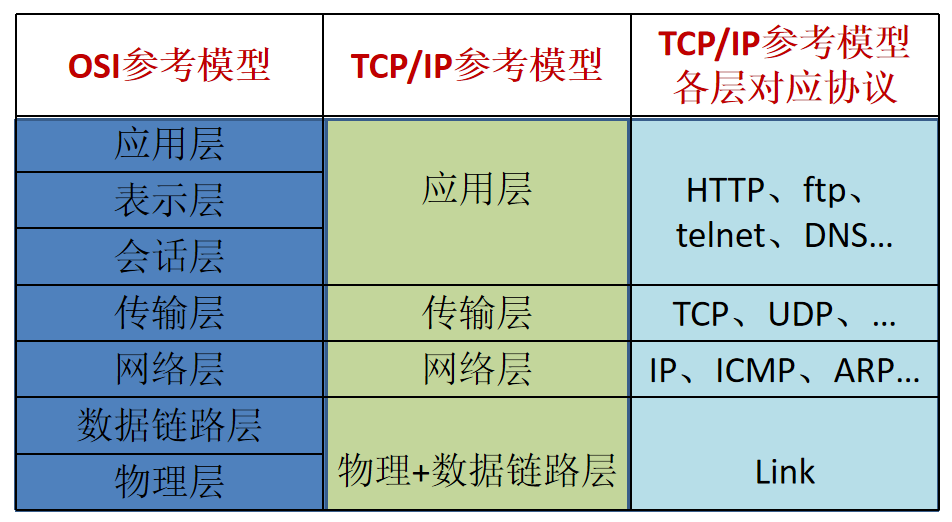
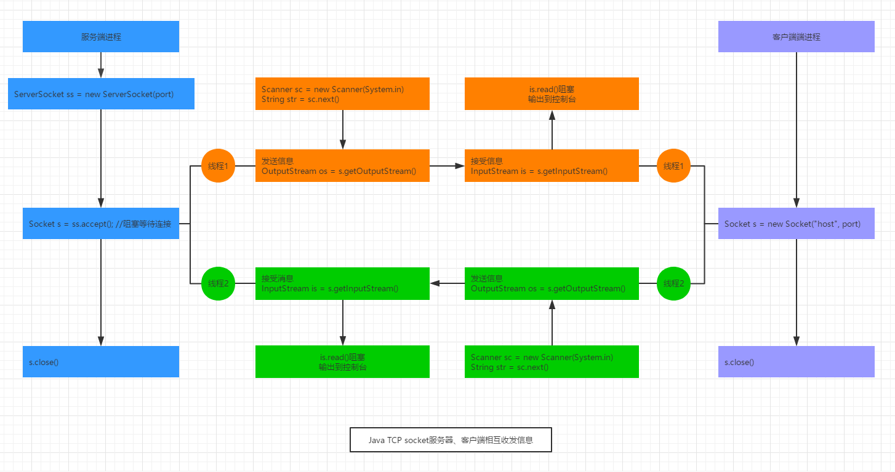

## # 網絡編程概述

    Java提供的網絡類庫，可以實現無痛的網絡連接，聯網的底層細節被隱藏在 Java 的本機安裝系統裡，由 JVM 進行控制。並且 Java 實現了一個跨平台的網絡庫，程序員面對的是一個統一的網絡編程環境。

### |> 網絡基礎

計算機網絡

    計算機網絡
    
    
    把分佈在不同地理區域的計算機與專門的外部設備用通信線路互連成一個規模大、功能強的網絡系統，
    從而使眾多的計算機可以方便地互相傳遞信息、共享硬件、軟件、數據信息等資源。

網絡編程的目的

    網絡編程的目的
    
    直接或間接地通過網絡協議與其他計算機進行通訊
    
    網絡編程中主要的兩個問題
        如何準確地定位網絡上的一台或多台主機 ---> IP 和 端口號
        找到主機後如何可靠高效地進行數據傳輸 ---> 網路通訊協議
    
    實現網絡中主機互相通信的機制
        通信雙方地址
        一定的規則(主要有兩套參考模型)
            OSI 7層參考模型：模型過於理想或，未能在互聯網上進行廣泛推廣
            TCP/IP 4層參考模型：事實上的國際標準

通信要素:網絡通信協議



```java
通信要素:IP和端口

IP地址：InetAddress
    唯一的標識Internet上的計算機
    本地回環地址：127.0.0.1,主機名：localhost
    不易記憶

端口：標識正在計算機上運行的進程(程序)
    不同的進程有不同的端口
    被規定為一個16二進制整數，端口可使用範圍：(0-65535]

IP與端口的組合得出一個socket
```


### |> InetAddress類

位置：java.net.InetAddress

```java
域名(hostName) --> DNS查詢域名解析 -->  IP地址(hostAddress)

主機地址的兩種表示形式
    域名(hostName)，如：www.baidu.com
    IP地址(hostAddress)，如：223.5.5.5
InetAddress類主表示IP地址
兩個子類
    Inet4Address
    Inet6Address
InetAddress對象含有一個Internet主機的域名和IP地址
域名易於記憶，通信前需要把域名解析成IP地址
InetSocketAddress，表示IP、端口的組合，即一個socket地址
```

構造器

```java
// 跨包後調用不了此構造器 protected InetAddress() { holder = new InetAddressHolder(); }
```

方法

```java
創建InetAddress對象 static InetAddress getByName(String host) static InetAddress getByAddress(byte[] addr) static InetAddress getByAddress(String host, byte[] addr) static InetAddress[] getAllByName(String host) 獲取到域名解析出來的多個IP

獲取相關屬性 String getHostName() String getHostAddress() byte[] getAddress() String getCanonicalHostName() static InetAddress getLocalHost() static InetAddress getLoopbackAddress()
```


### |> 通信要素2：網絡通訊協議

    - 通信協議
      計算機網絡中實現通信必須有一些約定，
      即通信協議，對速率、傳輸代碼、代碼結構、傳輸控制步驟、出錯控制等製定標準。
      
    - 通信協議分層思想
      由於結點之間聯繫很複雜，在製定協議時，把複雜成份分解成一些簡單的成份，再將它們複合起來。
      最常用的複合方式是層次方式，
      即同層間可以通信、上一層可以調用下一層，
      而與再下一層不發生關係。
      各層互不影響，利於系統的開發和擴展。


#### TCP/IP協議簇

    傳輸協議中兩個重要的協議
        TCP(Transmission Control Protocol) 傳輸控制協議
        UDP(User Datagram Protocol) 用戶數據報協議
    
    TCP/IP 以其兩個主要協議
    
    傳輸控制協議(TCP)和網絡互聯協議(IP)而得名，
    實際上是一組協議，包括多個具有不同功能且互為關聯的協議。
    
    IP(Internet Protocol)協議是網絡層的主要協議，支持網間互連的數據通信
    TCP/IP協議模型從更使用的角度出發，形成了高效地四層體系，
    即 物理鏈路層、IP層(網絡層)、傳輸層、應用層

#### TCP和UDP

    TCP協議 --> phone call
        使用TCP協議簽，必須建立TCP連接，形成傳輸的通道
        傳輸前，採用"三次握手"方式，是可靠的
        TCP協議進行通信的兩個應用進程：服務端、客戶端，先啟動服務端
        在已經建立了連接的連接中可進行大數據的傳輸
        傳輸完畢，採用"四次揮手"方式釋放已建立的連接，效率低
    UDP協議 --> sned message
        將數據、源地址、目的地址封裝成數據報，不需要建立連接
        每個數據報的大小限制在64K內
        因無需連接，故是不可靠的
        發送數據結束時無需釋放資源，速度快
#### Socket

    利用套接字(Socket)開發網絡應用程序早已被廣泛的採用，以至於成為事實上的標準
    通信的兩端都要有Socket，是兩台機器間通信的端點
    網絡通信其實就是Socket間的通信
    Socket允許程序把網絡連接當成一個流，數據在兩個Socket間通過IO傳輸
    一般主動發起通信的應用程序屬客戶端，等待通信請求的為服務端 個人覺得Socket翻譯成鏈流口更合適

#### 補充：ByteArrayOutputStream 介紹

[IO流之ByteArrayInputStream和ByteArrayOutputStream原理研究](https://blog.csdn.net/weixin_39723544/article/details/80561370)

```java
ByteArrayOutputStream 是位元組陣列輸出流。它繼承於OutputStream。

ByteArrayOutputStream 中的資料被寫入一個 byte 陣列。緩衝區會隨著資料的不斷寫入而自動增長。可使用 toByteArray() 和 toString() 獲取資料。
  
關閉 ByteArrayOutputStream 無效。此類中的方法在關閉此流後仍可被呼叫，而不會產生任何 IOException。
  
  
作用:
* ByteArrayInputStream是將資料寫入到記憶體輸入流中,通過建構函式實現的,而用read()方法來讀取記憶體輸入流的資料
* ByteArrayOutputStream是將資料寫入到記憶體輸出流,通過write()方法實現的

* 我們可以這樣理解上面的過程,將程式和記憶體分為兩層。
* ByteArrayInputStream就是把程式這一層的資料儲存進記憶體,而通過read()將資料讀取出來
* 而ByteArrayOutputStream就是把它當做是記憶體的中的一個緩衝區,向其中寫入資料,緩衝區自動增長,當寫入完成時可以從中提取資料。通過toByteArray()和toString()實現。
  
  
+ 應用場景
  
	- 問題
		一般，我們需要先訪問服務器或本地的文件或其他文件，把其數據以二進制讀取到內存中，然後在再以輸入流的形式發送給客戶端。這樣存在一個問題。我們從網絡上獲取的還要先存在本地，然後再讀取，再發送，這樣做是不是很麻煩，而上面兩個流的出現就可以完美解決這個問題。
  
	- 解決
    ByteArrayInputStream將內建緩存數組作為流的目的地
    ByteArrayOutputStream將內建緩存數組作為流的數據源
		解決將從網絡上讀取的文件讀取到ByteArrayInputStream將內建緩存數組中，然後直接再以輸出流的形式發送給客戶端。
  
	- 優點
		提高了效率

  - 用途
		創建臨時文件無需訪問磁盤，把數據進行讀取，寫出

  - 總結及問題
		ByteArrayInputStream、ByteArrayOutputStream的本質都是對內置字節數組的操作，其中包含了讀取字節大小，toString，寫入另外一個輸出流及清空緩存區等；ByteArrayInputStream中的count屬性，不是代表buf中可讀字節總數，它是正數或0，並且不應大於 buf 的長度內建數組嚴格遵守“一定的順序”
```

##### 基於TCP的socket通信



##### 基於Socket的TCP編程

```java
客戶端Socket的工作過程包含以下四個基本的步驟
  1. 創建 Socket
    根據指定服務端的 IP 地址或端口號構造 Socket 類對象。
    若服務器端響應，則建立客戶端到服務器的通信線路。
    若連接失敗，會出現異常

  2. 打開連接到 Socket 的輸入流/輸出流
    使用 getInputStream()方法獲得輸入流，其read()會阻塞
    使用 getOutputStream()方法獲得輸出流，進行數據傳輸

  3. 按照一定的協議對 Socket 進行讀/寫操作
    通過輸入流讀取服務器放入線路的信息（但不能讀取自己放入線路的信息），
    通過輸出流將信息寫入線程

  4. 關閉socket 斷開客戶端到服務器的連接，釋放鏈路


服務端TCP socket編程
	1. 調用 ServerSocket(int port)
			創建一個服務器端套接字，並綁定到指定端口上。用於監聽客戶端的請求
	2. 調用 accept()
			監聽連接請求，如果客戶端請求連接，則接受連接，返回通信套接字對象。
這裡會發生阻塞，知道有請求連接進來

	3. 調用 該Socket類對象的 getOutputStream() 和 getInputStream() InputStream.read(byte[] b)方法也會發生阻塞，等待讀取內容，需要自行判斷結束
		獲取輸出流和輸入流，開始網絡數據的發送和接收

	4. 關閉ServerSocket和Socket對象
			客戶端訪問結束，關閉通信套接字
```

TCP --> 從客戶端發送文件給服務端，服務端保存到本地。並返回“發送成功”給客戶端。

```java
/*
題目：
    從客戶端發送文件給服務端，服務端保存到本地。並返回“發送成功”給客戶端。並關閉相應的連接
* */

public class TCPSocketTest3 {
	/*
    先啟動 server，再啟動client
    客戶端連接的端口要與服務器端偵聽的端口相同
    * */
    @Test
    public void server() {
        ServerSocket serverSocket = null;
        Socket socket = null;
        InputStream inputStream = null;
        FileOutputStream fos = null;
        ByteArrayOutputStream baos = null;
        OutputStream outputStream = null;
        try {
        	// 1. 創建ServerSocket對象，並指定監聽的port
            serverSocket = new ServerSocket(8090);
            // 2. 調用 ServerSocket對象.accept()方法獲得socket ---> 收客戶端socket消息
            socket = serverSocket.accept();
            // 3. 通過Socket對象.getInputStream()獲取InputStream對象
            inputStream = socket.getInputStream();
            // 4. 通過InputStream對象 讀取內容，放入一個文件中
            fos = new FileOutputStream(new File("image_server_recive.png"));
            byte[] buffer = new byte[1024];
            int len;
            while ((len = inputStream.read(buffer)) != -1) {
                fos.write(buffer, 0, len);
            }
            // 這裡使用 ByteArrayOutputStream() 接手的圖檔會打不開，因為ByteArrayOutputStream()寫完之後，
            // 是調用toByteArray()方法，以字節數組的形式獲得所有 ByteArrayOutputStream()中已寫的數據
//            baos = new ByteArrayOutputStream();
//            byte[] buffer = new byte[1024];
//            int len;
//            while((len=inputStream.read(buffer)) != -1) {
//            	baos.write(buffer, 0, len);
//            }
            System.out.println("文件接收成功");

            // 5. 響應客戶端
            outputStream = socket.getOutputStream();
            outputStream.write("發送成功".getBytes());
        } catch (IOException e) {
            e.printStackTrace();
        } finally {
            // 關閉流、socket
            try {
                if (outputStream != null) {
                    outputStream.close();
                }
                if(baos != null) {
                	baos.close();
                }
                if (fos != null) {
                    fos.close();
                }
                if (inputStream != null) {
                    inputStream.close();
                }
                if (socket != null) {
                    socket.close();
                }
                if (serverSocket != null) {
                    serverSocket.close();
                }
            } catch (IOException e) {
                e.printStackTrace();
            }
        }
    }

    @Test
    public void client() {
        Socket socket = null;
        OutputStream outputStream = null;
        FileInputStream fis = null;
        InputStream inputStream = null;
        ByteArrayOutputStream baos = null;
        try {
        	// 1. 創建 Socket對象，並指定要連接的服務器的IP、端口
            socket = new Socket(InetAddress.getByName("127.0.0.1"), 8090);
            // 2. 通過Socket對象獲得OutputStream流
            outputStream = socket.getOutputStream();
            // 3. 通過OutputStream流輸出內容 
            // FileInputStream 先讀入檔案，在寫入 socket 的 outputStream
            fis = new FileInputStream(new File("image.png"));
            byte[] buffer = new byte[1024];
            int len;
            while ((len = fis.read(buffer)) != -1) {
                outputStream.write(buffer, 0, len);
            }
            // 文件發送完畢
            socket.shutdownOutput(); // 關閉socket的OutputStream流 --> 沒有關閉的情況下，對端的服務器 InputStream對象.read()方法將一直阻塞。

            // 6. 接收服務器信息
            inputStream = socket.getInputStream();
            baos = new ByteArrayOutputStream();
            byte[] buffer2 = new byte[1024];
            int len2;
            while ((len2 = inputStream.read(buffer2)) != -1) {
                baos.write(buffer2, 0, len2);
            }
            System.out.println("接收到服務器端的信息：" + baos.toString());
            
        } catch (IOException e) {
            e.printStackTrace();
        } finally {
            try {
            	if(baos != null) {
            		baos.close();
            	}
                if (inputStream != null) {
                    inputStream.close();
                }
                if (fis != null) {
                    fis.close();
                }
                if (outputStream != null) {
                    outputStream.close();
                }
                if (socket != null) {
                    socket.close();
                }
            } catch (IOException e) {
                e.printStackTrace();
            }
        }
    }
}
```

###### Socket類

位置：java.net.Socket

構造器

```java
public Socket() 創建一個未綁定IP、端口等的Socket對象
public Socket(InetAddress address, int port) throws IOException 創建一個流Socket對象(即TCP socket)，並綁定IP、端口
public Socket(String host, int port) throws UnknownHostException, IOException 創建一個流Socket對象(即TCP socket)，並綁定IP、端口
public Socket(InetAddress address, int port, InetAddress localAddr, int localPort) throws IOException 創建一個Socket對象，指定連接遠端的IP和端口，同時綁定本地的IP和端口
public Socket(String host, int port, InetAddress localAddr, int localPort) throws IOException 創建一個Socket對象，指定連接遠端的IP和端口，同時綁定本地的IP和端口
public Socket(InetAddress host, int port, boolean stream) throws IOException // Deprecated. 創建一個綁定了IP和端口的流Socket對象(TCP)或數據報Socket對象(UDP)，stream為true時創建流Socket對象，stream為false時創建數據報Socket
public Socket(String host, int port, boolean stream) throws IOException // Deprecated. 創建一個綁定了IP和端口的流Socket對象(TCP)或數據報Socket對象(UDP)，stream為true時創建流Socket對象，stream為false時創建數據報Socket

public Socket(Proxy proxy) 創建一個未連接的代理Socket，使用代理的設置，如調用代理的IP、端口，
    示例：
    Socket s = new Socket(Proxy.NO_PROXY); will create a plain socket ignoring any other proxy configuration.
    Socket s = new Socket(new Proxy(Proxy.Type.SOCKS, new InetSocketAddress("socks.mydom.com", 1080))); will create a socket connecting through the specified SOCKS proxy server.

protected Socket(SocketImpl impl) throws SocketException 創建一個由用戶實現的SocketImpl且未連接的Socket對象。
```

Socket類方法

```java
void bind(SocketAddress bindpoint) 綁定SocketAddress，即IP和端口
void close() 關閉此socket
void connect(SocketAddress endpoint) 連接此socket到服務器
void connect(SocketAddress endpoint, int timeout) 連接此socket到服務器，並指定連接超時時間
SocketChannel getChannel() 返回唯一的SocketChannel 對象，如果存在的話
InetAddress getInetAddress() 返回此socket連接到遠端的IP
InputStream getInputStream() 獲取此socket的InputStream輸入流，此InputStream.read()、InputStream.read(byte[] b) 都是是阻塞的
boolean getKeepAlive() 測試SO_KEEPALIVE 是否開啟，返回此socket是否開啟回話保持
InetAddress getLocalAddress() 獲取此socket綁定的本地IP
int getLocalPort() 獲取此socket綁定的本地端口
SocketAddress getLocalSocketAddress() 獲取此socket綁定的本地SocketAddress信息，即綁定的本地IP、本地端口
boolean getOOBInline() 獲取此socket的SO_OOBINLINE是否開啟
OutputStream getOutputStream() 獲取此socket的OutputStream輸出流，此OutputStream.write(byte[] b) 非阻塞的
int getPort() 返回此socket連接的遠端端口
int getReceiveBufferSize() 獲取此socket的SO_RCVBUF值
SocketAddress getRemoteSocketAddress() 返回此socket連接著遠端的SocketAddress信息(IP、port)
boolean getReuseAddress() 獲取SO_REUSEADDR是否可重用
int getSendBufferSize() 獲取此socket的SO_SNDBUF返送緩衝大小
int getSoLinger() 獲取 SO_LINGER值
int getSoTimeout() 獲取此socket的SO_TIMEOUT設置的值
boolean getTcpNoDelay() 獲取此socket的TCP_NODELAY是否開啟，關閉Nagle算法，即要發送到網絡的數據不緩衝
int getTrafficClass() 從發送的IP頭包裡獲取traffic跟踪類或服務類型
boolean isBound() 返回此socket是綁定狀態
boolean isClosed() 返回此socket是關閉狀態
boolean isConnected() 返回此socket是連接狀態
boolean isInputShutdown() 在此socket輸入流讀取過程中，返回此socket連接是否為是關閉狀態，是關閉則返回true
boolean isOutputShutdown() 在此socket輸出流讀取過程中，返回此socket連接是否為是關閉狀態，是關閉則返回true
void sendUrgentData(int data) 發送一個字節的緊急數據到此socket
void setKeepAlive(boolean on) 設置此suocket的SO_KEEPALIVE值，即socket TCP的超時時間
void setOOBInline(boolean on)
void setPerformancePreferences(int connectionTime, int latency, int bandwidth) 設置此Socket性能偏好：
      connectionTime：連接保持時間，對於短鏈接來說此參數相對重要
      latency：延遲時間，對於要求低延遲的連接，此參數相對重要
      bandwidth：帶寬，如要求帶寬比較高的，此參數比較重要
void setReceiveBufferSize(int size) 設置此socket的SO_RCVBUF值
void setReuseAddress(boolean on) 設置address是否可重用
void setSendBufferSize(int size) 設置SO_SNDBUF值
static void setSocketImplFactory(SocketImplFactory fac)
void setSoLinger(boolean on, int linger) 開啟/關閉 SO_LINGER，指定linger時間為linger，單位s
void setSoTimeout(int timeout) 設置此socket超時時間(單位ms)，以timeout為0時無限超時，read()將一直阻塞，如果timeout > 0,在read()時做多阻塞timeout 毫秒，超時後拋出java.net.SocketTimeoutException異常
void setTcpNoDelay(boolean on) 設置此socket的TCP_NODELAY 值
void setTrafficClass(int tc)
void shutdownInput() 關閉此socket的InputStream流，在read socket InputStream時，調用此方法後，InputStream的read()方法返回-1，其他可用方法都將返回0，不可恢復
void shutdownOutput() 關閉此socket的OutputStream流。對於TCP，調用此方法前需要發送的數據還未完成發送的將繼續正常的連接終止順序發送，不可恢復
String toString() //"Socket[addr=" + getImpl().getInetAddress() + ",port=" + getImpl().getPort() + ",localport=" + getImpl().getLocalPort() + "]";               
```

注意

```java
調用socket.close() 或者socket.shutdownOutput()方法，都會結束客戶端socket，且不可恢復。
socket.close() 將socket關閉連接，那邊如果有服務端給客戶端反饋信息，此時客戶端是收不到的。
socket.shutdownOutput() 是將輸出流關閉，此時，如果服務端有信息返回，則客戶端是可以正常接受的
inputStream.readAllBytes()，只有等對端的socket關閉了，才能讀取完成，是阻塞的
```
###### ServerSocket類

位置：java.net.ServerSocket

構造器(沒有特殊說明時，都是public構造器)

```java
ServerSocket() 創建未綁定IP、端口等的ServerSocket對象
ServerSocket(int port) 創建服務器端的ServerSocket對象，指定要綁定的監聽端口，綁定所有IP(即0.0.0.0)，端口範圍：[0, 65535]，0：自動分配端口，下同; 請求連接隊列的最大長度為50
ServerSocket(int port, int backlog) 建服務器端的ServerSocket對象，指定要綁定的監聽端口，綁定所有IP(即0.0.0.0)，指定請求連接隊列的最大長度
ServerSocket(int port, int backlog, InetAddress bindAddr) 建服務器端的ServerSocket對象，指定要綁定的監聽端口，指定請求連接隊列的最大長度，指定綁定的IP(InetAddress對象)
```


方法(沒有特殊說明，都是public方法)
ServerSocket類方法

```java
Socket accept() 創建並返回一個Socket對象，開始偵聽該socket並接收請求連接，阻塞的，直到有請求連接進來
void bind(SocketAddress endpoint) 綁定SocketAddress，即綁定IP和端口，如 ServerSocket對象.bind(new InetSocketAddress(InetAddress.getByName("hostName")), 端口)
void bind(SocketAddress endpoint, int backlog) 綁定SocketAddress，並指定請求連接隊列的最大長度
void close() 關閉此socket
ServerSocketChannel getChannel() 返回此ServerSocket對象相關的唯一的ServerSocketChannel 對象
InetAddress getInetAddress() 獲取此socket的IP信息
int getLocalPort() 獲取偵聽的端口
SocketAddress getLocalSocketAddress() 獲取綁定的IP信息
int getReceiveBufferSize()
boolean getReuseAddress() 獲取請求客戶端的address信息
int getSoTimeout() 獲取socket 超時設置值
protected void implAccept(Socket s) 重寫accept()方法
boolean isBound() 返回ServerSocket是否已經綁定
oolean isClosed() 返回ServerSocket是否已關閉
void setPerformancePreferences(int connectionTime, int latency, int bandwidth) 設置此ServerSocket性能偏好：
                connectionTime：連接保持時間，對於短鏈接來說此參數相對重要
                latency：延遲時間，對於要求低延遲的連接，此參數相對重要
                bandwidth：帶寬，如要求帶寬比較高的，此參數比較重要
void setReceiveBufferSize(int size) 重置socket接收緩存的大小，默認的大小將被修改
void setReuseAddress(boolean on) 開啟/關閉 SO_REUSEADDR socket 選項，當需要使用多進程時，需要開啟address重用
static void setSocketFactory(SocketImplFactory fac)
void setSoTimeout(int timeout) 設置socket的超時時間，單位ms，0：表示不超時
String toString()
```


TCP socket示例----------------

    客戶端發送內容給服務端，服務端將內容打印到控制台上
    TCPSocketTest1
    
    客戶端發送內容給服務端，服務端給予反饋
    TCPSocketTest2
    
    從客戶端發送文件給服務端，服務端保存到本地。並返回“發送成功”給客戶端。並關閉相應的連接
    TCPSocketTest3
    
    客戶端持續發送內容給服務端，輸入q或exit是退出，服務端將內容打印到控制台上
    TCPServer
    TCPClient
    
    服務端、客戶端互相收發信息，類似聊天，即一對一通信 TCPServer
    TCPClient
    
    java socket TCP 模擬 簡單的WEB Server
    WebServer
    
    Web server:先啟動一個線程來等待用戶的請求連接，當有一個客戶請求連接進來時，新開啟一個線程等待下一個客戶端請求連接。
    線程響應完客戶請求後，關閉當前socket及相關的IO流，當前線程就退出了。
    
    http request請求 /response響應數據格式
    
      WebServer2
      WebServer3
      WebServer4
    
    Web server:利用線程池，讓服務端一直保持開啟n個線程
    	WebServer5

##### UDP網絡通信

    - DatagramSocket類和DatagramPacket類實現了基於UDP協議的網絡程序
    - UDP數據報通過數據報socket DatagramSocket發送和接收，系統不保證UDP數據報一定能夠安全送到目的地， 也不能確定什麼時候送達
    - DatagramPacket對象封裝了UDP數據報，在數據報中包含了發送端的IP、發送端的端口、接收端的IP、接收端的端口、 數據信息
    - UDP協議中每個數據報都包含了完整的地址信息，因此無須建立發送方和接收方的連接
###### DatagramSocket類

位置：java.net.DatagramSocket;

構造器

```java
DatagramSocket() 創建一個數據報socket，不綁定IP、端口
protected DatagramSocket(DatagramSocketImpl impl) 創建一個未綁定IP、端口的 DatagramScoket對象，並指定DatagramSocketImpl
DatagramSocket(int port) 創建一個DatagramSocket對象，並綁定指定的port端口，IP默認為0.0.0.0
DatagramSocket(int port, InetAddress laddr) 創建一個DatagramSocket對象,綁定指定的IP(laddr)、端口(port)
DatagramSocket(SocketAddress bindaddr) 創建一個DatagramSocket對象，綁定指定的SocketAddress，如：new DatagramSocket(new InetSocketAddress("10.100.0.2", 3030))
```

方法

```java
void bind(SocketAddress addr) 綁定Socket地址，即綁定IP和端口
void close() 關閉此數據報socket
void connect(InetAddress address, int port) 連接到指定IP、端口
void connect(SocketAddress addr) 連接到指定的Socket地址([ip, 端口])
void disconnect() 斷開數據報socket連接，如果socket已經關閉或未連接，則沒有任何影響
boolean getBroadcast() 測試SO_BROADCAST 是否是開啟
DatagramChannel getChannel() 返回唯一DatagramChannel，如果DatagramChannel 存在的話
InetAddress getLocalAddress() 獲取socket本地的InetAddress
int getLocalPort() 獲取socket在本地綁定的端口
SocketAddress getLocalSocketAddress() 獲取socket本地的SocketAddress(即[ip, 端口])
InetAddress getInetAddress() 獲取socket遠端的InetAddress地址
int getPort() 獲取此socket遠端的端口
SocketAddress getRemoteSocketAddress() 獲取socket遠端的SocketAddress
int getReceiveBufferSize() 獲取SO_RCVBUF的值，即平台用在此DatagramSocket上的輸入的緩衝大小
boolean getReuseAddress() 測試SO_REUSEADDR 是否是開啟，即SocketAddress是否可複用。
int getSendBufferSize() 獲取SO_SNDBUF的值，即平台用在此DatagramSocket上的輸出的緩衝大小
int getSoTimeout() 獲取SO_TIMEOUT值，即socket的超時時間，默認為0，單位為：毫秒，即無限超時
int getTrafficClass() Gets traffic class or type-of-service in the IP datagram header for packets sent from this DatagramSocket.
boolean isBound() 返回此socket是否是已經綁定好IP、端口
boolean isClosed() 返回此socket是否是關閉
boolean isConnected() 返回此socket是否是連接
void receive(DatagramPacket p) 從此socket上用一個指定數據報包來接收一個數據報包
void send(DatagramPacket p) 從此socket上發送一個指定的數據報包p
void setBroadcast(boolean on) 設置SO_BROADCAST開啟/關閉
static void setDatagramSocketImplFactory(DatagramSocketImplFactory fac) Sets the datagram socket implementation factory for the application.
void setReceiveBufferSize(int size) 設置SO_RCVBUF大小，設置socket接收緩衝區大小
void setReuseAddress(boolean on) 設置此socket SO_REUSEADDR值，開啟/關閉此SocketAddress是否可複用
void setSendBufferSize(int size) 設置 SO_SNDBUF 大小，設置socket發送緩衝區大小
void setSoTimeout(int timeout) 設置此socket超時時間，單位milliseconds 毫秒
void setTrafficClass(int tc) Sets traffic class or type-of-service octet in the IP datagram header for datagrams sent from this DatagramSocket.
```

###### DatagramPacket類

位置：java.net.DatagramPacket

構造器

```java
DatagramPacket(byte[] buf, int length) 創建一個DatagramPacket對象，用於接收數據報包，使用字節數組buf來存放，長度length，默認從0開始
DatagramPacket(byte[] buf, int length, InetAddress address, int port) 創建一個DatagramPacket對象，用於發送數據報包，內容為buf，長度為length，默認從0開始，指定接收端的IP為address，端口為port
DatagramPacket(byte[] buf, int offset, int length) 創建一個DatagramPacket對象，用於接收數據報包，使用字節數組buf來存放，長度length，從offset開始
DatagramPacket(byte[] buf, int offset, int length, InetAddress address, int port) 創建一個DatagramPacket對象，用於發送數據報包，內容為buf，長度為length，從offset開始，指定接收端的IP為address，端口為port
DatagramPacket(byte[] buf, int offset, int length, SocketAddress address) 創建一個DatagramPacket對象，用於發送數據報包，內容為buf，長度為length，從offset開始，並指定SocketAddress為address
DatagramPacket(byte[] buf, int length, SocketAddress address) 創建一個DatagramPacket對象，用於發送數據報包，內容為buf，長度為length，默認從0開始，並指定SocketAddress為address
```

方法

```java
InetAddress getAddress() 返回發送數據報中的接收端的IP 或 返回接收數據報中的發送端的IP
byte[] getData() 從接收到或要發送的數據報包中獲取緩衝數據，從偏移量offset開始讀取length個字節
int getLength() 返回接收到或要發送的數據報包數據的大小
int getOffset() 返回讀取數據報包中數據的指定的偏移量，不指定默認為0
int getPort() 返回發送或接收數據報中遠端的端口
SocketAddress getSocketAddress() 返回發送或接收數據報中遠端的SocketAddress，包含了IP、端口，接收端要知道數據報包從哪發過來的，用此方法就可以知道發送端的IP和端口
void setAddress(InetAddress iaddr) 設置要發送數據報的接收端的IP
void setPort(int iport) 設置要發送數據報的接收端的端口
void setData(byte[] buf) 設置此數據報包的數據緩衝區
void setData(byte[] buf, int offset, int length) 設置此數據報包的數據緩衝區，指定從偏移量offset開啟，length個長度
void setLength(int length) 設置數據報包的長度
void setSocketAddress(SocketAddress address)
```

###### 基於socket的UDP編程

```java
創建DatagramSocket對象和DatagramPacket對象，數據放在數據報包，在數據報包中為數據報指定接收端IP、接收方端口、發送端(即本端)IP和端口不需要顯式指定，由系統自動添加
建立發送商、接收端
建立數據包
調用Socket的send、receive方法，DatagramSocket.receive()方法會阻塞，直接接收到數據
關閉Socket

發送端與接收端是兩個獨立的運行程序
```

UDP客戶端發信息到服務端，服務器端接收信息

```java
public class UDPSocketTest1 {
    @Test
    public void server() {
    	// receiver
        DatagramSocket datagramSocket = null;
        try {
        	// 1.
            datagramSocket = new DatagramSocket(9090);
            System.out.println("服務端啟動好了...");
            // 2.
            byte[] b = new byte[1024];
            DatagramPacket datagramPacket = new DatagramPacket(b, 0, b.length);
            // 3.
            datagramSocket.receive(datagramPacket); // 這裡阻塞，直接有客戶連接進來
            System.out.println("客戶端IP信息：" + datagramPacket.getSocketAddress());
            // datagramPacket.getData()-->byte[], 
            String str = new String(datagramPacket.getData(), 0, datagramPacket.getLength());
            System.out.println(str);
        } catch (IOException e) {
            e.printStackTrace();
        } finally {
        	// 4.
            if (datagramSocket != null) {
                datagramSocket.close();
            }
        }
    }

    @Test
    public void client() {
    	// sender
        DatagramSocket datagramSocket = null;
        try {
            // 1.創建DatagramSocket對象
            datagramSocket = new DatagramSocket();
            System.out.println("UDP 客戶端啟動好...");
            
            // 2.創建數據報
            // 要發送的內容，轉成字節數組
            String str = "ＵＤＰ方式測試";
            byte[] b = str.getBytes();
            // 創建數據報，每個數據報不能大於64K，每個數據報都記錄了數據信息、發送端的IP、發送端的端口、接收端的IP、接收端的端口
            // 發送的數據報，只需要顯式指定數據信息、接收端的IP、接收端的端口，發送端的IP(本端)、發送端的端口(本端)會自動添加到包中
            DatagramPacket datagramPacket = new DatagramPacket(b, 0, b.length,
                    InetAddress.getByName("127.0.0.1"), 9090);
            // 3.調用datagramSocket.send(數據報對象)，把數據報發出去
            datagramSocket.send(datagramPacket);
            System.out.println("信息發送完畢.");
        } catch (IOException e) {
            e.printStackTrace();
        } finally {
        	// 4.關閉資源
            if (datagramSocket != null) {
                datagramSocket.close();
            }
        }
    }

}
```


##### URL編程

```java
+ URL
  - Uniform Resource Locator, 統一資源定位符，它表示 Internet 上某一資源的地址。
  - 通過 URL 我們可以訪問 Internet 上的各種網絡資源，比如最常見的 www，ftp 站點。
  - 瀏覽器通過解析給定的 URL 可以在網絡上查找相應的文件或其他資源
  
+ URL的基本結構
    <傳輸協議>://<主機名>:<端口號>/<文件名>
    如：http://192.168.1.100:8080/helloworld/index.jsp

  - 類URL的構造方法都聲明拋出非運行時異常， 必須要對這一異常進行處理，通常是用 try-catch 語句進行捕獲

  - 一個URL對像生成後，其屬性是不能被改變的，但可以通過它給定的方法來獲取這些屬性
```


###### URL類

位置：java.net.URL

構造器

```java
URL(String spec)
Creates a URL object from the String representation.
從字符串形式的URL spec中創建一個URL對象

URL(String protocol, String host, int port, String file)
Creates a URL object from the specified protocol, host, port number, and file.
創建URL對象，指定協議為protocol、主機為host、端口為port、文件為字符串形式的file

URL(String protocol, String host, int port, String file, URLStreamHandler handler)
Creates a URL object from the specified protocol, host, port number, file, and handler.
創建URL對象，指定協議為protocol、主機為host、端口為port、文件為file、URL流處理器為Handler

URL(String protocol, String host, String file)
Creates a URL from the specified protocol name, host name, and file name.
創建URL對象，指定協議為protocol、主機為host、文件為file

URL(URL context, String spec)
Creates a URL by parsing the given spec within a specified context.
從指定的上下文context解析字符形式的spec，並創建該URL對象

URL(URL context, String spec, URLStreamHandler handler)
Creates a URL by parsing the given spec with the specified handler within a specified context.
創建URL對象，指定URL上下文解釋器context、字符串形式URLspec，URL流處理器handler
```

方法

```java
boolean equals(Object obj) 判斷此URL對象與URL對象obj是否相等
Compares this URL for equality with another object.

String getAuthority() 獲取Authority
Gets the authority part of this URL.

Object getContent() 從此URL對像中獲取內容，如：openConnection().getContent()
Gets the contents of this URL.

Object getContent(Class[] classes) 從此URL對像中獲取內容，有classes數組中的第一個類型開始匹配
Gets the contents of this URL.

int getDefaultPort() 獲取此URL協議的默認端口
Gets the default port number of the protocol associated with this URL.

String getFile() 獲取文件名
Gets the file name of this URL.

String getHost() 獲取主機
Gets the host name of this URL, if applicable.

String getPath() 獲取目錄path
Gets the path part of this URL.

int getPort() 獲取端口
Gets the port number of this URL.

String getProtocol() 獲取協議
Gets the protocol name of this URL.

String getQuery() 獲取所有query參數
Gets the query part of this URL.

String getRef() 獲取reference
Gets the anchor (also known as the "reference") of this URL.

String getUserInfo() 獲取用戶信息
Gets the userInfo part of this URL.

int hashCode() 獲取hash值
Creates an integer suitable for hash table indexing.

URLConnection openConnection() 返回一個URLConnection實例，該實例代表本地連接到URL遠程的連接對象。
    注意：該方法不是建立一個真實的網絡連接，只是返回一個URLConnection類的實例
Returns a URLConnection instance that represents a connection to the remote object referred to by the URL.

URLConnection openConnection(Proxy proxy) 與openConnection()相同，只是本地用的輸入、輸出流有指定的proxy處理
Same as openConnection(), except that the connection will be made through the specified proxy; Protocol handlers that do not support proxing will ignore the proxy parameter and make a normal connection.

InputStream openStream() 打開本地到URL遠端的連接，並返回一個InputStream輸入流
Opens a connection to this URL and returns an InputStream for reading from that connection.

boolean sameFile(URL other) 比較此URL與other URL是否相同，不包括fragment片段參數
Compares two URLs, excluding the fragment component.

static void setURLStreamHandlerFactory(URLStreamHandlerFactory fac) 設置此URL的URL流處理器為fac
Sets an application's URLStreamHandlerFactory.

String toExternalForm() 獲取此URL對象字符串形式的字符串
Constructs a string representation of this URL.

String toString()
Constructs a string representation of this URL.

URI toURI() 獲取去此URL等效的URI
Returns a URI equivalent to this URL.
```


###### URLConnection類

    + 針對HTTP協議
    + 位置：java.net.URLConnection 
      - URL的方法 openStream()：能從網絡上讀取數據
      - 若希望輸出數據，例如向服務器端的 CGI （公共網關接口-Common Gateway Interface-的簡稱，
      - 是用戶瀏覽器和服務器端的應用程序進行連接的接口）程序發送一些數據，
      則必須先與URL建立連接，然後才能對其進行讀寫，此時需要使用 URLConnection
      - 如果有輸入和輸入數據需求，使用URL對象.openConnection()，返回一個URLConnection
    
    
    + URLConnection
      
      - 表示到URL所引用的遠程對象的連接。當與一個URL建立連接時，
    	- 首先要在一個 URL 對像上通過方法 openConnection() 生成對應的 URLConnection 對象。
    	- 如果連接過程失敗，將產生IOException
    
    	- URLConnection對象可獲取輸入流、輸出流
    
    通過URLConnection對象獲取的輸入流和輸出流，即可以與現有的CGI程序進行交互


屬性

````java
protected boolean allowUserInteraction
If true, this URL is being examined in a context in which it makes sense to allow user interactions such as popping up an authentication dialog.

protected boolean connected
If false, this connection object has not created a communications link to the specified URL.

protected boolean doInput
This variable is set by the setDoInput method.

protected boolean doOutput
This variable is set by the setDoOutput method.

protected long ifModifiedSince
Some protocols support skipping the fetching of the object unless the object has been modified more recently than a certain time.

protected URL url
The URL represents the remote object on the World Wide Web to which this connection is opened.

protected boolean useCaches
If true, the protocol is allowed to use caching whenever it can.
````

構造器

```java
protected URLConnection(URL url)
Constructs a URL connection to the specified URL.
```

方法

```java
InputStream getInputStream() 從此打開的連接中獲取 InputStreams輸入流
Returns an input stream that reads from this open connection.

OutputStream getOutputStream() 從此打開的連接中獲取 OutputStreams輸出流
Returns an output stream that writes to this connection.

void addRequestProperty(String key, String value)
Adds a general request property specified by a key-value pair.

abstract void connect()
Opens a communications link to the resource referenced by this URL, if such a connection has not already been established.

boolean getAllowUserInteraction()
Returns the value of the allowUserInteraction field for this object.

int getConnectTimeout() 獲取連接超時時間，單位ms毫秒
Returns setting for connect timeout.

Object getContent()
Retrieves the contents of this URL connection.

Object getContent(Class[] classes)
Retrieves the contents of this URL connection.

String getContentEncoding() 從content-encoding頭字段中獲取內容的編碼
Returns the value of the content-encoding header field.

int getContentLength() 從content-encoding頭字段中獲取內容長度
Returns the value of the content-length header field.

long getContentLengthLong()
Returns the value of the content-length header field as a long.

String getContentType() 從content-encoding頭字段中獲取內容的類型
Returns the value of the content-type header field.

long getDate() 獲取long型日期
Returns the value of the date header field.

static boolean getDefaultAllowUserInteraction()
Returns the default value of the allowUserInteraction field.

static String getDefaultRequestProperty(String key)
Deprecated.
The instance specific getRequestProperty method should be used after an appropriate instance of URLConnection is obtained.

boolean getDefaultUseCaches()
Returns the default value of a URLConnection's useCaches flag.

boolean getDoInput()
Returns the value of this URLConnection's doInput flag.

boolean getDoOutput()
Returns the value of this URLConnection's doOutput flag.

long getExpiration()
Returns the value of the expires header field.

static FileNameMap getFileNameMap()
Loads filename map (a mimetable) from a data file.

String getHeaderField(int n)
Returns the value for the nth header field.

String getHeaderField(String name)
Returns the value of the named header field.

long getHeaderFieldDate(String name, long Default)

Returns the value of the named field parsed as date.

int getHeaderFieldInt(String name, int Default)
Returns the value of the named field parsed as a number.

String getHeaderFieldKey(int n)
Returns the key for the nth header field.

long getHeaderFieldLong(String name, long Default)
Returns the value of the named field parsed as a number.

Map<String,List<String>> getHeaderFields()
Returns an unmodifiable Map of the header fields.

long getIfModifiedSince()
Returns the value of this object's ifModifiedSince field.

long getLastModified()
Returns the value of the last-modified header field.

Permission getPermission()
Returns a permission object representing the permission necessary to make the connection represented by this object.

int getReadTimeout()
Returns setting for read timeout.

Map<String,List<String>> getRequestProperties()
Returns an unmodifiable Map of general request properties for this connection.

String getRequestProperty(String key)
Returns the value of the named general request property for this connection.

URL getURL()
Returns the value of this URLConnection's URL field.

boolean getUseCaches()
Returns the value of this URLConnection's useCaches field.

static String guessContentTypeFromName(String fname)
Tries to determine the content type of an object, based on the specified "file" component of a URL.

static String guessContentTypeFromStream(InputStream is)
Tries to determine the type of an input stream based on the characters at the beginning of the input stream.

void setAllowUserInteraction(boolean allowuserinteraction)
Set the value of the allowUserInteraction field of this URLConnection.

void setConnectTimeout(int timeout)
Sets a specified timeout value, in milliseconds, to be used when opening a communications link to the resource referenced by this URLConnection.

static void setContentHandlerFactory(ContentHandlerFactory fac)
Sets the ContentHandlerFactory of an application.

static void setDefaultAllowUserInteraction(boolean defaultallowuserinteraction)
Sets the default value of the allowUserInteraction field for all future URLConnection objects to the specified value.

static void setDefaultRequestProperty(String key, String value)
Deprecated.
The instance specific setRequestProperty method should be used after an appropriate instance of URLConnection is obtained. Invoking this method will have no effect.

void setDefaultUseCaches(boolean defaultusecaches)
Sets the default value of the useCaches field to the specified value.

void setDoInput(boolean doinput) 設置doInput屬性值，默認是true，即允許讀取InputStream
Sets the value of the doInput field for this URLConnection to the specified value.
void setDoOutput(boolean dooutput) 設置doOutput屬性值，默認是false，即默認不允許OutputStream寫入數據。若要寫入，把doOutput設置為true
Sets the value of the doOutput field for this URLConnection to the specified value.

static void setFileNameMap(FileNameMap map)
Sets the FileNameMap.

void setIfModifiedSince(long ifmodifiedsince)
Sets the value of the ifModifiedSince field of this URLConnection to the specified value.

void setReadTimeout(int timeout)
Sets the read timeout to a specified timeout, in milliseconds.

void setRequestProperty(String key, String value)
Sets the general request property.

void setUseCaches(boolean usecaches)
Sets the value of the useCaches field of this URLConnection to the specified value.

String toString()
Returns a String representation of this URL connection.
```

###### HttpURLConnection類

位置：java.net.HttpURLConnection

屬性

```java
protected int chunkLength
The chunk-length when using chunked encoding streaming mode for output.

protected int fixedContentLength0
The fixed content-length when using fixed-length streaming mode.

protected long fixedContentLengthLong
The fixed content-length when using fixed-length streaming mode.

static int HTTP_ACCEPTED
HTTP Status-Code 202: Accepted.

static int HTTP_BAD_GATEWAY
HTTP Status-Code 502: Bad Gateway.

static int HTTP_BAD_METHOD
HTTP Status-Code 405: Method Not Allowed.

static int HTTP_BAD_REQUEST
HTTP Status-Code 400: Bad Request.

static int HTTP_CLIENT_TIMEOUT
HTTP Status-Code 408: Request Time-Out.

static int HTTP_CONFLICT
HTTP Status-Code 409: Conflict.

static int HTTP_CREATED
HTTP Status-Code 201: Created.

static int HTTP_ENTITY_TOO_LARGE
HTTP Status-Code 413: Request Entity Too Large.

static int HTTP_FORBIDDEN
HTTP Status-Code 403: Forbidden.

static int HTTP_GATEWAY_TIMEOUT
HTTP Status-Code 504: Gateway Timeout.

static int HTTP_GONE
HTTP Status-Code 410: Gone.

static int HTTP_INTERNAL_ERROR
HTTP Status-Code 500: Internal Server Error.

static int HTTP_LENGTH_REQUIRED
HTTP Status-Code 411: Length Required.

static int HTTP_MOVED_PERM
HTTP Status-Code 301: Moved Permanently.

static int HTTP_MOVED_TEMP
HTTP Status-Code 302: Temporary Redirect.

static int HTTP_MULT_CHOICE
HTTP Status-Code 300: Multiple Choices.

static int HTTP_NO_CONTENT
HTTP Status-Code 204: No Content.

static int HTTP_NOT_ACCEPTABLE
HTTP Status-Code 406: Not Acceptable.

static int HTTP_NOT_AUTHORITATIVE
HTTP Status-Code 203: Non-Authoritative Information.

static int HTTP_NOT_FOUND
HTTP Status-Code 404: Not Found.

static int HTTP_NOT_IMPLEMENTED
HTTP Status-Code 501: Not Implemented.

static int HTTP_NOT_MODIFIED
HTTP Status-Code 304: Not Modified.

static int HTTP_OK
HTTP Status-Code 200: OK.

static int HTTP_PARTIAL
HTTP Status-Code 206: Partial Content.

static int HTTP_PAYMENT_REQUIRED
HTTP Status-Code 402: Payment Required.

static int HTTP_PRECON_FAILED
HTTP Status-Code 412: Precondition Failed.

static int HTTP_PROXY_AUTH
HTTP Status-Code 407: Proxy Authentication Required.

static int HTTP_REQ_TOO_LONG
HTTP Status-Code 414: Request-URI Too Large.

static int HTTP_RESET
HTTP Status-Code 205: Reset Content.

static int HTTP_SEE_OTHER
HTTP Status-Code 303: See Other.

static int HTTP_SERVER_ERROR
Deprecated.
it is misplaced and shouldn't have existed.

static int HTTP_UNAUTHORIZED
HTTP Status-Code 401: Unauthorized.

static int HTTP_UNAVAILABLE
HTTP Status-Code 503: Service Unavailable.

static int HTTP_UNSUPPORTED_TYPE
HTTP Status-Code 415: Unsupported Media Type.

static int HTTP_USE_PROXY
HTTP Status-Code 305: Use Proxy.

static int HTTP_VERSION
HTTP Status-Code 505: HTTP Version Not Supported.

protected boolean instanceFollowRedirects
If true, the protocol will automatically follow redirects.

protected String method
The HTTP method (GET,POST,PUT,etc.).

protected int responseCode
An int representing the three digit HTTP Status-Code.

protected String responseMessage
The HTTP response message.

```


```java
夠造器
protected HttpURLConnection(URL u)
Constructor for the HttpURLConnection.

  
方法 
abstract void disconnect()
Indicates that other requests to the server are unlikely in the near future.

InputStream	getErrorStream()
Returns the error stream if the connection failed but the server sent useful data nonetheless.

static boolean getFollowRedirects()
Returns a boolean indicating whether or not HTTP redirects (3xx) should be automatically followed.

String getHeaderField(int n)
Returns the value for the nth header field.

long getHeaderFieldDate(String name, long Default)
Returns the value of the named field parsed as date.

String getHeaderFieldKey(int n)
Returns the key for the nth header field.

boolean	getInstanceFollowRedirects()
Returns the value of this HttpURLConnection's instanceFollowRedirects field.

Permission getPermission()
Returns a SocketPermission object representing the permission necessary to connect to the destination host and port.

String getRequestMethod()
Get the request method.

int	getResponseCode()
Gets the status code from an HTTP response message.

String getResponseMessage()
Gets the HTTP response message, if any, returned along with the response code from a server.

void setChunkedStreamingMode(int chunklen)
This method is used to enable streaming of a HTTP request body without internal buffering, when the content length is not known in advance.

void setFixedLengthStreamingMode(int contentLength)
This method is used to enable streaming of a HTTP request body without internal buffering, when the content length is known in advance.

void setFixedLengthStreamingMode(long contentLength)
This method is used to enable streaming of a HTTP request body without internal buffering, when the content length is known in advance.

static void	setFollowRedirects(boolean set)
Sets whether HTTP redirects (requests with response code 3xx) should be automatically followed by this class.

void setInstanceFollowRedirects(boolean followRedirects)
Sets whether HTTP redirects (requests with response code 3xx) should be automatically followed by this HttpURLConnection instance.

void setRequestMethod(String method) 设置请求方法，GET、POST、HEAD、OPTIONS、PUT、DELETE、TRACE方法之一
Set the method for the URL request, one of: GET POST HEAD OPTIONS PUT DELETE TRACE are legal, subject to protocol restrictions.

abstract boolean usingProxy()
Indicates if the connection is going through a proxy.


```


###### URL編程示例

```java
URL url = new URL("http://127.0.0.1/");

URLConnection urlConnection = url.openConnection();
urlConnection.setDoOutput(true); // 設置doOutput值為true，允許向OutputStream寫入數據，默認是不允許的

InputStream inputStream = urlConnection.getInputStream()
OutputStream outputStream = urlConnection.getOutputStream()


如果URL的scheme為 http或https，則可以把URLConnection轉為HttpURLConnection

HttpURLConnection httpCon = (HttpURLConnection) url.openConnection();
```


小結

    位於網絡中的計算機具有唯一的IP地址，這樣不同的主機可以互相區分
    客戶端--服務器模型
    
    是一種最常見的網絡應用程序模型。
    服務器是一個為其客戶端提供某種特定服務的硬件或軟件。
    客戶機是一個用戶應用程序，用於訪問某台服務器提供的服務。
    端口號是對一個服務的訪問場所，它用於區分同一物理計算機上的多個服務。
    套接字用於連接客戶端和服務器，客戶端和服務器之間的每個通信會話使用一個不同的套接字。
    TCP協議用於實現面向連接的會話
    
        Java 中有關網絡方面的功能都定義在 java.net 程序包中。
        Java 用 InetAddress 對象表示 IP 地址，
        該對象裡有兩個字段：主機名(String) 和 IP 地址(int)
        類 Socket 和 ServerSocket 實現了基於TCP協議的客戶端－服務器程序
    
    Socket是客戶端和服務器之間的一個連接，連接創建的細節被隱藏了。
    這個連接提供了一個安全的數據傳輸通道，
    這是因為 TCP 協議可以解決數據在傳送過程中的丟失、損壞、重複、亂序以及網絡擁擠等問題，
    它保證數據可靠的傳送
    
        類 URL 和 URLConnection 提供了最高級網絡應用
    
    URL 的網絡資源的位置來同一表示 Internet 上各種網絡資源。
    通過URL對象可以創建當前應用程序和 URL 表示的網絡資源之間的連接，
    這樣當前程序就可以讀取網絡資源數據，或者把自己的數據傳送到網絡上去


##### InputStream判斷數據已經讀取結束的解決方法

    讓發送端發送完數據後，關閉連接。這個在Http的操作時很常見。
    約定發送的數據長度，比如 http的 keepAlive 就是必須依賴這個的 Content-Length
    設置超時的時間，根據我的經驗，只有在Socket級別設置才有效. Socket socket = new Socket(host,port); socket.setSoTimeout(100); // 如果超過100毫秒還沒有數據，則拋出 SocketTimeoutException


#### java lambda表達式

```java
符號：() -> { } 即一個匿名類的匿名方法

// 如：
Runnable runnable = () -> {
    // 方法內容
    ...
}
```


