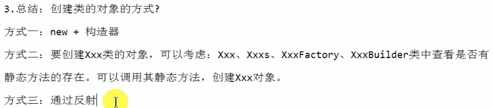
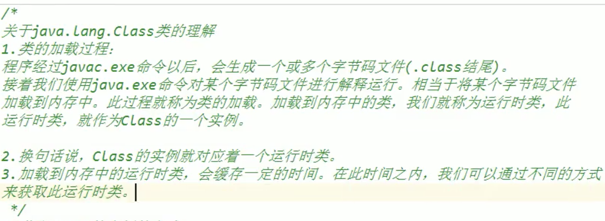
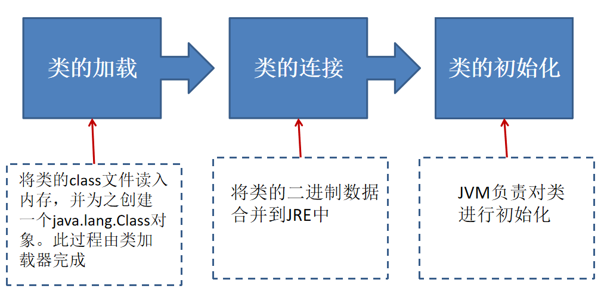
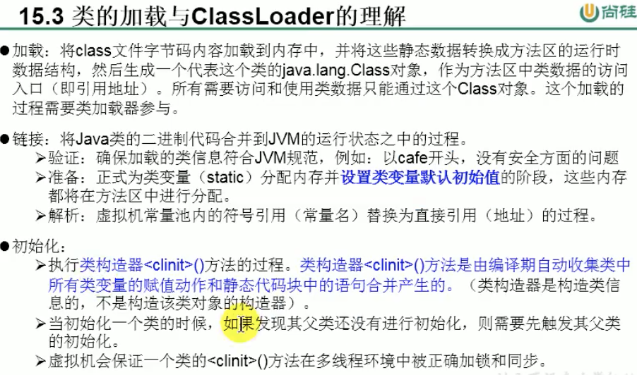
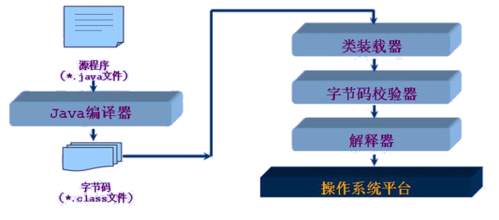
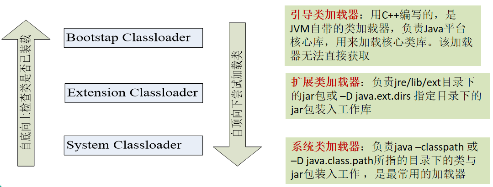
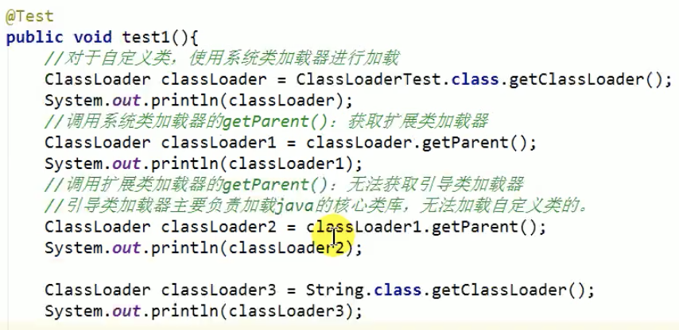
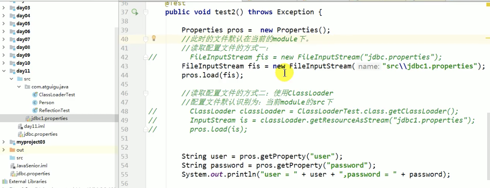
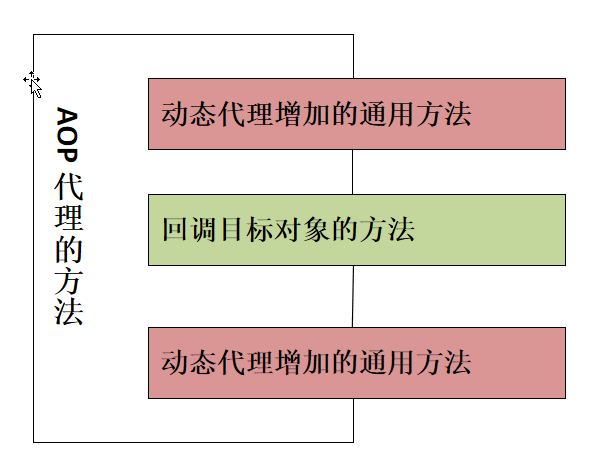

## # java反射機制

- 封裝性：訂定公有和私有，提示、建議調用這怎麼調（調公有而非私有）

- 反射機制：提供動態調用，能不能調問題



    理解Class類、實例化Class類對象、運行時類
    創建運行時類的對象，獲取該類的完整結構
    通過反射調用類的指定方法、屬性
    動態代理、AOP

### java reflection

```java
reflection(反射)被視為動態語言的關鍵，反射機制允許程序員在執行期間借助於reflection API 取得任何類的內部信息，並能直接操作任意對象的內部屬性、方法
反射機制提供的功能

    在運行時判斷任意一個對象所屬的類
    在運行時構造任意一個類的對象
    在運行時判斷任意一個類所具有的成員變量和方法
    在運行時調用任意一個對象的成員變量和方法
    生成動態代理

反射相關的主要API

    java.lang.Class 一個類
    java.lang.reflect.Method 類的方法
    java.lang.reflect.Field 類的成員變量
    java.lang.reflect.Constructor 類的構造器

```

### Class類

```java
哪些對象可以有Class對象
1. class
2. interface
3. [] array	// 只要數組的元素類型和維度一樣，就是同一個Class
4. enum
5. annotation
6. primitive type
7. void
```


```java
Object 類是所有類的根類，Object定義了下面這個方法

    public final Class getClass()

Class類是java反射的源頭

正常方式

    引入需要的"包類"名稱 -> 通過 new實例化 -> 取得實例化的對象

反射方式

    實例化對象 -> 對象.getClass() -> 得到完整的"包類"名稱

Class也是一個類

Class對像只能有系統創建對象

一個類在JVM中有且只有一個Class實例

一個Class對像對應的是一個加載到JVM中的一個.class文件

每個類的實例都會記錄自己是有哪個Class實例生成的

通過Class可以完整的得到一個類的完整結構
```

Class類主要方法

```java
static Class forName(String name) 返回指定類名name的Class對象
Object newInstance() 調用空參(或缺省)的構造器，返回Class對象的一個實例
String getName() 返回此Class對象所表示的實體名稱(類、接口、數組、基本類型或void)
Class getSuperClass() 返回此Class對象的父類的Class對象
ClassLoader getClassLoader() 返回此類的加載器
Class getSuperclass() 返回此Class所表示的實體超類的Class
Constructor[] getConstructors() 返回此對像對應類的所有構造器，以數組形式返回
Field[] getDeclaredFields() 返回此對像對應類的聲明的屬性，Field[]
Method getMethod(String name, Class... paramTypes) 返回此對像對像類形參為paramTypes 的方法
```


### 獲取類的Class實例的4種方法



```java
獲取類的Class實例的4種方法 --> 不同方法獲取同一個被加載到內存中的類
  Class 實例對應一著加載到內存中的一個運行時類
  
1. 通過運行時類的對象，調用 對象.getClass()
   	Person p1 = new Person();
    // 獲取對象的運行時類
    Class clazz = p1.getClass();

2. 通過運行時類，調用 類 .class
  
    Person p1 = new Person();
    Class clazz2 = p1.class;

3. 通過Class的靜態方法，調用 public Class Class.forName(String className),className必須是完整路徑的
		// className必須是完整路徑的
    String className = "com.wong.reflection.Person";
    Class clazz3 = null;
    try {
        clazz3 = Class.forName(className);
    } catch (ClassNotFoundException e) {
        e.printStackTrace();
    }
    System.out.println(clazz3.getName());

4. 類加載器

    ClassLoader loader = this.getClass().getClassLoader();
    try {
        Class clazz5 = loader.loadClass("java.lang.Math");
        System.out.println(clazz5);
    } catch (ClassNotFoundException e) {
        e.printStackTrace();
    }
```


### JAVA類加載過程

當程序主動使用某個類時，如果該類還未被加載到內存中，則係統會通過如下三個步驟來對該類進行初始化。








#### ClassLoader

加載 src 目錄下配置文件

`類加載器是用來把類(class)裝載進內存的。 `

JVM規範定義了兩種類型的類加載器：

- 啟動類加載器(bootstrap)
- 和 用戶自定義加載器(user-define class loader)。

 JVM在運行時回產生3個類加載器組成的初始化加載器層次結構，如下：

- Bootstrap ClassLoader 引導類加載器：用C++編寫，是JVM自帶的類加載器，負責java平台核心庫，用來加載核心類庫。
- 訪加載器無法直接獲取
  Extension ClassLoader 擴展類加載器：負責jre/lib/ext 目錄下的jar包或-D java.ext.dirs指定目錄下的jar包載入工作庫
- System ClassLoader 系統類加載器：負責java -classpath 或 -D java.class.path所指定的目錄下的類與jar包載入工作，是最常用的加載器
- 用戶自定義加載器(user-define class loader)。





```java
------------------console----------------
sun.misc.Luncher$AppClassLoader@18b4aac2
sun.misc.Luncher$ExtClassLoader@452b3a41
null
null
----------------------------------------------------------------
// 類加載器
ClassLoader loader0 = this.getClass().getClassLoader();
System.out.println(loader0); //jdk.internal.loader.ClassLoaders$AppClassLoader@55054057
ClassLoader loader1 = ClassLoader.getSystemClassLoader();
System.out.println(loader1); //jdk.internal.loader.ClassLoaders$AppClassLoader@55054057

ClassLoader loader2 = loader1.getParent();
System.out.println(loader2); //jdk.internal.loader.ClassLoaders$PlatformClassLoader@20d28811

ClassLoader loader3 = loader2.getParent();
System.out.println(loader3); // null ---> BootStrap ClassLoader 無法直接獲取
```



eclipse

```java
@Test
public void test5() {
  // 利用類加載器訪問包內的文件，非根路徑下的
  ClassLoader loader = this.getClass().getClassLoader();
  String filePath = "jdbc.properties";
  // jdbc.properties 在 src 目錄下
  InputStream is = loader.getResourceAsStream(filePath);

  // 或
  InputStream fis = null;
  try {
    // FileInputStream 相對路徑只能加載(workspace)根目錄下或絕對路徑的文件，相對包路徑下的文件加載找不到路徑
    fis = new FileInputStream("/Users/---------/Desktop/jee-2020-06/workspace/Java_Advance/src/jdbc.properties"); 
  } catch (FileNotFoundException e) {
    e.printStackTrace();
  }

  Properties properties = new Properties();
  try {
    properties.load(fis);
    String host = properties.getProperty("host"); // 等號後的""也會取出來
    String port = properties.getProperty("port");
    String user = properties.getProperty("user");
    String password = properties.getProperty("password");

    System.out.println(host);
    System.out.println(port);
    System.out.println(user);
    System.out.println(password);

  } catch (IOException e) {
    e.printStackTrace();
  }
}
```

### 應用一：通過反射創建運行時類對象newinstance

```java
Object newInstance() 調用空參(或缺省)的構造器，創造對應運行時類對象，返回Class對象的一個實例，
  1. 類對象要有空參構造器，
  2. 空參構造器權限為public
  
  IllegalAccessException --> privete 空參構造器會報錯=權限不夠
  InstantiationException --> 類對象無空參構造器會報錯
  
補充：
  在Javabean中，要求提供一個 權限為public空參構器，原因：
  1. 便於通過反射，創造運行時類的對象
  2. 便於子類擠成此運行時類對象時，默認調用 super()時，保証父類有此構造器

-------------------------------------------------------------  
// 體會反射動態性
@Test
public void test(){
  int num = Random().nextInt(3); // 0,1,2
  String classPath = "";
  switch(num){
    case 0:
      classPath = "java.util.Date";
      break;
    case 1:
      classPath = "java.lang.Object";
      break;
    case 2:
      classPath = "com.wong.Person";
      break;
  }
  object obj = getInstance(classPath);
}
public Object getInstance(String classPath) throws Exception{
  Class clazz = Class.forName(classPath);
  return clazz.newInstance();
}
```


### 應用二：通過反射調用運行時類的完整結構

Field、Method、Constructor、Supperclass、實現的Interface、Annotation、方法的Exception信息、內部類

先獲取類的Class實例

```java
// Class 才可以 getName()
  
+ 獲取實現的接口
  public Class<?>[] getInterfaces()
  獲取此對象所表示的類或接口實現的接口

+ 獲取所繼承的父類
  public Class<? Super T> getSuperclass()
  返回此Class所表示的實體(類、接口、基本數據類型)的父類的Class

+ 獲取全部的構造器
    public Constructor[] getConstructors()
    返回此Class對象所表示的類的所有public構造器，及其父類（繼承類）中聲名為 public 訪問權限的構造器

    public Constructor[] getDeclaredConstructors()
    返回此Class對象表示的類中聲明的所有構造器，包括私有的（不包括父類（繼承類）中的構造器）

      Constructor類中：
      取得修飾符：public int getModifiers()
      取得方法名稱：public String getName()
      取得參數的類型：public Class<?>[] getParameterTypes()

+ 獲取全部的方法
    public Method[] getDeclaredMethods()
    返回此Class對象所表示的類或接口的全部方法，包括 private 修飾的方法（不包括父類（繼承類）中聲名的方法）

    public Method[] getMethods() 
  	返回此Class對象所表示的類或接口的 public 方法，及其父類（繼承類）中聲名為 public 訪問權限的方法

    Method類中：
    * public Class<?> getReturnType() 取得方法全部的返回值
    * public Class<?>[] getParameterTypes() 獲取方法全部的參數
    * public int getModifiers() 取得方法修飾符
    * public Class<?>[] getExceptionTypes() 獲取方法異常信息

+ 獲取全部的屬性(Field)
    public Field[] getFields()
    返回當前運行時Class對象所表示的類或接口中聲名為 public 訪問權限的  Field（屬性），及其父類（繼承類）中聲名為 public 訪問權限的 Field （屬性）

    public Field[] getDeclaredFields()
    返回當前運行時Class對象所表示的類或接口中聲明的的全部 Field（屬性），包括 private 修飾的屬性（不包括父類（繼承類）中聲名的屬性）

      Field類中：
      * public int getModifiers() 以整數形式返回此Field的修飾符
          Modifer (java.lang.reflect)
          public static final int PUBLIC = 0x00000001
          public static final int PRIVATE = 0x00000002
          public static final int PROTECTED = 0x00000003
          ...		
  				數字形式修飾符轉String修飾符
            int i = f.getModifiers();
          	String modifier = Modifier.toString(i);
      * public Class<?> getType() 返回Field的屬性類型
      * public String getName() 返回Field名稱

+ 獲取註解(Annotation)
    public Annotation[] getAnnotations() 獲取此Class對象所表示的類或接口的public修飾的註解
    public Annotation[] getDeclaredAnnotations() 獲取此Class對象所表示的類或接口的全部註解

+ 泛型相關
    Type getGenericSuperclass() 獲取帶泛型的父類
    獲取父類的泛型

      Class clazz = Person.class;
      Type type1 = clazz.getGenericSuperclass();
      ParameterizedType parameterizedType = (ParameterizedType) type1;
      Type[] args = parameterizedType.getActualTypeArguments(); //獲取實際的泛型類型參數數組
      Class firstArg = (Class) args[0];
      System.out.println(firstArg.getName());

+ 獲取類所在的包
    public Package getPackage()

+ 獲取內部類
    public Class[] getDeclaredClasses()
```

獲取全部的屬性(Field)

```java
@Test
public void test8() {
  private Class clas = Person.class;
  // 獲取屬性字段
  Field[] fields = clas.getDeclaredFields();
  System.out.println("修飾符 類型 屬性名");
  for (Field f : fields) {
    // 獲取屬性修飾符
    int i = f.getModifiers();
    System.out.print(i + " ");// 1 2 ...
    String modifier = Modifier.toString(i); //private public ...
    System.out.print(modifier + " ");

    // 獲取屬性的類型
    Class type = f.getType();
    // System.out.print(type.getName()+"\t") // java.lang.String
    String[] typeStr = type.toString().split("\\.");
    System.out.print(typeStr[typeStr.length - 1] + " "); // String

    // 獲取屬性名
    System.out.print(f.getName());
    System.out.println();
  }
```

獲取全部的方法

```java
@Test
// 權限修飾符  返回值類型	 方法名(參數類型1 型參名1, ...) throws 異常{}
public void test15() {
  Class clas = Person.class;
  // 獲取此類以及父類的所有public 方法
  Method[] methods = clas.getDeclaredMethods();
  for (Method m : methods) {
    // 獲取註解
    Annotation[] annotations = m.getAnnotations(); 
    for (Annotation anno : annotations) {
      System.out.println(anno);
    }
    // 獲取權限修飾符
    System.out.print(Modifier.toString(m.getModifiers()) + "\t");
    // 返回值類型
    System.out.print(m.getReturnType().getName() + "\t");
    // 方法名
    System.out.print(m.getName());
    System.out.print("(");
    // 形參列表
    Class[] parameterTypes = m.getParameterTypes();
    if(!(parameterTypes==null && parameterTypes.length==0)){
      for(int i=0; i<parameterTypes.length; i++){
        if(i == parameterTypes.length-1) {
          System.out.print(parameterTypes[i].getName() + " args_" + i);
          break;
        }
        System.out.print(parameterTypes[i].getName() + " args_" + i + ", ");
      }
    }   
    System.out.print(")");
    // 拋出異常
    Class[] exceptionTypes = m.getExceptionTypes();
    if(exceptionTypes.length > 0){
      System.out.print("throws ");
      for(int i=0; i<exceptionTypes.length; i++){
        if(i == exceptionTypes.length-1) {
          System.out.print(exceptionTypes[i].getName());
          break;
        }
        System.out.print(parameterTypes[i].getName() +  ", ");
      }
    }
    
    System.out.println();
  }
}
```

獲取父類的泛型

```java
@Test
public void test4() {
  // 獲取父類的泛型
  Class clazz = Person.class;
  Type type1 = clazz.getGenericSuperclass();
  ParameterizedType parameterizedType = (ParameterizedType) type1;
  Type[] args = parameterizedType.getActualTypeArguments();
  Class firstArg = (Class) args[0];
  System.out.println(firstArg.getName());
  // System.out.println(((Class) args[0]).getName());
  System.out.println(args[0].getTypeName());
  // for (Type t : args) {
  // System.out.println(t);
  // }
}
---------------------------------------------
public interface Type {
    default String getTypeName() {
        return toString();
    }
}
```


框架＝註解＋反射＋設計模式


### 應用三：通過反射調用運行時類中指定的方法、屬性、構造器

調用指定的方法

```java
調用指定的方法
    通過Class類的getMethod(String name, Class... parameterTypes) 方法獲得一個Method對象，並設置此方法操作是需要的參數
    再使用Object invoke(Object obj, Object[] args) 進行調用，並向方法中傳遞要設置的obj對象的參數信息，invoke() 方法的返回值即為對應類中調用方法的返回值
  
    說明
        - Object對應原方法的返回值，若原方法無返回值，此時返回 null
        - 若原方法為static靜態方法，此時形參Object obj可為 null
        - 若原方法形參列表為空，則 Object[] args 為 null, 可比傳此參數
        - 若原方法權限修飾符為private，則需要在調用 invoke() 方法前，顯式的調用方法對象的setAccessible(true)方法，這樣就能訪問private的方法了，其他的構造、屬性等也是類似的
```

Example:

```java
@Test
public void test13() {
  // 獲取指定的方法，並調用該方法

  Method m1 = null;
  try {
    Person p1 = (Person) clas.newInstance();
    p1.setName("謝春芳");
    p1.setAge(32);

    // public 無參方法
    m1 = clas.getMethod("getAge");
    Object ret = m1.invoke(p1);
    int age = (Integer) ret;
    System.out.println(age);

    // public 有參方法
    Method m2 = clas.getMethod("speak", String.class);
    Object ret191 = m2.invoke(p1, "Hello");

    // private 有參方法 
    Method m3 = clas.getDeclaredMethod("see", int.class, String.class); // 1.
    m3.setAccessible(true); // 2.
    Object returnValue = m3.invoke(p1, 10, "站著");
    // String returnValueString = (String) returnValue;
    System.out.println(returnValue);

    // 靜態方法 private static void info()
    Method m4 = clas.getDeclaredMethod("info");
    m4.setAccessible(true);
    m4.invoke(Person.class); // 調用的運行時類中的方法沒有返回值，invoke() 方法返回 void
    m4.invoke(null); // 對象 null 也可以


  } catch (Exception e) {
    e.printStackTrace();
  }

}
```


調用指定的屬性

```java
調用指定的屬性
    public Field getField(String name) 返回此Class對象表示的類或接口指定的public的Field
    public Field getDeclaredField(String name) 返回此Class對象表示的類或接口指定的Field，包括private的

Field中：
public Object get(Object obj) 獲取指定對象obj上此Field的屬性內容
public void set(Object, Object value) 設置指定對象obj上此Field的屬性內容值
```

EXAMPLE: 

```java
@Test
public void test12() {
  // 獲取指定的屬性，並操作該屬性

  Person p1 = null;
  try {
    p1 = (Person) clas.newInstance();
		
    Field name = clas.getField("name");
    name.set(p1, "Leon");

    // 1.獲取並做操私有屬性
    Field age = clas.getDeclaredField("age");
    age.setAccessible(true); // 2.設置此屬性可操作
    age.set(p1, 22); // 3.

    System.out.println(p1);

  } catch (Exception e) {
    e.printStackTrace();
  }
}
```


調用指定的構造器

```java
調用指定的構造器
public Constructor getDeclaredConstructor(Class<?>... parameterTypes)
```

Example:

```java
@Test
public void test14() {
  // 調用指定的構造器

  try {
    // 空參構造器
    Constructor constructor = clas.getConstructor();
    Object obj = constructor.newInstance();
    System.out.println(obj);

    // 獲取帶參的構造器
    Constructor constructor2 = clas.getDeclaredConstructor(String.class);
    constructor2.setAccessible(true);
    Person p2 = (Person) constructor2.newInstance("鬼穀子");
    System.out.println(p2);

    // 獲取帶參的構造器
    Constructor constructor3 = clas.getDeclaredConstructor(String.class, int.class);
    Person p3 = (Person) constructor3.newInstance("孫臏", 33);
    System.out.println(p3);

  } catch (NoSuchMethodException | IllegalAccessException | InstantiationException | InvocationTargetException e) {
    e.printStackTrace();
  }
}
```

## # JAVA動態代理

```java
動態代理是指客戶通過代理類來調用其它對象的方法，並且是在程序運行時根據需要動態創建目標類的代理對象
動態代理的使用場景
    調試
    遠程方法調用
代理設計模式的原理

使用一個代理將對象包裝起來, 然後用該代理對象取代原始對象. 任何對原始對象的調用都要通過代理. 代理對象決定是否以及何時將方法調用轉到原始對象

Proxy：專門完成代理的操作類，是所有動態代理的父類。通過此類為一個或多個接口動態地生成實現類
提供用於創建動態代理類和動態代理對象的靜態方法
    static Class getProxyClass(ClassLoader loader, Class... interfaces) 創建一個動態代理類序所對應的Class對象
    static Object newProxyInstance(ClassLoader loader, Class<?>[] interfaces, InvocationHandler h) 直接創建一個動態代理對象

loader: 類加載器
interfaces: 得到全部的接口
h: 得到InvocationHandler接口的子類實例

動態代理步驟
    創建一個實現接口InvocationHandler的類，它必須實現invoke方法，以完成代理的具體操作

@Override
public Object invoke(Object proxy, Method method, Object[] args) throws Throwable {
    // 當通過代理類的對象發起對被重寫方法的調用時，都會轉為對invoke方法的調用

    Object returnVal = method.invoke(obj, args);
    System.out.println("實現的invoke方法被調用了");
    return returnVal;
}
    
/*
proxy: 被代理的對象
method：要調用的方法
args: 方法調用時需要的參數
**/

    創建被代理的類以及接口

// 示例
interface Factory {
    void make();
}

class HuaweiFactory implements Factory {

    // 構造器
    public HuaweiFactory() {
        super();
    }

    // 方法
    @Override
    public void make() {
        System.out.println("華為松山湖生產基地生產了100000 部手機");
    }

}

    通過Proxy的靜態方法 public Object newProxyInstance(ClassLoader loader, Class[] interfaces, InvocationHandler h)創建一個相應的接口代理

// 示例
public Object getProxyInstance(Object obj) {
    /*
    本方法作用：
    1. 給被代理的對象實例化
    2. 返回一個代理類的對象

    * */

    this.obj = obj;
    // 使用反射，根據被代理類動態生成代理對象
    Object proxy = Proxy.newProxyInstance(obj.getClass().getClassLoader(), obj.getClass().getInterfaces(), this);
    return proxy;
}

    通過代理調用被代理類的方法

// 示例
// 1. 創建被代理類對象
HuaweiFactory huawei = new HuaweiFactory();
// 2. 創建一個 實現了 InvocationHandler接口的對象
MyInvocationHandler handler = new MyInvocationHandler();

// 調用getProxy獲取 動態生成代理類對象
Object obj = handler.getProxyInstance(huawei);
Factory haproxy = (Factory) obj;
haproxy.make(); // 轉到對動態代理類對象的invoke()方法的調用
System.out.println();
```


AOP動態代理功能類似於python中的裝飾器

    使用Proxy生成一個動態代理時，往往並不會憑空產生一個動態代理。通常都是為指定的目標對像生成動態代理
    這種動態代理在AOP中稱為AOP代理，AOP代理可代替目標對象，AOP代理包含了目標對象的全部方法。
    但AOP代理中的方法與目標對象的方法存在差異：AOP代理中的方法可以在執行目標方法之前、之後插入一些通用處理

AOP代理示例




